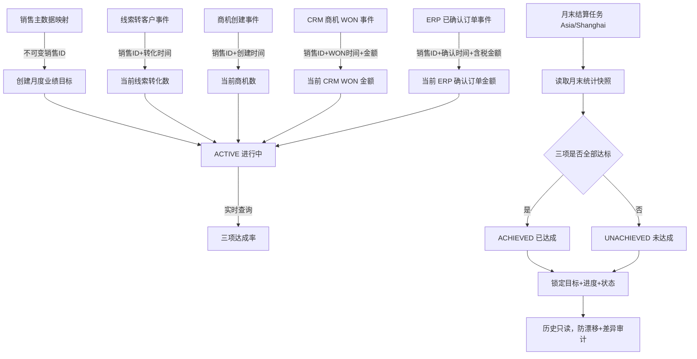
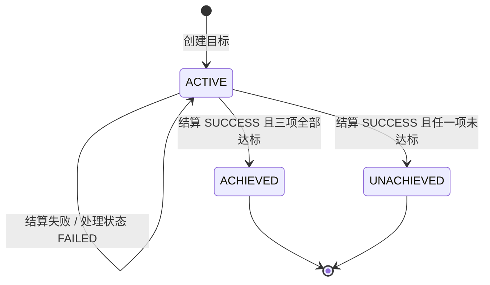

# 业绩目标主PRD

> **版本**：V2.1 | 2026-08-13
> **读者**：研发工程师、测试工程师、产品复核、项目经理
> **字段定义 SSOT**：《业绩目标字段清单》
> **时间口径**：`Asia/Shanghai`
> **引用原则**：本文描述目标、进度与结算规则，不重复定义字段取值、必填性或格式。

---

### 1. 业务背景

业绩目标用于把销售团队的月度经营要求转化为可追踪的线索转化、商机创建和赢单金额三项指标，并在月末形成不可漂移的结算快照。

没有统一业绩目标管理时存在以下问题：

1. 目标散落在表格中，销售无法实时看到完成进度。
2. 主管对线索、商机和金额采用不同统计口径，结果难以对齐。
3. 使用中文姓名归集，人员改名或同名时容易错算。
4. 销售转组后历史数据可能被归到新团队，造成历史漂移。
5. 线索转化、商机创建和赢单发生时间口径不一致。
6. 商机从赢单回写或数据修正后，历史月份数字可能反复变化。
7. 月末结算重复执行可能重复锁定或重复通知。
8. 结算任务失败没有补偿机制，部分销售状态可能缺失。
9. 主管可在月底后继续修改目标，造成“移动目标线”。
10. 已达成与未达成只看单项指标，缺少三项联合判定。
11. 销售离职后目标被删除，历史绩效无法审计。
12. 目标状态可在表单直接修改，绕过真实结算过程。

本模块通过“销售ID + 目标月份”唯一目标、实时进度聚合、月末幂等结算、快照锁定和事件归属口径，提供可解释且稳定的销售目标视图。

**定位句**：业绩目标是 CRM 的月度经营衡量对象；进行中实时计算，月末由系统结算，结算后目标、进度和状态全部只读锁定，历史结果不随源数据后续变化而漂移。

---

### 2. 功能范围

**In Scope**：

- 按销售和月份创建目标。
- 使用销售ID生成稳定目标编号。
- 同一销售同一月份唯一目标。
- 维护三项目标值。
- 进行中实时聚合三项当前进度。
- 展示三项达成率。
- 展示整体目标状态。
- 支持列表按月份、销售和状态筛选。
- 销售查看自己的目标。
- 主管查看团队目标。
- 主管创建和编辑进行中目标。
- 目标值变更保留审计日志。
- 进行中按事件发生时间归集业务数据。
- 并行展示 CRM 商机 WON 金额与 ERP 已确认订单金额，明确差异。
- 每月结束执行自动结算。
- 三项均达到目标时判定达成。
- 任一项未达到时判定未达成。
- 结算时持久化目标与进度快照。
- 结算后锁定全部业务字段。
- 重复结算幂等处理。
- 结算失败进入补偿队列。
- 销售改名或转组不影响历史归属。
- 支持按权限导出当前查询结果；区分实时值与结算快照值。
- 结算失败支持主管/管理员通过动作按钮重试。

**Out of Scope**：

- 提成与佣金计算；原因：属于财务或薪酬域。
- 奖金发放；原因：不在 CRM 业务边界。
- 目标审批流；原因：一期由主管直接设定。
- 季度或年度目标；原因：一期以月度粒度验证。
- 团队汇总目标；原因：一期对象粒度为销售+月份。
- 团队、区域作为独立统计维度；原因：团队仅为权限范围，区域/季度/年度目标 OOS。
- 区域目标、季度目标、年度目标；原因：一期统计维度固定为销售ID+月份，均为 OOS。
- 权重化综合评分；原因：一期要求三项同时达成。
- 已结算目标直接修改；原因：防止历史漂移。
- 删除目标；原因：业务对象不删除，历史需审计。
- 自动预测目标；原因：一期不使用 AI 生成目标值。
- 从 ERP 修改目标；原因：目标 SSOT 在 CRM。
- 真实数据仓库建设；原因：Demo 使用 CRM 聚合 Mock。
- 跨时区结算；原因：一期统一使用 Asia/Shanghai。

---

### 3. 对象定位

#### 3.1 在系统中的位置

| 项目 | 内容 |
|------|------|
| 对象类型 | 业绩目标（经营衡量层） |
| 核心职责 | 设定月度目标、聚合进度并形成锁定结算快照 |
| 来源 | 销售主管手动创建 |
| 上游对象 | CRM 线索转客户事件、CRM 商机创建/WON 事件、ERP 已确认订单事件 |
| 下游对象 | 销售工作台、团队目标看板、月度审计结果 |
| 粒度 | 销售ID + 目标月份 |
| 唯一性 | 每个销售每个月最多一条目标 |
| 编号依据 | 目标月份与不可变销售ID |
| 状态权威 | 目标状态与结算处理状态均在 CRM 内由动作/系统结算驱动；ERP 只提供订单事实 |
| 删除策略 | 不提供删除；结算后永久只读保留 |
| 统计维度 | 一期仅销售ID + 目标月份；团队/区域不生成目标对象 |
| 默认排序 | 销售ID升序；本模块例外于通用创建时间倒序规范 |

#### 3.2 系统链路图

链路约束：

- 目标创建使用销售ID，不使用中文姓名作为关联键。
- 三项进度使用各自业务事件时间归入目标月份。
- 进行中视图可实时变化。
- 结算读取月末截止快照并一次性持久化。
- 结算后不再回查源表覆盖快照。
- 后续源数据修正进入审计或未来校正流程，不改历史结算。

#### 3.3 实体关系说明

| 关系 | 基数 | 说明 | 一致性约束 |
|------|:---:|------|------------|
| 销售 : 月度目标 | 1:N | 一个销售可在不同月份有多条目标 | 同月唯一 |
| 目标月份 : 销售目标 | 1:N | 同一月份有多个销售目标 | 每条以销售ID区分 |
| 业绩目标 : 线索转化事件 | 1:N | 聚合目标月内归属该销售的转化事件 | 使用转化发生时销售ID快照 |
| 业绩目标 : 商机创建事件 | 1:N | 聚合目标月内创建的商机 | 使用创建时责任销售ID快照 |
| 业绩目标 : CRM WON 事件 | 1:N | 聚合目标月内 CRM 商机赢单经营金额 | 使用 WON 时责任销售ID与金额快照 |
| 业绩目标 : ERP 确认订单事件 | 1:N | 聚合目标月内已确认订单金额，作为订单事实口径 | 使用确认时责任销售ID、订单ID与金额快照 |
| 业绩目标 : 结算快照 | 1:0..1 | 进行中无结算快照，月末后有一份 | 结算幂等，只能成功写入一次 |
| 业绩目标 : 审计日志 | 1:N | 创建、编辑、结算、失败与重试留痕 | 已结算数据不可被编辑日志覆盖 |

实体一致性要求：

1. 目标编号中的销售ID必须与目标关联销售ID一致。
2. 中文姓名只用于展示，不用于归集或唯一性判断。
3. 销售改名后历史目标展示可更新姓名，但编号和归属不变。
4. 销售转组后已发生事件仍按发生时销售ID归集。
5. 结算快照包含结算时的目标值、三项当前值、CRM WON 金额、ERP 确认订单金额、金额差异和判定结果。
6. 结算后源事件不得直接覆盖当前进度字段快照。

#### 3.4 销售ID映射口径

| 展示姓名 | 销售ID | 用途 |
|----------|--------|------|
| 张三 | `S001` | 目标编号与事件归属 |
| 李四 | `S002` | 目标编号与事件归属 |
| 王五 | `S003` | 目标编号与事件归属 |

映射规则：

- 具体映射表以《业绩目标字段清单》为 SSOT。
- 页面选择销售时同时保存销售ID。
- 销售ID不可因姓名变化而改变。
- 新增销售必须先完成ID映射，未映射用户不可创建目标。
- 目标编号生成后不因姓名变化重生成。
- 同名销售通过不同销售ID区分。

---

#### 3.5 金额口径与跨系统结算契约

本模块采用方案 C：双口径并行展示。CRM WON 金额是 CRM 经营指标，不替代 ERP 订单事实；ERP 已确认订单金额是订单 SSOT，月末结算的赢单金额达成判定使用 ERP 确认订单金额。列表、详情和导出同时提供 `当前 CRM WON 金额`、`当前 ERP 确认订单金额` 与 `金额差异`，避免把两者混为一个字段。

| 规则项 | 统一口径 |
|--------|----------|
| 金额来源系统 | CRM WON 金额来自 CRM 商机 WON 事件；结算金额来自 ERP 已确认销售订单事件；ERP 为订单事实 SSOT |
| 计入时间 | CRM 按 WON 事件时间；ERP 按订单确认事件时间；均按 `Asia/Shanghai` 归入目标月份 |
| 结算判定 | 线索转客户数、商机创建数按 CRM 事件；赢单金额按 ERP 已确认订单金额；CRM WON 仅并行经营展示 |
| 币种/税口径 | 一期仅支持 `CNY` 人民币结算，按含税金额、金额保留 2 位小数；非 CNY 合同在创建/提交签署时阻断并提示“一期仅支持人民币结算”，同时进入差异审计，不做静默换算 |
| 订单取消 | 结算截止前 ERP 取消/全额退款不计入；部分取消按 ERP 修正后的确认金额计入；截止后取消不回写历史快照，只进差异审计 |
| 订单修改 | 截止前按 ERP 最新有效订单版本聚合；截止后修正不改历史快照，记录源值、快照值和修正版本 |
| 拆单/合单 | 以 ERP 拆合单关联ID去重；只按确认订单事实累计一次，原单与子单不重复计入 |
| 月末快照读取字段 | `ERP 订单ID`、`ERP 订单确认事件ID`、`ERP 订单确认时间`、`ERP 订单状态`、`ERP 确认订单金额`、`ERP 拆单/合单关联ID`、`币种`、`含税标识`、`ERP 修正版本` |
| 结算后差异审计 | 对晚到事件、取消、退款、修正、CRM WON 与 ERP 金额差异生成差异审计；不提供回写历史快照动作 |

### 4. 业务场景

| 场景ID | 场景 | 类型 | 触发角色 | 说明 |
|--------|------|------|----------|------|
| S01 | 主管创建销售月度目标 | **主流程** | 销售主管 | 选择销售与月份，设定三项目标并生成编号 |
| S02 | 进行中实时更新三项进度 | **主流程** | 系统 | 基于三类业务事件更新显示 |
| S03 | 月末结算并锁定 | **主流程** | 系统 | 读取快照，判定状态并永久锁定 |
| S04 | 重复结算或结算失败重试 | **异常** | 系统 | 通过幂等键避免重复，并从失败点补偿 |
| S05 | 改名、转组或源数据后改防漂移 | **异常** | 系统 / 管理员 | 历史编号、归属与结算快照保持不变 |

#### S01 主管创建销售月度目标

- 前置：操作者有目标新增权限。
- 前置：销售存在有效销售ID映射。
- 输入：销售、目标月份和三项目标值。
- 校验：销售+月份尚无目标。
- 结果：生成目标编号并进入进行中。
- 后置：开始实时读取当月业务进度。

#### S02 进行中实时更新三项进度

- 线索转客户事件更新当前线索转化数。
- 商机创建事件更新当前商机数。
- CRM 商机 WON 事件更新当前 CRM WON 金额；ERP 已确认订单事件更新当前 ERP 确认订单金额。
- 页面每次查询读取最新聚合结果。
- 事件归属使用发生时销售ID快照。
- 当前达成率按字段清单目标值计算。
- 进行中状态不因临时达到 100% 提前转为已达成。

#### S03 月末结算并锁定

- 时间：目标月最后一天结束后的第一个结算时点。
- 时区：Asia/Shanghai。
- 读取：目标月截止时刻内的三项聚合快照。
- 判定：线索转化数、商机创建数、ERP 已确认订单金额三项均达到目标才为已达成；CRM WON 金额只作并行经营指标。
- 否则：未达成。
- 写入：目标、进度、状态和结算时间快照。
- 后置：所有字段只读，不再实时聚合覆盖。

#### S04 重复结算或结算失败重试

- 结算键：目标编号 + 目标月份。
- 同一目标重复执行只返回首次成功快照。
- 单目标失败不阻断其他目标结算。
- 失败目标进入补偿队列。
- 重试继续使用原截止时间，不读取重试时的新事件。
- 全部完成后生成结算结果摘要。

#### S05 改名、转组或源数据后改防漂移

- 销售改名：展示名可更新，销售ID和编号不变。
- 销售转组：历史事件按发生时销售ID归属不变。
- 源事件晚到：已结算目标不自动回写。
- ERP 订单取消、退款或金额后改：不修改已结算 ERP 金额快照，记录差异审计；CRM WON 与 ERP 金额差异可见但不自动回写。
- 需要纠偏：记录差异，进入未来校正流程，不直接改历史。
- 历史目标始终可审计。

---

### 5. 状态机

#### 5.1 双状态模型

> 状态枚举与配色以《业绩目标字段清单》为 SSOT。目标主状态表达业务结果，结算处理状态表达结算任务技术进度；“结算中/结算异常”不是目标主状态。

目标主状态：

| 状态 | 业务含义 | 是否终态 |
|------|----------|:--------:|
| `ACTIVE` | 目标进行中，实时聚合；即使结算处理失败也保持 ACTIVE | 否 |
| `ACHIEVED` | 结算处理 SUCCESS 且三项判定均达标，已锁定 | 是 |
| `UNACHIEVED` | 结算处理 SUCCESS 且至少一项未达标，已锁定 | 是 |

结算处理状态：

| 状态 | 页面文案 | 业务含义 | 是否允许目标终态 |
|------|----------|----------|:----------------:|
| `NOT_STARTED` | 正常 | 尚未开始结算 | 否 |
| `PROCESSING` | 结算中 | 结算任务执行中，目标锁已生效 | 否 |
| `SUCCESS` | 已完成 | 结算快照已成功写入 | 是 |
| `FAILED` | 结算异常 | 任务失败，目标主状态仍为 ACTIVE | 否 |
| `RETRYING` | 结算中 | 失败后的重试任务执行中，目标锁已生效 | 否 |

组合定义：

> 审计清单中的 `ACTIVE + NORMAL` 在本文对应 `ACTIVE + NOT_STARTED`；`NORMAL` 不是新增枚举，仅表示尚未进入结算处理。

| 目标主状态 | 结算处理状态 | 页面含义 | 编辑/刷新 |
|------------|----------------|----------|----------|
| `ACTIVE` | `NOT_STARTED` | 进行中 | 可编辑、可刷新 |
| `ACTIVE` | `PROCESSING`/`RETRYING` | 结算中 | 禁止编辑、禁止刷新 |
| `ACTIVE` | `FAILED` | 结算异常 | 禁止编辑；主管/管理员可通过动作按钮重试 |
| `ACHIEVED`/`UNACHIEVED` | `SUCCESS` | 已结算终态 | 只读；仅查看结算快照和差异审计 |

#### 5.2 状态机图

#### 5.3 状态流转表（核心交付物）

| 当前组合 | 动作 | 前置条件 | 结果组合 | 二次确认 | 后置影响 | 失败处理 |
|----------|------|----------|----------|:--------:|----------|----------|
| 新建 | 创建目标 | 权限通过；销售ID已映射；销售+月份唯一；字段清单校验通过 | `ACTIVE + NOT_STARTED` | 否 | 生成目标编号；开始实时聚合 | 保持新增页；Toast `目标创建失败` |
| `ACTIVE + NOT_STARTED` | 保存目标修改 | 有编辑权限；版本一致；结算锁未生效；字段清单校验通过 | `ACTIVE + NOT_STARTED` | 月内修改时是 | 记录调整原因、前后值、操作者、版本；实时重算达成率 | 保持原值；Toast `目标保存失败` |
| `ACTIVE + NOT_STARTED` | 业务事件更新 | 事件时间在目标月；销售ID匹配；事件合法 | `ACTIVE + NOT_STARTED` | 否 | 更新实时聚合时间与进度 | 保留上次聚合并提示延迟 |
| `ACTIVE + NOT_STARTED` | 发起月末结算 | 到达结算时点；未锁定 | `ACTIVE + PROCESSING` | 否 | 写入任务编号、截止时间、锁定时间；禁止编辑/刷新 | 失败转 `ACTIVE + FAILED`，进入补偿 |
| `ACTIVE + PROCESSING` | 结算成功且三项达标 | 读取固定截止快照成功 | `ACHIEVED + SUCCESS` | 否 | 写入唯一结算快照；锁定全部字段；发送通知 | 失败转 `ACTIVE + FAILED` |
| `ACTIVE + PROCESSING` | 结算成功但未全部达标 | 读取固定截止快照成功 | `UNACHIEVED + SUCCESS` | 否 | 写入唯一结算快照；锁定全部字段；发送通知 | 失败转 `ACTIVE + FAILED` |
| `ACTIVE + FAILED` | 主管/管理员重试结算 | 失败原因可见；沿用原截止时间和幂等键 | `ACTIVE + RETRYING` | 是 | 递增重试次数；锁定编辑/刷新 | 重试失败回 `ACTIVE + FAILED` |
| `ACTIVE + RETRYING` | 重试成功 | 固定原截止快照可读且事务成功 | `ACHIEVED/UNACHIEVED + SUCCESS` | 否 | 只生成一份快照 | 保留原快照（如已有）并回 `FAILED` |
| `ACHIEVED + SUCCESS`/`UNACHIEVED + SUCCESS` | 编辑/刷新/重试 | 已锁定终态 | 原组合 | 否 | 无 | 阻断；Toast `已结算目标不可修改` |
| 任一组合 | 删除请求 | 主数据不提供删除 | 原组合 | 否 | 无 | 阻断；Toast `业绩目标不支持删除` |

#### 5.4 组合动作能力矩阵

| 动作 | `ACTIVE + NOT_STARTED` | `ACTIVE + PROCESSING/RETRYING` | `ACTIVE + FAILED` | `终态 + SUCCESS` |
|------|:------------------------:|:--------------------------------:|:----------------:|:----------------:|
| 查看 | ✅ | ✅ | ✅ | ✅ |
| 编辑目标值 | 按权限 | ❌（结算锁） | ❌（等重试） | ❌ |
| 查看实时明细 | ✅ | ❌（查看结算任务元数据） | ✅（查看失败原因/实时明细） | ❌（查看结算明细） |
| 手动刷新进度 | ✅ | ❌（结算锁） | ❌（等待重试） | ❌ |
| 查看结算快照 | 元数据 | 任务元数据 | 失败元数据，无快照 | ✅ |
| 重试结算 | ❌ | ❌ | 主管/管理员 ✅ | ❌ |
| 查看差异审计 | 可查看 | 可查看任务审计 | 主管/管理员可查看 | ✅ |
| 导出 | 实时值 | 任务状态/最近有效值 | 实时值+异常字段 | 结算快照+差异字段 |
| 删除 | ❌ | ❌ | ❌ | ❌ |

矩阵约束：

- 状态不在表单直接修改；所有状态变化均由创建、发起结算、重试结算等动作按钮或系统结算动作触发。
- “结算中”仅由结算处理状态为 `PROCESSING/RETRYING` 产生，不是目标主状态。
- `ACTIVE + PROCESSING` 禁止编辑和刷新；`ACTIVE + FAILED` 只能由有权限人员点击“重试结算”。
- 终态必须是 `ACHIEVED/UNACHIEVED + SUCCESS`，全部业务字段只读。
- 提前达到三项目标仍保持进行中至月末。
- 终态全部字段只读。
- 不可用动作不渲染。
- 不提供删除或重开。

---

### 6. 核心业务规则

#### 6.1 创建与唯一性规则

| 规则ID | 规则 |
|--------|------|
| R01 | 业绩目标以销售ID和目标月份为唯一业务粒度；同一销售同一月份只能有一条目标，目标编号使用字段清单定义的销售ID映射生成。 |
| R02 | 只有具备目标管理权限的主管或管理员可创建和编辑进行中目标；目标状态、当前进度和结算结果均为系统生成，不可在表单修改。 |
| R02-1 | 目标值按字段清单范围校验：线索/商机目标为 0-999,999 的非负整数，赢单目标金额为 0.00-999,999,999.99 CNY 的非负金额，禁止小数（数量）、负数、科学计数法和超过 2 位小数。 |
| R02-2 | 目标值为 0 表示该指标本月不要求；当前值≥0 即该项达标，达成率显示 100%，不做除零。 |

#### 6.2 进度与归属规则

| 规则ID | 规则 |
|--------|------|
| R03 | 线索转客户数按 CRM 转化事件、商机创建数按 CRM 创建事件、CRM WON 金额按 CRM WON 事件、ERP 确认订单金额按 ERP 确认事件分别聚合；统一使用事件发生时的销售ID快照归属。 |
| R04 | 进行中目标实时展示最新聚合；销售改名、转组或同名不得改变销售ID和历史归属，重复事件通过来源事件ID/订单事实键去重。 |
| R04-1 | 一期统计维度为销售ID+月份；团队仅用于权限范围和查询聚合，团队汇总不是独立目标对象；区域、季度、年度目标不实现。 |

#### 6.3 结算与防漂移规则

| 规则ID | 规则 |
|--------|------|
| R05 | 每月结束后按 Asia/Shanghai 截止时刻结算；线索数、商机数、ERP 已确认订单金额三项均达到目标才进入已达成，否则进入未达成；每个目标结算使用唯一幂等键。 |
| R06 | 结算成功后目标值、当前值、CRM WON 金额、ERP 确认订单金额、金额差异、状态和结算时间全部锁定为快照；源数据晚到、改名、转组、订单取消/退款/金额调整或重复跑批均不得自动改写历史结果。 |
| R06-1 | 结算处理状态与目标主状态分离：失败为 `ACTIVE + FAILED`，不伪造 `UNACHIEVED`；重试进入 `ACTIVE + RETRYING`，成功后才转终态。 |
| R06-2 | 结算锁在读取固定截止快照前生效；锁生效后编辑、刷新和目标调整均阻断。并发结算只允许一份成功快照。 |

#### 6.4 目标调整与防“移动目标线”规则

| 规则ID | 规则 |
|--------|------|
| R07 | 仅 `ACTIVE + NOT_STARTED` 允许调整；`PROCESSING/RETRYING` 锁生效后禁止调整，`FAILED` 需先通过“重试结算”动作处理，不允许以编辑绕过异常。 |
| R08 | 目标值可上调或下调，但不得超出字段清单范围；当前值已超过新目标时允许保存，保存后显示真实超 100% 达成率，不回退当前值、不改事件。 |
| R09 | 月内调整次数一期限制为每个目标每自然月最多 3 次；超过次数需管理员通过“调整次数豁免”动作并填写原因，Demo 不实现豁免入口。 |
| R10 | 每次调整必须通过“保存修改”动作按钮和二次确认，填写调整原因；记录调整人、调整时间、调整前后值、调整版本、版本号。取消或失败不生成调整记录。 |
| R11 | 调整历史销售本人可见但只读，主管可见权限范围内记录，管理员/审计角色按授权查看；任何角色不得编辑或删除调整历史。 |
| R12 | 无审批流时通过权限、次数上限、调整原因必填、版本并发校验、结算锁和不可修改已结算快照共同防止“移动目标线”；不提供直接修改状态、当前值或历史快照的动作。 |

执行优先级：

1. 数据与操作权限。
2. 销售ID映射。
3. 销售+月份唯一性。
4. 字段清单校验。
5. 事件时间与归属快照。
6. 版本并发或结算锁。
7. 快照事务写入。
8. 审计与反馈。

---

### 7. AI 与自动化串联规则

业绩目标不使用 AI 生成目标或判定结果；达成状态必须由确定性业务公式与月末结算产生。

| 自动化节点 | 触发时机 | 输入 | 输出 | 执行动作 | 失败处理 |
|------------|----------|------|------|----------|----------|
| 实时进度聚合 | 业务事件发生或页面查询 | 销售ID、事件时间、事件类型、金额 | 三项当前进度 | 更新进行中目标展示 | 失败保留上次聚合时间并显示延迟；不修改目标状态 |
| 月末结算 | 每月结束后的结算调度 | 目标快照、截止时刻三项进度、ERP订单字段 | 达成/未达成、结算快照 | 先将处理状态置为 PROCESSING 并锁定，再写入 SUCCESS 终态 | 单目标失败置 `FAILED` 并进入补偿队列；重试沿用原截止时间和幂等键 |
| 结算重试 | 主管/管理员点击“重试结算”动作按钮 | 失败任务、原截止时间、原幂等键 | RETRYING 与新的尝试记录 | 成功后只生成一份结算快照 | 失败回 FAILED，保留失败原因和重试次数 |
| 差异检测 | 已结算后出现晚到或修正事件 | 历史结算快照、CRM/ERP源事件差异 | 差异审计记录 | 供授权角色查看，不自动改写历史 | 检测失败下次重跑，不影响已结算结果 |

自动化约束：

- AI 商机预测概率不计入业绩目标。
- 只有真实 CRM WON 事件金额和 ERP 已确认订单金额计入对应金额进度；结算判定只使用 ERP 已确认订单金额。
- 结算不是大模型判断。
- 结算失败不默认判定未达成。
- 单个销售失败不阻断其他销售结算。
- 补偿重试不读取截止时间之后的新事件。
- 已结算目标不因实时聚合任务刷新。
- ERP 已确认订单金额是结算判定口径；CRM WON 金额仅为并行经营指标。

---

### 8. 权限设计

#### 8.1 数据可见范围

| 角色 | 可见范围 | 说明 |
|------|----------|------|
| 销售 | 自己的月度目标 | 查看进度与明细，不可设定 |
| 销售主管 | 本团队目标 | 创建、编辑进行中目标、查看结算 |
| 系统管理员 | 全部目标 | 处理映射与结算异常 |
| 只读审计角色 | 授权范围内历史目标 | 仅查看结算快照 |

可见性约束：

- 转组后历史目标仍按结算时授权范围提供审计。
- 明细查询不能越过线索或商机数据权限。
- 汇总数字可见不代表可见每条敏感明细。
- 导出与列表使用同一数据范围。
- 销售ID可展示，内部技术标识不暴露更多个人信息。

#### 8.2 操作权限矩阵

| 操作 | 销售 | 销售主管 | 系统管理员 | 只读审计 |
|------|:----:|:--------:|:------------:|:--------:|
| 查看目标列表 | 自己 | 团队 | 全部 | 授权范围 |
| 查看目标详情/明细 | 自己 | 团队 | 全部 | 授权范围 |
| 新建目标 | ❌ | 团队销售 | ✅ | ❌ |
| 编辑进行中目标 | ❌ | 团队销售 | ✅ | ❌ |
| 修改已结算目标 | ❌ | ❌ | ❌ | ❌ |
| 手动刷新进度 | 自己 | 团队 | ✅ | ❌ |
| 重试结算 | ❌ | 失败团队目标 | ✅ | ❌ |
| 查看差异审计 | ❌ | 团队范围 | ✅ | ✅ |
| 删除目标 | ❌ | ❌ | ❌ | ❌ |

权限失败：

- 无权入口不展示。
- 接口返回 403。
- 不修改目标或结算快照。
- Toast `无权执行该操作`。

团队/区域边界：主管的“本团队”是权限过滤范围；团队汇总在查询时按销售目标聚合，不创建或维护独立团队目标。销售转组后历史目标仍保留原团队快照；区域、季度、年度目标不在一期实现。

#### 8.3 导出范围与快照区别

| 项目 | 一期规则 |
|------|----------|
| 是否支持 | 支持列表按当前月份、Tab、筛选条件导出，导出当前权限范围内全部结果，不受分页影响 |
| 导出权限 | 与列表查询权限一致；销售只能导出本人，主管导出本团队，管理员导出全部，只读审计导出授权范围 |
| ACTIVE + NOT_STARTED | 导出实时进度、`实时聚合时间`、当前 CRM WON 金额、当前 ERP 确认订单金额、金额差异 |
| PROCESSING/RETRYING/FAILED | 导出最近有效进度、结算处理状态、任务编号、失败原因、最近结算时间、重试次数、补偿状态；不伪造终态 |
| 终态 + SUCCESS | 导出结算快照值、结算版本、锁定时间、结算时间、CRM/ERP金额及差异审计摘要 |
| 公共字段 | 目标编号、销售ID、姓名快照、团队/区域快照、目标月份、三项目标、目标状态、结算处理状态、币种、含税标识 |
| 处理方式 | 常规数据创建导出任务；任务编号与结果写审计；导出不提供修改或回写能力 |

---

### 9. 边界与异常处理

#### 9.1 并发控制

| 场景 | 处理方式 |
|------|----------|
| 两名主管同时创建同销售同月目标 | 唯一约束只允许一条成功，另一方跳转现有目标 |
| 编辑与月末结算并发 | 结算锁优先；编辑发现锁后阻断并刷新终态 |
| 两个结算执行器并发 | 目标级结算锁与幂等键保证一次成功 |
| 实时聚合与结算并发 | 结算使用固定截止时刻快照，不读取截止后事件 |

#### 9.2 去重与幂等

| 场景 | 处理方式 |
|------|----------|
| 重复创建点击 | 客户端请求键返回首次结果 |
| 重复线索转化事件 | 使用来源事件标识去重 |
| 重复商机创建事件 | 使用商机标识和创建事实去重 |
| 重复 CRM WON 事件 | 使用 CRM WON 事件ID去重，CRM 金额只累计一次 |
| 重复 ERP 订单确认事件 | 使用 ERP 订单确认事件ID/拆合单关联ID去重，ERP 金额只累计一次 |
| 重复结算任务 | 目标编号+月份作为幂等键，返回首次快照 |
| 重复通知 | 目标编号+结算版本去重 |

#### 9.3 数量、时间与业务边界

| 场景 | 处理方式 |
|------|----------|
| 销售ID未映射 | 阻断创建，提示先完成销售ID映射 |
| 同销售同月重复目标 | 阻断并提供查看现有目标 |
| 目标值不合规 | 按字段清单阻断并聚焦字段 |
| 月内修改目标 | 二次确认，记录修改前后值与操作者 |
| 提前三项达标 | 状态仍为进行中，等待月末结算 |
| 结算前一秒事件 | 事件时间在截止内则计入 |
| 截止后一秒事件 | 归入下一业务周期或不计当前月 |
| 结算失败 | 保持进行中业务状态并显示技术结算失败元数据，补偿后再进入终态 |
| 晚到事件 | 已结算目标仅记录差异，不自动回写 |
| 销售改名 | 展示名可更新，销售ID、编号和历史归属不变 |
| 销售转组 | 历史事件按发生时销售ID，结算快照不变 |
| ERP 订单取消/退款/金额后改 | 截止前按 ERP 最新有效版本聚合；截止后已结算快照不变，记录差异审计 |
| CRM WON 与 ERP 金额不一致 | 双口径并行展示，ERP金额决定结算，差异进入审计 |
| 团队汇总 | 仅按权限查询聚合销售目标，不生成团队目标 |
| 终态编辑或删除 | 不展示入口，接口阻断 |

异常审计：

- 记录目标编号、销售ID、月份、操作者和版本。
- 业务事件记录事件标识和发生时间。
- 结算记录截止时间、输入快照和判定结果。
- 差异检测记录源值与快照值，不直接覆盖。
- 技术错误不向普通销售暴露内部任务凭证。

---

### 10. 验收重点

| # | 验收项 | 输入条件 | 预期结果 |
|---|--------|----------|----------|
| V01 | 销售ID与唯一目标 | 为张三选择销售ID映射并创建某月目标，再次创建同销售同月目标 | 首次生成含正确销售ID的目标编号；第二次阻断并跳转现有目标；改名后编号不变 |
| V02 | 三项实时进度 | 目标进行中；目标月内分别发生线索转化、商机创建、CRM WON 和 ERP确认订单事件 | 三项当前值按对应事件更新；重复事件不重复累计；CRM/ERP金额并行展示；状态仍保持进行中 |
| V03 | 月末达成与未达成 | 两条目标，一条线索/商机/ERP订单金额均达标，一条任一项未达标；触发月末结算 | 分别进入已达成和未达成；写入唯一结算快照；全部字段锁定；CRM WON仅保留经营指标 |
| V04 | 结算幂等与补偿 | 对同一目标并发执行两次结算；另一目标模拟首次失败后重试 | 同一目标只产生一份快照；失败目标不默认未达成；重试使用原截止时间并正确完成 |
| V05 | 防漂移 | 结算后修改销售姓名、调整团队、补录晚到事件并修改历史 ERP 订单金额 | 展示名可更新；销售ID、编号、归属、进度快照和状态不变；差异进入审计记录 |
| V06 | 双状态异常 | 模拟结算失败并点击重试 | `ACTIVE + FAILED` 不伪造未达成；重试进入 `RETRYING`；成功后才进入终态 |
| V07 | 目标调整边界 | 月内上调、下调、当前值已超新目标、超过次数或结算锁生效 | 按字段清单和 R07-R12 校验；保留调整审计；锁后阻断 |
| V08 | 导出差异 | 分别导出进行中、结算中/异常、已结算目标 | 权限范围正确；实时值与结算快照字段区分明确；不提供回写 |

补充验收：

- [ ] 状态不在表单直接编辑。
- [ ] 只有三项全部达标才判定已达成。
- [ ] 提前达标不提前进入终态。
- [ ] 结算统一使用 Asia/Shanghai。
- [ ] 结算后不再执行实时覆盖。
- [ ] 销售ID而非姓名用于聚合。
- [ ] 目标不提供删除。
- [ ] AI 概率不计入业绩。
- [ ] 结算处理状态与目标主状态分开存储，结算异常不伪造终态。
- [ ] ERP 已确认订单金额为结算判定口径，CRM WON金额并行展示。
- [ ] 导出字段、权限及实时值/快照区别明确。

---

### 11. 修订记录

| 日期 | 版本 | 变更摘要 |
|------|------|----------|
| 2026-07-18 | V1.0 | 初版，定义月度目标和进度 |
| 2026-08-13 | V2.1 | 按业绩目标审计返修：双状态、ERP/CRM双金额口径、字段八组、目标调整边界、统计维度、导出和验收补全 |
