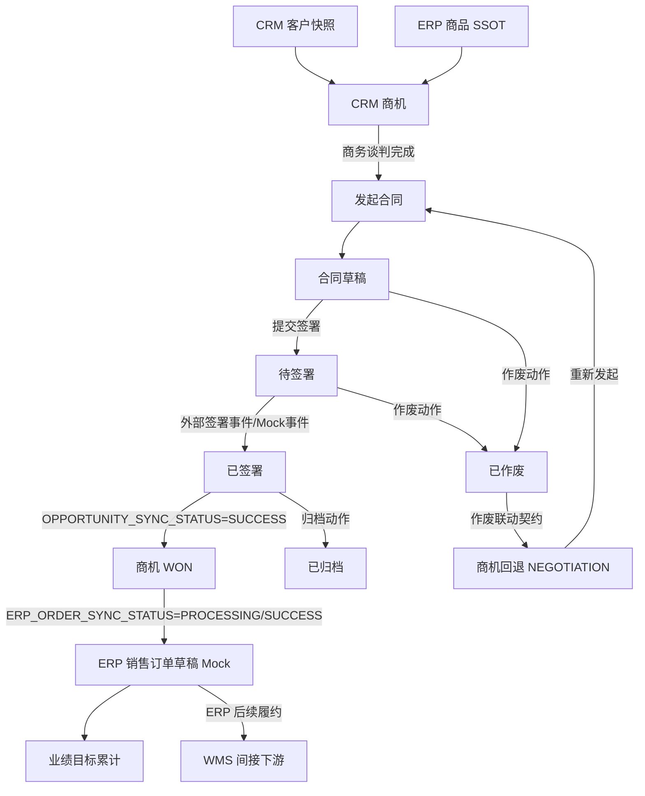
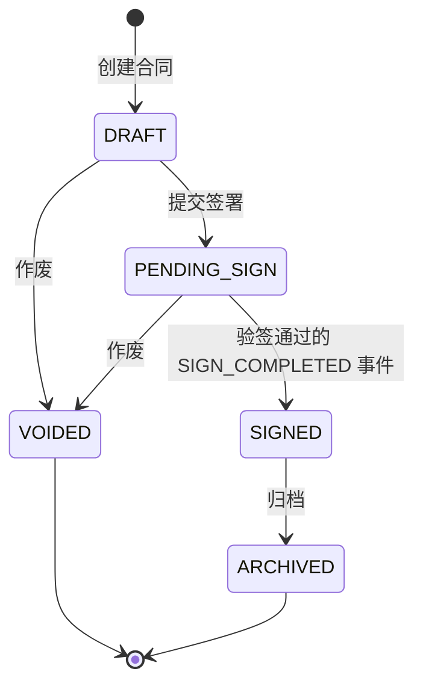
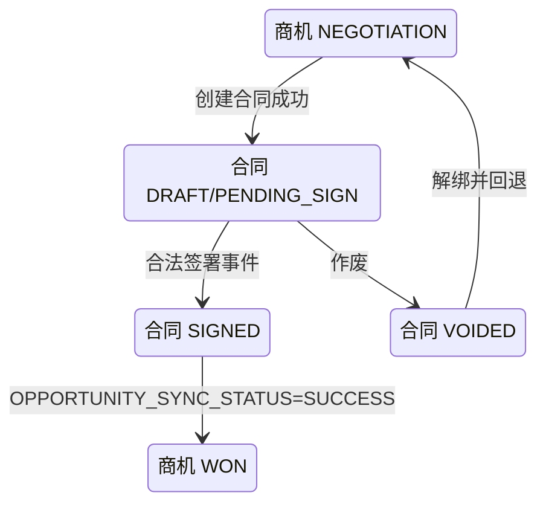

# 合同主PRD

> **版本**：V2.1 | 2026-08-13
> **读者**：研发工程师、测试工程师、产品复核、项目经理
> **字段定义 SSOT**：《合同字段清单》
> **引用原则**：本文描述流程、动作和联动，不重复定义字段取值、必填性或长度。

---

### 1. 业务背景

合同是商机从商务谈判走向可确认成交的签约控制对象。在 Forge CRM Demo 中，合同模块通过模拟创建、提交签署、签署完成、归档和作废，验证商机、合同与 ERP 订单之间的关键闭环。合同在一期不是完整合同文件或条款库，而是围绕合同名称、签署金额、关联商机和外部合同标识建立的最小业务契约；条款、附件和真实电子签章均不在本模块保存。

没有统一合同管理时存在以下问题：

1. 合同与商机依靠人工记忆关联，无法证明成交来源。
2. 销售在商机中直接标记赢单，缺少合同签署这一事实门槛。
3. 合同状态分散在邮件和聊天工具中，主管无法追踪签署进度。
4. 同一商机可能重复发起多份有效合同，造成金额和状态冲突。
5. 待签署合同作废后商机仍停留合同阶段，销售流程被锁死。
6. 合同签署完成后商机未自动赢单，业绩与真实签约不一致。
7. 商机赢单后 ERP 订单草稿需要重复录入，容易漏单或重单。
8. 合同金额与商机预计金额缺乏明确回写口径。
9. 已签署合同仍可能被误作废，破坏既成业务事实。
10. 多次签署回调可能重复触发赢单和 ERP 建单。
11. 外部签署或 ERP 服务失败时缺少可追踪的降级方案。
12. 历史合同被删除后无法审计，不符合主数据留痕要求。

本模块通过合同状态机和跨对象业务约束，确保“发起合同→签署完成→商机赢单→ERP 订单草稿”的顺序正确，并保证“合同作废→解绑→商机回退谈判”可追踪、可补偿、不可出现合同已作废但商机仍被合同锁定的业务结果。

**定位句**：合同是 CRM 商机成交的签约控制对象；它不实现真实电子签章，但负责以签署事实驱动商机赢单，并以作废事实解除绑定和回退销售流程。

---

### 2. 功能范围

**In Scope**：

- 从商机谈判阶段发起合同。
- 从合同列表手动新建并关联符合条件的商机。
- 自动继承关联客户与商机上下文。
- 生成合同编号。
- 草稿状态维护合同信息。
- 提交合同进入待签署。
- 模拟在线签署完成事件。
- 签署完成后写入签署结果。
- 签署完成后联动关联商机赢单。
- 商机赢单后触发 ERP 销售订单草稿 Mock。
- 已签署合同执行归档。
- 草稿或待签署合同执行作废。
- 作废时记录动作原因到审计日志。
- 作废后解除有效合同绑定。
- 作废后联动商机回退至谈判阶段。
- 展示合同列表、详情、关联对象和联动结果。
- 所有不可逆动作二次确认。
- 外部联动失败提供重试和审计。

**Out of Scope**：

- 真实电子签章；原因：Demo 只模拟签署结果。
- 实名认证与证书管理；原因：依赖第三方签章平台。
- 合同模板库；原因：一期聚焦状态和跨模块联动。
- 合同条款在线编辑器；原因：不验证富文本法务协作。
- 合同审批流；原因：一期无审批角色和节点设计。
- 合同变更、补充协议与续签；原因：属于二期合同生命周期能力。
- 已签署合同作废；原因：外部签署事实不可逆，需未来变更流程处理。
- 合同删除；原因：业务对象统一保留历史，不提供删除。
- 纸质合同附件存储；原因：Demo 不建设文件服务。
- ERP 正式订单审核；原因：订单 SSOT 在 ERP。
- WMS 发货；原因：CRM 不直接对接 WMS。
- 法务合规意见管理；原因：不在一期验证范围。

---

### 3. 对象定位

#### 3.1 在系统中的位置

| 项目 | 内容 |
|------|------|
| 对象类型 | 合同（签约控制层） |
| 核心职责 | 固化签署过程并驱动商机赢单或作废回退 |
| 来源 | 商机谈判阶段发起，或合同列表手动创建并关联可用商机 |
| 上游对象 | CRM 商机、CRM 客户快照、ERP 商品引用 |
| 下游对象 | 商机赢单事件、ERP 销售订单草稿、业绩目标 |
| 关联基数 | 一个有效合同关联一个商机；一个商机同一时刻至多一个有效合同 |
| 主数据边界 | 合同业务记录、商机关联和 CRM 合同状态机由 CRM 负责；真实签署过程与签署事件来自外部签署平台；订单金额和订单状态由 ERP 负责 |
| 删除策略 | 不提供删除；草稿或待签署通过作废终止 |
| 终态 | 归档或作废 |
| 关键互锁 | 有效合同进入待签署后，关联商机禁止手工推进或回退；签署、赢单、订单节点分别受各自联动状态控制 |

#### 3.2 系统链路图

链路约束：

- 商机必须先有有效客户和商品上下文。
- 合同创建成功后商机才进入合同阶段。
- 合同签署完成是商机赢单的唯一合同侧触发；商机未 `WON` 不允许下推 ERP。
- 合同作废与商机回退必须满足业务一致性约束；部分失败必须进入联动待补偿，不得留下不可追踪的半完成结果。
- ERP 下推失败不回滚合法签署事实或商机 `WON`；超时先查询幂等结果，不重复创建订单。
- CRM 不直接调用 WMS。

#### 3.2.1 对象 SSOT 分层

| 层级 | 权威对象 | CRM 的职责 | 不得伪造/覆盖 |
|------|----------|------------|--------------|
| CRM 合同层 | 合同业务记录、商机关联、CRM 合同状态机 | 创建、编辑草稿、提交签署、记录状态动作、保存只读签署结果快照 | 不伪造外部签署凭证；不把 ERP 订单当合同状态来源 |
| 外部签署平台 | 真实签署过程、签署主体、签署事件和 `signedAt` | 接收并校验事件；保存事件字段和只读结果快照 | CRM Mock 操作人不得被写成真实签署主体 |
| ERP 订单层 | 订单金额、价格、税率和正式订单状态 | 以合同签署金额作为请求输入，展示 ERP 返回只读摘要 | CRM 不把商机预计金额改写为 ERP 订单金额 |

Demo 阶段没有真实外部平台和 ERP API，使用 Mock 事件和 Mock 响应模拟上述边界；Mock 只模拟外部事实，不改变 SSOT 归属。

#### 3.3 实体关系说明

| 关系 | 基数 | 说明 | 约束 |
|------|:---:|------|------|
| 客户 : 合同 | 1:N | 同一客户可因不同商机产生多份合同 | 客户基础档案来自 ERP 快照 |
| 商机 : 有效合同 | 1:0..1 | 同一时刻最多一份未作废合同 | 作废后允许重新发起 |
| 商机 : 历史合同 | 1:N | 重复发起周期保留作废历史 | 历史合同不可删除 |
| 合同 : 签署事件 | 1:N | 可接收重复回调或重试事件 | 同一事件只处理一次 |
| 合同 : ERP订单草稿 | 1:0..1 | 签署并赢单后产生订单草稿 | 订单 SSOT 在 ERP |
| 合同 : 审计日志 | 1:N | 创建、编辑、提交、签署、归档、作废均留痕 | 动作原因存日志，不伪造主表字段 |
| 合同 : 系统用户 | N:1 | 每份合同由创建人负责维护 | 主管可查看团队数据 |

实体一致性要求：

1. 合同关联客户必须与关联商机的客户一致。
2. 合同保存时重新校验商机未绑定其他有效合同。
3. 合同作废后保留历史关联，但解除“当前有效合同”指针。
4. 合同签署事件必须匹配当前有效绑定。
5. ERP 订单草稿返回结果以关联摘要展示，不在 CRM 维护订单主数据。
6. 合同金额用于成交事实与订单草稿，不静默覆盖历史审计。

#### 3.4 合同最小契约与签署角色

- 合同最小契约仅包含：合同名称、合同签署金额、关联商机、外部合同标识；条款正文、附件、模板版本和真实签章凭证 Out of Scope。
- **合同发起人**：销售，负责从商机或合同列表创建草稿、提交签署和执行允许的作废动作。
- **外部签署主体**：客户方在外部签署平台完成签署，是真实签署人；其身份和签署时间来自外部事件。
- **CRM 内部 Mock 操作人**：销售主管或系统管理员，仅能点击“模拟签署完成”产生 Mock 事件，不得被当作真实签署人或签署主体。
- 每条签署结果必须同时记录 `签署人来源`、`签署主体标识`、`事件来源`、`操作者` 和 `mockedAt`（仅 Mock 事件），以便区分外部事实和内部模拟动作。

#### 3.5 金额分层与展示口径

| 金额层 | SSOT/用途 | CRM 处理 |
|--------|-----------|----------|
| 商机预计金额 | CRM 预测值，用于预测和复盘 | 可作为合同金额建议，不自动覆盖合同签署金额 |
| 合同签署金额 | 外部签署事实对应的合同金额 | 作为下推 ERP 请求输入，保留币种、含税标识和税率 |
| ERP 订单金额 | ERP 按价格、税率计算后的正式事实 | CRM 只读展示 ERP 返回值，不反向修改合同金额 |

金额不一致时必须展示差异提示并记录差异原因；不得用预计金额替代合同金额，也不得用合同金额覆盖 ERP 正式订单金额。一期固定 `CNY`，非 CNY 合同在创建/提交签署时阻断并提示“一期仅支持人民币结算”，并进入差异审计，不做汇率换算。

---

### 4. 业务场景

| 场景ID | 场景 | 类型 | 触发角色 | 说明 |
|--------|------|------|----------|------|
| S01 | 商机发起合同并签署完成 | **主流程** | 销售 / 系统 | 创建草稿、提交签署、签署后联动赢单与 ERP 订单 |
| S02 | 已签署合同归档 | **支线** | 销售主管 | 确认资料完整后归档，保留只读历史 |
| S03 | 待签署合同作废并回退商机 | **支线** | 销售 | 填写动作原因，作废、解绑并回退谈判 |
| S04 | 已签署合同尝试作废 | **异常** | 销售 | 系统阻断并提示走未来变更流程 |
| S05 | 签署或 ERP 联动重复与失败 | **异常** | 系统 | 幂等处理、保留签署事实并提供重试 |

#### S01 商机发起合同并签署完成

- 前置：商机处于允许发起合同的阶段。
- 前置：不存在其他有效合同。
- 动作：创建合同草稿并继承关联上下文。
- 动作：草稿提交签署。
- 事件：模拟签署服务返回成功。
- 结果：合同进入已签署。
- 后置：商机联动进入赢单。
- 后置：下推一份 ERP 销售订单草稿。

#### S02 已签署合同归档

- 前置：合同已签署且关联结果一致。
- 动作：销售主管点击“归档”。
- 确认：提示归档后不可编辑。
- 结果：合同进入归档终态。
- 后置：保留商机赢单与 ERP 订单结果。
- 约束：归档不重复触发赢单或订单。

#### S03 待签署合同作废并回退商机

- 前置：合同处于允许作废状态。
- 输入：作废动作原因，写入审计日志。
- 确认：提示将解除绑定并回退商机。
- 业务结果一：合同进入作废终态。
- 业务结果二：解除当前有效合同绑定。
- 业务结果三：商机回退至谈判阶段并恢复可推进。
- 三项结果必须满足业务一致性；若合同已作废但解绑或回退失败，保留已作废事实并进入“联动待补偿”，不得出现商机仍被合同锁定且无补偿记录的结果。

#### S04 已签署合同尝试作废

- 前置：合同已签署或已归档。
- 动作：通过旧页面或接口尝试作废。
- 结果：动作入口不展示，接口仍阻断。
- 提示：`已签署合同不可作废，如需变更请走合同变更流程`。
- 数据：合同与商机均不变化。
- 审计：记录非法状态操作请求。

#### S05 签署或 ERP 联动重复与失败

- 重复签署事件：只处理第一次合法事件。
- 商机赢单联动失败：合同保持已签署，进入联动补偿队列。
- ERP 下推失败：商机保持赢单，显示同步失败并允许重试。
- 重复 ERP 重试：使用同一业务幂等键。
- 最终结果：不得生成重复订单草稿。

### 4.6 外部签署事件契约

外部签署平台向 CRM 发送签署事件；真实接入时由平台签名，Demo 阶段由主管或管理员通过 Mock 操作生成同结构事件。事件字段如下：

| 字段 | 类型/要求 | 含义 |
|------|-----------|------|
| `eventId` | String，必填，全局唯一 | 外部事件唯一标识，作为事件幂等键 |
| `externalContractId` | String，必填 | 外部签署平台合同标识 |
| `crmContractId` | String，必填 | CRM 合同编号/内部 ID |
| `crmOpportunityId` | String，必填 | 关联 CRM 商机标识；对外事件契约统一使用该名称 |
| `eventType` | Enum：`SIGN_STATUS_CHANGED` / `SIGN_COMPLETED` / `SIGN_FAILED` / `SIGN_REJECTED` / `SIGN_EXPIRED` | 事件类型 |
| `signStatus` | Enum：`SIGNED` / `FAILED` / `REJECTED` / `EXPIRED` | 外部签署结果 |
| `signedAt` | ISO 8601，可空 | 外部平台确认签署的时间；仅合法完成事件使用 |
| `signedAmount` | Decimal，可空 | 外部签署确认的合同金额；合法完成事件用于校验合同签署金额 |
| `currency` | String，固定 `CNY` | 签署金额币种；一期仅支持人民币结算，非 `CNY` 事件进入异常并不得推进 |
| `taxIncluded` | Boolean/Enum，可空 | 签署金额含税标识；具体枚举引用《合同字段清单》 |
| `taxRate` | Decimal，可空 | 签署确认税率；与合同金额税率留痕并用于差异说明 |
| `eventVersion` | String/Integer，必填 | 外部事件契约版本 |
| `signature` | String，必填 | 外部平台事件签名，用于验签；Mock 使用受控 Mock 签名 |
| `receivedAt` | ISO 8601，系统生成 | CRM 接收到事件的时间 |
| `externalRequestId` | String，必填 | 当前签署请求标识；重新发起签署时生成新值，旧请求事件不得推进新请求 |

事件处理规则：

1. 同一 `eventId` 只处理一次；重复事件返回第一次处理结果，不重复写状态、不重复触发赢单或订单。
2. 同一合同只接受一次通过验签且匹配当前外部请求的合法 `SIGN_COMPLETED` 事件；后续完成事件记录为重复或异常。
3. 验签失败、契约版本不支持、合同标识/商机标识不匹配时，事件进入合同异常记录，合同状态不变。
4. `VOIDED` 或 `ARCHIVED` 合同收到迟到事件时，事件进入异常队列，不推进合同、不推进商机、不创建订单。
5. 事件接收时间 `receivedAt` 不等于外部签署时间 `signedAt`；Mock 操作时间另存 `mockedAt`，不覆盖 `signedAt`。
6. `SIGN_FAILED`、`SIGN_REJECTED`、`SIGN_EXPIRED` 一期不新增合同主状态，均进入合同异常记录，合同保持 `PENDING_SIGN`；主管可取消作废或重新发起签署。

**字段映射说明**：对外签署事件契约统一使用 `crmContractId + crmOpportunityId`。合同模块内部历史代码或页面变量可将 `crmOpportunityId` 简称为 `opportunityId`，但事件序列化、事件日志、跨模块请求和验收数据必须使用统一对外字段名；`crmContractId` 同理不得在跨模块契约中缩写为 `contractId`。

### 4.7 作废联动契约

合同作废动作向商机联动服务提交以下业务契约：

| 字段 | 要求 |
|------|------|
| `voidedContractId` | 被作废合同标识 |
| `crmOpportunityId` | 关联商机标识；模块内部可简称 `opportunityId`，跨模块契约不得使用简称 |
| `sourceOpportunityStatus` | 作废前商机状态，必须与当前读取值一致 |
| `targetOpportunityStatus` | 固定为 `NEGOTIATION` |
| `voidReason` | 作废原因，按字段清单校验 |
| `requestId` | 本次作废联动请求幂等标识 |
| `contractVersion` | 作废提交时合同版本 |
| `eventId` | 作废动作事件标识 |

一致性策略：业务硬约束是不得出现合同已作废而商机仍被合同锁定，且失败必须可追踪、可重试；Demo 采用 Mock 事务模拟结果链路，真实实现可选同库事务或事件驱动，这些属于推荐技术方案而非业务约束。若合同作废成功但商机回退失败，合同保持 `VOIDED`，联动结果记为“联动待补偿”，生成补偿记录；销售主管或管理员可点击“重试回退”，成功后更新目标阶段和补偿状态，不回滚已作废事实。

---

### 5. 状态机

#### 5.1 对象状态

> 完整状态定义以《合同字段清单》为准。本节只说明业务语义。

| 状态 | 业务含义 | 是否终态 |
|------|----------|:--------:|
| `DRAFT` | 合同草稿，可维护并提交签署 | 否 |
| `PENDING_SIGN` | 已提交，等待外部签署结果；签署失败、拒签或超时事件不新增主状态，进入合同异常记录 | 否 |
| `SIGNED` | 签署事实已确认，可继续归档 | 否 |
| `ARCHIVED` | 已归档，只读保留 | 是 |
| `VOIDED` | 已作废，只读保留 | 是 |

#### 5.2 状态机图

跨对象联动：

#### 5.3 状态流转表（核心交付物）

| 当前状态 | 动作 | 前置条件 | 结果状态 | 二次确认 | 后置影响 | 失败处理 |
|----------|------|----------|----------|:--------:|----------|----------|
| 新建 | 保存合同 | 表单校验通过；商机可签约；不存在有效合同 | `DRAFT` | 否 | 生成编号；建立有效绑定；商机进入合同阶段 | 合同与绑定必须共同成功；失败不产生孤立合同或错误商机阶段，保持新增页；Toast `合同创建失败` |
| `DRAFT` | 保存修改 | 当前版本一致；操作者有编辑权限 | `DRAFT` | 否 | 更新合同信息与审计日志 | 保持原数据；映射字段错误；Toast `保存失败` |
| `DRAFT` | 提交签署 | 合同信息完整；有效绑定一致 | `PENDING_SIGN` | 是 | 锁定编辑；发送模拟签署通知 | 保持草稿；Toast `提交签署失败` |
| `PENDING_SIGN` | 签署完成 | 事件契约完整、验签通过、未处理且绑定一致 | `SIGNED` | 否 | 写入外部签署结果只读快照；启动三节点联动 | 合同保持待签署；失败事件进入合同异常记录，不改主状态 |
| `PENDING_SIGN` | 签署失败/拒签/超时/过期事件 | 事件契约完整但 `signStatus` 非 `SIGNED` | `PENDING_SIGN` | 否 | 记录合同异常、外部请求结果和事件来源 | 不改主状态；主管可取消作废或重新发起，生成新外部请求标识，旧事件不得推进新请求 |
| `SIGNED` | 归档 | 归档门槛满足：三节点联动成功，或已记录允许 ERP 失败后归档且不影响重试的例外；有归档权限 | `ARCHIVED` | 是 | 写入归档人、归档时间、归档原因和归档结果审计 | 保持已签署；Toast `归档失败，请重试` |
| `DRAFT` | 作废 | 动作原因通过字段清单校验；有权限 | `VOIDED` | 是 | 解除有效绑定；商机回退谈判；记录原因 | 合同作废成功但回退失败时进入联动待补偿，不伪造回退成功 |
| `PENDING_SIGN` | 作废 | 尚未签署；动作原因通过字段清单校验；有权限 | `VOIDED` | 是 | 取消待签署任务；解绑；商机回退谈判 | 合同作废成功但回退失败时进入联动待补偿；主管可重试回退 |
| `SIGNED` | 作废请求 | 已存在签署事实 | `SIGNED` | 否 | 无 | 阻断；Toast `已签署合同不可作废，如需变更请走合同变更流程` |
| `ARCHIVED` | 作废请求 | 已归档 | `ARCHIVED` | 否 | 无 | 阻断；同上 |

#### 5.4 动作能力矩阵

| 动作 | DRAFT | PENDING_SIGN | SIGNED | ARCHIVED | VOIDED |
|------|:-----:|:------------:|:------:|:--------:|:------:|
| 查看 | ✅ | ✅ | ✅ | ✅ | ✅ |
| 编辑 | ✅ | ❌ | ❌ | ❌ | ❌ |
| 提交签署 | ✅ | ❌ | ❌ | ❌ | ❌ |
| 模拟签署完成 | ❌ | 按权限 | ❌ | ❌ | ❌ |
| 归档 | ❌ | ❌ | ✅ | ❌ | ❌ |
| 作废 | ✅ | ✅ | ❌ | ❌ | ❌ |
| 查看商机 | ✅ | ✅ | ✅ | ✅ | ✅ |
| 查看 ERP 订单 | ❌ | ❌ | 依同步结果 | 依同步结果 | ❌ |
| 删除 | ❌ | ❌ | ❌ | ❌ | ❌ |

矩阵约束：

- 状态变化只通过动作按钮或合法签署事件触发。
- 合同状态不在新增编辑表单中直接修改。
- 不可用动作不渲染。
- 已作废合同仍可查看历史关联和审计日志。

---

### 6. 核心业务规则

#### 6.1 创建与绑定规则

| 规则ID | 规则 |
|--------|------|
| R01 | 合同必须关联一个满足签约条件的商机，关联客户必须与商机客户一致；同一商机同一时刻至多绑定一份未作废合同。 |
| R02 | 合同创建成功后才能建立有效绑定并把商机推进至合同阶段；任一步失败不得产生孤立合同或错误商机阶段，页面可重试且保留失败审计。 |

#### 6.2 签署与赢单规则

| 规则ID | 规则 |
|--------|------|
| R03 | 只有草稿可提交签署；进入待签署后合同信息锁定，关联商机禁止手工推进或回退。 |
| R04 | 合法签署完成事件将合同置为已签署，并先推进 `OPPORTUNITY_SYNC_STATUS`；商机确认 `WON` 后才允许推进 `ERP_ORDER_SYNC_STATUS`，随后以请求幂等键下推一份 ERP 销售订单草稿。 |

#### 6.3 作废与归档规则

| 规则ID | 规则 |
|--------|------|
| R05 | 草稿或待签署合同作废时必须提供动作原因；合同作废、解绑和商机回退遵循作废联动契约，失败进入可追踪、可重试的补偿记录；已签署或已归档合同不得作废。 |
| R06 | 已签署合同可执行归档并进入只读终态；合同不提供删除，归档不重复触发商机赢单或 ERP 订单下推。归档人、时间、原因和结果写入审计日志。 |

执行优先级：

1. 操作权限。
2. 当前合同状态。
3. 关联商机状态与绑定唯一性。
4. 字段清单校验。
5. 版本并发校验。
6. 合同状态结果提交与版本校验。
7. 商机与 ERP 后置联动。
8. 审计与反馈。

#### 6.4 联动节点状态与顺序

合同签署成功后，CRM 独立维护以下三个业务联动节点；节点状态是联动结果，不是合同主状态：

| 节点 | 状态示例 | 前置 | 请求参数 | 幂等键 | 成功返回 | 失败/重试 | 页面表现 |
|------|----------|------|----------|----------|-----------|----------|
| `OPPORTUNITY_SYNC_STATUS` | `PENDING/SUCCESS/FAILED/COMPENSATING` | 合同状态 `SIGNED`，事件已幂等处理 | `crmContractId`、`crmOpportunityId`、`eventId`、`contractVersion` | `crmOpportunityId+contractVersion` | 商机 `WON`、返回商机版本 | 记录失败原因和 `requestId`；主管/管理员重试，不回滚合同 | 展示商机联动节点和失败原因 |
| `ERP_ORDER_SYNC_STATUS` | `NOT_TRIGGERED/PROCESSING/SUCCESS/FAILED/RETRYING` | `OPPORTUNITY_SYNC_STATUS=SUCCESS` 且商机为 `WON` | `crmContractId`、`crmOpportunityId`、`contractSignedAmount`、`currency`、`taxIncluded`、`taxRate`、幂等键 | `crmContractId+crmOpportunityId+contractVersion` | ERP 订单编号、ERP 订单金额、订单版本 | 超时先查询幂等结果；已有订单返回已有订单；失败进入 `RETRYING` 并沿用原幂等键重试 | 展示订单编号、ERP 金额和重试入口；“查单中”仅为 `PROCESSING` 子标识 |
| `PERFORMANCE_SYNC_STATUS` | `NOT_TRIGGERED/PROCESSING/SUCCESS/FAILED/RETRYING` | 商机 `WON` 和 ERP 订单结果按业绩规则可用 | `crmContractId`、`crmOpportunityId`、订单编号、金额摘要 | `crmContractId+ERP订单编号` | 业绩累计结果 | 失败记录原因和重试次数，不影响合同或 ERP 订单 | 展示业绩累计或待重试 |

硬约束：商机未 `WON` 时 ERP 节点必须保持 `NOT_TRIGGERED`，不得下推；任一联动失败不回滚已经确认的合同签署事实或商机 `WON`；重试只作用于失败节点并沿用原幂等键，不得生成第二份订单。`QUERYING（查单中）`如需展示，只能作为 `PROCESSING` 的页面子标签，不是独立枚举。

---

### 7. AI 串联规则（CRM特有）

合同不独立计算 AI 结果，但它位于 AI 商机预测闭环的关键执行节点：预测辅助推进，签署事实才允许成交。

| AI/自动化节点 | 触发时机 | 输入 | 输出 | 执行动作 | 失败处理 |
|---------------|----------|------|------|----------|----------|
| 商机预测刷新 | 合同创建成功、签署完成、合同作废后 | 商机阶段、合同关联结果、客户画像、跟进频率 | 最新成交概率 | 回写商机最新预测展示，不改变合同状态 | 预测失败不阻断合同动作；商机保留上次成功结果 |
| 成交自动化 | 合同签署完成 | 合同标识、商机标识、签署结果 | 商机赢单事件 | 联动商机 WON 并触发 ERP 订单草稿 | 商机联动失败进入补偿队列；不得回滚签署事实 |
| 回退自动化 | 合同作废 | 合同标识、商机标识、作废事件 | 商机回退事件 | 解绑并回退谈判 | 必须满足作废联动业务一致性；失败进入联动待补偿并提供重试，不伪造回退成功 |

自动化约束：

- AI 概率不能替代合同签署事实。
- 高概率商机也不能跳过合同状态机直接赢单。
- 预测失败不阻断提交签署、签署完成或作废。
- 签署联动失败展示待补偿状态。
- 补偿成功后刷新商机和 ERP 结果。
- 同一签署事件只触发一次成交自动化。

---

### 8. 权限设计

#### 8.1 数据可见范围

| 角色 | 可见范围 | 说明 |
|------|----------|------|
| 销售 | 自己负责商机的合同 | 可维护草稿和发起签署 |
| 销售主管 | 本团队合同 | 可签署确认、归档和处理业务异常 |
| 系统管理员 | 全部合同 | 可联调与重试外部同步 |
| 只读审计角色 | 授权范围内全部历史合同 | 仅查看 |

数据范围约束：

- 客户与商机链接继续执行各自数据权限。
- ERP 订单摘要不扩大合同可见范围。
- 深链接访问必须重新校验。
- 作废历史对授权审计角色可见。

#### 8.2 操作权限矩阵

| 操作 | 销售 | 销售主管 | 系统管理员 | 只读审计 |
|------|:----:|:--------:|:------------:|:--------:|
| 查看合同 | 自己负责 | 团队范围 | 全部 | 授权范围 |
| 新建合同 | 关联商机范围 | 团队商机 | ✅ | ❌ |
| 编辑草稿 | 自己负责 | 团队范围 | ✅ | ❌ |
| 提交签署 | 自己负责 | 团队范围 | ✅ | ❌ |
| 模拟签署完成 | ❌ | ✅ | ✅ | ❌ |
| 作废未签署合同 | 自己负责 | 团队范围 | ✅ | ❌ |
| 归档已签署合同 | ❌ | ✅ | ✅ | ❌ |
| 重试商机联动 | ❌ | ✅ | ✅ | ❌ |
| 重试 ERP 下推 | ❌ | ✅ | ✅ | ❌ |
| 删除合同 | ❌ | ❌ | ❌ | ❌ |

权限失败处理：

- 无权入口不展示。
- 直接接口返回 403。
- 不改变合同、商机或 ERP 请求状态。
- Toast `无权执行该操作`。

---

### 9. 边界与异常处理

#### 9.1 并发控制

| 场景 | 处理方式 |
|------|----------|
| 同一商机同时创建两份合同 | 通过有效绑定唯一约束，只允许一份创建成功 |
| 编辑草稿与提交签署并发 | 版本号乐观锁，首个成功动作生效 |
| 作废与签署回调并发 | 以签署服务已确认事实、事件接收顺序和合同版本校验处理；冲突进入人工异常队列，不静默覆盖 |
| 归档与 ERP 重试并发 | 归档不阻断幂等 ERP 重试，两个结果独立记录 |

#### 9.2 去重与幂等

| 场景 | 处理方式 |
|------|----------|
| 重复创建点击 | 客户端请求键返回首次创建结果 |
| 重复提交签署 | 当前已待签署时返回首次提交结果 |
| 重复签署回调 | 以签署事件标识去重，只联动一次赢单 |
| 重复商机赢单事件 | 商机已赢单时返回当前结果，不重复写业绩 |
| 重复 ERP 下推 | 以商机标识为业务幂等键，禁止第二份订单草稿 |
| 重复作废确认 | 已作废时返回首次结果，不重复回退商机 |

#### 9.3 数量、时间与业务边界

| 场景 | 处理方式 |
|------|----------|
| 商机已有有效合同 | 阻断创建并跳转现有合同 |
| 关联客户与商机客户不一致 | 阻断保存，关联客户只允许继承 |
| 草稿信息不完整提交签署 | 阻断并聚焦第一个缺失项 |
| 待签署期间编辑 | 不展示编辑入口，接口拒绝 |
| 已签署合同作废 | 阻断并提示走合同变更流程 |
| 已归档合同作废 | 阻断，保持归档终态 |
| 作废原因不合规 | 阻断弹窗提交并保留输入 |
| 作废回退失败 | 合同保留 `VOIDED`，联动状态为“联动待补偿”，显示失败原因、补偿记录和重试入口；不得出现商机仍被合同锁定且无记录 |
| 签署回调缺少绑定 | 拒绝联动并进入异常队列 |
| 商机赢单失败 | 合同保持已签署，补偿任务重试 |
| ERP 订单下推失败 | 商机保持赢单，显示失败并允许幂等重试 |
| 合同金额与预计金额不同 | 以合同签署金额作为成交和订单草稿输入，保留历史预计值用于复盘 |
| 终态编辑或删除 | 不展示入口，接口阻断 |

异常审计：

- 记录合同编号、原状态、目标状态、操作者和时间。
- 作废动作原因写入审计日志。
- 签署事件记录外部事件标识。
- 联动失败记录合同、商机和请求标识。
- 用户文案不暴露签章或 ERP 技术凭证。

---

### 10. 验收重点

| # | 验收项 | 输入条件 | 预期结果 |
|---|--------|----------|----------|
| V01 | 正常签署成交闭环 | 一条谈判阶段商机且无有效合同；创建合同、提交签署、模拟签署完成 | 合同依次进入草稿、待签署、已签署；商机进入赢单；仅生成一份 ERP 订单草稿 |
| V02 | 作废联动回退 | 一份草稿或待签署合同；输入合规作废原因并确认 | 合同进入作废；解除有效绑定；商机回退谈判；重新发起合同入口恢复 |
| V03 | 已签署作废阻断 | 合同已签署或已归档；通过页面或接口请求作废 | 页面不展示入口；接口阻断；合同和商机不变；提示走合同变更流程 |
| V04 | 重复签署与订单幂等 | 对同一待签署合同重复发送相同签署事件，并重试 ERP 下推 | 合同只签署一次；商机只赢单一次；业绩只累计一次；ERP 仅一份订单草稿 |
| V05 | 联动失败与补偿 | 签署成功后模拟商机联动失败，再模拟 ERP 下推超时后恢复 | 签署事实保留；商机联动可补偿；ERP 使用同一幂等键重试；页面展示每个节点结果 |

#### 10.1 归档门槛与审计

- 归档前必须满足：合同为 `SIGNED`；商机联动状态为 `SUCCESS`；ERP 订单同步成功，或主管明确选择“允许 ERP 失败后归档”并确认该失败不影响后续重试；合同与商机不存在未处理的绑定冲突。
- 归档不代表 ERP 失败记录被清除；允许带失败节点归档时，`ERP_ORDER_SYNC_STATUS` 和 `PERFORMANCE_SYNC_STATUS` 继续可重试。
- 归档动作由销售主管或系统管理员通过按钮触发，必须记录归档人、归档时间、归档原因、归档结果、合同版本和审计日志编号。
- 已归档合同只读；迟到签署事件和重复联动事件仅进入异常队列，不改变归档状态。

补充验收：

- [ ] 合同状态不可在表单直接编辑。
- [ ] 同一商机同一时刻只有一份有效合同。
- [ ] 关联客户与商机客户始终一致。
- [ ] 待签署后合同信息只读。
- [ ] 签署完成是商机赢单的唯一合同侧触发。
- [ ] 作废、解绑和商机回退满足业务一致性；失败可追踪、可补偿、可重试。
- [ ] 合同不提供删除。
- [ ] CRM 不直接操作 WMS。

---

### 11. 修订记录

| 日期 | 版本 | 变更摘要 |
|------|------|----------|
| 2026-07-18 | V1.0 | 初版，定义合同签署与商机联动 |
| 2026-07-18 | V2.0 | 对齐 v2.0 模板，补齐全链路、实体、场景、状态失败处理、R01-R06、作废回退、签署赢单、权限、异常与验收 |
| 2026-08-13 | V2.1 | 明确外部签署事件契约、对象 SSOT、签署角色、金额分层、作废补偿、三节点联动、归档门槛和业务一致性硬约束；补齐字段与 Demo 引用规则及 11 条验收用例 |
