# 商机管理评审PRD

> **文档定位**：评审用完整档，评审人读本件即可审，开发直接按本件工作，不用切换多份PRD。
> **本件为自包含评审档，覆盖商机管理全部需求**，评审通过后可直接作为开发依据，无需再查其他文档。
> **版本**：V0.1 | 评审状态：待评审

## 修改记录

| 日期 | 版本 | 修改人 | 修改内容 |
|------|------|--------|---------|
| 2026-09-26 | V0.1 | 杰西卡 | 初版：按评审PRD编写规范，覆盖商机管理28功能点（列表11+新增/编辑6+详情11），字段取自商机字段清单权威定义 |

---

## 一、做哪些 / 不做哪些

**做哪些**：
- 基于客户快照创建商机，从 ERP Mock 列表引用商品，维护商机业务信息和预计结果。
- 按既定阶段逐级推进商机（初步接触→需求确认→方案报价→商务谈判→合同签订→赢单），支持看板拖拽和列表操作。
- 在任意非终态执行输单关闭，输单时沉淀复盘原因。
- 创建与阶段变化时触发 AI 商机预测，输出成交概率和推荐商品；高概率触发 ERP 库存预占通知 Mock。
- 进入合同阶段触发合同草稿；合同签署完成后联动商机赢单；赢单后下推 ERP 销售订单草稿 Mock。
- 汇总跟进记录并回写最近业务活动；为业绩目标模块提供赢单金额和创建量数据。
- 提供列表视图和阶段看板视图，两种视图同一数据、阶段、权限。

**不做哪些**：
- 不做 ERP 商品、价格与库存主数据维护（权威源在 ERP）。
- 不做 ERP 销售订单正式审核与履约（订单唯一源在 ERP）。
- 不直接对接 WMS 发货；不做真实库存锁定（Demo 只验证 Mock 通知链路）。
- 不做真实电子签章（一期合同签署为模拟动作）；不做报价审批流；不做折扣权限体系。
- 不做商机批量导入；不做商机阶段自定义。
- 已赢单或已输单后不可重开（保护历史报表和目标结算稳定性）。

---

## 二、功能清单

### 商机列表页（11 个）

| 序号 | 功能 | 一句话说清 | 本期？ |
|------|------|-----------|:---:|
| 1 | 商机列表与看板页面 | 商机管理主页面，列表与看板两种视图入口 | ✅ |
| 2 | 看板与列表视图切换 | 看板按阶段分列，列表按表格展示，切换保留筛选与页签 | ✅ |
| 3 | 新建商机 | 主操作区进入新增表单，不在列表直接建半成品行 | ✅ |
| 4 | 商机查询筛选 | 关键词/阶段/创建人组合筛选，结果受数据权限约束 | ✅ |
| 5 | 商机阶段看板 | 按7阶段分列，卡片可拖拽逐级推进 | ✅ |
| 6 | 列表状态页签 | 全部/进行中/赢单/输单四页签筛选 | ✅ |
| 7 | 商机列表字段 | 列表列展示与排序，阶段/概率标签视觉 | ✅ |
| 8 | 列表行内操作 | 按阶段显示查看/编辑/推进/输单，权限控制 | ✅ |
| 9 | 列表输单确认 | 输单弹窗，必填原因，终态不可回退 | ✅ |
| 10 | 列表发起合同 | 商务谈判推进时触发合同流程确认 | ✅ |
| 11 | 本页规则 | 页面准入、防重复操作、空态与并发 | ✅ |

### 商机新增/编辑页（6 个）

| 序号 | 功能 | 一句话说清 | 本期？ |
|------|------|-----------|:---:|
| 1 | 商机新增/编辑页面 | 新增空白表单 / 编辑早期阶段回填，高阶段只读 | ✅ |
| 2 | 表单校验与保存流程 | 必填→客户快照→商品→状态前置→保存的顺序校验 | ✅ |
| 3 | 基本信息 | 名称/客户/预计金额/日期/需求/商品明细录入 | ✅ |
| 4 | 底部保存操作栏 | 返回列表/保存商机，只读模式隐藏保存 | ✅ |
| 5 | 保存商机动作 | 创建/更新记录，触发AI预测，阶段由动作触发 | ✅ |
| 6 | 本页规则 | 新增/编辑模式区分、未保存离开、防重复提交 | ✅ |

### 商机详情页（11 个）

| 序号 | 功能 | 一句话说清 | 本期？ |
|------|------|-----------|:---:|
| 1 | 商机详情页面 | 查看单商机状态、时间线、商品、跟进与联动结果 | ✅ |
| 2 | 状态与AI预测摘要 | 状态卡片展示阶段与AI成交概率 | ✅ |
| 3 | 阶段时间线 | 6业务节点+输单终态，随阶段刷新不可点击 | ✅ |
| 4 | 商机基本信息卡片 | 名称/客户/金额/日期/需求，按状态条件展示合同/输单原因 | ✅ |
| 5 | 关联商品明细 | 商品/单价/数量/行小计只读快照 | ✅ |
| 6 | 推进与跟进历史 | 跟进记录时间倒序，提供添加跟进入口 | ✅ |
| 7 | 详情底部状态动作 | 按阶段渲染推进/输单/发起合同等动作 | ✅ |
| 8 | 添加跟进记录弹窗 | 跟进方式+沟通纪要，必填保存写入时间线 | ✅ |
| 9 | 详情输单确认 | 输单弹窗，不可撤销，必填复盘原因 | ✅ |
| 10 | 合同流程与赢单确认 | 启动在线合同/赢单确认，联动ERP与合同 | ✅ |
| 11 | 本页规则 | 准入、防重复提交、并发变化、外部联动失败 | ✅ |

---

## 三、主要流程

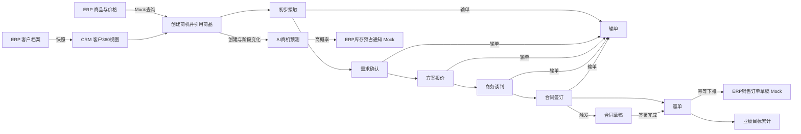
```mermaid
flowchart LR
    A["ERP 客户档案"] -->|快照| B["CRM 客户360视图"]
    C["ERP 商品与价格"] -->|Mock查询| D["创建商机并引用商品"]
    B --> D
    D --> E["初步接触"]
    E --> F["需求确认"]
    F --> G["方案报价"]
    G --> H["商务谈判"]
    H --> I["合同签订"]
    I --> J["赢单"]
    E -->|输单| LOST["输单"]
    F -->|输单| LOST
    G -->|输单| LOST
    H -->|输单| LOST
    I -->|输单| LOST
    D -->|创建与阶段变化| AI["AI商机预测"]
    AI -->|高概率| K["ERP库存预占通知 Mock"]
    I -->|触发| M["合同草稿"]
    M -->|签署完成| J
    J -->|幂等下推| O["ERP销售订单草稿 Mock"]
    J --> P["业绩目标累计"]
```

**流程关键规则**：
- 商机不得直接创建 ERP 客户或商品主数据。
- 赢单不由表单字段修改，只接受合同签署完成动作。
- ERP Mock 失败时商机保持原状态并显示可重试反馈。
- 阶段只能逐级推进，不允许越级、回退或直接修改阶段字段。

---

## 四、状态流转

| 当前状态 | 动作 | 前置条件 | 结果状态 | 二次确认 | 后置影响 | 失败处理 |
|----------|------|----------|----------|:--------:|----------|----------|
| 新建 | 保存商机 | 表单校验通过；客户快照有效 | 初步接触 | 否 | 生成编号；触发首次AI预测 | 保持新增页定位错误字段；提示商机创建失败请重试 |
| 初步接触 | 推进 | 需求信息满足规则；有推进权限 | 需求确认 | 是 | 写入阶段时间；触发AI预测 | 保持原状态；提示推进失败请检查需求信息 |
| 需求确认 | 推进 | 已引用有效ERP商品 | 方案报价 | 是 | 写入阶段时间；触发AI预测 | 保持原状态；提示先关联有效商品 |
| 方案报价 | 推进 | 报价信息满足规则 | 商务谈判 | 是 | 写入阶段时间；触发AI预测 | 保持原状态；提示推进失败请完善报价信息 |
| 商务谈判 | 发起合同 | 合同创建输入完整；不存在有效合同 | 合同签订 | 是 | 创建合同草稿；回写合同关联；触发AI预测 | 合同创建回滚；保持原状态；提示合同创建失败商机未推进 |
| 合同签订 | 合同签署完成 | 回调合法；合同与商机绑定一致 | 赢单 | 否 | 写入赢单时间；下推ERP订单草稿；更新业绩 | 回调失败保持原状态；提示签署结果同步失败 |
| 合同签订 | 合同作废 | 合同允许作废；原因已填写 | 商务谈判 | 是 | 解除合同绑定；商机恢复可推进 | 合同作废事实保留；提示合同已作废商机回退待补偿 |
| 任一非终态 | 输单 | 输单原因校验通过；有权限 | 输单 | 是 | 写入阶段时间；停止预测提醒；保留复盘记录 | 保持原状态；聚焦输单原因；提示请输入输单原因 |
| 赢单 | 查看 | 记录存在且有查看权限 | 赢单 | 否 | 仅展示历史与ERP结果 | 无权限展示403 |
| 输单 | 查看 | 记录存在且有查看权限 | 输单 | 否 | 仅展示历史与输单复盘 | 无权限展示403 |

---

## 五、业务规则

### 5.1 创建与引用

| 序号 | 什么情况下 | 结果 |
|------|-----------|------|
| 1 | 商机必须关联可用客户快照 | 客户正式档案以ERP为唯一权威，CRM不允许在商机表单内新建或修改客户主数据 |
| 2 | 推进到需求确认后的后续阶段前 | 必须引用至少一个有效ERP商品；失效商品只保留历史展示，不允许新增引用 |

### 5.2 阶段推进

| 序号 | 什么情况下 | 结果 |
|------|-----------|------|
| 1 | 商机阶段推进 | 只能按状态机逐级推进；看板拖拽、按钮和接口统一校验，不允许越级、回退或直接修改阶段字段 |
| 2 | 进入合同阶段 | 必须先成功创建合同草稿；合同签署完成是进入赢单的唯一业务触发 |
| 3 | 合同作废 | 必须联动回退至商务谈判阶段，并保留历史合同记录 |

### 5.3 关闭与下推

| 序号 | 什么情况下 | 结果 |
|------|-----------|------|
| 1 | 任一非终态执行输单 | 输单原因必须填写；赢单和输单均为不可手工回退终态 |
| 2 | 赢单后 | 以商机为幂等业务键下推一个ERP销售订单草稿；重试不得重复建单，ERP失败不得回退已确认的合同签署事实 |

### 5.4 AI 预测

| 序号 | 什么情况下 | 结果 |
|------|-----------|------|
| 1 | 创建成功后、每次阶段变化后 | 触发AI商机预测；不阻断创建或推进 |
| 2 | AI预测失败/超时 | 保留上次成功结果并标注更新时间；无历史结果显示暂不可用；允许人工重试 |
| 3 | AI输出 | 不直接改变商机阶段；推荐不自动写入商品明细；高概率只触发预占通知不代表真实库存锁定 |
| 4 | 终态商机 | 不再自动触发新预测 |

### 5.5 权限

| 序号 | 什么情况下 | 结果 |
|------|-----------|------|
| 1 | 数据可见范围 | 销售看自己创建/负责的；主管看本团队；管理员看全部；只读审计看授权范围内历史 |
| 2 | 操作权限 | 早期阶段编辑仅限推进/编辑权限内角色；重试ERP下推仅主管/管理员；导出按数据范围 |
| 3 | 权限失败 | 页面不展示无权动作；直接调用接口返回403；提示无权执行该操作；不改变任何业务数据 |

### 5.6 边界与异常

| 序号 | 什么情况下 | 结果 |
|------|-----------|------|
| 1 | 并发推进同一商机 | 版本号乐观锁，后提交者失败并刷新最新阶段 |
| 2 | 重复点击保存 | 客户端请求键，返回首次创建结果 |
| 3 | 重复合同签署回调 / ERP下推 | 事件/幂等键去重，只执行一次赢单联动，仅生成一份订单草稿 |
| 4 | 越级推进 / 反向拖拽 | 阻断，保持原阶段，提示当前仅可推进至下一阶段 |
| 5 | 输单原因留空 / 不合规 | 阻断并聚焦原因，提示请输入输单原因 |
| 6 | 终态编辑 | 不展示编辑入口，接口拒绝写入 |
| 7 | 客户快照失效 / ERP商品失效 | 阻断创建/新引用；既有历史只读保留 |
| 8 | 预计日期早于当前日期 | 阻断保存 |

---

## 六、页面和操作

### 6.1 商机列表页

**操作路径**：商机管理 / 商机列表

| 序号 | 操作路径/功能点 | 原型页面 | 页面说明 | 备注 |
|------|----------------|---------|---------|------|
| 1 | 商机列表-商机列表与看板页面 | 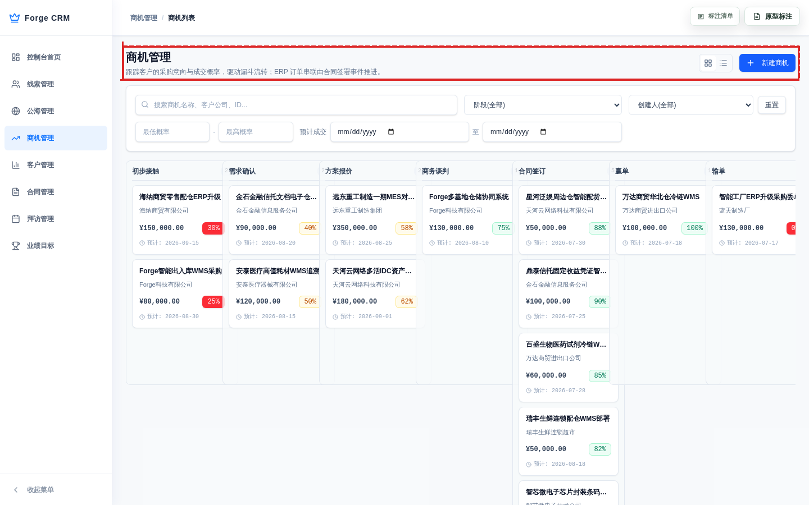 | 页面用于查看、筛选、推进和关闭商机，支持看板与列表两种视图。默认进入看板视图，可切换列表视图。新建商机从主操作区进入新增表单。页头含页面标题、视图切换和新建商机按钮。商机由CRM管理，正式客户档案以ERP为权威源，商品和价格来自ERP查询；商机阶段由动作触发，不在页面直接编辑状态字段。 | |
| 2 | 商机列表-看板与列表视图切换 | 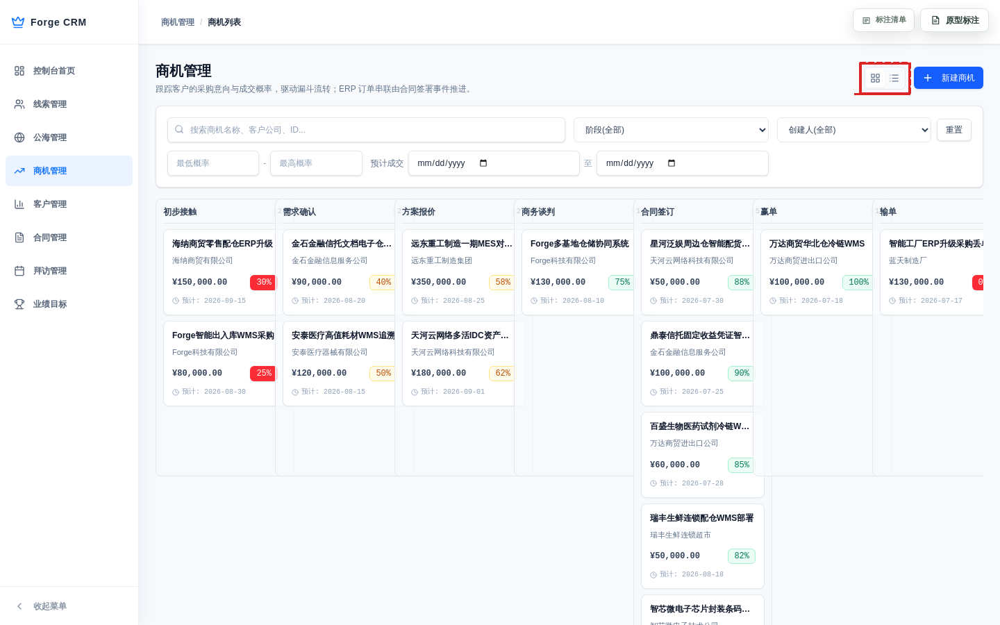 | 提供看板和列表两个切换按钮。看板按商机阶段分列，列表按表格列展示同一批商机。点击立即切换内容区，切换时保留当前筛选条件和状态页签。看板卡片支持拖拽推进，列表通过行内按钮执行等价动作。两种视图使用同一商机数据、阶段状态和权限规则；终态可查看但不可继续推进。 | |
| 3 | 商机列表-新建商机 | 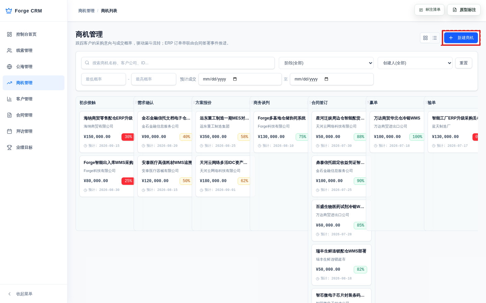 | 页面展示新建商机主按钮。点击后打开空白商机表单，保存成功后返回列表并刷新数据与计数。新增商机只对具备新增权限的销售、主管或管理员展示入口。客户必须选择可见的客户快照，不在商机表单内新建客户主数据。 | |
| 4 | 商机列表-商机查询筛选 | 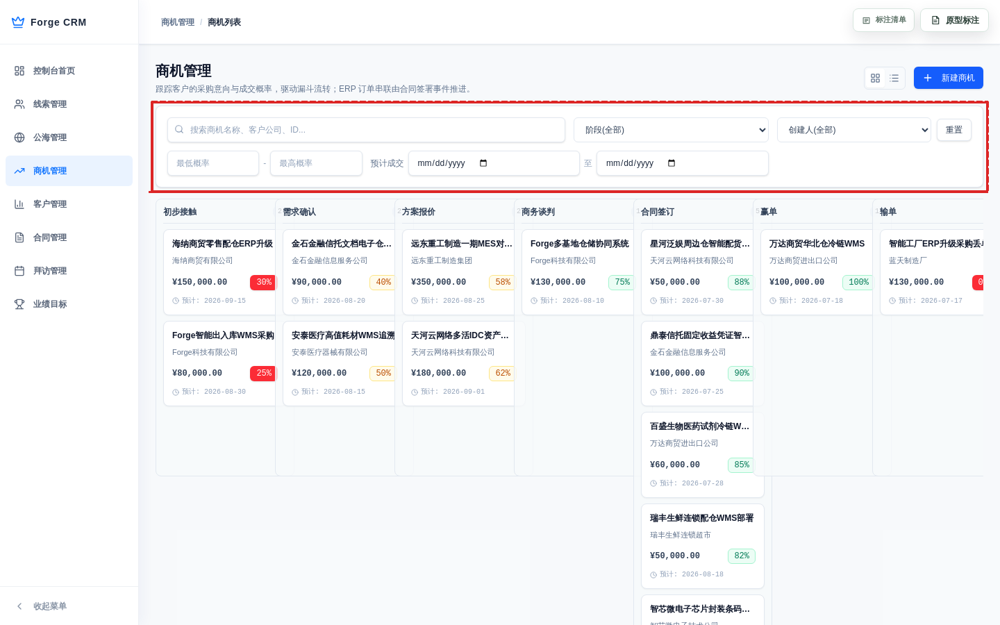 | 查询区提供关键词、商机阶段、创建人三个条件及重置。关键词匹配商机名称、客户名称和商机编号；多个条件同时取交集过滤。阶段选择用中文业务状态，英文枚举仅系统对照。查询结果受当前用户数据可见范围约束；进行中表示除赢单输单外的过程状态。 | |
| 5 | 商机列表-商机阶段看板 | 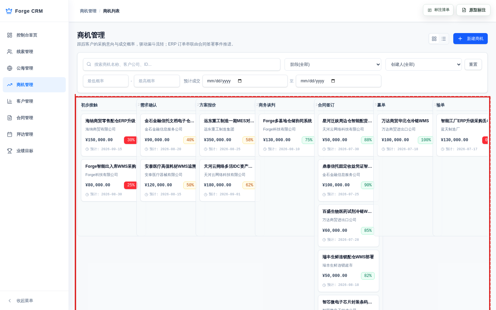 | 看板按7阶段（初步接触到输单）分列，卡片展示商机名称、客户、预计金额、AI成交概率和预计成交日期。卡片可拖拽到阶段列，目标阶段需经过统一前置校验。合同阶段打开合同流程确认，输单打开原因填写弹窗；校验失败时卡片返回原位置并提示原因。 | |
| 6 | 商机列表-列表状态页签 | 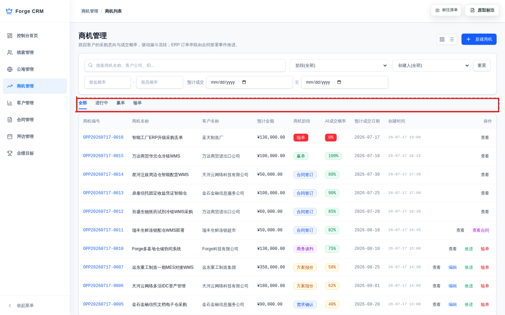 | 列表视图提供全部、进行中、赢单、输单四个状态页签。点击页签刷新列表，阶段筛选与页签条件取交集。进行中排除赢单和输单两个终态；赢单输单为不可手工回退终态。切换回看板时保留查询条件。 | |
| 7 | 商机列表-商机列表字段 | 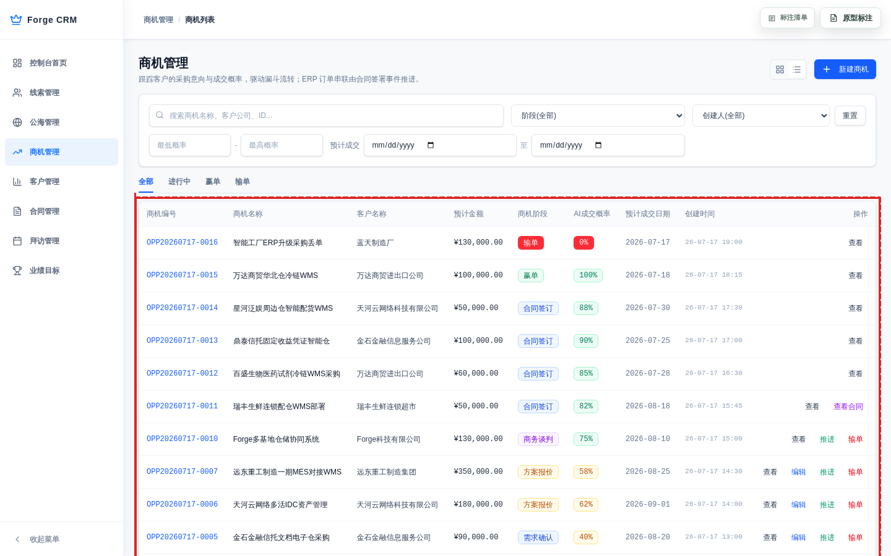 | 表格展示商机编号、商机名称、客户名称、预计金额、商机阶段、AI成交概率、预计成交日期、创建时间和操作。商机编号点击进入详情，不支持整行点击。列表按阶段变更时间倒序；阶段标签遵循状态颜色口径，预计金额为空显示占位，AI概率按高/中/低分层展示。空结果显示暂无符合条件的商机数据。 | |
| 8 | 商机列表-列表行内操作 | 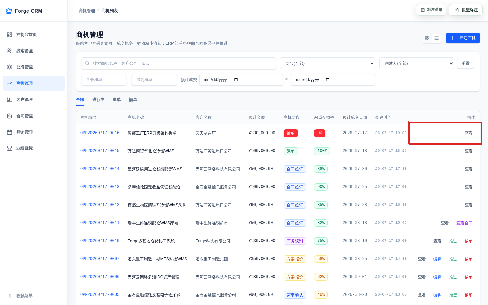 | 早期阶段提供查看、编辑、推进和输单；商务谈判提供查看、推进和输单；终态仅查看。推进按当前阶段计算下一阶段并执行前置校验；输单要求填写原因；推进到合同阶段需确认合同流程。操作成功后更新商机状态并写入跟进记录。不允许越级、回退或通过列表直接修改阶段字段。 | |
| 9 | 商机列表-列表输单确认 | 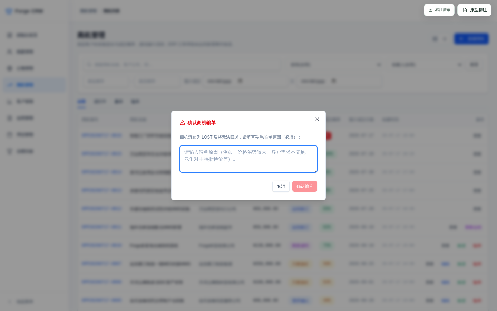 | 输单弹窗要求填写输单原因，提供取消和确认输单按钮。输单后商机进入输单终态，列表页签和计数更新。打开弹窗聚焦原因输入框，原因为空不能提交；提交中断开按钮；确认成功后关弹窗刷新当前行。输单原因满足字段清单约束，输单后不可回退，保留复盘记录。 | |
| 10 | 商机列表-列表发起合同 |  | 商务谈判推进到合同签订时打开合同流程弹窗，确认合同草案编号后创建合同草稿并推进。取消时保持商务谈判状态；创建失败时不得推进商机。进入合同阶段必须先成功创建合同草稿；合同签署完成才允许进入赢单；合同作废按联动规则回退商务谈判。 | |
| 11 | 商机列表-本页规则 | 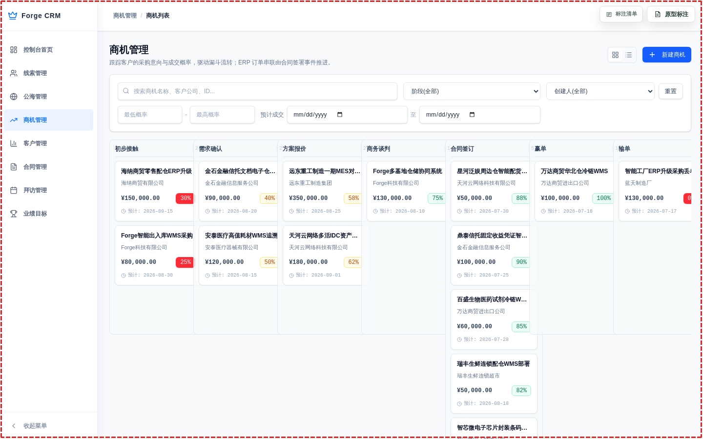 | 页面级准入：列表数据和行内动作按当前角色、数据范围和商机状态计算。自动刷新60秒间隔，拖拽或编辑弹窗期间暂停并保留输入。防重复操作：推进、发起合同、输单确认提交后锁定对应动作。查询无结果展示空态；列表刷新失败保留上下文提示重试；行状态或版本被他人改变时阻断动作并刷新最新状态。 | |

**商机列表页-字段清单**：

| 字段名称 | 填写格式 | 是否必填 | 字段来源 | 能不能改 | 字段说明 |
|----------|---------|:--------:|---------|---------|---------|
| 商机编号 | 文本 OPP{日期}-{序号} | 系统自动 | 系统生成 | 只读 | 商机唯一标识 |
| 商机名称 | 文本，限100字符 | 必填 | 用户填写 | 早期阶段可改 | 商机标题 |
| 客户名称 | 从可见客户快照选择 | 必填 | 用户选择 | 只读快照 | 关联客户，客户主数据权威源在ERP |
| 预计金额 | 数字，上限99999999.99，保留2位小数 | 选填 | 用户填写 | 早期阶段可改 | 预估成交金额(元)，非ERP订单金额 |
| 商机阶段 | 7个中文业务状态 | 系统自动 | 系统生成 | 只读 | 当前阶段，状态机驱动，不可表单改 |
| AI成交概率 | 0-100%整数 | 系统自动 | 系统计算 | 只读 | AI预测成交概率，按高/中/低分层展示 |
| 预计成交日期 | 日期 | 选填 | 用户填写 | 早期阶段可改 | 预计签单日期 |
| 创建时间 | YYYY-MM-DD HH:mm:ss | 系统自动 | 系统生成 | 只读 | 创建时间 |

### 6.2 商机新增/编辑页

**操作路径**：商机管理 / 新建商机 | 早期阶段编辑

| 序号 | 操作路径/功能点 | 原型页面 | 页面说明 | 备注 |
|------|----------------|---------|---------|------|
| 1 | 商机新增编辑-商机新增/编辑页面 | 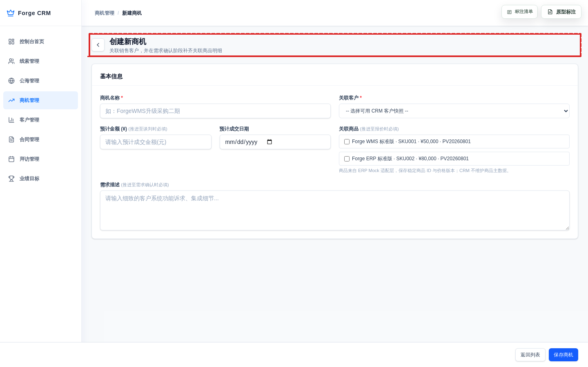 | 页面用于创建新商机或维护早期阶段商机基本信息，由页头、基本信息表单和固定底部操作栏组成。新增模式展示空白表单，编辑模式回填已有商机数据；进入方案报价或更高阶段后只读展示。商机阶段由状态机和动作触发，表单不直接编辑阶段字段。 | |
| 2 | 商机新增编辑-表单校验与保存流程 | 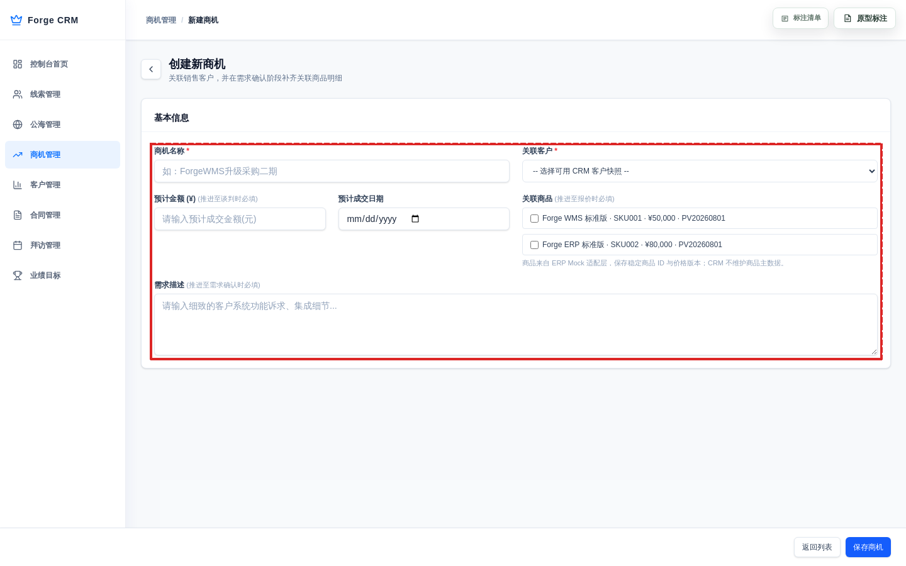 | 表单统一承载校验和保存。校验顺序：字段格式与必填→客户快照有效性→商品明细→状态前置→保存与后置联动。校验错误在对应字段附近提示，保存失败保留已填写内容。保存期间禁用重复提交，成功后提示并回到商机列表。商机名称和关联客户为必填。 | |
| 3 | 商机新增编辑-基本信息 | 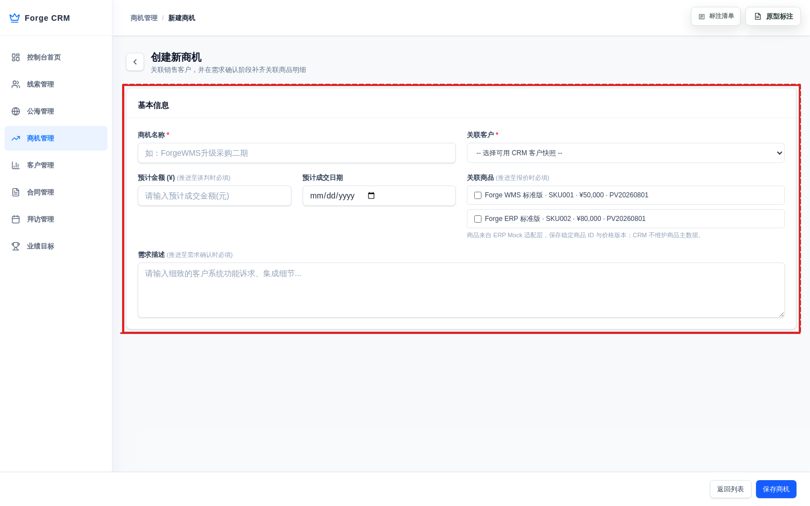 | 基本信息卡片承载商机名称、关联客户、预测字段、关联商品和需求描述。客户使用可见客户快照，商品来自ERP查询，CRM只保存商品和价格快照及销售填写的数量。编辑回填已有商机，进入方案报价或更高阶段后只读。预计金额数字输入，预计成交日期日期输入。需求描述多行文本，保存时保留原文。 | |
| 4 | 商机新增编辑-底部保存操作栏 | 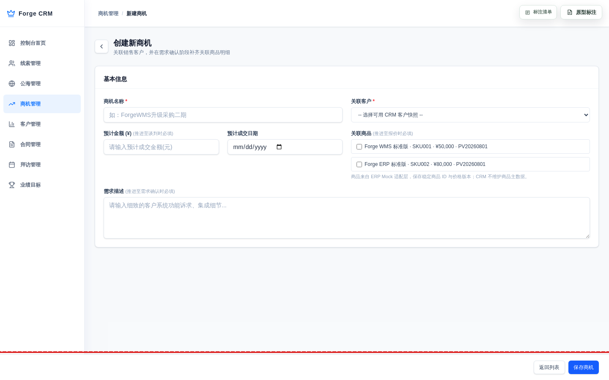 | 固定底部操作栏提供返回列表和保存商机。只读模式隐藏保存动作，仅保留返回。返回列表不保存当前修改，保存动作提交表单数据。保存成功提示商机保存成功并返回列表，失败保留表单内容并提示原因。重复点击保存按幂等规则只创建或更新一次。 | |
| 5 | 商机新增编辑-保存商机动作 | 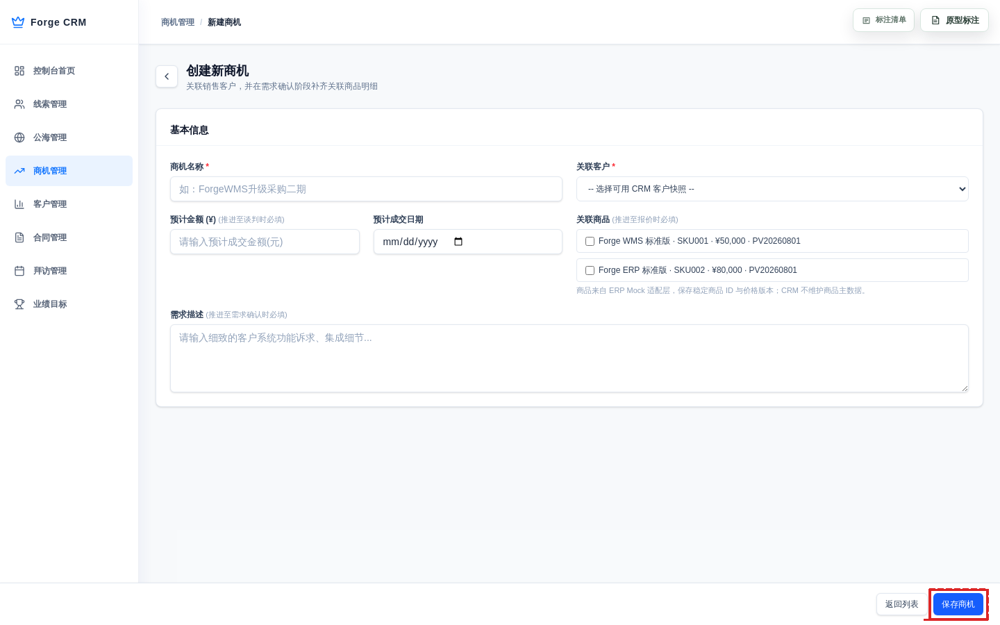 | 保存商机创建或更新记录，并依据已有字段计算或保存AI成交概率。创建成功后商机进入初步接触阶段，编辑保留原有阶段。点击保存显示加载状态，提交完成显示成功或失败Toast。AI预测失败不阻断保存，保留上次成功结果或显示不可用。商机创建后不自动改变阶段，阶段变化必须由合法动作触发。 | |
| 6 | 商机新增编辑-本页规则 | 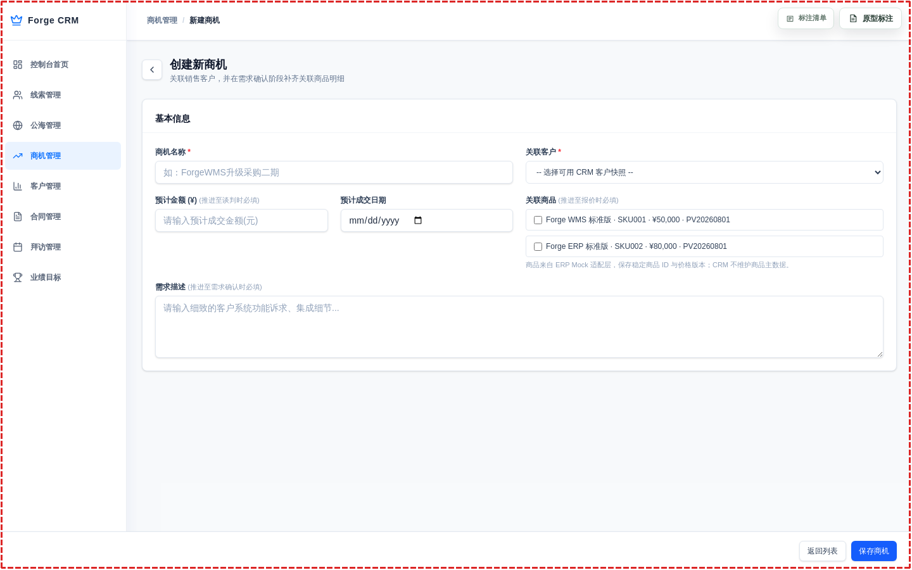 | 页面区分新增和编辑模式，编辑模式加载已有商机、客户快照和商品引用后再计算可编辑范围。准入先校验页面权限和可编辑状态。未保存离开时存在修改则提示放弃修改。保存loading后禁用重复点击。初始化显示骨架屏，商机不存在或无权限进入404/403。版本冲突不得覆盖他人修改，提示重新加载。 | |

**商机新增/编辑页-字段清单**：

| 字段名称 | 填写格式 | 是否必填 | 字段来源 | 能不能改 | 字段说明 |
|----------|---------|:--------:|---------|---------|---------|
| 商机名称 | 文本，限100字符 | 必填 | 用户填写 | 早期阶段可改 | 商机标题 |
| 关联客户 | 从可见客户快照选择 | 必填 | 用户选择 | 只读快照 | 保存客户快照标识和版本，不以名称作关联键 |
| crmCustomerId | 系统带出 | 系统自动 | 系统生成 | 只读 | CRM客户快照标识 |
| erpCustomerId | 系统带出 | 系统自动 | 系统生成 | 只读 | ERP客户档案标识，正式档案唯一源为ERP |
| customerSnapshotVersion | 系统带出 | 系统自动 | 系统生成 | 只读 | 下推前校验仍有效 |
| customerSnapshotSyncTime | 日期时间 | 系统自动 | 系统生成 | 只读 | 快照过期阻断下推 |
| 关联商品 | ERP商品查询选择 | 条件必填 | 用户选择 | 只读快照 | 推进到需求确认后的阶段前至少1行有效商品 |
| 预计金额 | 数字，上限99999999.99，2位小数 | 选填 | 用户填写 | 早期阶段可改 | 预估成交金额(元) |
| 预计成交日期 | 日期 | 选填 | 用户填写 | 早期阶段可改 | 预计签单日期 |
| 需求描述 | 多行文本，限1000字符 | 条件必填 | 用户填写 | 早期阶段可改 | 推进到需求确认时必填 |
| 商机编号 | 系统生成 | 系统自动 | 系统生成 | 只读 | 新增生成，编辑不变 |
| 商机阶段 | 7个中文业务状态 | 系统自动 | 系统生成 | 只读 | 状态机驱动，不可表单改 |

### 6.3 商机详情页

**操作路径**：商机管理 / 商机详情

| 序号 | 操作路径/功能点 | 原型页面 | 页面说明 | 备注 |
|------|----------------|---------|---------|------|
| 1 | 商机详情-商机详情页面 | 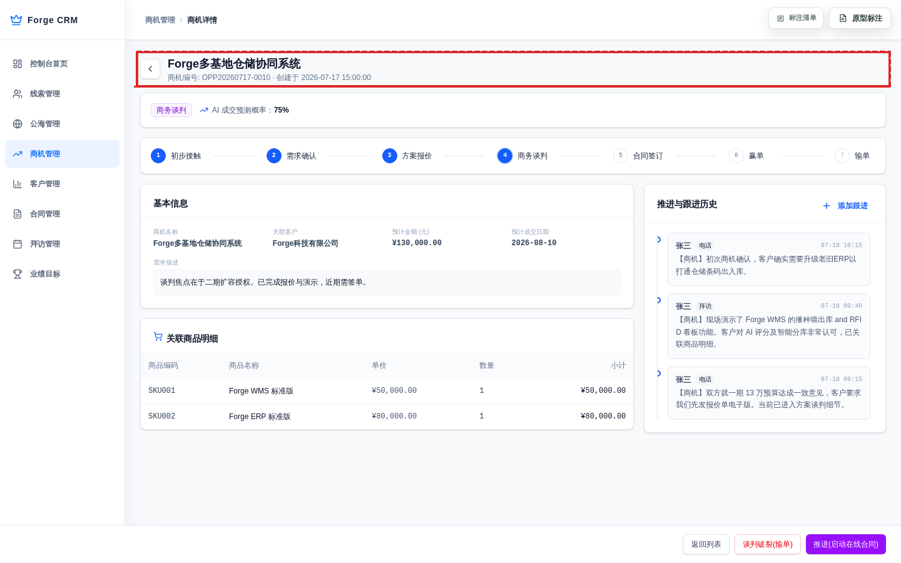 | 页面用于查看单个商机的状态、阶段轨迹、基本信息、商品、跟进记录和联动结果。页头展示商机名称、编号和创建时间，提供返回列表入口。进入详情加载商机主记录、跟进记录、商品明细、合同和ERP结果。无权查看显示权限错误，不泄露商机敏感字段。阶段只能由动作、合同事件或合法状态流转触发。 | |
| 2 | 商机详情-状态与AI预测摘要 | 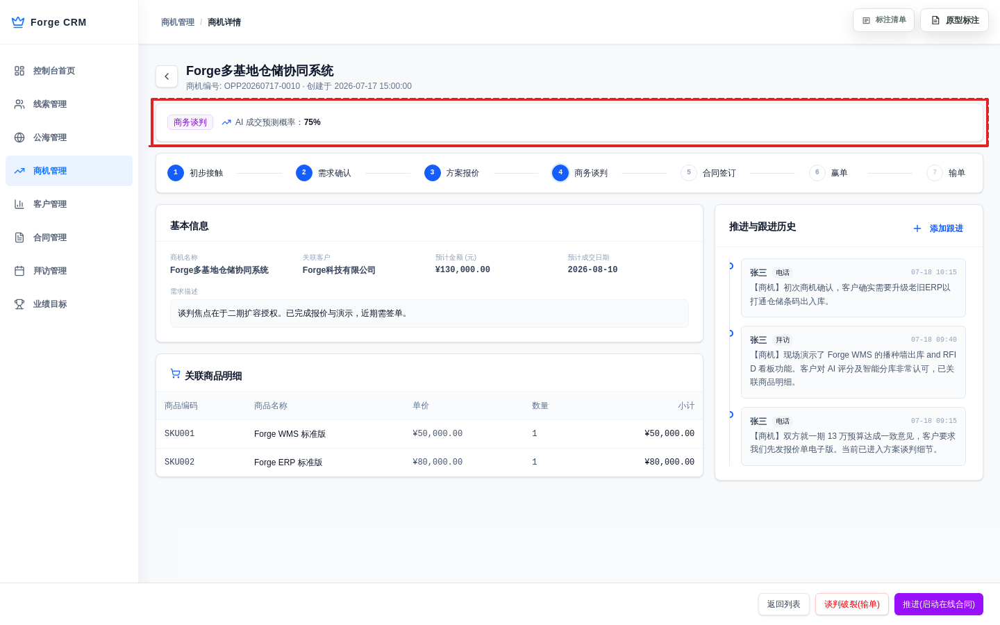 | 状态卡片展示当前中文阶段标签和AI成交预测概率。页面加载读取最新成功预测结果；AI服务失败时保留历史结果，将失败作为系统反馈而不改变商机阶段。AI输出不直接改变阶段；高概率只触发预占通知Mock；终态商机不再自动触发新预测；区分最新结果和重新计算状态。 | |
| 3 | 商机详情-阶段时间线 | 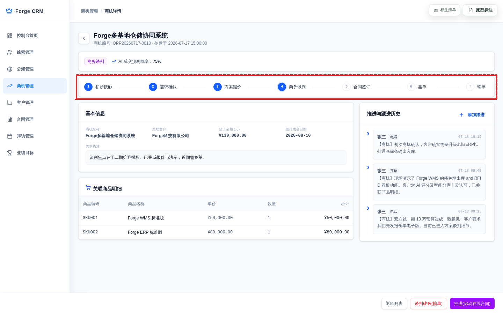 | 时间线展示初步接触、需求确认、方案报价、商务谈判、合同签订、赢单和输单终态。节点根据当前阶段显示已完成、当前、待推进或输单分支状态。时间线随阶段变化刷新，不提供直接点击节点修改状态。阶段只能严格逐级推进，不能越级或回退。 | |
| 4 | 商机详情-商机基本信息卡片 | 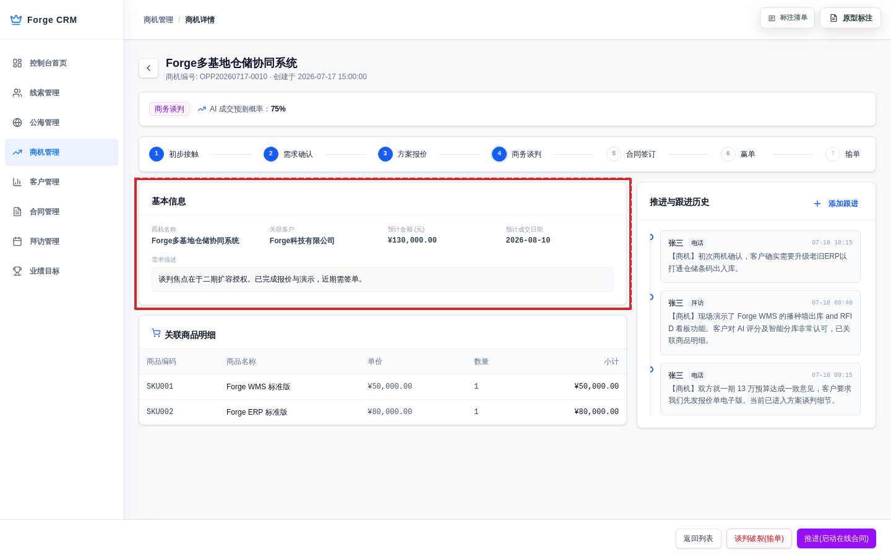 | 卡片展示商机名称、关联客户、预计金额、预计成交日期、需求描述。合同签订或赢单状态可展示合同编号，输单状态可展示输单原因。基本信息以详情只读展示。客户展示用客户快照，正式客户档案由ERP管理；预计金额是预测值，不等同于ERP订单金额。 | |
| 5 | 商机详情-关联商品明细 | 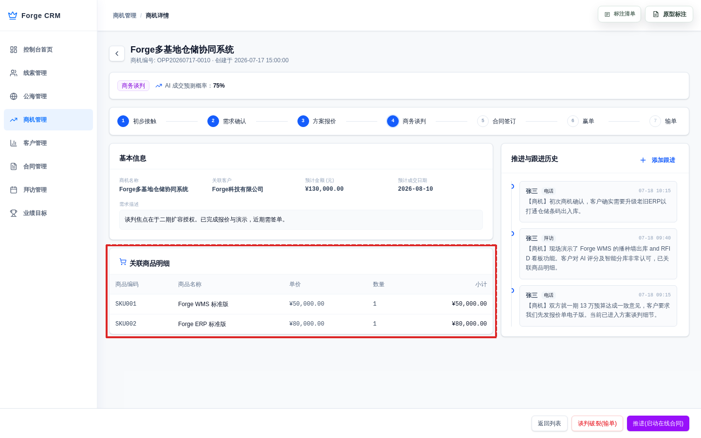 | 详情展示商品编码、商品名称、单价、数量和行小计。初步接触阶段不展示商品明细，更高阶段展示已关联商品或空态。商品明细为只读快照，不在详情表格修改ERP商品主数据或价格。数量必须大于0，行小计由数量乘以单价快照计算。失效商品保留历史展示，但不能新增引用。 | |
| 6 | 商机详情-推进与跟进历史 | 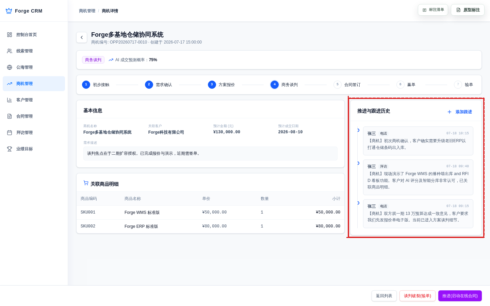 | 右侧区域按时间倒序展示阶段推进和跟进活动。非赢单非输单商机提供添加跟进入口。添加跟进需选择跟进方式并填写沟通纪要，保存后写入时间线并提示成功。跟进记录保留操作者、时间、方式和沟通内容；跟进动作不直接修改商机阶段。 | |
| 7 | 商机详情-详情底部状态动作 | 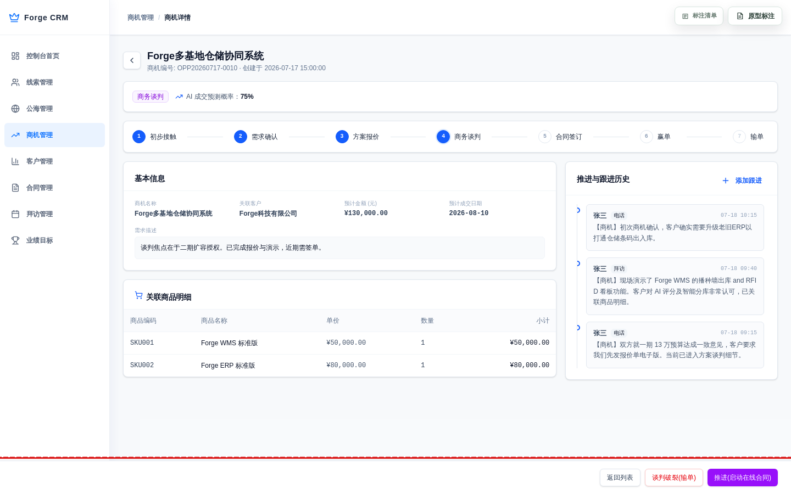 | 底部操作栏按阶段动态渲染动作。早期阶段提供输单、编辑和推进；方案报价提供报价未通过/发送报价；商务谈判提供谈判破裂或启动在线合同；合同签订提供违约输单或签署完成确认赢单。输单打开原因弹窗，启动合同打开合同编号弹窗，赢单需签署完成确认。赢单成功触发ERP销售订单草稿生成Mock。 | |
| 8 | 商机详情-添加跟进记录弹窗 | 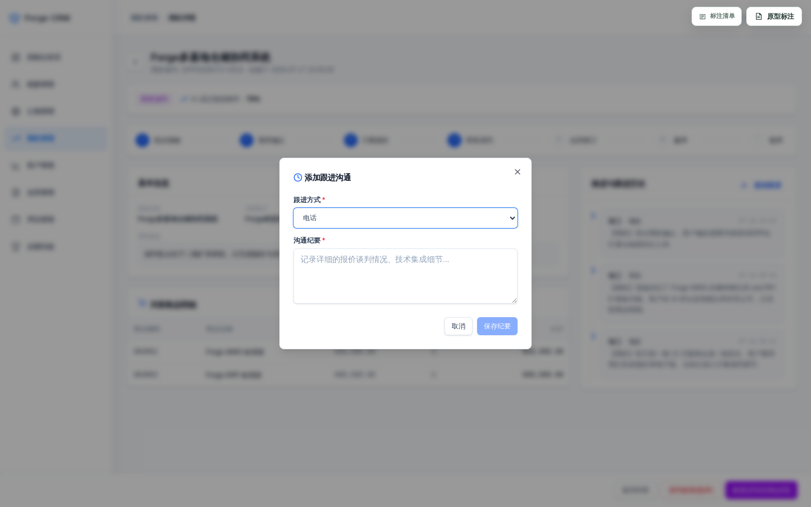 | 弹窗提供跟进方式选择和沟通纪要输入，提供取消与保存纪要按钮。沟通纪要为空不能保存，保存成功关弹窗刷新时间线。赢单或输单状态不允许新增跟进。添加跟进不改变商机阶段，但记录可作为推进的业务历史。 | |
| 9 | 商机详情-详情输单确认 | 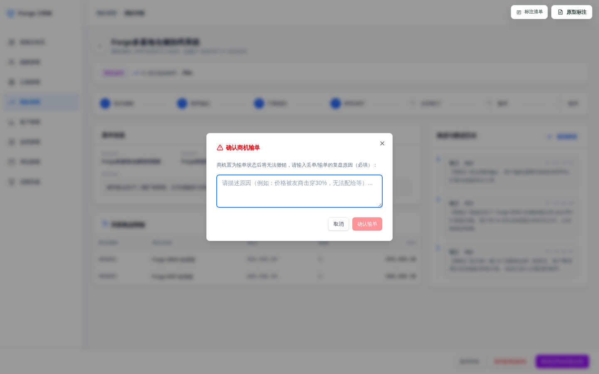 | 输单弹窗明确输单后不可撤销，要求填写丢单/输单原因，提供取消和危险样式的确认输单按钮。原因为空禁用确认，提交成功关弹窗更新阶段和时间线。任一非终态可输单，输单原因必填用于复盘；输单后停止正常预测提醒且不可手工回退。 | |
| 10 | 商机详情-合同流程与赢单确认 | 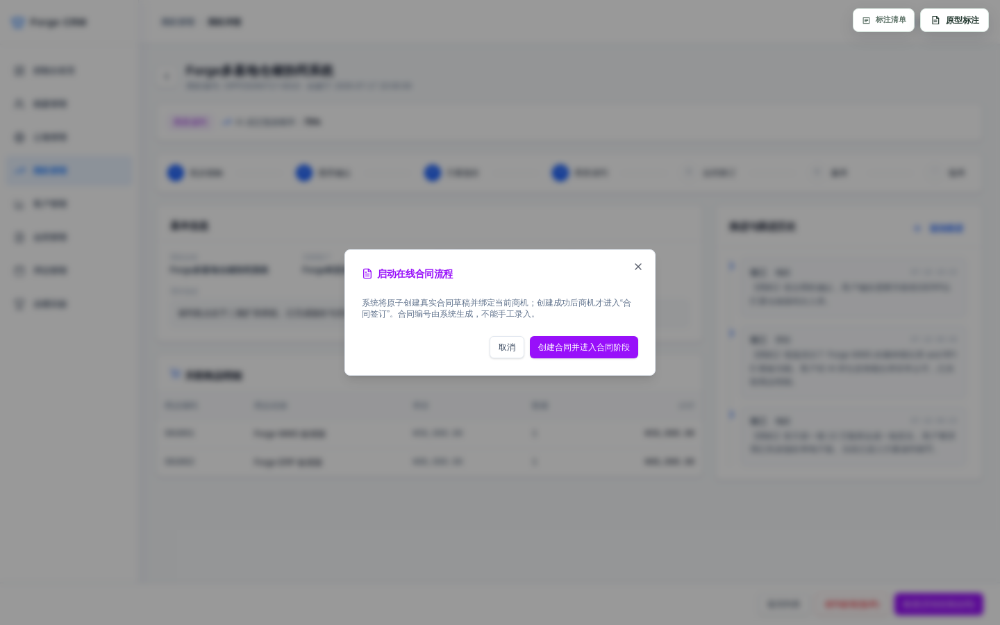 | 商务谈判推进时打开在线合同流程，确认合同草案后进入合同签订；合同签订阶段签署完成后打开赢单确认，赢单后生成ERP销售订单草稿。合同编号必填，取消保持商务谈判。确认赢单前提示已签署合同及不可回退风险。合同流程失败商机不得推进；ERP下推失败不得回退已确认的赢单事实。 | |
| 11 | 商机详情-本页规则 | 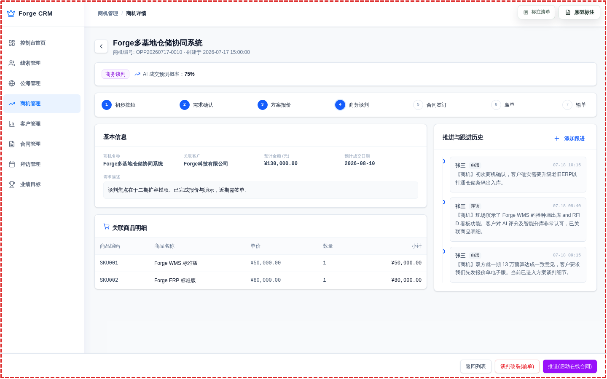 | 详情页统一展示商机状态、时间线、关联数据和底部动作，动作栏由状态与权限共同计算。准入先校验查看权限，无权限403，商机不存在404。防重复提交：推进、输单、发起合同、添加跟进等提交动作锁定至结果返回。并发变化时刷新主数据和动作栏，不覆盖他人更新。终态按详情只读展示。 | |

**商机详情页-字段清单**：

| 字段名称 | 填写格式 | 是否必填 | 字段来源 | 能不能改 | 字段说明 |
|----------|---------|:--------:|---------|---------|---------|
| 商机名称 | 文本，限100字符 | 必填 | 用户填写 | 只读 | 商机标题 |
| 商机编号 | 系统生成 | 系统自动 | 系统生成 | 只读 | 商机唯一标识 |
| 关联客户 | 客户快照 | 必填 | 用户选择 | 只读 | 展示客户名称，主数据权威源在ERP |
| 当前阶段 | 7个中文业务状态 | 系统自动 | 系统生成 | 只读 | 当前阶段，动作触发 |
| AI成交概率 | 0-100%整数 | 系统自动 | 系统计算 | 只读 | AI预测值 |
| 预计金额 | 数字 | 选填 | 用户填写 | 只读 | 预估成交金额(元) |
| 预计成交日期 | 日期 | 选填 | 用户填写 | 只读 | 预计签单日期 |
| 需求描述 | 多行文本 | 条件必填 | 用户填写 | 只读 | 客户需求简述 |
| 商品明细 | ERP商品快照列表 | 条件必填 | 系统生成 | 只读 | 商品/单价/数量/行小计 |
| 合同编号 | 系统生成/回写 | 系统自动 | 系统生成 | 只读 | 合同阶段展示 |
| 输单原因 | 多行文本，限500字符 | 输单时必填 | 用户填写 | 只读 | 输单复盘原因 |
| 创建人 | 当前登录用户 | 系统自动 | 系统生成 | 只读 | 商机创建人 |
| 创建时间 | 日期时间 | 系统自动 | 系统生成 | 只读 | 创建时间 |
| 阶段变更时间 | 日期时间 | 系统自动 | 系统生成 | 只读 | 最近一次阶段变更时间 |
| 赢单时间 | 日期时间 | 系统自动 | 系统生成 | 只读 | 推进到赢单的时间 |
| ERP订单同步状态 | 枚举 | 系统自动 | 系统生成 | 只读 | WON后触发，同步结果展示 |

---

## 七、验收标准

| 序号 | 验收项 | 输入条件 | 预期结果 |
|------|--------|----------|----------|
| 1 | 完整赢单闭环 | 新建商机；客户可用；商品有效；逐级推进；合同签署成功 | 阶段按顺序变化；签署后进入赢单；仅生成一份ERP订单草稿；业绩同步累计 |
| 2 | 越级推进阻断 | 当前处于初步接触；尝试拖到方案报价或直接调用跨级接口 | 前端与接口均阻断；阶段不变；提示只能推进至下一阶段；不写阶段日志 |
| 3 | 输单必填与终态锁定 | 任一非终态点击输单；原因留空后再填写合规内容确认 | 留空时阻断并聚焦；填写后进入输单；编辑、推进和再次输单入口消失 |
| 4 | AI预测及失败降级 | 创建商机后先返回成功预测，再模拟预测超时并推进阶段 | 成功结果展示；失败不阻断推进；保留上次结果并标记更新时间；出现重试入口 |
| 5 | 合同与ERP异常幂等 | 合同创建首次失败后重试成功；签署回调重复两次；ERP下推首次超时后重试 | 首次失败不推进；重试后进入合同；只赢单一次；只生成一份订单草稿；错误可追踪 |

**补充验收检查**：
- [ ] 所有状态变化均由动作按钮或外部合法事件触发。
- [ ] 表单中没有可编辑的商机阶段控件。
- [ ] 客户、商品和订单边界符合 ERP 权威源约束。
- [ ] 看板和列表对同一商机展示一致阶段。
- [ ] 无权动作既不展示也无法通过接口绕过。
- [ ] 终态数据不因后续 AI 任务发生变化。
- [ ] 合同作废后商机准确回退并解除绑定。
- [ ] 所有外部调用均有失败反馈与幂等保护。