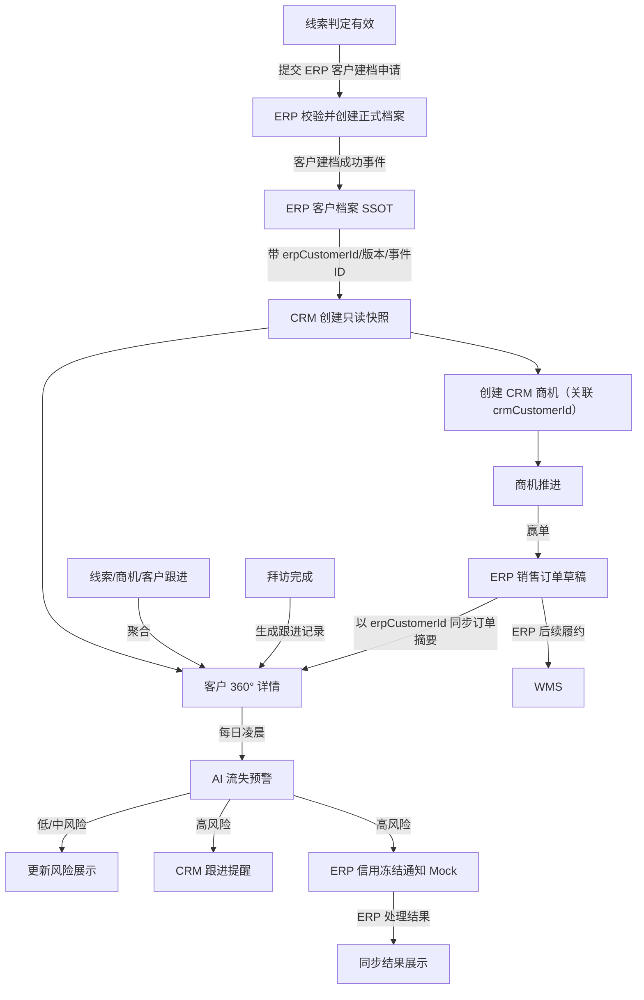
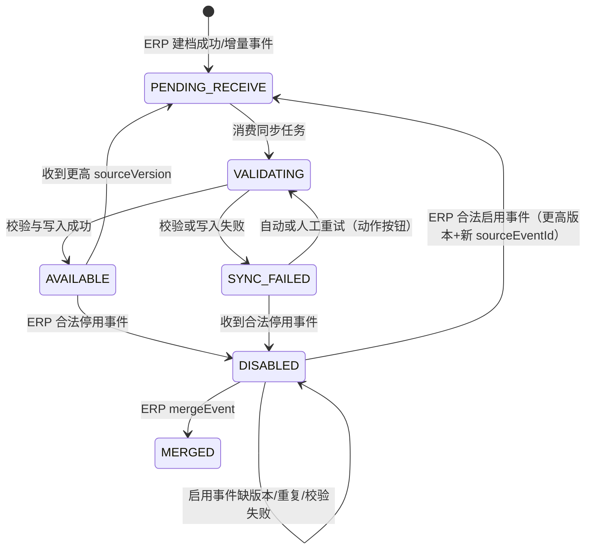

# 客户主PRD

> **版本**：V2.1 | 2026-08-13
> **读者**：研发工程师、测试工程师、产品复核、项目经理
> **字段定义 SSOT**：《客户字段清单》
> **特别声明**：客户正式档案的唯一权威源是 ERP；CRM 只持有只读快照与 CRM 聚合数据。

---

### 1. 业务背景

客户是 Forge CRM 中承接线索转化、商机推进、订单观察和持续跟进的聚合对象。它不是独立客户主数据系统，而是围绕 ERP 客户档案构建的销售关系视图。

在没有统一客户视图时，Forge面临以下问题：

1. 客户基础档案散落在 ERP 与个人表格中，销售查看路径割裂。
2. CRM 和 ERP 分别维护公司名称与联系人，容易形成双主数据源。
3. 销售无法从客户维度快速查看全部商机和交易历史。
4. 跟进记录分散在线索、商机和拜访中，无法还原完整关系过程。
5. ERP 订单结果没有回到客户上下文，复购判断缺少交易证据。
6. 长期未跟进客户只能靠销售记忆发现，流失干预严重滞后。
7. 主管无法区分“没有商机”和“有商机但停滞”的客户。
8. 高风险客户没有统一提醒，信用冻结等协同动作依赖人工通知。
9. ERP 档案变更后 CRM 信息可能陈旧，销售误用过期联系方式。
10. 同步失败没有显式标识，用户无法判断数据是否可信。
11. 客户详情缺乏 360° 聚合，销售需要跨多个页面反复查询。
12. 客户历史数据若被 CRM 随意编辑，会破坏 ERP 主数据治理。

本模块通过“ERP 快照 + CRM 商机/跟进聚合 + ERP 订单聚合 + AI 流失预警”提供客户 360° 视图，同时坚持客户主数据只在 ERP 建档、编辑和停用。

**定位句**：客户是 CRM 的成交运营聚合对象，不是客户主数据 SSOT；CRM 负责呈现与销售运营，ERP 负责客户正式档案与订单事实。

---

### 2. 功能范围

**In Scope**：

- 接收 ERP 客户档案快照。
- 接收 ERP 客户档案增量更新。
- 维护 CRM 快照记录标识 `crmCustomerId`、ERP 正式档案标识 `erpCustomerId`、快照版本与同步审计元数据。
- 展示客户列表与只读基础信息。
- 展示 ERP 同步结果标识。
- 按数据权限查询客户。
- 从客户详情创建关联商机；合同必须从商机详情“发起合同”，客户详情仅提供跳转入口。
- 聚合客户名下全部 CRM 商机。
- 聚合 ERP 订单摘要。
- 聚合线索、商机、客户与拜访产生的跟进记录。
- 展示最近跟进时间。
- 每日计算 AI 流失风险。
- 高风险时生成 CRM 跟进提醒。
- 高风险时发送 ERP 信用冻结通知 Mock。
- 提供 AI 失败降级与人工重试。
- 记录客户快照同步审计信息。
- 保留历史关联数据的只读访问。
- 区分客户生命周期状态与快照同步处理状态，并按状态控制关联业务动作。
- 接收 ERP 合并事件，维护旧客户到主客户的历史映射。
- 在线索转客户时提交 ERP 客户建档申请，并在 ERP 成功事件后创建只读快照。
- 客户列表默认排序为本模块例外：进行中商机优先，其次按 ERP 客户创建时间倒序；用户主动选择排序时以用户选择为准。

**Out of Scope**：

- CRM 新增客户正式档案；原因：客户 SSOT 在 ERP。
- CRM 编辑客户基础档案；原因：避免双写和主数据冲突。
- CRM 删除客户；原因：主数据不提供删除，停用由 ERP 执行。
- CRM 合并客户；原因：客户合并属于 ERP 主数据治理。
- 客户管理页不提供“新增客户”入口；线索转客户只提交 ERP 建档申请，不在 CRM 产生客户主数据。
- CRM 调整客户信用额度；原因：信用策略由 ERP 管理。
- CRM 修改 ERP 订单；原因：订单 SSOT 在 ERP。
- CRM 直接冻结客户信用；原因：仅发送 Mock 通知，由 ERP 决策执行。
- CRM 直接操作 WMS；原因：WMS 是 ERP 的间接下游。
- 客户分层与会员体系；原因：依赖更长周期订单数据，规划在二期。
- 营销短信或邮件召回；原因：营销自动化不在一期范围。
- AI 模型在线自学习；原因：一期使用规则化 Mock 验证闭环。
- 移动端客户视图；原因：一期仅 PC Web。

---

### 3. 对象定位

#### 3.1 在系统中的位置

| 项目 | 内容 |
|------|------|
| 对象类型 | 客户（成交运营层 / 聚合视图） |
| 核心职责 | 在不破坏 ERP SSOT 的前提下聚合销售过程和交易结果 |
| 正式档案来源 | ERP 客户档案 API 实时同步 Mock |
| CRM 数据来源 | 线索转化、商机、跟进记录、拜访记录、AI 结果 |
| 下游对象 | 商机、拜访计划、跟进任务、流失召回任务 |
| 订单来源 | ERP 销售订单摘要同步 |
| 主数据动作 | CRM 不新增、不编辑、不删除；仅查看同步快照 |
| 停用动作 | 由 ERP 执行，CRM 同步后进入 `DISABLED`，限制创建新业务但可由 ERP 合法启用事件恢复 |
| 关联关系 | CRM 关联对象内部使用 `crmCustomerId`，跨系统请求统一使用 `erpCustomerId` |
| 数据责任 | ERP 对基础档案负责；CRM 对销售聚合与风险结果负责 |

身份与状态分离：

- `crmCustomerId` 是 CRM 快照记录的稳定内部标识；`erpCustomerId` 是 ERP 正式客户档案标识，也是跨系统关联主键。
- `snapshotVersion`、`snapshotUpdatedAt`、`lastSuccessfulSyncAt`、`sourceEventId` 记录快照版本与同步审计，完整字段以《客户字段清单》为准。
- 商机、合同、拜访、跟进在 CRM 内部通过 `crmCustomerId` 关联，同时保存 `erpCustomerId` 作为跨系统请求与对账标识；ERP 订单及所有跨系统请求只使用 `erpCustomerId`。
- 公司名称只能用于展示和搜索，禁止作为商机、合同、拜访、跟进、订单或同步事件的关联键。
- 客户生命周期状态使用 `PROSPECT/ACTIVE/DISABLED/MERGED`；快照同步处理状态使用 `PENDING_RECEIVE/VALIDATING/AVAILABLE/SYNC_FAILED`，两套状态禁止混用。一期潜在客户由线索对象承载，客户对象只接收 ERP 已建档客户。

#### 3.2 系统链路图

链路边界：

- 客户基础档案只从 ERP 流入 CRM。
- CRM 不允许把快照编辑结果反向覆盖 ERP。
- 客户详情展示的订单是 ERP 摘要，不是 CRM 订单副本。
- 流失预警的信用冻结仅为通知 Mock，不等同 ERP 已冻结。
- WMS 与 CRM 无直接数据或操作链路。

#### 3.3 实体关系说明

| 关系 | 基数 | 说明 | 一致性约束 |
|------|:---:|------|------------|
| ERP客户档案 : CRM客户快照 | 1:1 | 以 `erpCustomerId` 绑定，CRM 另有 `crmCustomerId` | ERP 为权威源，CRM 只读 |
| 转化线索 : 客户 | 1:1 | 一条有效线索最多对应一个 ERP 客户档案 | ERP 建档成功事件后才建立绑定 |
| 客户 : 商机 | 1:N | 一个客户可有多个销售机会 | 商机 SSOT 在 CRM；内部关联 `crmCustomerId` |
| 客户 : ERP订单 | 1:N | 一个客户可有多个订单摘要 | 订单 SSOT 在 ERP；跨系统用 `erpCustomerId` |
| 客户 : 跟进记录 | 1:N | 聚合直接和关联对象跟进 | 原始跟进记录仍保留来源对象 |
| 客户 : 拜访计划 | 1:N | 可直接为客户创建多次拜访 | 拜访完成后生成跟进记录 |
| 客户 : 流失预测快照 | 1:N | 每日产生一个最新计算版本 | 页面展示最新成功版本 |
| 客户 : 系统用户 | N:M | 多个销售可因不同商机与客户关联 | 数据可见性由权限规则计算 |

实体一致性补充：

1. `erpCustomerId` 是跨系统绑定主键，`crmCustomerId` 只标识 CRM 快照记录；两者都不得由公司名称替代。
2. ERP 同步消息乱序时按 `sourceVersion` 和 `sourceEventId` 去重，拒绝旧数据覆盖新数据。
3. 商机、合同、拜访、跟进内部关联 `crmCustomerId`，跨系统请求与订单关联使用 `erpCustomerId`。
4. 商机与订单聚合失败不影响客户基础快照读取。
5. 跟进聚合保留来源类型和来源标识，禁止复制成无来源文本。
6. 客户停用后保留历史商机、合同、订单、拜访和跟进的只读查询。
7. 客户快照同步失败时保留最近一次成功版本，并显示旧版本提示。

---

### 4. 业务场景

| 场景ID | 场景 | 类型 | 触发角色 | 说明 |
|--------|------|------|----------|------|
| S01 | ERP 建档后生成 CRM 客户快照 | **主流程** | 系统 | ERP 返回客户编号并同步只读快照 |
| S02 | 客户 360° 视图支撑销售跟进 | **主流程** | 销售 | 聚合商机、订单和跟进记录 |
| S03 | 高流失风险触发召回与信用通知 | **支线** | 系统 | 每日计算高风险并执行两个后置动作 |
| S04 | ERP 增量同步失败 | **异常** | 系统 | 保留最近成功快照并展示同步异常 |
| S05 | 无权或停用客户发起新业务 | **异常** | 销售 | 阻断创建商机或拜访并提供明确原因 |
| S06 | ERP 建档成功但首次快照同步失败 | **异常** | 系统 | 保存待绑定任务，不伪造客户快照 |
| S07 | 重复或乱序同步事件 | **异常** | 系统 | 按版本与事件标识幂等处理 |
| S08 | ERP 停用后恢复客户 | **主流程** | ERP/系统 | 合法启用事件驱动恢复，CRM 无恢复按钮 |
| S09 | ERP 合并客户 | **支线** | ERP/系统 | 旧客户只读并映射至主客户 |
| S10 | 停用客户关联对象处理 | **异常** | 销售 | 历史可查，新业务阻断，恢复不自动回滚 |

#### S01 ERP 建档后生成 CRM 客户快照

- 前置：线索已满足转客户条件。
- 第一步：线索模块提交“ERP 客户建档申请”，请求不得以公司名称作为关联键。
- 第二步：ERP 校验并创建正式客户档案，生成 `erpCustomerId`。
- 第三步：CRM 接收带 `erpCustomerId`、`sourceVersion`、`sourceEventId` 的建档成功事件，创建只读快照并生成 `crmCustomerId`。
- 后置：线索进入已转客户终态。
- 失败：ERP 未返回成功或首次快照失败时不创建孤立客户快照，保留待绑定/同步任务供重试。

#### S02 客户 360° 视图支撑销售跟进

- 前置：客户快照存在且操作者有查看权限。
- 页面：加载基础快照、商机、订单和跟进聚合。
- 结果：销售可从一个页面理解客户关系和交易状态。
- 动作：从客户详情快捷创建商机或添加跟进。
- 约束：所有基础字段保持只读。
- 异常：某个聚合区块失败时只降级该区块。

#### S03 高流失风险触发召回与信用通知

- 触发：每日凌晨定时任务。
- 输入：最近跟进间隔、订单停滞、进行中商机与阶段停留。
- 结果：更新最新成功风险等级。
- 高风险后置一：向责任销售生成跟进提醒。
- 高风险后置二：向 ERP 发送信用冻结通知 Mock。
- 失败：保留上次成功风险并记录失败，不静默改成低风险。

#### S04 ERP 增量同步失败

- 触发：ERP 客户档案变更消息到达。
- 异常：消息格式错误、版本过旧或接口超时。
- 处理：拒绝覆盖最近成功快照。
- 页面：展示“同步异常”标识和最后成功同步时间。
- 重试：后台自动重试，管理员可人工触发。
- 影响：CRM 关联数据仍可查看，不允许编辑快照绕过问题。

#### S05 无权或停用客户发起新业务

- 无权访问：返回 403，不泄露客户基础信息。
- 客户停用：保留历史查询，但隐藏新建商机和新建拜访入口。
- 快照同步异常：新业务动作执行前再次查询客户可用性。
- 阻断提示：`当前客户不可用于新业务，请联系管理员核对 ERP 状态`。
- 结果：不创建孤立商机或拜访。

#### S06 ERP 建档成功但首次快照同步失败

- 输入：`erpCustomerId=ERP-C-1001`、`sourceVersion=202608130001`、`sourceEventId=evt-customer-created-1001`。
- 处理：ERP 已正式建档，但 CRM 校验字段或写入快照失败。
- 结果：同步任务为 `SYNC_FAILED`，客户生命周期不伪造为 `ACTIVE` 可用快照，保存待绑定任务与错误元数据。
- 关联对象：线索保留“ERP 已建档待同步”，不得创建商机、合同、拜访或跟进关联。
- 恢复：管理员点击重试动作，成功后再创建 `crmCustomerId` 对应的只读快照。

#### S07 重复或乱序同步事件

- 输入：同一 `erpCustomerId` 的 `sourceEventId=evt-1001` 重复到达；随后版本 12 先于版本 11 到达。
- 处理：重复事件按事件标识幂等返回；版本 11 因 `sourceVersion` 较旧被丢弃。
- 结果：只保留版本 12，更新 `snapshotVersion` 和 `sourceEventId`，不回退快照。
- 关联对象：商机、合同、拜访、跟进仍关联原 `crmCustomerId`，不因事件重放产生重复对象。

#### S08 ERP 停用后恢复客户

- 输入：停用客户收到 `sourceVersion=21`；之后收到更高版本且带唯一 `sourceEventId` 的合法启用事件。
- 状态：`ACTIVE + AVAILABLE → DISABLED`；合法启用事件后 `DISABLED → PENDING_RECEIVE → VALIDATING → AVAILABLE`，生命周期恢复为 `ACTIVE`。
- 约束：CRM 不提供恢复按钮；版本缺失、事件重复或校验失败时保持 `DISABLED`。
- 关联对象：停用期间不创建新业务；恢复后允许新建，历史对象不自动改状态。

#### S09 ERP 合并客户

- 输入：`mergeEvent` 携带 `sourceErpCustomerId`、`targetErpCustomerId`、`sourceVersion`、`sourceEventId`。
- 处理：保存源客户到主客户映射；源客户生命周期改为 `MERGED` 且只读，详情提示“已合并至主客户”。
- 关联对象：历史商机、合同、拜访、跟进保留原 `crmCustomerId` 关联并支持跳转主客户；新业务只关联 target。

#### S10 停用客户关联对象处理

- 输入：客户生命周期为 `DISABLED`，存在进行中商机、未开始拜访、历史合同、订单和跟进。
- 处理：历史对象可查；商机不可推进、合同只读且不自动作废；拜访新建/改期新单/新签到被阻断，已签到拜访允许完成并生成跟进作为历史执行事实收口；跟进禁止新增、订单继续只读同步。
- 恢复后：不自动恢复或回滚对象状态；业务人员按权限重新推进商机、创建拜访或添加跟进。

---

### 5. 状态机

#### 5.1 客户生命周期状态

> 客户生命周期状态由 ERP 决定，CRM 只读同步，不提供状态下拉框或恢复按钮。若一期不支持潜在客户，`PROSPECT` 仅由线索对象承载，客户对象只接收 ERP 已建档客户。

| 生命周期状态 | 含义 | CRM 可用性 | 进入方式 |
|--------------|------|------------|----------|
| `PROSPECT` | 潜在客户 | 客户对象一期不承载 | 由线索模块承载，不能由 CRM 客户页新增 |
| `ACTIVE` | ERP 正式档案有效 | 结合同步处理状态判断是否可用 | ERP 建档成功或合法启用事件 |
| `DISABLED` | ERP 已停用 | 对新业务不可用，但可由 ERP 事件恢复 | ERP 合法停用事件 |
| `MERGED` | 已并入其他 ERP 客户，仅保留历史 | 只读，不接收新业务 | ERP `mergeEvent` |

`DISABLED` 不是终态；它表示“对新业务不可用的状态”。CRM 不执行恢复，恢复必须来自带更高来源版本和唯一事件标识的 ERP 启用事件。

#### 5.2 快照同步处理状态

> 本状态描述快照接收、校验和写入处理，不替代客户生命周期状态。字段 SSOT 为《客户字段清单》中的 `syncStatus`。

| 处理状态 | 枚举 | 含义 |
|----------|------|------|
| 待接收 | `PENDING_RECEIVE` | 已产生或收到同步任务，尚未开始校验 |
| 校验中 | `VALIDATING` | 正在校验 ERP 标识、来源版本、事件标识和快照内容 |
| 可用 | `AVAILABLE` | 最近一次同步成功，可供 CRM 只读引用 |
| 同步失败 | `SYNC_FAILED` | 最近一次处理失败；有旧快照时继续展示并标记旧版本 |

#### 5.3 状态机图

> 图中 `DISABLED/MERGED` 表示客户生命周期状态，`PENDING_RECEIVE/VALIDATING/AVAILABLE/SYNC_FAILED` 表示快照同步处理状态；两者是联动关系，不是同一字段的枚举值。

#### 5.4 状态流转表（核心交付物）

| 当前状态 | 动作/事件 | 前置条件 | 结果状态 | 后置影响 | 失败处理 |
|----------|-----------|----------|----------|----------|----------|
| 无快照 | 接收建档成功事件 | 有 `erpCustomerId`、`sourceVersion`、`sourceEventId` 且事件合法 | `PENDING_RECEIVE` | 创建同步任务；不创建伪造客户 | 线索保持待绑定，记录错误 |
| `PENDING_RECEIVE` | 消费同步任务 | 事件未重复且版本不旧 | `VALIDATING` | 锁定当前消息处理 | 进入重试队列，保留任务 |
| `VALIDATING` | 写入快照 | 双标识、版本、字段校验通过 | `AVAILABLE`；生命周期为 `ACTIVE` | 创建/更新只读快照，记录成功同步时间 | 事务回滚，转 `SYNC_FAILED`，保留最近成功版本 |
| `VALIDATING` | 校验失败 | 标识缺失、版本旧、字段不合法或写入失败 | `SYNC_FAILED` | 保留旧快照，展示错误摘要 | 记录 `syncErrorCode/syncErrorMessage` |
| `SYNC_FAILED` | 自动/人工重试 | 系统任务或管理员点击“重试同步” | `VALIDATING` | 增加 `retryCount`，记录尝试时间 | 保持 `SYNC_FAILED`，不清空旧快照 |
| `AVAILABLE` | 接收增量事件 | `sourceVersion` 高于当前版本 | `PENDING_RECEIVE` | 准备处理新快照 | 旧事件丢弃并审计，不改变快照 |
| `ACTIVE + AVAILABLE` | 接收 ERP 停用事件 | 停用事件合法且版本最新 | 生命周期 `DISABLED`；同步处理状态保留最近处理结果 | 立即阻断新业务，历史关联只读 | 非法/旧事件拒绝，不静默停用 |
| `DISABLED` | 接收 ERP 启用事件 | 事件带更高 `sourceVersion`、新 `sourceEventId` 且 ERP 状态有效 | `PENDING_RECEIVE` | 进入校验，不能直接恢复为可用 | 缺版本、重复、校验失败均保持 `DISABLED` |
| `DISABLED` | 启用事件校验成功 | 标识一致、版本有效、字段合法 | `AVAILABLE`；生命周期 `ACTIVE` | 恢复新业务能力；历史对象不自动回滚 | 保持 `DISABLED`，保留错误与旧快照 |
| 任意状态 | ERP `mergeEvent` | 带 source/target ERP 标识、版本和事件标识 | 源客户生命周期 `MERGED` | 保存映射；旧客户只读，新业务只关联 target | 事件不完整或过旧则拒绝并告警 |

#### 5.5 页面动作能力矩阵

| 动作 | `ACTIVE + AVAILABLE` | `ACTIVE + PENDING_RECEIVE/VALIDATING` 且有最近成功快照 | `ACTIVE + SYNC_FAILED` 且有最近成功快照 | 无最近成功快照 | `DISABLED` | `MERGED` 源客户 |
|------|:--------------------:|:----------------------------------------------:|:-----------------------------------------:|:----------------:|:---------:|:----------------:|
| 查看快照/历史 | ✅ | ✅，提示同步中 | ✅，标注旧版本 | ✅，仅展示待同步状态 | ✅，标注停用 | ✅，提示已合并至主客户 |
| 新建商机/拜访；发起合同需跳转商机 | ✅ | ✅，提交前重新校验 | ✅，提交前重新校验 | ❌ | ❌ | ❌，跳转主客户 |
| 添加新跟进 | ✅ | ✅，提交前重新校验 | ✅，提交前重新校验 | ❌ | ❌ | ❌ |
| 查看历史关联对象 | ✅ | ✅ | ✅ | 按权限展示 | ✅，只读 | ✅，保留原关联并支持跳转主客户 |
| 重试同步 | 管理员 | 管理员 | 管理员 | 管理员 | 按任务处理，不是恢复按钮 | ❌ |
| 恢复客户 | ❌ | ❌ | ❌ | ❌ | ❌，仅 ERP 启用事件 | ❌ |

状态约束：

- 有最近成功快照且 ERP 有效时，同步中可继续业务，但每次提交前必须重新校验 ERP 可用性与版本。
- 没有成功快照时，禁止新建任何关联业务，不能以公司名称或临时编号伪造客户。
- 收到 ERP 停用事件后立即阻断新业务；同步异常沿用最近成功快照，但页面必须提示旧版本。
- 停用客户统一禁止新增跟进，历史跟进只读可查；恢复后才可按权限新增跟进。
- 主数据不允许删除，历史关联永久保留；状态变更只能由 ERP 事件或同步任务动作触发。

---

### 6. 核心业务规则

#### 6.1 SSOT 与同步规则

| 规则ID | 规则 |
|--------|------|
| R01 | 客户正式档案、客户编号、基础信息和信用数据以 ERP 为唯一权威源；CRM 只读展示，不提供新增、编辑或删除入口。 |
| R02 | CRM 线索模块只提交 ERP 客户建档申请；ERP 校验并创建正式档案后发送成功事件，CRM 才创建只读快照；失败时只保留待绑定/同步任务，不伪造客户。 |
| R03 | `crmCustomerId` 标识 CRM 快照记录，`erpCustomerId` 标识 ERP 正式档案并作为跨系统主键；快照版本、更新时间、成功同步时间和事件标识必须随快照保存。 |
| R04 | ERP 建档或变更通过 API Mock 实时同步；消息必须校验双标识、`sourceVersion` 与 `sourceEventId`，旧版本不得覆盖新版本，失败时保留最近一次成功快照。 |

#### 6.2 关联与聚合规则

| 规则ID | 规则 |
|--------|------|
| R05 | CRM 可在客户下创建商机、拜访和跟进；合同必须关联商机并从商机详情“发起合同”，客户详情不直接创建合同，仅提供跳转入口。对象在 CRM 内部关联 `crmCustomerId`，跨系统请求统一携带 `erpCustomerId`；公司名称禁止作为关联键。 |
| R06 | 客户 360° 视图按双标识规则聚合 CRM 商机、合同、拜访与跟进、ERP 订单摘要；任一区块失败必须局部降级，不得使基础快照不可查看。 |
| R07 | 累计成交金额采用 ERP 已确认订单金额聚合，不采用 CRM `WON` 商机金额；商机金额仍作为销售过程指标单独展示。 |

#### 6.3 风险与停用规则

| 规则ID | 规则 |
|--------|------|
| R08 | AI 流失预警每日计算；高风险必须生成 CRM 跟进提醒并发送 ERP 信用冻结通知 Mock，通知结果与风险结果分别记录。 |
| R09 | ERP 停用客户后，CRM 保留历史数据并阻断新商机、合同、拜访和跟进；已签到的拜访允许完成并生成跟进，这是已发生执行事实的收口而非新增业务。停用不是终态，恢复必须来自带更高版本和新事件标识的 ERP 启用事件。 |
| R10 | ERP 合并事件到达后，源客户标记 `MERGED` 只读并保存 source/target 映射；历史关联保留原标识并支持跳转主客户，新业务只关联 target。 |

执行原则：

1. 先校验权限。
2. 再校验客户快照可用性。
3. 再校验来源版本与并发。
4. 聚合查询互相隔离失败。
5. 外部动作独立记录结果。
6. 页面只展示最近成功快照和同步状态。

补充约束：

- 有最近成功快照且 ERP 有效时，同步中/失败可以继续关联动作，但提交前必须重新校验。
- 无成功快照、`DISABLED` 或 `MERGED` 源客户直接阻断新业务；停用客户统一禁止新增跟进。
- 页面同时展示客户生命周期状态与快照同步处理状态，禁止用“同步异常”替代“ERP 停用”。

#### 6.4 停用客户关联对象处理矩阵

| 关联对象 | 停用期间处理 | 恢复后的处理 |
|----------|--------------|--------------|
| 商机 | 历史可查看；不允许推进阶段、报价或新建；保留原 `crmCustomerId` | 不自动改变阶段；客户恢复后按权限继续未完商机 |
| 合同 | 历史可查看、只读；不因停用自动作废 | 不自动恢复或改状态，沿用合同自身状态 |
| 拜访 | 历史可查看；新建/改期新单/新签到阻断；已签到拜访允许完成并生成跟进，作为历史执行事实收口 | 不自动恢复执行；需按权限重新安排或创建新拜访 |
| 跟进 | 历史可查看；统一禁止新增跟进 | 恢复为 `ACTIVE` 且快照可用后，按权限允许新增 |
| 订单 | 继续接收 ERP 只读摘要同步；CRM 不可编辑 | 恢复后继续按 `erpCustomerId` 同步，不回写历史订单 |
| 新业务 | 禁止新建商机、拜访、跟进；合同入口不可发起且必须从商机详情创建 | 恢复后按权限和提交前校验重新开放 |

#### 6.5 ERP 合并事件后的 CRM 处理

- CRM 不执行客户合并，只消费 ERP `mergeEvent`。
- 事件必须包含 `sourceErpCustomerId`、`targetErpCustomerId`、`sourceVersion`、`sourceEventId`；CRM 保存源/主客户映射。
- 源客户生命周期变为 `MERGED`，详情页只读展示“已合并至某客户”并提供主客户跳转。
- 历史商机、合同、拜访、跟进保留原 `crmCustomerId` 和 `erpCustomerId` 关联，支持从原记录跳转主客户；新业务只能关联 target。

---

### 7. AI 串联规则（CRM特有）

#### 7.1 流失预警触发条件

| 风险结果 | 触发条件 | 说明 |
|----------|----------|------|
| 高风险 | 最近跟进超过 30 天，且存在进行中商机 | 两个条件同时成立 |
| 中风险 | 最近跟进位于 15 至 30 天，或所有商机长期停留在初期 | 任一条件成立 |
| 低风险 | 最近跟进小于 15 天，且存在活跃商机 | 两个条件同时成立 |

> 风险条件来自 `context/06-AI评分模型规则.md`；页面字段展示口径仍引用《客户字段清单》。

#### 7.2 AI 节点表

| AI 节点 | 触发时机 | 输入维度 | 输出 | 执行动作 | 失败处理 |
|---------|----------|----------|------|----------|----------|
| 流失预警 | 每日凌晨定时任务 | 最近跟进间隔、订单停滞天数、进行中商机、阶段停留 | 风险等级、解释摘要、计算时间 | 更新最新风险；高风险生成跟进提醒并发送 ERP 信用冻结通知 Mock | 保留上次成功风险并标注更新时间；没有历史结果时显示 `暂不可用`；任务进入重试队列 |
| 手动重算 | 主管或管理员点击重试 | 与定时任务相同 | 最新风险结果 | 刷新详情 Banner 与列表 Tag | 不清空旧结果；Toast `风险计算失败，请稍后重试` |

#### 7.3 后置动作与失败隔离

- 风险计算成功不代表 CRM 提醒发送成功。
- CRM 提醒失败不回滚风险结果。
- ERP 信用冻结通知失败不回滚风险结果。
- ERP 通知是协同请求，不代表信用已冻结。
- 两个后置动作分别记录请求标识和结果。
- ERP 通知支持幂等重试。
- 同一客户同一计算版本只生成一条召回提醒。
- 风险从高降为中或低时关闭未处理的自动提醒。
- 风险服务失败时不得默认降为低风险。
- 客户停用后仍计算历史风险仅供审计，不再生成新提醒。

#### 7.4 AI 可解释展示

- 详情页展示命中的主要条件。
- 展示最近成功计算时间。
- 展示上次跟进时间和商机活跃摘要。
- 不展示模型内部技术参数。
- 不允许用户直接修改 AI 风险字段。
- 通过新增跟进或商机变化影响下一次计算。

---

### 8. 权限设计

#### 8.1 数据可见范围

| 角色 | 可见数据范围 | 说明 |
|------|--------------|------|
| 销售 | 自己负责商机或被授权跟进的客户 | 可查看必要快照、商机、订单摘要和跟进 |
| 销售主管 | 本团队覆盖客户 | 可查看团队聚合与风险 |
| 系统管理员 | 全部客户快照 | 可处理同步异常 |
| 只读审计角色 | 授权范围内历史客户 | 不可触发新业务动作 |

可见性约束：

- 订单摘要遵循客户数据范围，不因 ERP 来源自动扩大权限。
- 跟进聚合过滤无权来源对象。
- 深链接访问必须重新校验。
- 导出与列表使用同一权限条件。
- 403 页面不展示客户名称等敏感信息。

#### 8.2 操作权限矩阵

| 操作 | 销售 | 销售主管 | 系统管理员 | 只读审计 |
|------|:----:|:--------:|:------------:|:--------:|
| 查看客户列表 | 授权范围 | 团队范围 | 全部 | 授权范围 |
| 查看客户详情 | 授权范围 | 团队范围 | 全部 | 授权范围 |
| 新增客户 | ❌ | ❌ | ❌ | ❌ |
| 编辑客户快照 | ❌ | ❌ | ❌ | ❌ |
| 删除客户 | ❌ | ❌ | ❌ | ❌ |
| 新建商机 | 授权客户 | 团队客户 | ✅ | ❌ |
| 新建拜访 | 授权客户 | 团队客户 | ✅ | ❌ |
| 添加跟进 | 授权客户 | 团队客户 | ✅ | ❌ |
| 查看 ERP 订单摘要 | 授权客户 | 团队客户 | ✅ | ✅ |
| 手动重算风险 | ❌ | ✅ | ✅ | ❌ |
| 重试快照同步 | ❌ | ❌ | ✅ | ❌ |
| 导出客户 | 授权范围 | 团队范围 | 全部 | 授权范围 |

权限失败处理：

- 无权操作不展示入口。
- 接口仍执行权限校验。
- 失败返回 403 且不改变数据。
- 页面 Toast `无权执行该操作`。

---

### 9. 边界与异常处理

#### 9.1 并发控制

| 场景 | 处理方式 |
|------|----------|
| 两条 ERP 更新消息并发 | 按来源版本排序，只允许最新合法版本生效 |
| 风险任务与新增跟进并发 | 风险快照记录计算基准时间，下次任务重算，不覆盖跟进 |
| 停用事件与新建商机并发 | 商机创建提交前再次校验客户可用性，停用优先阻断 |
| 人工重试与自动重试并发 | 使用任务锁，同一消息只允许一个执行器处理 |

#### 9.2 去重与幂等

| 场景 | 处理方式 |
|------|----------|
| 重复 ERP 建档消息 | 以客户编号和来源事件标识去重 |
| 重复增量消息 | 已处理版本直接返回成功，不重复覆盖 |
| 重复风险任务 | 以客户标识和计算日期去重 |
| 重复召回提醒 | 以客户标识和预测版本去重 |
| 重复信用冻结通知 | 以客户标识和预测版本作为幂等键 |

#### 9.3 数量、时间与业务边界

| 场景 | 处理方式 |
|------|----------|
| CRM 尝试新增客户 | 不展示入口；接口阻断并说明 ERP SSOT |
| CRM 尝试编辑快照 | 阻断；提示前往 ERP 维护并等待同步 |
| CRM 尝试删除客户 | 不提供删除；ERP 停用后只读保留 |
| ERP 消息缺少客户编号 | 拒绝写入并进入异常队列 |
| ERP 旧版本晚到 | 记录并丢弃，不覆盖新快照 |
| 同步失败 | 保留最近成功快照并显示异常标识 |
| 没有成功快照 | 不展示伪造客户数据，显示待同步状态 |
| 某聚合区块超时 | 仅该区块错误，其他区块正常显示 |
| 高风险通知失败 | 风险仍为高，展示通知失败并允许重试 |
| 风险计算失败 | 保留旧风险，不默认低风险 |
| 客户已停用 | 历史可查，新建商机和拜访阻断 |
| 订单摘要无数据 | 展示空态，不推断客户无交易 |

异常审计要求：

- 记录客户编号、来源版本、事件标识和处理结果。
- 同步失败记录技术原因与用户可见摘要。
- 风险任务记录计算基准时间。
- ERP 通知记录请求与结果，不记录认证凭证。
- 支持按客户编号查询跨系统链路日志。

---

### 10. 验收重点

| # | 验收项 | 输入条件 | 预期结果 |
|---|--------|----------|----------|
| V01 | ERP SSOT 与只读快照 | ERP 返回一条合法客户建档结果；用户打开客户列表和详情 | CRM 生成客户快照；编号来自 ERP；无新增、编辑、删除客户入口；基础字段只读 |
| V02 | 增量同步与旧版本保护 | 先收到较新客户变更，再收到较旧消息，随后模拟一次同步失败 | 新版本保留；旧消息丢弃；失败不覆盖成功快照；页面显示同步异常和最后成功时间 |
| V03 | 客户 360° 聚合 | 客户存在多个商机、ERP 订单、手工跟进和拜访生成记录 | 详情分别展示商机表、订单表和聚合时间线；来源标识正确；单区块失败不影响其他区块 |
| V04 | AI 高风险及失败降级 | 最近跟进超过阈值且有进行中商机；随后模拟 AI 服务失败 | 首次计算为高风险；生成一条 CRM 提醒和一条 ERP 通知；失败时保留上次结果且可重试 |
| V05 | 停用客户业务阻断 | ERP 同步客户停用事件；销售尝试新建商机和拜访 | 历史详情仍可查看；新业务入口消失；接口请求被阻断；不删除历史关联数据 |
| V06 | 双标识与快照元数据 | 建档成功事件携带 `erpCustomerId`、版本、事件ID | CRM 生成 `crmCustomerId` 快照；跨系统请求使用 ERP 标识；元数据可审计 |
| V07 | 同步中/失败动作可用性 | 有或无最近成功快照分别进入同步中、同步失败 | 有旧快照可继续但提交前重校验；无旧快照禁止新关联业务 |
| V08 | ERP 停用与恢复 | 合法停用事件后发送带更高版本和新事件ID的启用事件 | `DISABLED → PENDING_RECEIVE → VALIDATING → AVAILABLE`；CRM 无恢复按钮，失败保持停用 |
| V09 | ERP 合并 | 收到带 source/target 的 `mergeEvent` | 源客户 `MERGED` 只读；历史关联保留并可跳主客户；新业务只关联 target |
| V10 | 停用客户关联对象 | 停用客户存在商机、合同、拜访、订单、跟进 | 历史可查；新业务和新增跟进阻断；合同不自动作废，拜访不自动取消，订单只读同步 |

补充验收：

- [ ] 客户字段定义只引用《客户字段清单》。
- [ ] 客户页面没有可编辑状态字段。
- [ ] CRM 不直接修改 ERP 订单或信用额度。
- [ ] 高风险不等同 ERP 已冻结信用。
- [ ] 无权限深链接不泄露客户信息。
- [ ] `crmCustomerId` 与 `erpCustomerId` 双标识均可追溯，且公司名称未被用作关联键。
- [ ] 生命周期状态与同步处理状态分离展示。
- [ ] ERP 启用事件可恢复停用客户，缺少版本或事件ID时保持停用。
- [ ] ERP 合并事件完成源/主客户映射，源客户只读且新业务仅指向主客户。
- [ ] 停用客户关联对象处理符合矩阵，主PRD与 Demo 禁止新增跟进口径一致。
- [ ] 所有同步与风险重试具备幂等保护。
- [ ] ERP 停用事实优先于新业务创建。
- [ ] WMS 不出现在 CRM 可操作入口中。

---

### 11. 修订记录

| 日期 | 版本 | 变更摘要 |
|------|------|----------|
| 2026-07-17 | V1.0 | 初版，定义客户快照与 360° 视图 |
| 2026-07-18 | V2.0 | 对齐 v2.0 模板，补齐 ERP SSOT、链路、实体、同步状态机、AI 触发与失败、权限、异常和验收 |
| 2026-08-13 | V2.1 | 按客户模块审计补齐双标识、快照同步元数据、生命周期/同步状态分离、ERP 恢复与合并、关联对象矩阵及动作规则 |
