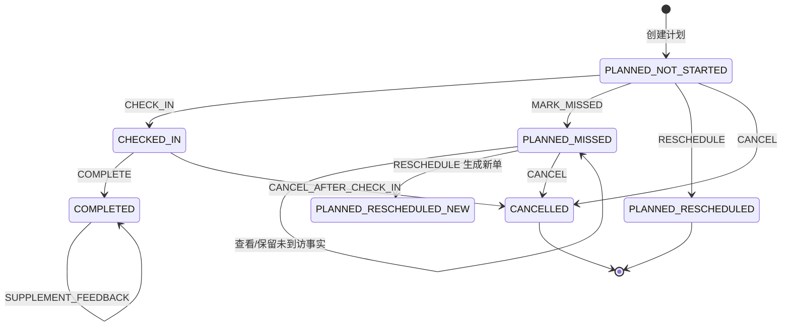

# 拜访计划主PRD

> **版本**：V2.0 | 2026-08-13
> **产品**：Forge CRM | **端**：PC Web | **文档状态**：返修版，待评审

---

## 1. 业务背景

拜访是销售推进线索、商机和客户关系的核心动作。当前只记录“计划、签到、完成、取消”四个粗粒度状态，无法回答以下问题：计划过期但没有签到是否算未到访、改期是否覆盖原计划、已签到后取消是否抹掉执行事实、拜访反馈如何生成下一次跟进，以及客户在 ERP 停用后哪些动作仍可执行。

本模块以 Forge CRM 为演示品牌，Forge为演示公司。目标是把“创建计划 → 执行签到 → 填写反馈 → 形成下一步跟进”的执行事实沉淀在 CRM，并将商机阶段同步、客户快照和 ERP 边界说清楚。CRM 只保存客户快照和拜访事实，客户档案 SSOT 仍为 ERP。

### 1.1 目标用户与核心任务

| 角色 | 核心任务 |
|---|---|
| 销售人员 `SALES_REP` | 创建/编辑本人计划，签到，提交反馈，查看下一步跟进 |
| 销售主管 `SUPERVISOR` | 查看团队计划，代签，修正异常，审核退回反馈，控制已签到取消 |
| 系统管理员 `ADMIN` | 全量配置、异常处理、审计追溯和权限兜底 |

### 1.2 事实、假设与待确认项

| 类型 | 内容 |
|---|---|
| 事实 | CRM 是线索、商机和拜访的权威源；ERP 是客户档案、商品/价格和订单的权威源。 |
| 事实 | 项目为 PC Web Demo，不包含移动端、GPS 轨迹和真实后端 API。 |
| 假设 | 拜访反馈提交后自动生成跟进记录；商机阶段不因完成拜访自动改动。 |
| 假设 | 浏览器定位是可选辅助证据，不作为 PC Web 签到阻断条件。 |
| 待确认 | 真实项目接入 ERP 后，ERP 状态查询和同步失败的超时阈值需由接口协议确认；Demo 使用 `Mock`。 |

---

## 2. 产品目标与成功指标

### 2.1 产品目标

1. 所有拜访都有可追踪的计划、执行结果、反馈和异常审计。
2. 任何状态变化均由明确动作按钮触发，表单不允许直接编辑状态字段。
3. 拜访完成后，下一步行动可落为一条不重复的跟进记录。
4. 客户停用、线索转客户、商机输单等跨模块变化不会覆盖历史事实。

### 2.2 指标

| 指标 | 目标/口径 |
|---|---|
| 拜访闭环率 | `COMPLETED` 拜访数 / 已到计划截止时间的非取消拜访数，目标 ≥ 80%。 |
| 反馈完整率 | 完成时 `visitResult`、`feedbackContent` 和必要的下一步字段均落库的比例，目标 ≥ 95%。 |
| 自动跟进幂等率 | 同一拜访不产生重复 `followUpRecordId`，目标 100%。 |
| 异常可追溯率 | 取消、代签、主管修正、定位拒绝均有审计日志，目标 100%。 |
| 守护指标 | 不允许因定位权限、ERP 同步失败导致历史签到事实丢失。 |

---

## 3. 功能范围

### 3.1 In Scope

- 拜访计划创建、列表查询、编辑、详情查看。
- 关联一个主对象：`LEAD`、`OPPORTUNITY` 或 `CUSTOMER`。
- 计划时间、拜访方式、地址和负责人维护。
- `CHECK_IN`、`COMPLETE`、`CANCEL`、`RESCHEDULE`、`MARK_MISSED`、`PROXY_CHECK_IN`、`SUPERVISOR_CORRECT` 动作。
- PC Web 浏览器定位请求、定位授权结果和签到来源记录；定位不是 GPS 轨迹。
- 反馈字段、反馈退回/补充、自动生成下一条跟进记录。
- 与 ERP 客户快照、商机/线索状态快照的提交前校验。
- 操作日志、失败重试、幂等标识和客户/商机时间线展示。
- 列表页、 新增/编辑页、详情页的 Demo 规格。

### 3.2 Out of Scope

- 移动端 App、小程序和移动端专属交互。
- GPS 轨迹、连续定位、电子围栏、路线规划和地图导航。
- 真实后端 API；ERP/WMS 侧原型修改；AI 模型实现。本模块仅用 Mock 展示接口调用与结果。
- 短信、邮件群发、广告归因等市场营销功能。
- CRM 独立维护客户档案、商品、价格或销售订单。

---

## 4. 单据定位与数据边界

### 4.1 单据定位

| 项目 | 定义 |
|---|---|
| 单据名称 | `VisitPlan`（拜访计划） |
| 单据编号 | 系统生成，格式 `VS{YYYYMMDD}-{4位序号}` |
| 来源 | 手动创建；改期和重新计划由原拜访动作生成新单据。 |
| 权威源 | CRM；执行事实和拜访反馈以 CRM 为准。 |
| 生命周期 | 计划 → 执行/未到访/改期/取消 → 完成；原单据不删除。 |
| 关联基数 | 一个拜访只能有一个主关联对象；同一客户/商机/线索可以有多条拜访。 |

### 4.2 主状态、执行结果和异常标识

主状态字段为 `primaryStatus`，只能由动作按钮或明确的动作接口写入，不能在表单中直接修改。执行结果和异常是拆分字段，避免把“已签到后取消”和“未签到取消”混成同一事实。

| 字段 | 枚举/值 | 用途 |
|---|---|---|
| `primaryStatus` | `PLANNED` / `CHECKED_IN` / `COMPLETED` / `CANCELLED` | 主生命周期状态。 |
| `executionResult` | `NOT_STARTED` / `MISSED` / `RESCHEDULED` | 计划执行结果，仅对尚未签到的计划类记录生效；不覆盖主状态。 |
| `feedbackReviewStatus` | `DRAFT` / `NOT_REQUIRED` / `PENDING` / `RETURNED` / `ACCEPTED` | 反馈是否为草稿、待审核、退回或接受；不改变主状态。 |
| `executionException` | 可并存枚举数组：`NONE` / `CHECK_IN_FAILED` / `CUSTOMER_NO_SHOW` / `OVERTIME` / `FEEDBACK_PENDING` / `FOLLOW_UP_PENDING` | 可并存的异常标识；异常处理必须有日志。 |

### 4.3 状态/结果展示组合

| 数据组合 | 用户可见文案 | 颜色 | 可执行动作 |
|---|---|---|---|
| `PLANNED + NOT_STARTED` 且未到 `plannedEndAt` | 已计划 | 蓝色 `#1677FF` | 签到、取消、改期、编辑 |
| `PLANNED + NOT_STARTED` 且已过 `plannedEndAt` | 已超时待处理 | 蓝色 Tag + 黄色提示 | 标记未到访、改期、取消 |
| `PLANNED + MISSED` | 未到访 | 紫色 `#722ED1` | 重新计划、取消、查看 |
| `PLANNED + RESCHEDULED` | 已改期 | 灰色 `#8C8C8C` | 仅查看原单和新单 |
| `CHECKED_IN` | 已签到 | 橙色 `#FA8C16` | 完成、已签到后取消、保存反馈 |
| `COMPLETED` | 已完成 | 绿色 `#52C41A` | 查看；主管/管理员补充反馈 |
| `CANCELLED` 且未签到 | 已取消 | 红色 `#F5222D` | 仅查看 |
| `CANCELLED` 且已签到 | 已签到后取消 | 红色 `#F5222D` + 执行事实图标 | 仅查看、查看反馈草稿/审计 |

### 4.4 时间和空值规则

- 存储使用带时区的 ISO 时间；服务端统一以 `Asia/Shanghai` 生成和校验时间，页面展示格式统一为 `YYYY-MM-DD HH:mm`。
- `plannedStartAt` 和 `plannedEndAt` 必须由服务端校验，`plannedEndAt > plannedStartAt`；默认时长 60 分钟，可由用户调整。
- 签到时间 `checkInAt` 由服务端生成，禁止使用浏览器本地时间覆盖。
- `PLANNED`（包括 `NOT_STARTED`、`MISSED`、`RESCHEDULED`）若从未签到，`checkInAt` 显示 `—`。
- `CANCELLED` 且从未签到，`checkInAt` 显示 `—`；`CANCELLED` 且已签到，保留并展示原 `checkInAt`。
- 常规 `COMPLETED` 必须有 `checkInAt` 和 `completedAt`；`BACKFILL` 历史补录由授权角色填写实际时间并写明原因。
- 任何空时间不显示 `1970-01-01`、空白或本地混合时区，统一显示 `—`。

---

## 5. 状态机与执行路径

### 5.1 状态规则

| 当前数据 | 动作 | 结果 | 说明 |
|---|---|---|---|
| `PLANNED + NOT_STARTED` | `CHECK_IN` | `CHECKED_IN` | 签到事实写入服务端时间；`executionResult` 不再适用。 |
| `PLANNED + NOT_STARTED` 且过截止时间 | 页面显示超时 | 不改状态 | 系统只计算 `overdueFlag=true`，不自动改状态。 |
| `PLANNED + NOT_STARTED` 且过截止时间 | `MARK_MISSED` | `PLANNED + MISSED` | 由动作按钮确认后落库，原因必填。 |
| `PLANNED + NOT_STARTED` | `RESCHEDULE` | 原单 `PLANNED + RESCHEDULED`，生成新单 `PLANNED + NOT_STARTED` | 不修改原 `plannedStartAt`；双向保存关联。 |
| `PLANNED + MISSED` | `RESCHEDULE` | 原单保持 `MISSED`，生成新单 | 未到访事实保留；新动作名为“重新计划”。 |
| `PLANNED + NOT_STARTED/MISSED` | `CANCEL` | `CANCELLED` | 取消原因必填；未签到无 `checkInAt`。 |
| `CHECKED_IN` | `COMPLETE` | `COMPLETED` | 反馈字段校验通过后提交；必要时生成跟进记录。 |
| `CHECKED_IN` | `CANCEL_AFTER_CHECK_IN` | `CANCELLED` | 只终止计划，不删除签到事实；主管/管理员专属。 |
| `COMPLETED` | `SUPPLEMENT_FEEDBACK` | `COMPLETED` | 仅追加/补充反馈，不改原始执行事实。 |
| `CANCELLED` | 任意执行动作 | 阻断 | 不恢复、不重复签到、不直接改回计划。 |

### 5.2 Mermaid 状态图

### 5.3 到期未签到判定

1. 计划到 `plannedEndAt` 后，服务端计算 `overdueFlag=true`，列表和详情展示“已超时待处理”。该计算不直接改变 `primaryStatus` 或 `executionResult`。
2. 负责人、主管或管理员点击“标记未到访”，系统重新以服务端时间校验 `now > plannedEndAt` 且 `checkInAt IS NULL`，要求填写 `missedReason`。
3. 校验通过后写入 `executionResult=MISSED`、`missedAt`、`missedBy` 和操作日志；失败时保留 `PLANNED + NOT_STARTED`，Toast 提示“当前条件不满足标记未到访，请刷新后重试”。
4. 未到访可以点击“重新计划”生成新拜访；不能直接把原单的计划时间改成新时间。

### 5.4 改期与重新计划

- 改期永远生成新 `VisitPlan`，不覆盖原记录的计划时间、关联快照或执行事实。
- 原单为 `PLANNED + NOT_STARTED` 时，点击“改期”后原单变为 `PLANNED + RESCHEDULED`；新单写 `rescheduledFromVisitId=原单ID`。
- 原单为 `PLANNED + MISSED` 时，点击“重新计划”生成新单，原单保持 `MISSED`，避免抹掉爽约事实；新单仍写 `rescheduledFromVisitId`。
- 原单为 `CHECKED_IN`、`COMPLETED` 或 `CANCELLED` 时不可改期；如需追加动作，创建新的关联拜访。
- 原单、新单均在详情页展示关联链路；列表默认只展示新单的可执行状态，原单显示“已改期/未到访”。
- 改期原因 `rescheduleReason` 必填；客户临时取消使用 `cancelReason=CUSTOMER_CANCELLED`，不代替改期原因。

### 5.5 反馈状态闭环

- `CHECKED_IN` 时可以保存反馈草稿，`feedbackReviewStatus=DRAFT` 作为前端展示状态，不改变主状态。
- 点击“完成”必须提交 `visitResult`、`feedbackContent`；如有下一步，必须同时提交 `nextAction`、`nextFollowUpAt`、`nextActionOwner`。
- 完成后自动生成跟进记录：有下一步时创建一条 `FollowUpRecord`，回写 `followUpRecordId`；无下一步时记录 `followUpRecordId=NULL` 和 `followUpCreateSkippedReason=NO_NEXT_ACTION`。
- 跟进生成使用幂等键 `visit:{visitId}:follow-up:v1`。重复点击完成、刷新页面或重试只查询并复用原记录，不创建第二条。
- 拜访完成后默认只读；主管/管理员可点击“补充反馈”，只能追加或补充反馈字段，不能改写 `checkInAt`、`completedAt`、签到来源、原始定位和原关联对象。
- 主管点击“退回反馈”后，`feedbackReviewStatus=RETURNED`，必须填写 `returnReason`；负责人可“补充反馈并重新提交”，全程保留版本和审计日志。
- `relatedObjectType=OPPORTUNITY` 时，完成不自动修改商机阶段；系统可展示 `recommendedOpportunityStage`，销售或主管点击“更新商机阶段”后才写入商机，接口失败不回滚拜访完成状态。

---

## 6. 关联对象规则

### 6.1 关联模型

一个拜访只能有一个主关联对象，字段拆为：

| 字段 | 规则 |
|---|---|
| `relatedObjectType` | 必填，枚举 `LEAD` / `OPPORTUNITY` / `CUSTOMER`。 |
| `relatedObjectId` | 必填，引用对象稳定 ID；所有查询、写入、权限校验均使用 ID。 |
| `relatedObjectNameSnapshot` | 创建/更换时保存名称快照，仅用于历史展示，不能作为关联键。 |
| `relatedObjectStatusSnapshot` | 创建/动作校验时保存状态快照，展示当时状态，不替代 ERP 最新状态。 |
| `inheritedCustomerId` | 关联商机时从商机客户关系继承，用于客户时间线，不计为第二主关联。 |
| `inheritedCustomerNameSnapshot` | 继承客户名称快照。 |
| `associationChangeLog` | 关联更换的前后 ID、快照、原因、操作者、时间；历史不覆盖。 |

### 6.2 三类对象处理

- 关联 `CUSTOMER`：客户必须通过 ERP 最新校验为 `ACTIVE` 或允许快照提交的同步中状态；CRM 不新建或修改正式客户主档。
- 关联 `OPPORTUNITY`：商机必须存在且当前用户有访问权；商机的客户关系写入 `inheritedCustomerId`。商机输单后，已完成/已签到记录保留；未执行计划禁止签到，需由负责人/主管点击取消并填写 `OPPORTUNITY_LOST`，或保留为未到访后再处理。
- 关联 `LEAD`：线索转客户后不自动覆盖原拜访的 `relatedObjectType/Id`；原拜访保留线索 ID、名称和转化快照，并展示 `convertedToCustomerId`。未来拜访应选择转化后的 `CUSTOMER`，避免历史事实漂移。
- 关联对象名称变化只更新未来的展示快照或由同步任务追加快照，不能通过名称匹配替换历史 ID。

### 6.3 关联对象可更换规则

- `PLANNED + NOT_STARTED` 且未改期/未取消时，只有 `SUPERVISOR`/`ADMIN` 可通过“更换关联对象”动作更换；必须填写 `associationChangeReason`，并写入前后快照。
- `CHECKED_IN`、`COMPLETED`、`CANCELLED`、`MISSED` 和 `RESCHEDULED` 记录不能更换主关联对象；如对象选错，主管通过修正动作追加说明，必要时新建正确关联的拜访。
- 线索转客户不是“更换关联对象”动作，系统仅建立转化映射，保留原 ID 和历史时间线。

---

## 7. 客户停用与 ERP 同步状态矩阵

创建、签到和完成前均执行状态校验；页面上的 `StatusSnapshot` 只用于提示，不能绕过提交前校验。

| 客户状态（生命周期 / 同步处理） | 新建拜访 | 新签到 | 已签到后完成 | 历史补录 | 处理规则 |
|---|---|---|---|---|---|
| 生命周期 `ACTIVE` + 同步 `AVAILABLE` | 允许 | 允许 | 允许 | 允许 | 以 ERP 最新状态为准并更新 CRM 快照。 |
| 生命周期 `ACTIVE` + 同步 `PENDING_RECEIVE/VALIDATING` 且有最近快照 | 可填写草稿；提交前必须查 ERP | 提交前必须查 ERP，返回 `ACTIVE + AVAILABLE` 才允许 | 允许，仍保留原快照 | `SUPERVISOR`/`ADMIN` 可操作 | 展示“客户同步中”；查询超时或无明确可用结果时阻断新建/签到。 |
| 生命周期 `ACTIVE` + 同步 `SYNC_FAILED` 且有最近快照 | 可填写草稿；提交前必须查 ERP | 提交前必须查 ERP，不能只依赖快照 | 允许，使用原执行快照 | `SUPERVISOR`/`ADMIN` 可操作 | 展示“基于最近快照，待 ERP 校验”；校验失败可重试。 |
| `DISABLED` | 禁止 | 禁止新签到 | **已签到允许完成** | 仅 `SUPERVISOR`/`ADMIN` 可历史补录 | 停用阻断新业务；已签到执行事实允许收口。 |

### 7.1 停用前已签到的产品决定

客户在签到之后被 ERP 停用（生命周期 `DISABLED`），允许原拜访完成。完成时保留 `relatedObjectStatusSnapshot=DISABLED`、停用时间和校验结果，并可按幂等规则生成跟进记录；这属于对已发生执行事实的收口，不代表恢复客户，也不是新增业务。新建拜访、改期新单和新签到仍被阻断；下一条拜访在执行前必须重新校验客户为 `ACTIVE + AVAILABLE`。

### 7.2 历史补录与恢复规则

- 历史补录只允许 `SUPERVISOR`/`ADMIN`，通过“历史补录”动作创建一条 `source=BACKFILL` 的 `COMPLETED` 记录；不得在普通新增表单直接选择 `COMPLETED`。
- 历史补录必须输入实际发生时间、`backfillReason` 和证据说明；不要求真实 GPS，但 `locationSource=NONE`，不得伪造浏览器定位。
- 恢复客户后，只恢复“新建/执行校验能力”，不自动恢复已经 `CANCELLED`、`MISSED` 或 `RESCHEDULED` 的原拜访，也不自动清除已过 `plannedEndAt` 的 `overdueFlag`；需要新的计划必须点击“重新计划/新建拜访”，过期计划仍需通过“签到/标记未到访/改期/取消”动作收口。

---

## 8. PC Web 签到与定位边界

### 8.1 定位规则

| 拜访方式 `visitMethod` | 定位行为 | 是否阻断签到 |
|---|---|---|
| `ONSITE` | 点击签到时可调用浏览器 Geolocation API；用户可授权、拒绝或浏览器不支持。 | 不阻断；无可靠定位时允许“无定位签到”，但必须记录原因。 |
| `PHONE` | 不请求定位，记录 `locationSource=NONE`。 | 不阻断。 |
| `VIDEO` | 不请求定位，记录 `locationSource=NONE`。 | 不阻断。 |

- 定位是一次性签到辅助信息，不采集连续轨迹，不实现电子围栏；移动端不在本项目范围内。
- 真实浏览器定位写 `locationSource=BROWSER`，保存 `latitude`、`longitude`、`accuracyMeters`、`authorizationResult` 和服务端 `checkInAt`。
- 拒绝授权、浏览器不支持、超时或精度超过产品阈值时，签到动作仍可继续；弹窗要求用户确认“无定位签到”，并记录 `locationFailureReason`。
- Demo 没有真实 GPS 能力时只能写 `locationSource=MOCK`、`locationReliability=MOCK`，UI 显示“Mock 定位”，不得把模拟坐标标为真实 GPS。
- 服务端时间优先于浏览器时间；客户端提交的时间只作为诊断字段 `clientReportedAt`，不能用于状态判定。

### 8.2 签到失败处理

签到前重新校验当前状态、负责人权限、客户状态、关联对象状态和服务端时间窗口。任一校验失败，状态保持原值，记录失败审计日志并 Toast 具体原因；网络/Mock 接口失败显示“签到失败，请重试”，保留表单输入，不产生半条签到事实。重复点击使用 `idempotencyKey=visit:{visitId}:check-in:{requestId}`，已成功则返回原签到结果。

---

## 9. 状态动作权限与失败处理矩阵

所有动作均为按钮或动作接口；状态字段在新增/编辑表单中只读展示。`OWNER` 表示当前 `assigneeId` 对应的销售人员。

| 当前状态/条件 | 动作 | 允许角色 | 前置条件 | 状态变化/数据落库 | 失败结果 | 二次确认 | 审计日志 |
|---|---|---|---|---|:---:|:---:|
| `PLANNED + NOT_STARTED` | `CHECK_IN` 签到 | `OWNER`、`SUPERVISOR`、`ADMIN` | 有权限；未签到；计划未取消；客户校验通过；必填定位结果已确认。 | `primaryStatus→CHECKED_IN`；写 `checkInAt`、来源、定位、执行人。 | 状态不变；提示权限/客户/时间/网络原因；可重试。 | 是 | 是 |
| `PLANNED + NOT_STARTED` | `PROXY_CHECK_IN` 代签 | `SUPERVISOR`、`ADMIN` | 指定实际执行人；填写 `proxyReason`；上传/填写证据说明；客户校验通过。 | `CHECKED_IN`；`checkInMethod=PROXY`；保留操作者与实际执行人。 | 状态不变；缺原因或权限不足时阻断。 | 是 | 是 |
| `PLANNED + NOT_STARTED` 且 `now>plannedEndAt` | `MARK_MISSED` 标记未到访 | `OWNER`、`SUPERVISOR`、`ADMIN` | 服务端已过截止时间；`checkInAt IS NULL`；填写 `missedReason`。 | `executionResult→MISSED`；写 `missedAt`。 | 仍为 `NOT_STARTED`；提示需刷新或已存在签到。 | 是 | 是 |
| `PLANNED + NOT_STARTED/MISSED` | `RESCHEDULE` 改期/重新计划 | `OWNER`、`SUPERVISOR`、`ADMIN` | 新计划时间合法；客户/关联对象提交前校验；填写改期原因。 | 生成新 `VisitPlan`；原单为未过期时 `RESCHEDULED`，已 `MISSED` 时保留 MISSED；双向关联。 | 原单不变；提示新单创建失败，可安全重试。 | 是 | 是 |
| `PLANNED + NOT_STARTED/MISSED` | `CANCEL` 取消 | `OWNER`、`SUPERVISOR`、`ADMIN` | 未签到；填写 `cancelReason`。 | `primaryStatus→CANCELLED`；未签到 `checkInAt` 为空。 | 状态不变；提示已有签到或已终态。 | 是 | 是 |
| `CHECKED_IN` | `COMPLETE` 完成 | `OWNER`、`SUPERVISOR`、`ADMIN` | 反馈必填；客户停用时必须是签到后事实；服务端状态仍为 CHECKED_IN。 | `primaryStatus→COMPLETED`；写 `completedAt`；按幂等键生成跟进。 | 校验失败不完成；跟进失败则完成保留并标 `FOLLOW_UP_PENDING`，提供重试。 | 是 | 是 |
| `CHECKED_IN` | `CANCEL_AFTER_CHECK_IN` 已签到后取消 | `SUPERVISOR`、`ADMIN` | 填写 `cancelReason`；确认保留签到事实；反馈草稿自动保留。 | `primaryStatus→CANCELLED`；签到字段不变；时间线写“已签到后取消”。 | 状态不变；普通负责人提示“已签到取消需主管或管理员操作”。 | 是 | 是 |
| `COMPLETED` | `SUPPLEMENT_FEEDBACK` 补充反馈 | `SUPERVISOR`、`ADMIN` | 不改原始事实；填写补充原因；必要时补下一步。 | 状态不变；新增反馈版本；更新跟进幂等关系。 | 原反馈不覆盖；提示无修改权限或版本冲突。 | 是 | 是 |
| `COMPLETED` 且商机 | `UPDATE_OPPORTUNITY_STAGE` 更新商机阶段 | `OWNER`、`SUPERVISOR`、`ADMIN` | 选择目标阶段；校验商机版本；确认不自动联动订单。 | 商机阶段变更；拜访保持 COMPLETED；记录来源 VisitPlan。 | 商机失败不回滚拜访；提示阶段更新失败，可重试。 | 是 | 是 |
| 任意非终态 | `SUPERVISOR_CORRECT` 主管修正 | `SUPERVISOR`、`ADMIN` | 选择允许修正字段；填写原因和证据；检查版本。 | 仅追加修正版本；可修正异常分类/反馈，不删除或覆盖原签到事实。 | 版本冲突时拒绝写入；提示刷新后重试。 | 是 | 是 |
| `PLANNED + NOT_STARTED` 或客户停用历史 | `BACKFILL` 历史补录 | `SUPERVISOR`、`ADMIN` | 实际时间、原因、证据必填；`locationSource=NONE`。 | 动作直接生成 `COMPLETED + source=BACKFILL`；不进入普通签到。 | 不满足证据/权限时不落库。 | 是 | 是 |

### 9.1 二次确认、Toast 与重试统一规则

- `CHECK_IN`、`PROXY_CHECK_IN`、`COMPLETE`、`CANCEL`、`CANCEL_AFTER_CHECK_IN`、`RESCHEDULE`、`MARK_MISSED` 均需二次确认；确认弹窗显示对象、当前状态、关键后果和不可逆事实。
- 成功 Toast：签到“签到成功”；完成“拜访已完成”；取消“拜访已取消”；改期“已生成新拜访”；未到访“已标记未到访”。
- 失败 Toast 必须说明失败类别：权限、前置校验、状态冲突、ERP 校验、网络/Mock 服务；不使用“操作失败”这一无上下文提示。
- 网络、Mock 接口和跟进生成失败均提供“重试”；重试沿用业务幂等键，不能创建重复拜访、重复签到或重复跟进。
- 状态冲突重试前先刷新详情；若状态已被其他人完成/取消，按钮隐藏或置灰，并提示最新状态。

---

## 10. 页面与交互要求

页面 Demo 详见：`拜访计划Demo_列表页.md`、`拜访计划Demo_新增编辑页.md`、`拜访计划Demo_详情页.md`。

### 10.1 列表页

- 默认按 `plannedStartAt` 升序展示近 30 天计划，支持状态、负责人、拜访方式、关联对象类型、时间范围和异常筛选。
- 状态列展示主状态与执行结果组合 Tag；签到时间为空显示 `—`。
- 行操作由当前状态和角色动态展示；不在列表直接编辑状态。
- 空态、加载态、ERP 校验失败态和无权限态均有明确文案。

### 10.2 新增/编辑页

- 新增时状态固定为 `PLANNED + NOT_STARTED`，不提供状态 Select。
- 关联对象使用 `relatedObjectType` + 按 ID 查询的选择器，提交前重新取得 `relatedObjectStatusSnapshot`。
- 编辑只能修改未执行的计划字段；状态、执行事实和审计字段只读。
- 改期使用动作弹窗，不复用编辑页直接覆盖原计划时间。

### 10.3 详情页

- 顶部展示编号、标题、主状态/结果 Tag、负责人、计划时间和可用动作。
- 主体分为计划信息、执行信息、反馈信息、关联对象、异常与审计时间线。
- 详情页明确区分 `checkInAt`、`completedAt`、客户状态快照和当前 ERP 状态。
- 完成后默认只读；主管/管理员显示“补充反馈”“退回反馈”“主管修正”，但原始事实字段不可编辑。

---

## 11. 业务场景

### 场景 A：正常上门拜访

销售创建 `ONSITE` 计划关联 `OPPORTUNITY`，到访点击签到并授权浏览器定位。服务端写入签到时间和定位结果；拜访后提交结果、客户意向和下一步，点击完成，系统创建一条跟进记录并在商机时间线展示。

### 场景 B：客户临时取消

销售在计划时间前点击取消，选择 `CUSTOMER_CANCELLED` 并填写原因。系统将主状态置为 `CANCELLED`，保留原计划和关联快照；如客户约定新时间，销售再点击“改期”生成新拜访，不覆盖原记录。

### 场景 C：已签到但客户未出现

销售已经签到，客户未出现。销售在反馈中选择 `visitResult=CUSTOMER_NO_SHOW`，填写说明和下一步，仍可正常完成；如要终止计划，必须由主管/管理员执行已签到后取消，签到事实和反馈草稿均保留。

### 场景 D：客户停用后的收口

ERP 将客户生命周期标记为 `DISABLED`。未签到的计划禁止新签到，负责人需取消或标记未到访；已签到的计划仍允许完成并生成跟进，完成后的跟进使用客户快照，后续新拜访需等客户恢复 `ACTIVE + AVAILABLE` 并通过提交前校验。

### 场景 E：线索转客户与商机输单

线索转化后，既有线索拜访仍引用原 `LEAD` ID，并展示转化客户映射；新拜访引用 `CUSTOMER` 或 `OPPORTUNITY`。商机输单后，历史拜访保留，未执行计划禁止签到，需通过取消动作收口，不能自动删除或改写。

---

## 12. 字段与数据要求

完整字段清单见 `拜访管理/拜访计划字段清单.md`。本 PRD 的关键字段如下：

| 分组 | 关键字段 |
|---|---|
| 计划 | `visitId`、`title`、`visitMethod`、`plannedStartAt`、`plannedEndAt`、`assigneeId`、`address` |
| 执行 | `primaryStatus`、`executionResult`、`checkInAt`、`checkInMethod`、`actualExecutorId`、`locationSource`、`latitude`、`longitude`、`accuracyMeters` |
| 反馈 | `visitResult`、`customerIntent`、`feedbackContent`、`nextAction`、`nextFollowUpAt`、`nextActionOwner`、`followUpRecordId`、`feedbackReviewStatus` |
| 关联 | `relatedObjectType`、`relatedObjectId`、`relatedObjectNameSnapshot`、`relatedObjectStatusSnapshot`、`inheritedCustomerId`、`rescheduledFromVisitId`、`rescheduledToVisitId` |
| 异常/审计 | `cancelReason`、`rescheduleReason`、`missedReason`、`executionException`、`idempotencyKey`、`createdBy`、`updatedBy`、`auditLogId` |

---

## 13. 验收标准

| 编号 | 验收项 | 通过标准 |
|---|---|---|
| V01 | 创建计划 | 新建后为 `PLANNED + NOT_STARTED`；服务端生成 `visitId`；关联保存稳定 ID 和名称/状态快照。 |
| V02 | 正常闭环 | `CHECK_IN` 写服务端 `checkInAt`，`COMPLETE` 写 `completedAt`、反馈和跟进记录，重复重试不重复。 |
| V03 | 到期未签到 | 过 `plannedEndAt` 只显示“已超时待处理”；点击“标记未到访”并填原因后才落 `MISSED`。 |
| V04 | 改期 | 原记录计划时间不变；改期生成新 `VisitPlan`，双向关联；原记录显示 `RESCHEDULED` 或保留 `MISSED`。 |
| V05 | 已签到取消 | 主管/管理员二次确认并填写原因后才允许；`checkInAt`、定位和反馈草稿保留；时间线展示“已签到后取消”。 |
| V06 | 反馈闭环 | `visitResult`、`feedbackContent` 必填；下一步字段按条件必填；自动跟进创建有幂等键，失败可重试。 |
| V07 | 完成后权限 | `COMPLETED` 对销售只读；主管/管理员补充反馈只能追加，不能改原始签到/完成事实，修正写审计。 |
| V08 | 关联转换 | 线索转客户不覆盖原拜访；商机继承客户但只保留一个主对象；商机输单阻断未执行签到并保留历史。 |
| V09 | 客户停用 | `DISABLED` 阻断新建/改期新单/新签到；已签到允许完成并生成跟进作为历史事实收口；历史补录只允许主管/管理员；恢复不自动恢复终态拜访。 |
| V10 | PC Web 定位 | 上门可请求浏览器定位，电话/视频不请求；拒绝授权不阻断；记录授权结果；Mock 定位明确标识。 |
| V11 | 动作与权限 | 状态字段无可编辑控件；动作矩阵中的角色、前置、确认、失败 Toast 和审计日志均可验证。 |
| V12 | 空值与展示 | 未签到时间统一显示 `—`；已签到取消保留时间；所有时间按 `Asia/Shanghai` 展示。 |

---

## 14. 依赖、风险与上线边界

### 14.1 依赖

- ERP 客户状态查询与客户快照同步；客户生命周期使用 `ACTIVE/DISABLED`，同步处理使用 `PENDING_RECEIVE/VALIDATING/AVAILABLE/SYNC_FAILED`，本 Demo 使用 Mock 响应覆盖上述状态组合。
- CRM 商机和线索详情/时间线；商机阶段更新为显式动作。
- 跟进记录服务；创建接口必须支持 `idempotencyKey`。
- 权限服务提供 `OWNER`、`SUPERVISOR`、`ADMIN` 判断。

### 14.2 风险与缓解

| 风险 | 影响 | 缓解 |
|---|---|---|
| 浏览器定位权限不稳定 | 签到证据不完整 | 定位非阻断；记录授权结果、失败原因和 Mock 标识。 |
| ERP 同步失败 | 误在停用客户上新建或签到 | 草稿可暂存但提交前必须校验；失败时阻断并可重试。 |
| 改期生成重复新单 | 计划混乱 | 使用原单动作幂等键和双向关联。 |
| 完成后跟进创建失败 | 下一步遗漏 | 完成记录 `FOLLOW_UP_PENDING`，详情提供幂等重试。 |
| 多人同时操作 | 状态被覆盖 | 服务端版本号校验；冲突时不写入并要求刷新。 |

### 14.3 发布前自检

- 主 PRD、字段清单、用例推演和三个页面 Demo 均存在，且字段名/组件名/枚举值遵守英文规范。
- 8 个 P1 和 8 个 P2 均有对应章节、字段或用例。
- 不提供删除操作；客户、线索、商机名称不作为稳定关联键。
- 不涉及移动端、真实 GPS、ERP/WMS 侧修改或真实后端实现。
