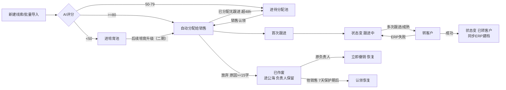

# 线索管理评审PRD

> **文档定位**：评审用完整档，评审人读本件即可审，开发直接按本件工作，不用切换多份PRD。
> **业务事实以「线索字段清单（详细稿）.tsv」和「线索主PRD.md」为准**，本件是评审工作入口，不是第四权威源。
> **版本**：V0.2 | 评审状态：待评审

---

## 一、做哪些（本期范围内）/ 不做哪些（后续再做）

- **做**：管理线索从创建到转客户的全过程——新增、修改、查询筛选、导出、认领、跟进、放弃、作废、批量导入、AI评分分流。
- **不做**：线索自动营销推送、客户深度画像（二期）；移动端功能。

## 二、功能清单

| 功能 | 一句话说清 | 本期？ |
|------|-----------|:---:|
| 新增线索 | 录入新线索，进 AI 评分分流 | ✅ |
| 修改线索 | 编辑本人名下会配套线索的信息 | ✅ |
| 批量导入 | Excel 一次建多条线索，逐条评分 | ✅ |
| 查询筛选 | 按来源/行业/评分/负责人/创建时间筛列表 | ✅ |
| 状态页签 | 全部/待分配/我的/公海/已转客户/已作废 | ✅ |
| 认领 | 销售把待分配/公海线索领到自己名下 | ✅ |
| 跟进 | 记录跟进，首次跟进后状态变"跟进中" | ✅ |
| 放弃 | 说明原因后放弃，进公海可被他人认领 | ✅ |
| 批量作废 | 选中多条一次作废（已转客户除外） | ✅ |
| 转客户 | 完成转客户后状态变"已转客户" | ✅ |
| 导出 | 按当前筛选结果导出 Excel/CSV | ✅ |

## 三、主要流程（含业务流程图）



**主流程（文字版）**：新建/导入 → AI评分分流 → 销售认领 → 首次跟进(变跟进中) → 多次跟进 → 转客户(同步ERP)。

**关键分支**：
- 高分(≥80)自动分配；中分进待分配；低分进培育池
- 认领后：可跟进、可放弃；放弃进公海他人可认领
- 已分配且无跟进超48小时 → 自动回收回待分配
- 转客户写ERP失败 → 保留原状态，可重试

## 四、状态怎么流转

状态在 草稿/待分配/已分配/跟进中/已转客户/已作废 之间变，由动作驱动：

```
草稿 →（提交）待分配 →（认领）已分配 →（首次跟进）跟进中 →（转客户）已转客户
        ↕                        ↘（放弃）已作废（进公海，负责保留，可立即撤销）
                                 （超48h无跟进，自动回收→待分配）
```

- 状态**只能靠动作按钮变**，不许直接在列表改
- 已转客户只能查看，不能作废
- 已作废原负责人可立即撤销；其他销售须等7天保护期后才能认领

## 五、业务规则

| 编号 | 什么情况下 | 结果 |
|------|-----------|------|
| R01 | 公司名称或线索来源没填 | 阻止新建，提示必填 |
| R02 | 手机号和邮箱都没填 | 阻止新建，要求至少填一个 |
| R03 | 手机号/邮箱和别的线索重复 | 阻止创建，提示重复 |
| R04 | AI评分 ≥80 | 自动分配给销售 |
| R05 | AI评分 50-79 | 进待分配池 |
| R06 | AI评分 <50 | 进培育池 |
| R07 | 评分失败/缺失 | 按50分兜底，进待分配 |
| R08 | 已分配且无跟进记录超48小时 | 自动回收回待分配，空出负责人 |
| R09 | 放弃原因少于15字 | 阻断，提示"放弃原因至少15字" |
| R10 | 销售名下已分配+跟进中达30条 | 不许继续认领 |
| R11 | 最小评分 > 最大评分，或超出0-100 | 阻断查询，提示 |
| R12 | 转客户写入ERP失败 | 保留线索原状态，提示稍后重试 |
| R13 | 已转客户线索点"作废" | 入口不展示（不可作废） |
| R14 | 修改线索 | 仅草稿/待分配可改；已分配及以后锁定关键字段，只能改备注 |

## 六、页面和操作

### 6.1 新增线索（表单页）


- **进入**：列表右上"新增"按钮 → 打开新建表单
- **表单字段**：公司名称(必填)、线索来源(必填下拉)、联系人(选填)、手机号(与邮箱至少一个)、邮箱、所属行业(选填下拉)、备注(选填)
- **提交**：点"保存" → 校验必填+重复 → 通过则创建，触发AI评分分流，返回列表刷新
- **失败**：校验不过红字提示并定位到错误字段，不消失

### 6.2 修改编辑
- **可编辑**：草稿、待分配状态——所有非只读字段可改
- **锁定**：已分配/跟进中/已转客户——公司/来源/手机号/邮箱/行业等关键字段只读，仅备注可改
- **改后**：保存后刷新，沿用当前状态，不重新评分（除非改了影响评分的字段，此为待确认项）

### 6.3 查询筛选（列表页查询区）
- **条件**：关键词(公司/联系人/手机号/编号)、线索来源、所属行业、AI评分区间、负责人、创建时间区间
- **逻辑**：多条件同时满足(且)；关键词支持逗号分隔多个值，任一命中
- **评分边界**：最小≤最大且在0-100，否则阻断提示
- **按钮**：搜索=刷新,回第1页；重置=清空条件；展开/收起=高级条件(评分/负责人/时间)

### 6.4 导出
- **入口**：列表工具条"导出"
- **范围**：按当前页签 + 已生效筛选条件的线索结果
- **格式**：Excel/CSV
- **权限**：销售只导本人可见，主管导团队，管理员导全量
- **操作**：点导出→生成文件→下载；不改当前查询条件和列表状态

### 6.5 列表页整体
- 顶部状态页签；下方查询区；主区表格(编号/公司/联系人/来源/行业/评分/负责人/状态/创建时间)；支持列宽拖拽、分页每页20/50/100
- **行操作**：草稿可查看/编辑/删除；待分配可查看/认领；已分配可查看/跟进/放弃；跟进中可查看/跟进/转客户/放弃；已转客户仅查看；已作废可撤销(原负责人)

### 6.6 批量作废
- 勾选行 → 二次确认 → 统一作废，清选择刷新；已转客户不可选作废

## 七、字段

关键字段（详见线索字段清单详细稿.tsv，本处只列要点，不重复定义）：

| 字段 | 填什么 | 哪来的 | 能不能改 |
|------|--------|--------|---------|
| 线索编号 | — | 系统生成 LEAD{日期}-{序号} | 只读 |
| 公司名称 | 所属公司 | 用户填 | 改：上限100字 |
| 线索来源 | 官网/活动/展会/转介绍/导入/其他 | 用户选 | 已分配后锁定 |
| 手机号 | 11位数字 | 用户填 | 已分配后锁定；全局去重 |
| 邮箱 | 邮箱格式 | 用户填 | 已分配后锁定；全局去重 |
| 所属行业 | 制造业/零售/…/其他 | 用户选 | 已分配后锁定 |
| AI评分 | 0-100 | 系统算 | 只读 |
| 线索状态 | 见第四章 | 系统生成 | 只读，按钮驱动 |
| 归属人 | 负责销售 | 系统生成 | 只读 |
| 最近跟进时间 | 最近一次跟进时刻 | 系统生成 | 只读 |
| 备注 | 补充说明 | 用户填 | 各状态都可改 |

## 八、给谁的权限

> 本模块需求分析中明确区分了角色所看范围，需要页面做角色控制，故写；系统未实现 RBAC，靠页面控制。

- **管理员**：看重全部线索 + 全部销售数据
- **销售**：只看本人线索 + 符合条件的公海线索
- **主管**：看团队线索，可做团队范围的管理动作(批量分配)
- **导出**：销售只能导本人可见范围，主管导团队，管理员导全量
- 认定/转客户失败提示已被他人处理

## 九、怎么验收

| 验收项 | 操作 | 预期 |
|--------|------|------|
| V01 | 对已转客户线索点"作废" | 入口不展示 |
| V02 | 新建时手机邮箱都留空提交 | 阻断，提示至少填一个 |
| V03 | 输入重复手机号提交 | 阻断，提示重复 |
| V04 | 已分配无跟进线索放48h | 状态自动回待分配 |
| V05 | 放弃原因只写5个字 | 阻断，提示至少15字 |
| V06 | 最小评分80、最大评分20 | 阻断查询，提示 |
| V07 | 30条满的销售再认领 | 阻断，提示上限 |
| V08 | 转客户时ERP断开 | 保留原状态，提示重试 |
| V09 | 已分配线索点编辑 | 来源/公司/手机号锁定，仅备注可改 |
| V10 | 查询区填关键词+来源+行业 | 三条件同时满足才显示结果 |
| V11 | 点导出 | 下载当前筛选结果Excel，列表状态不变 |

---

## 待确认 / 评审记录

- 待确认1：修改线索是否触发重新评分？（影响评分字段变了是否重算）
- （评审时填：评审人拍板的问题、裁决）

## 变更台账

| 日期 | 改了啥 | 回写目标 | 回写完成？ |
|------|--------|---------|:---:|
| 2026-09-25 | 新增线索管理评审PRD示范 v0.2：补新增/编辑/查询/导出章节 + Mermaid业务流程图 | 主PRD/字段清单待回写 | 否 |