# 线索管理评审PRD

> **文档定位**：评审用完整档，评审人读本件即可审，开发直接按本件工作，不用切换多份PRD。
> **业务事实以「线索字段清单（详细稿）.tsv」和「线索主PRD.md」为准**，本件是评审工作入口，不是第四权威源。
> **内容来源**：本件"页面和操作"章节由原型标注搬运整理而成，截图与标注一一对应；修改请回写权威源。
> **版本**：V0.3 | 评审状态：待评审

---

## 一、做哪些（本期范围内）/ 不做哪些（后续再做）

- **做**：管理线索从创建到转客户的全过程——新增、修改、查询筛选、导出、认领、跟进、放弃、作废、批量导入、AI评分分流。
- **不做**：线索自动营销推送、客户深度画像（二期）；移动端功能。

## 二、功能清单

> 与原型标注角标一一对应：每条功能对应一个标注块/角标，共 26 个（线索列表 9 + 新增/编辑 6 + 详情 11）。

### 线索列表页（9 个）

| # | 功能 | 一句话说清 | 本期？ |
|---|------|-----------|:---:|
| L1 | 线索列表页面 | 线索管理主页面，列表入口 | ✅ |
| L2 | 状态页签与线索池视图 | 全部/待分配/我的/公海/已转客户/已作废 按状态筛选，带数量徽章 | ✅ |
| L3 | 线索筛选与查询栏 | 关键词/来源/行业/评分/负责人/创建时间组合筛选 | ✅ |
| L4 | 新建与批量导入工具 | 手动新建线索、Excel 批量导入 | ✅ |
| L5 | 批量作废工具 | 勾选多条一次作废（已转客户除外） | ✅ |
| L6 | 线索表格字段与分页 | 列表列展示、列宽拖拽、分页（20/50/100） | ✅ |
| L7 | AI评分与分流规则 | 评分维度、分流区间、边界校验 | ✅ |
| L8 | 线索行操作与状态流转 | 每行按状态显示查看/编辑/跟进/转客户/放弃 | ✅ |
| L9 | 权限与异常边界 | 角色可见范围、批量分配权限、并发处理 | ✅ |

### 线索新增/编辑页（6 个）

| # | 功能 | 一句话说清 | 本期？ |
|---|------|-----------|:---:|
| F1 | 线索新增/编辑页面 | 新增空白表单 / 编辑草稿，返回/保存/提交 | ✅ |
| F2 | 基本信息 | 来源/公司/联系人/手机号/邮箱/职位/行业/地区/备注录入 | ✅ |
| F3 | 表单完整性与去重拦截 | 必填校验、手机号/邮箱全局去重 | ✅ |
| F4 | 保存草稿流程 | 暂存未完成线索，格式错阻断 | ✅ |
| F5 | 提交线索与AI分流 | 提交后评分，按分数入池/分配 | ✅ |
| F6 | 本页规则 | 页面级准入、防重复提交、失败保留 | ✅ |

### 线索详情页（11 个）

| # | 功能 | 一句话说清 | 本期？ |
|---|------|-----------|:---:|
| D1 | 线索详情页面 | 查看完整资料、生命周期状态与动作执行点 | ✅ |
| D2 | 状态与归属信息 | 展示状态、归属人、分配时间 | ✅ |
| D3 | AI评分与评分维度 | 评分卡片、权重拆解、流向规则 | ✅ |
| D4 | 线索基本信息 | 四列只读展示基础字段 | ✅ |
| D5 | 跟进记录时间线 | 跟进历史倒序展示 | ✅ |
| D6 | 状态操作栏与动作入口 | 按状态动态显示底部操作 | ✅ |
| D7 | 添加跟进记录弹窗 | 填写跟进方式/内容/计划 | ✅ |
| D8 | 主动放弃线索弹窗 | 二次确认、≥15字原因 | ✅ |
| D9 | 转客户确认与ERP建档 | 二次确认、ERP建档成功才转态 | ✅ |
| D10 | 草稿作废动作 | 草稿作废替代物理删除 | ✅ |
| D11 | 本页规则 | 准入、终态保护、防重复提交、并发 | ✅ |

## 三、主要流程（含业务流程图）

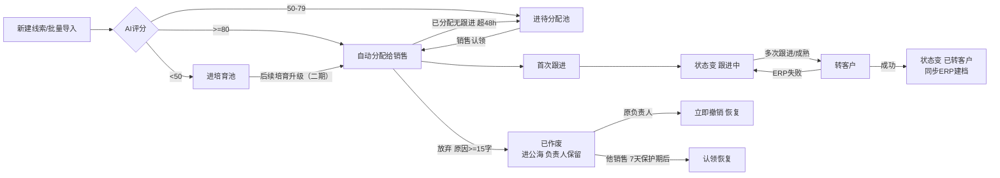
```mermaid
flowchart LR
    A[新建线索/批量导入] --> B{AI评分}
    B -->|>=80| C[自动分配给销售]
    B -->|50-79| D[进待分配池]
    B -->|<50| E[进培育池]
    C --> F[首次跟进]
    F --> G[状态变 跟进中]
    D -->|销售认领| C
    G -->|多次跟进/成熟| H[转客户]
    H -->|成功| I[状态变 已转客户<br/>同步ERP建档]
    H -->|ERP失败| G
    C -->|放弃 原因>=15字| J[已作废<br/>进公海 负责人保留]
    J -->|原负责人| K[立即撤销 恢复]
    J -->|他销售 7天保护期后| L[认领恢复]
    C -->|已分配无跟进 超48h| D
    E -->|后续培育升级（二期）| C
```

**主流程（文字版）**：新建/导入 → AI评分分流 → 销售认领 → 首次跟进(变跟进中) → 多次跟进 → 转客户(同步ERP)。

**关键分支**：
- 高分(≥80)自动分配；中分进待分配；低分进培育池
- 认领后：可跟进、可放弃；放弃进公海他人可认领
- 已分配且无跟进超48小时 → 自动回收回待分配
- 转客户写ERP失败 → 保留原状态，可重试

## 四、状态怎么流转

状态在 草稿/待分配/已分配/跟进中/已转客户/已作废 之间变，由动作驱动：

```
草稿 →（提交）待分配 →（认领）已分配 →（首次跟进）跟进中 →（转客户）已转客户
        ↕                        ↘（放弃）已作废（进公海，负责保留，可立即撤销）
                                 （超48h无跟进，自动回收→待分配）
```

- 状态**只能靠动作按钮变**，不许直接在列表改
- 已转客户只能查看，不能作废
- 已作废原负责人可立即撤销；其他销售须等7天保护期后才能认领

**各状态含义**：

| 状态 | 含义 |
|------|------|
| 草稿 | 手动录入暂存，允许继续编辑 |
| 待分配 | 等待分配，或处于培育池的统一状态 |
| 已分配 | 已有归属销售，尚未完成首次有效跟进 |
| 跟进中 | 已完成首次有效跟进，可继续跟进或转客户 |
| 已转客户 | ERP建档成功后的不可逆只读终态 |
| 已作废 | 作废或主动放弃，是否进公海取决于作废类型 |

## 五、业务规则

### 5.1 创建与提交

| 编号 | 什么情况下 | 结果 |
|------|-----------|------|
| R01 | 公司名称或线索来源没填 | 阻止新建，提示必填 |
| R02 | 手机号和邮箱都没填 | 阻止保存，提示"手机号和邮箱至少填写一个" |
| R03 | 手机号/邮箱和别的线索重复 | 阻止创建，提示冲突编号及当前负责人 |
| R04 | 草稿保存 | 字段格式错误阻断；不触发AI评分 |
| R05 | 正式提交 | 先校验完整性，再校验去重，任一不过不落库不评分 |

### 5.2 AI评分与分流

| 编号 | 什么情况下 | 结果 |
|------|-----------|------|
| R06 | AI评分 ≥80 | 自动分配给销售，状态已分配 |
| R07 | AI评分 50-79 | 进待分配池，状态待分配 |
| R08 | AI评分 <50 | 进培育池，状态仍待分配 |
| R09 | 评分失败/超时 | 按50分降级进待分配，记录失败日志，不阻断提交 |

**评分权重**：来源15% / 行业20% / 首次响应25% / 历史转化25% / 活跃度15%

### 5.3 认领/跟进/放弃

| 编号 | 什么情况下 | 结果 |
|------|-----------|------|
| R10 | 已分配且无跟进记录超48小时 | 自动回收回待分配，空出负责人 |
| R11 | 放弃原因少于15字 | 阻断，提示"放弃原因至少15字" |
| R12 | 销售名下已分配+跟进中达30条 | 不许继续认领 |
| R13 | 首条有效跟进后 | 状态由已分配变跟进中 |

### 5.4 转客户

| 编号 | 什么情况下 | 结果 |
|------|-----------|------|
| R14 | 转客户写ERP失败 | 保留原状态（跟进中），不写转化时间，可重试 |
| R15 | 已转客户 | 不可逆只读终态，不能再编辑/跟进/放弃/转客户 |
| R16 | 转客户请求 | 需幂等，重试不重复建档 |

### 5.5 作废/放弃与公海

| 编号 | 什么情况下 | 结果 |
|------|-----------|------|
| R17 | 销售主动放弃 | 状态已作废；保留归属人、清空分配时间；进公海 |
| R18 | 原负责人撤销放弃 | 立即恢复为已分配 |
| R19 | 其他销售认领 | 须等7天保护期后 |
| R20 | 草稿作废 | 替代物理删除，保留记录，不进公海认领范围 |

### 5.6 其他边界

| 编号 | 什么情况下 | 结果 |
|------|-----------|------|
| R21 | 最小评分>最大评分，或超出0-100 | 阻断查询提示 |
| R22 | 写操作重复点击 | 防重复提交，不产生重复业务结果 |

---

## 六、页面和操作

> 每页一张整页截图 + 下方功能清单（对应原型标注角标，每角标一行，配该角标区域截图与说明）。评审时在原型图上逐个讲述角标，本件把各角标内容固化于此，评审后凭本件即可回看。备注列为评审时手填待确认，平时留空。

### 6.1 线索列表页

**操作路径**：线索管理 / 线索列表

| 操作路径/功能点 | 原型页面 | 页面说明 | 备注 |
|----------------|------|------|------|
| 线索管理/线索列表-线索列表页面 |  | 页面名称：线索管理/线索列表，用于统一查看和处理 CRM 线索。页面目标：通过状态、筛选和销售动作推进线索转化。页面骨架：页面标题、状态页签、查询栏、工具条和线索表格。默认视图：进入页面默认选中全部页签并加载列表数据。 | |
| 线索管理/线索列表-状态页签 | 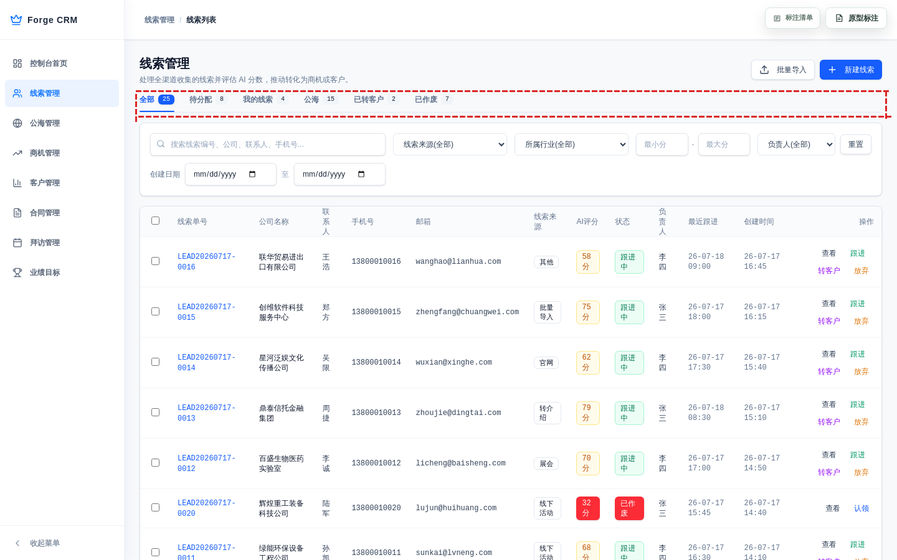 | 页签集合：全部、待分配、我的线索、公海、已转客户、已作废六个，每页签带数量徽章（超99显示99+）。切换页签后刷新列表重置到第1页、不清空其他条件。我的线索仅销售角色可见。 | |
| 线索管理/线索列表-线索筛选 | 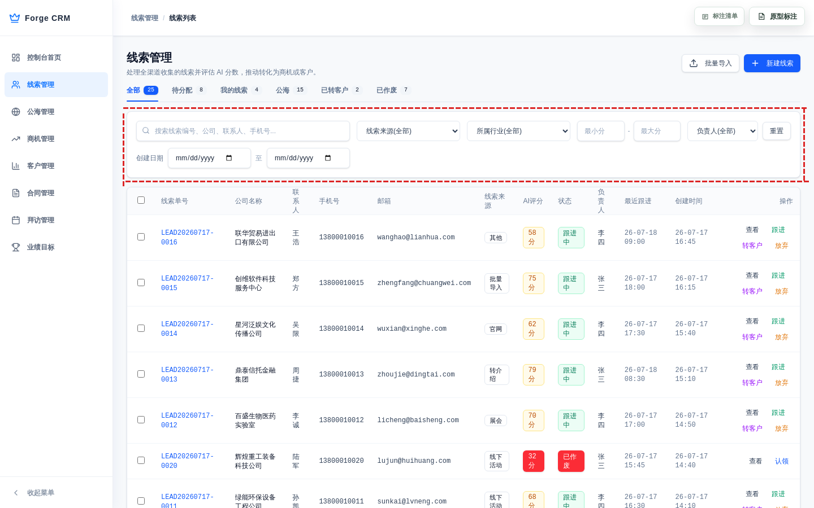 | 桌面端六列栅格筛选项，提供搜索、展开/收起高级筛选、重置。条件作用于当前页签。搜索=按页签+条件刷新回第1页；高级筛选=展开AI评分/负责人/创建时间；重置清空全部。切页签保留查询条件。 | |
| 线索管理/线索列表-新建与导入 | 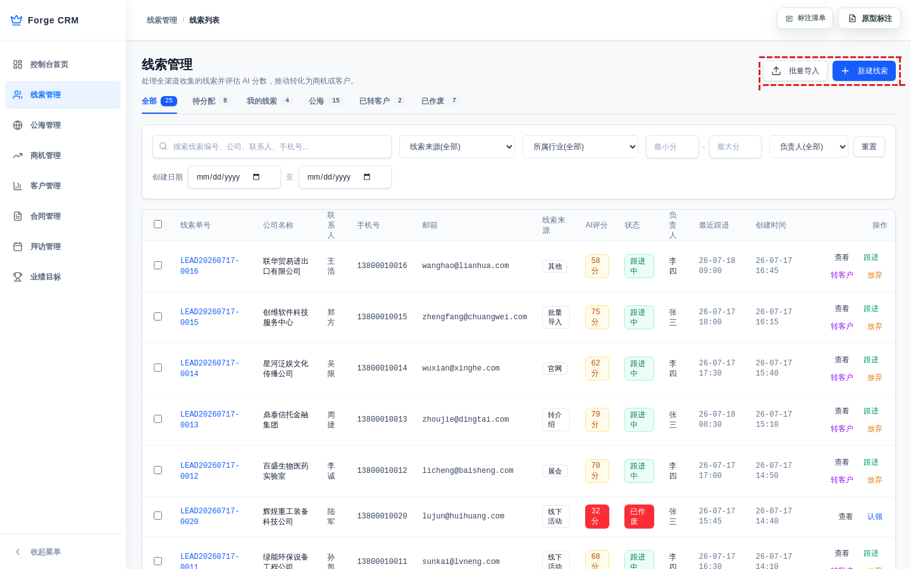 | 新建线索=打开表单录入单条；批量导入=Excel流程批量建；导出=导出当前页签+筛选结果（Excel/CSV）。新建/导入后刷新列表和页签数。 | |
| 线索管理/线索列表-批量作废 | 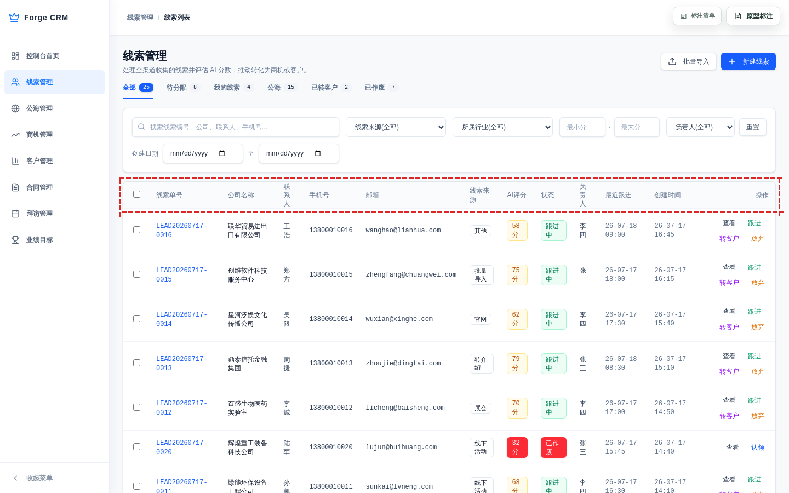 | 勾选多条显示批量作废；销售主管可批量指定负责人（普通销售不显示入口）。工具条显示已选数。二次确认后统一作废、清选择刷新。已转客户不可选作废。 | |
| 线索管理/线索列表-表格字段 | 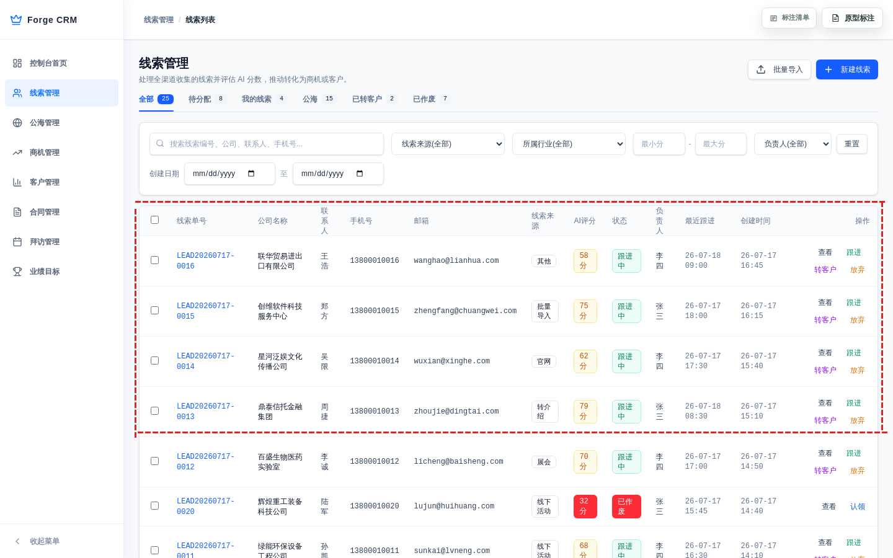 | 表格行展示编号/公司/联系人/来源/行业/AI评分/负责人/状态/创建时间；空数据态提示；分页20/50/100；翻页加载对应分页；按创建时间倒序；列宽可拖；操作列固定右侧。 | |
| 线索管理/线索列表-AI评分 | 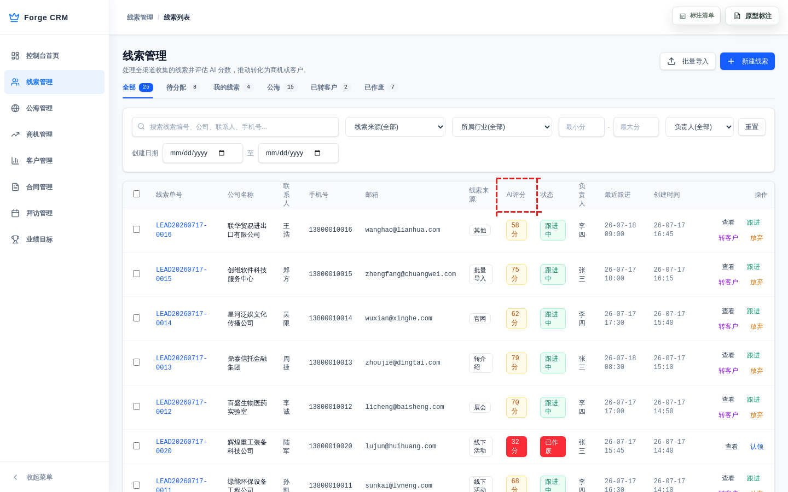 | 评分字段0-100分；由来源/行业/首次响应/历史转化/活跃度加权计算。新建/导入时触发评分。边界：最小≤最大且在0-100，否则阻断查询。 | |
| 线索管理/线索列表-行操作 | 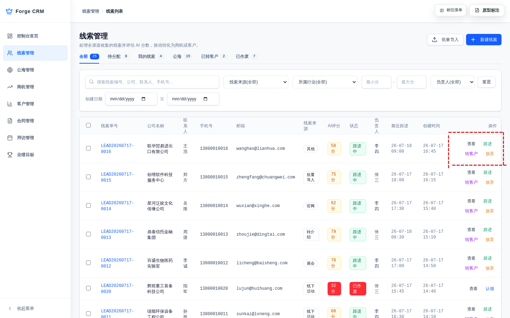 | 每行按状态+权限显示操作：草稿=查看/编辑/删除；待分配=查看/认领；已分配=查看/跟进/放弃；跟进中=查看/跟进/转客户/放弃；已转客户仅查看；已作废按保护期恢复/认领。 | |
| 线索管理/线索列表-权限边界 |  | 管理员看全部；销售看本人+公海；主管看团队+管理动作（批量分配）。操作按角色/负责人/状态显隐；导出按权限范围；并发操作失败提示刷新。 | |

**字段清单**（列表展示关键字段，全量见字段清单详细稿.tsv）：

| 字段名称 | 填写格式 | 是否必填 | 字段来源 | 能不能改 | 字段说明 |
|---------|---------|---------|---------|---------|---------|
| 线索编号 | LEAD{YYYYMMDD}-{序号} | 不适用 | 系统生成 | 只读 | 线索唯一标识 |
| 线索来源 | 下拉选择 | 必填 | 用户填写 | 草稿可改，已分配后锁定 | 官网/活动/展会/转介绍/导入/其他 |
| 公司名称 | 文本，限100字符 | 必填 | 用户填写 | 草稿可改，已分配后锁定 | 线索所属公司 |
| 联系人 | 文本，限50字符 | 选填 | 用户填写 | 草稿可改 | 联系人姓名 |
| 手机号 | 11位数字 | 条件必填 | 用户填写 | 草稿可改，已分配后锁定 | 与邮箱至少填一个；全局去重 |
| 邮箱 | 邮箱格式 | 条件必填 | 用户填写 | 草稿可改，已分配后锁定 | 与手机号至少填一个；全局去重 |
| 所属行业 | 下拉选择 | 选填 | 用户填写 | 草稿可改，已分配后锁定 | 制造业/零售/医疗/金融/IT/其他 |
| AI评分 | 0-100整数 | 不适用 | 系统计算 | 只读 | 评分模型输出 |
| 线索状态 | 枚举值 | 不适用 | 系统生成 | 只读，按钮驱动 | 草稿/待分配/已分配/跟进中/已转客户/已作废 |
| 归属人 | 销售姓名 | 不适用 | 系统生成 | 只读 | 当前负责人 |
| 最近跟进时间 | YYYY-MM-DD HH:mm:ss | 不适用 | 系统生成 | 只读 | 最近一次添加跟进记录时间 |
| 创建时间 | YYYY-MM-DD HH:mm:ss | 不适用 | 系统生成 | 只读 | 录入时间 |

---

### 6.2 线索新增/编辑页

**操作路径**：线索管理 / 线索新增编辑

| 操作路径/功能点 | 原型页面 | 页面说明 | 备注 |
|----------------|------|------|------|
| 线索管理/线索新增编辑-新增编辑页面 |  | 页面名称：线索管理/线索新增编辑，用于创建新线索或维护草稿线索。页面骨架：基本信息表单卡片+固定底部操作栏。新增模式=空白表单可保存草稿或提交；编辑模式=加载已有线索，仅草稿（DRAFT）允许编辑。 | |
| 线索管理/线索新增编辑-基本信息 | 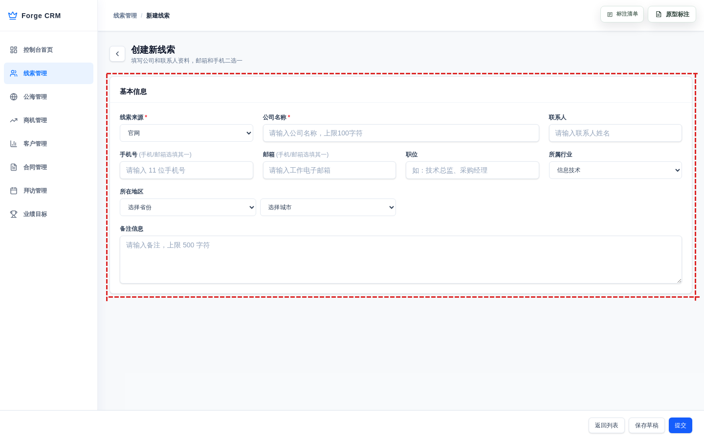 | 线索来源：下拉，记录获客渠道（AI评分输入维度）；公司名称：单行文本上限100字；联系人：上限50字可空；手机号11位/邮箱邮箱格式，二者承担去重；职位上限50字；所属行业下拉（AI评分维度）；所在地区省-市两级；备注多行上限500字。 | |
| 线索管理/线索新增编辑-完整性与去重 | 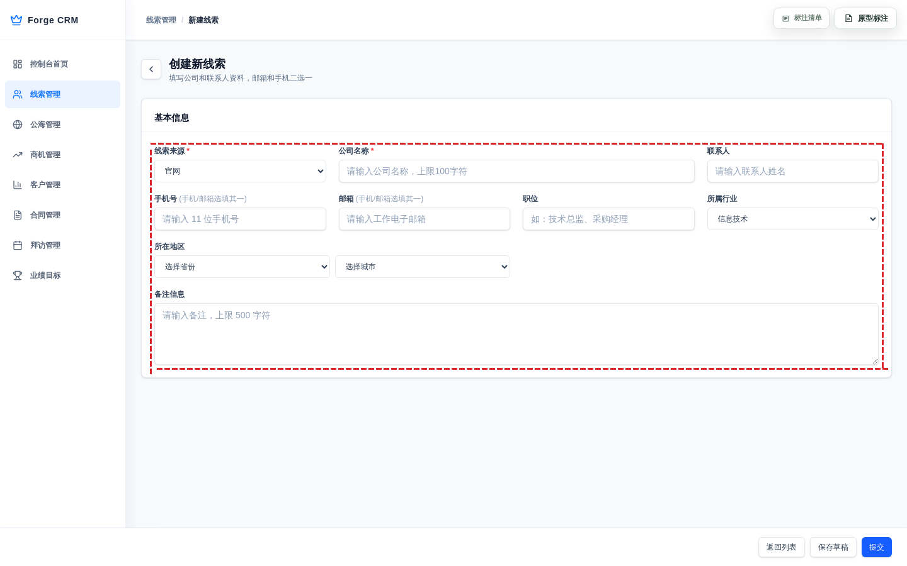 | 校验覆盖必填/条件必填/格式/长度/手机邮箱全局去重；错误字段标红+Toast提示。保存草稿允许暂存未完成但格式错阻断；正式提交先校验完整性再去重，任一不过不落库不评分。手机号邮箱至少填一个；命中任一历史线索阻断并提示冲突。 | |
| 线索管理/线索新增编辑-保存草稿 | 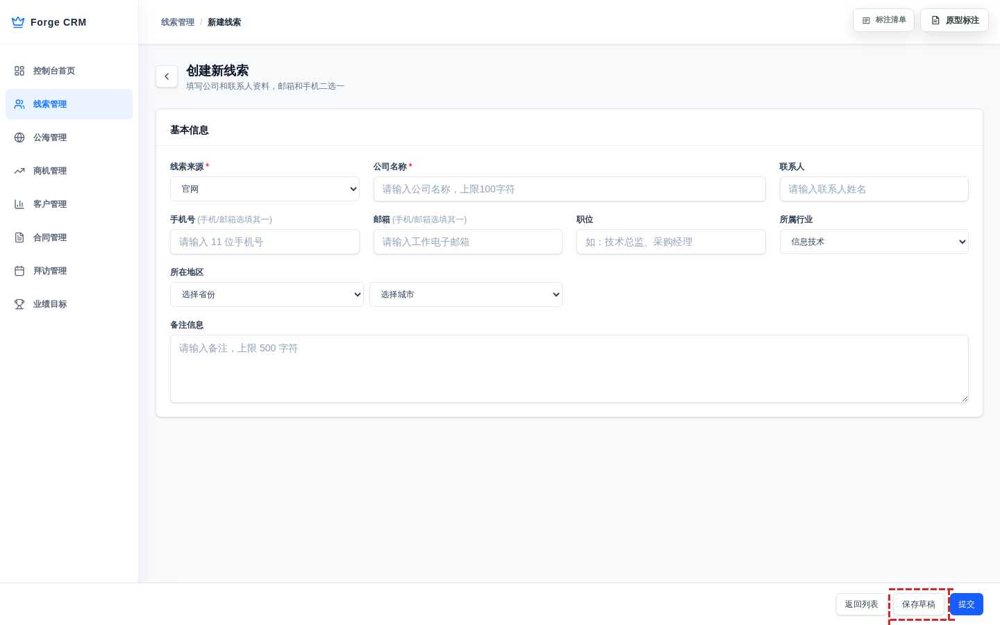 | “保存草稿”是固定底部操作栏次要动作，用于暂存未完成手工录入线索。保存成功状态为草稿（DRAFT）并生成唯一编号；按钮进入处理中防重复；成功提示“草稿已保存”返回列表；失败保留表单重试。草稿不触发AI分流；草稿不可物理删除，需作废草稿留痕。 | |
| 线索管理/线索新增编辑-提交与AI分流 | 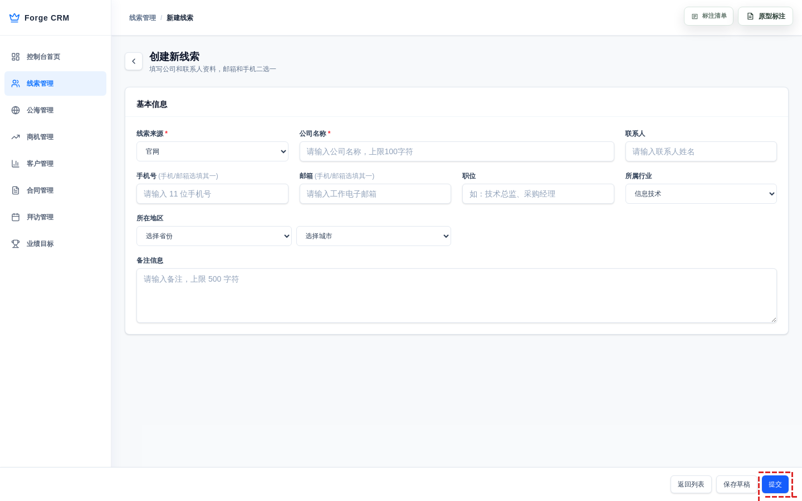 | “提交”是固定底部操作栏主动作，把校验完成的线索送入AI评分和分流。提交后不允许直接编辑状态。流程：先校验必填/格式/去重→通过后保存并触发评分→按钮loading防重复→展示成功及评分分流结果。评分≥80自动分配、50-79进待分配、<50进培育池、失败按50降级。 | |
| 线索管理/线索新增编辑-本页规则 | 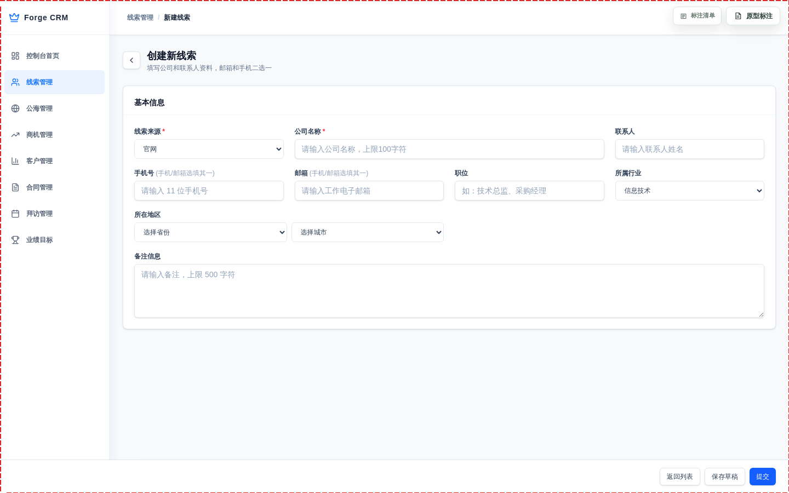 | 页面区分新增/编辑，编辑仅草稿态可编辑；非草稿进入编辑路由只读。返回/保存草稿/提交是跨区域动作。防重复提交：写操作开始后按钮loading/disabled。去重命中任一历史线索阻断；条件必填手机号邮箱至少一个；写操作失败保留已填内容重试。 | |

**字段清单**（表单字段，详见字段清单详细稿.tsv）：

| 字段名称 | 填写格式 | 是否必填 | 字段来源 | 能不能改 | 字段说明 |
|---------|---------|---------|---------|---------|---------|
| 线索来源 | 下拉选择 | 必填 | 用户填写 | 可编辑 | 官网/活动/展会/转介绍/导入/其他 |
| 公司名称 | 文本，限100字符 | 必填 | 用户填写 | 可编辑 | 线索所属公司 |
| 联系人 | 文本，限50字符 | 选填 | 用户填写 | 可编辑 | 联系人姓名 |
| 手机号 | 11位数字 | 条件必填 | 用户填写 | 可编辑 | 与邮箱至少填一个；全局去重 |
| 邮箱 | 邮箱格式 | 条件必填 | 用户填写 | 可编辑 | 与手机号至少填一个；全局去重 |
| 职位 | 文本，限50字符 | 选填 | 用户填写 | 可编辑 | 联系人职位 |
| 所属行业 | 下拉选择 | 选填 | 用户填写 | 可编辑 | 制造业/零售/医疗/金融/IT/其他 |
| 所在地区 | 省-市级联选择 | 选填 | 用户填写 | 可编辑 | 省市两级选择 |
| 线索备注 | 多行文本，限500字符 | 选填 | 用户填写 | 可编辑 | 备注信息 |
---

### 6.3 线索详情页

**操作路径**：线索管理 / 线索详情

| 操作路径/功能点 | 原型页面 | 页面说明 | 备注 |
|----------------|------|------|------|
| 线索管理/线索详情-详情页面 |  | 页面名称：线索管理/线索详情，查看线索完整资料、AI评分、跟进时间线并执行状态动作。页面骨架：顶部标识区、状态区、AI评分卡片、基本信息卡片、跟进记录时间线和固定底部操作栏。 | |
| 线索管理/线索详情-状态归属 | 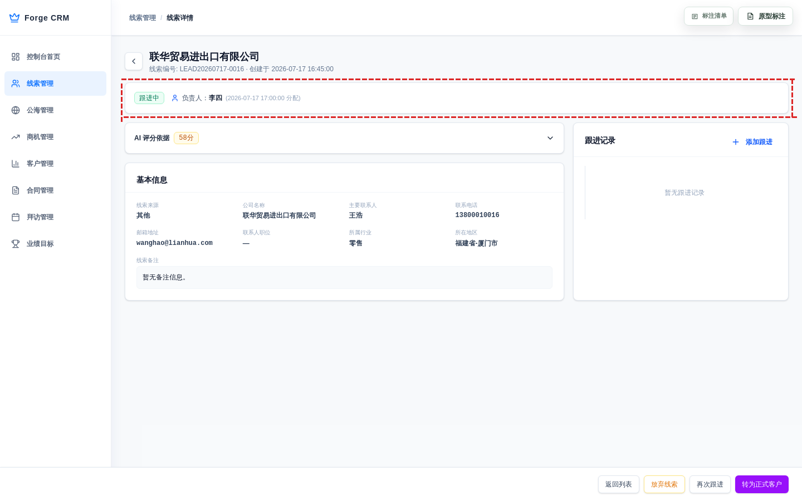 | 状态区展示状态标签、线索编号、归属人、分配时间；状态标签用中文业务颜色。状态只能由动作触发（提交/认领/添加跟进/转客户/主动放弃/作废），不能下拉改。认领后更新归属人和分配时间；主动放弃保留归属人清空分配时间。 | |
| 线索管理/线索详情-AI评分 | 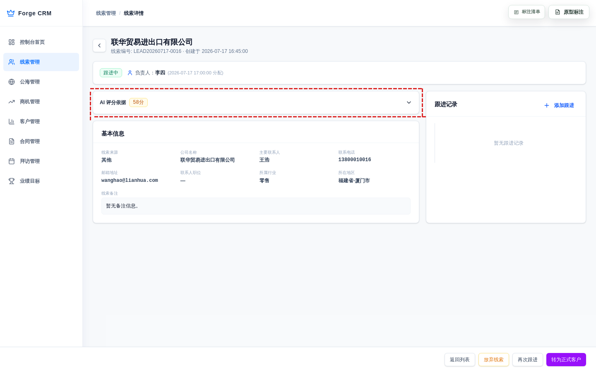 | 评分卡片展示0-100整数，按高/中/低绿黄红区分；展开后展示维度明细（来源/行业/首次响应/历史转化/活跃度）。评分系统计算不可手工改。评分≥80自动分配、50-79进待分配、<50进培育池、接口失败按50降级并记录日志。 | |
| 线索管理/线索详情-基本信息 | 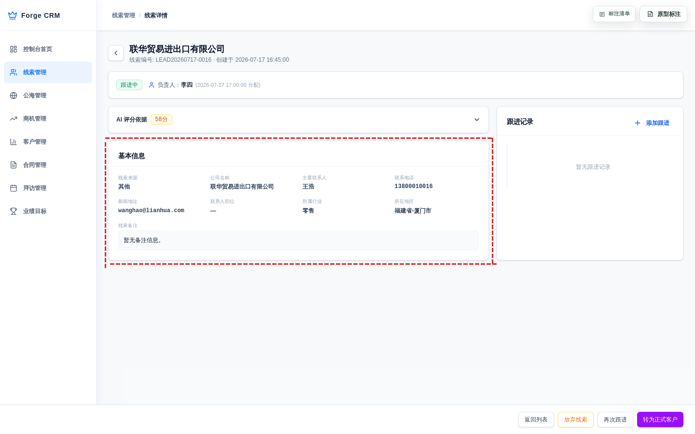 | 基本信息卡片四列Key-Value只读展示来源/公司/联系人/手机号/邮箱/职位/行业/地区/备注；已作废额外展示放弃/作废原因；系统字段展示（创建人/时间/最后修改/转化时间）。草稿需经编辑入口维护，非草稿只读。 | |
| 线索管理/线索详情-跟进时间线 | 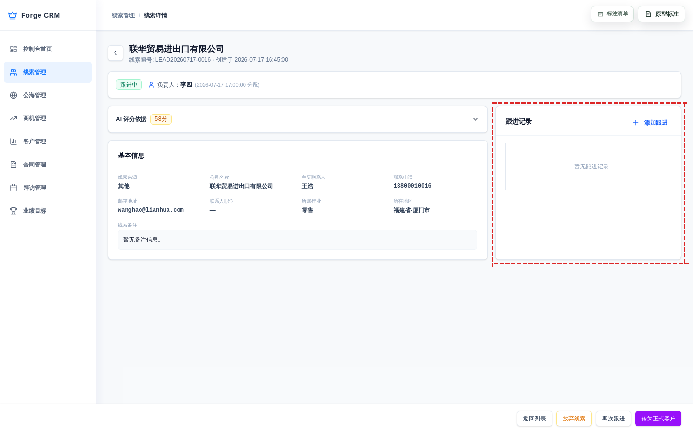 | 跟进记录按时间倒序展示时间/跟进人/方式/内容/下次计划；长内容折叠可展开；无记录显示"暂无跟进记录"。已分配/跟进中显示"添加跟进"入口；首条有效跟进后状态变跟进中。 | |
| 线索管理/线索详情-操作栏 | 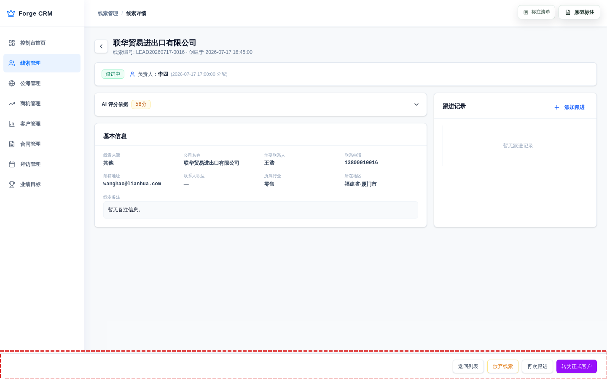 | 固定底部操作栏"返回列表"居左，主操作按状态动态显示居右。操作入口只展示当前状态/业务池/作废类型/权限共同允许的动作。草稿=编辑/提交/作废草稿；待分配=认领；已分配=跟进/放弃；跟进中=跟进/转客户/放弃；已转客户=查看ERP客户；已作废=按类型恢复/认领。 | |
| 线索管理/线索详情-添加跟进弹窗 | 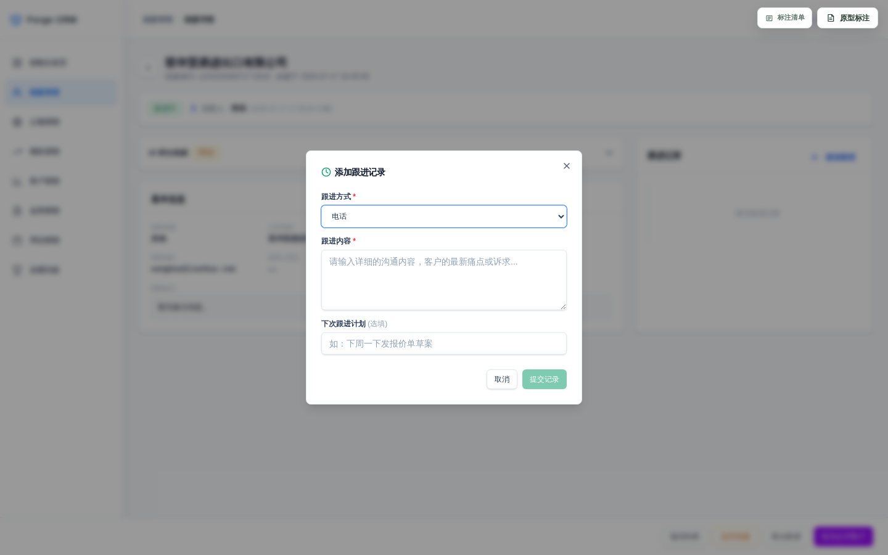 | 弹窗提供跟进方式（必填，电话/拜访/邮件）、跟进内容（必填）、下次跟进计划（选填）。取消关闭弹窗清空未提交；提交后关弹窗刷新时间线+更新最近跟进时间。提交在内容为空时不可用，防重复提交。已分配首条有效跟进后变跟进中。 | |
| 线索管理/线索详情-放弃弹窗 | 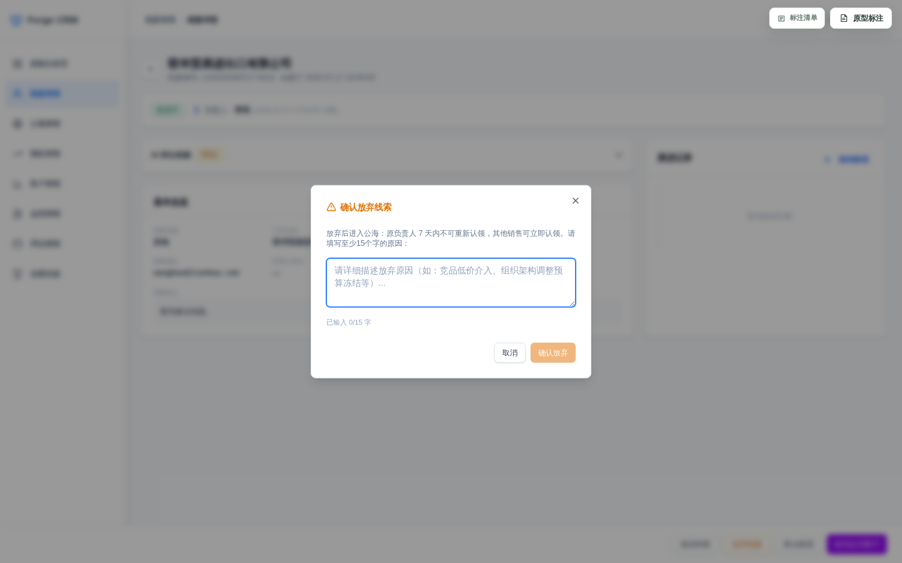 | 弹窗标题"确认放弃线索"，说明放弃后进公海；放弃原因多行文本，为空或不足15字阻断。确认后写原因、更新状态、追加放弃跟进记录。放弃返回已作废，保留归属人清空分配时间；原负责人可立即撤销，其他销售受7天保护。 | |
| 线索管理/线索详情-转客户 |  | 弹窗说明转客户将同步ERP建档、线索只读不可逆，提供取消/确认转客户。仅跟进中显示入口，点击先二次确认。ERP建档成功才改已转客户；失败保持跟进中、不写转化时间、可幂等重试。 | |
| 线索管理/线索详情-草稿作废 | 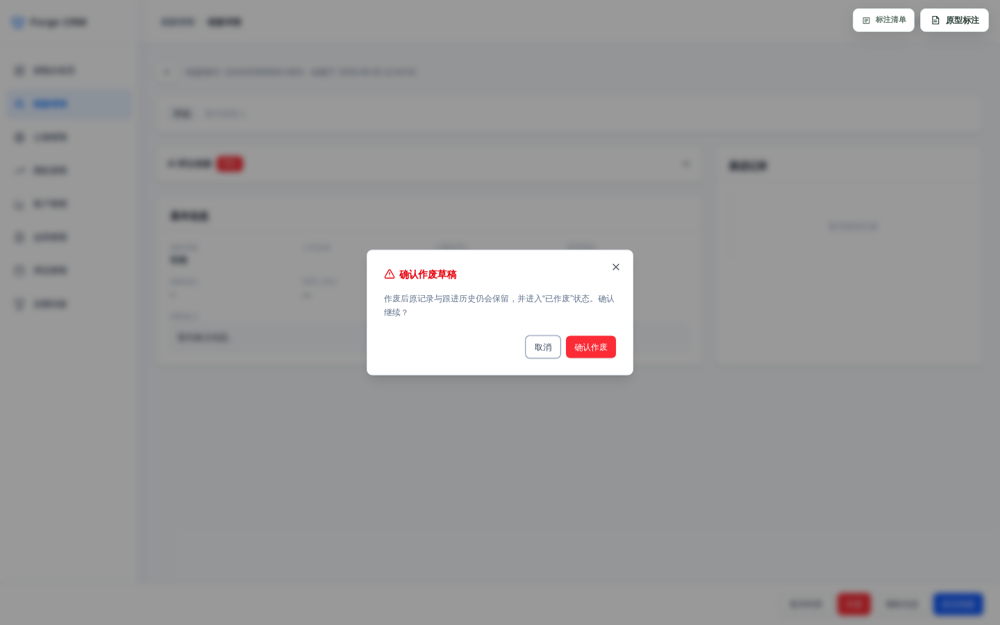 | 草稿状态提供作废草稿入口，二次确认说明保留记录不可编辑。确认后保留线索内容/状态变更记录/操作痕迹。作废由创建人/主管/管理员执行；结果已作废（DRAFT_VOID），替代物理删除，不进公海认领。 | |
| 线索管理/线索详情-本页规则 | 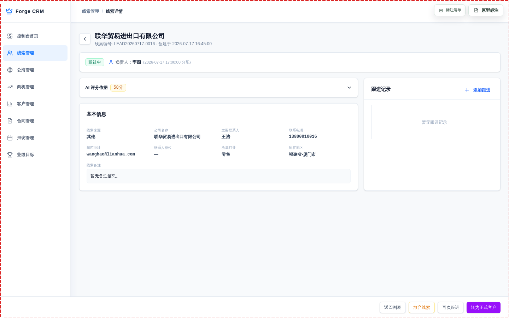 | 详情按状态展示状态区/基本信息/跟进/底部动作，遵循当前用户数据权限。准入：角色+负责人+状态共同决定可见动作。终态保护：已转客户只读。防重复提交，写操作按钮锁定。并发失败提示已被他人处理并刷新。 | |

**字段清单**（详情展示，含分配/跟进/系统字段，详见字段清单详细稿.tsv）：

| 字段 | 必填/可编辑 | 核心约束 |
| 字段名称 | 填写格式 | 是否必填 | 字段来源 | 能不能改 | 字段说明 |
|---------|---------|---------|---------|---------|---------|
| 线索编号 | LEAD{YYYYMMDD}-{序号} | 不适用 | 系统生成 | 只读 | 线索唯一标识 |
| 线索来源 | 下拉选择 | 必填 | 用户填写 | 只读（详情） | 官网/活动/展会/转介绍/导入/其他 |
| 公司名称 | 文本，限100字符 | 必填 | 用户填写 | 只读（详情） | 线索所属公司 |
| 联系人 | 文本，限50字符 | 选填 | 用户填写 | 只读（详情） | 联系人姓名 |
| 手机号 | 11位数字 | 条件必填 | 用户填写 | 只读（详情） | 与邮箱至少填一个；全局去重 |
| 邮箱 | 邮箱格式 | 条件必填 | 用户填写 | 只读（详情） | 与手机号至少填一个；全局去重 |
| 所属行业 | 下拉选择 | 选填 | 用户填写 | 只读（详情） | 制造业/零售/医疗/金融/IT/其他 |
| AI评分 | 0-100整数 | 不适用 | 系统计算 | 只读 | 评分模型输出 |
| 线索状态 | 枚举值 | 不适用 | 系统生成 | 只读，按钮驱动 | 草稿/待分配/已分配/跟进中/已转客户/已作废 |
| 归属人 | 销售姓名 | 不适用 | 系统生成 | 只读 | 当前负责人 |
| 分配时间 | YYYY-MM-DD HH:mm:ss | 不适用 | 系统生成 | 只读 | 最近一次分配时间 |
| 最近跟进时间 | YYYY-MM-DD HH:mm:ss | 不适用 | 系统生成 | 只读 | 最近一次跟进记录时间 |
| 放弃原因 | 多行文本，至少15字 | 条件必填 | 用户填写 | 放弃时填写 | 放弃理由 |
| 创建时间 | YYYY-MM-DD HH:mm:ss | 不适用 | 系统生成 | 只读 | 录入时间 |
| 转化时间 | YYYY-MM-DD HH:mm:ss | 不适用 | 系统生成 | 只读 | 转客户时写入 |

## 七、给谁的权限

> 本模块需求分析中明确区分了角色所看范围，需要页面做角色控制，故写；系统未实现 RBAC，靠页面控制。

- **管理员**：看重全部线索 + 全部销售数据
- **销售**：只看本人线索 + 符合条件的公海线索
- **主管**：看团队线索，可做团队范围的管理动作(批量分配)
- **导出**：销售只导本人可见，主管导团队，管理员导全量
- 认领/转客户等竞争操作失败提示已被他人处理

## 八、怎么验收

| 验收项 | 操作 | 预期 |
|--------|------|------|
| V01 | 对已转客户线索点"作废" | 入口不展示 |
| V02 | 新建时手机邮箱都留空提交 | 阻断，提示至少填一个 |
| V03 | 输入重复手机号提交 | 阻断，提示冲突线索 |
| V04 | 已分配无跟进线索放48h | 状态自动回待分配 |
| V05 | 放弃原因只写5个字 | 阻断，提示至少15字 |
| V06 | 最小评分80、最大评分20 | 阻断查询，提示 |
| V07 | 30条满的销售再认领 | 阻断，提示上限 |
| V08 | 转客户时ERP断开 | 保留跟进中，提示重试 |
| V09 | 已分配线索点编辑 | 来源/公司/手机号锁定，仅备注可改 |
| V10 | 查询区填关键词+来源+行业 | 三条件同时满足才显示结果 |
| V11 | 点导出 | 下载当前筛选结果Excel，列表状态不变 |
| V12 | 草稿线索点作废 | 二次确认，保留记录，不进公海 |

---

## 待确认 / 评审记录

- 待确认1：修改线索是否触发重新评分？（影响评分字段变了是否重算）
- 待确认2：详情页草稿作废按钮，原型文案为"删除"，PRD定义为"作废草稿"——业务文案是否统一待确认
- （评审时填：评审人拍板的问题、裁决）

## 变更台账

| 日期 | 改了啥 | 回写目标 | 回写完成？ |
|------|--------|---------|:---:|
| 2026-09-25 | 评审PRD v0.3：三页结构(列表/新增/详情)每页截图+五维搬运稿，内容自原型标注 | 主PRD/字段清单待回写 | 否 |