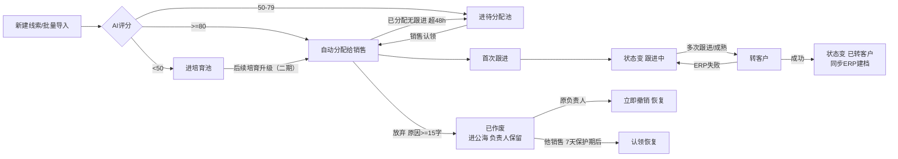
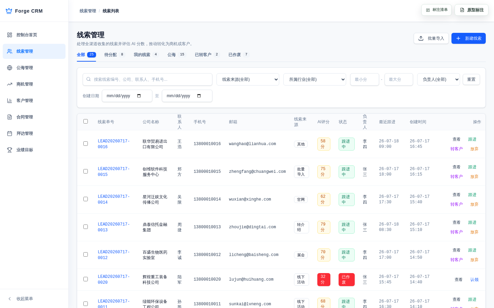
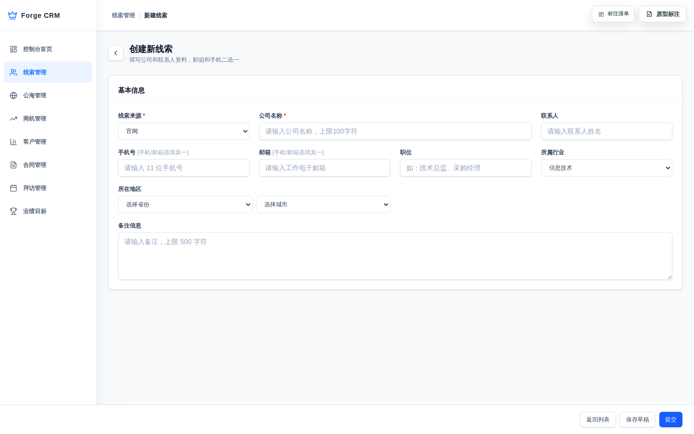
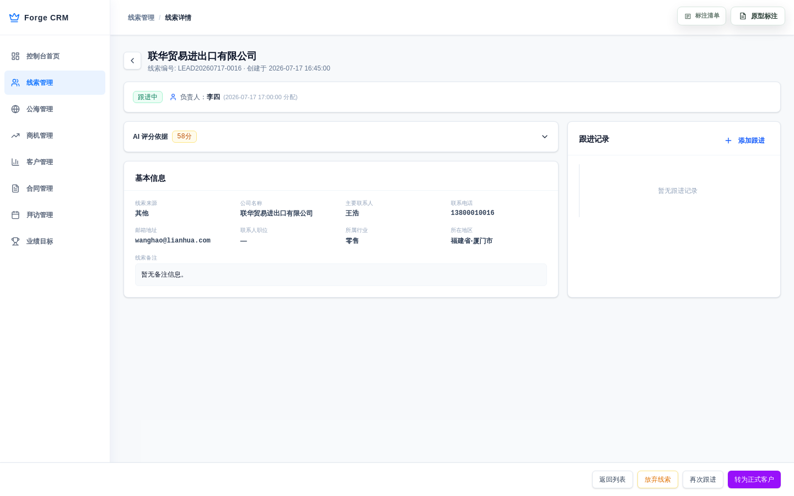

# 线索管理评审PRD

> **文档定位**：评审用完整档，评审人读本件即可审，开发直接按本件工作，不用切换多份PRD。
> **业务事实以「线索字段清单（详细稿）.tsv」和「线索主PRD.md」为准**，本件是评审工作入口，不是第四权威源。
> **内容来源**：本件"页面和操作"章节由原型标注搬运整理而成，截图与标注一一对应；修改请回写权威源。
> **版本**：V0.3 | 评审状态：待评审

---

## 一、做哪些（本期范围内）/ 不做哪些（后续再做）

- **做**：管理线索从创建到转客户的全过程——新增、修改、查询筛选、导出、认领、跟进、放弃、作废、批量导入、AI评分分流。
- **不做**：线索自动营销推送、客户深度画像（二期）；移动端功能。

## 二、功能清单

| 功能 | 一句话说清 | 本期？ |
|------|-----------|:---:|
| 新增线索 | 录入新线索，进 AI 评分分流 | ✅ |
| 修改线索 | 编辑本人名下配套线索的信息 | ✅ |
| 批量导入 | Excel 一次建多条线索，逐条评分 | ✅ |
| 查询筛选 | 按来源/行业/评分/负责人/创建时间筛列表 | ✅ |
| 状态页签 | 全部/待分配/我的/公海/已转客户/已作废 | ✅ |
| 认领 | 销售把待分配/公海线索领到自己名下 | ✅ |
| 跟进 | 记录跟进，首次跟进后状态变"跟进中" | ✅ |
| 放弃 | 说明原因后放弃，进公海可被他人认领 | ✅ |
| 批量作废 | 选中多条一次作废（已转客户除外） | ✅ |
| 转客户 | 完成转客户后状态变"已转客户" | ✅ |
| 导出 | 按当前筛选结果导出 Excel/CSV | ✅ |

## 三、主要流程（含业务流程图）



**主流程（文字版）**：新建/导入 → AI评分分流 → 销售认领 → 首次跟进(变跟进中) → 多次跟进 → 转客户(同步ERP)。

**关键分支**：
- 高分(≥80)自动分配；中分进待分配；低分进培育池
- 认领后：可跟进、可放弃；放弃进公海他人可认领
- 已分配且无跟进超48小时 → 自动回收回待分配
- 转客户写ERP失败 → 保留原状态，可重试

## 四、状态怎么流转

状态在 草稿/待分配/已分配/跟进中/已转客户/已作废 之间变，由动作驱动：

```
草稿 →（提交）待分配 →（认领）已分配 →（首次跟进）跟进中 →（转客户）已转客户
        ↕                        ↘（放弃）已作废（进公海，负责保留，可立即撤销）
                                 （超48h无跟进，自动回收→待分配）
```

- 状态**只能靠动作按钮变**，不许直接在列表改
- 已转客户只能查看，不能作废
- 已作废原负责人可立即撤销；其他销售须等7天保护期后才能认领

**各状态含义**：

| 状态 | 含义 |
|------|------|
| 草稿 | 手动录入暂存，允许继续编辑 |
| 待分配 | 等待分配，或处于培育池的统一状态 |
| 已分配 | 已有归属销售，尚未完成首次有效跟进 |
| 跟进中 | 已完成首次有效跟进，可继续跟进或转客户 |
| 已转客户 | ERP建档成功后的不可逆只读终态 |
| 已作废 | 作废或主动放弃，是否进公海取决于作废类型 |

## 五、业务规则

### 5.1 创建与提交

| 编号 | 什么情况下 | 结果 |
|------|-----------|------|
| R01 | 公司名称或线索来源没填 | 阻止新建，提示必填 |
| R02 | 手机号和邮箱都没填 | 阻止保存，提示"手机号和邮箱至少填写一个" |
| R03 | 手机号/邮箱和别的线索重复 | 阻止创建，提示冲突编号及当前负责人 |
| R04 | 草稿保存 | 字段格式错误阻断；不触发AI评分 |
| R05 | 正式提交 | 先校验完整性，再校验去重，任一不过不落库不评分 |

### 5.2 AI评分与分流

| 编号 | 什么情况下 | 结果 |
|------|-----------|------|
| R06 | AI评分 ≥80 | 自动分配给销售，状态已分配 |
| R07 | AI评分 50-79 | 进待分配池，状态待分配 |
| R08 | AI评分 <50 | 进培育池，状态仍待分配 |
| R09 | 评分失败/超时 | 按50分降级进待分配，记录失败日志，不阻断提交 |

**评分权重**：来源15% / 行业20% / 首次响应25% / 历史转化25% / 活跃度15%

### 5.3 认领/跟进/放弃

| 编号 | 什么情况下 | 结果 |
|------|-----------|------|
| R10 | 已分配且无跟进记录超48小时 | 自动回收回待分配，空出负责人 |
| R11 | 放弃原因少于15字 | 阻断，提示"放弃原因至少15字" |
| R12 | 销售名下已分配+跟进中达30条 | 不许继续认领 |
| R13 | 首条有效跟进后 | 状态由已分配变跟进中 |

### 5.4 转客户

| 编号 | 什么情况下 | 结果 |
|------|-----------|------|
| R14 | 转客户写ERP失败 | 保留原状态（跟进中），不写转化时间，可重试 |
| R15 | 已转客户 | 不可逆只读终态，不能再编辑/跟进/放弃/转客户 |
| R16 | 转客户请求 | 需幂等，重试不重复建档 |

### 5.5 作废/放弃与公海

| 编号 | 什么情况下 | 结果 |
|------|-----------|------|
| R17 | 销售主动放弃 | 状态已作废；保留归属人、清空分配时间；进公海 |
| R18 | 原负责人撤销放弃 | 立即恢复为已分配 |
| R19 | 其他销售认领 | 须等7天保护期后 |
| R20 | 草稿作废 | 替代物理删除，保留记录，不进公海认领范围 |

### 5.6 其他边界

| 编号 | 什么情况下 | 结果 |
|------|-----------|------|
| R21 | 最小评分>最大评分，或超出0-100 | 阻断查询提示 |
| R22 | 写操作重复点击 | 防重复提交，不产生重复业务结果 |

---

## 六、页面和操作

> 三页结构，每页配真实原型截图 + 对应原型标注搬运稿件（功能点/业务关系/字段清单/交互规则/业务规则）。

### 6.1 线索列表页



**功能点**：
- 分状态页签筛选（全部/待分配/我的线索/公海/已转客户/已作废，带数量徽章）
- 查询区多条件组合筛选（关键词/来源/行业/评分区间/负责人/创建时间）
- 表格展示线索（编号/公司/联系人/来源/行业/评分/负责人/状态/创建时间）
- 行操作（查看/编辑/跟进/转客户/放弃，按状态显示）
- 新建线索、批量导入、批量作废、导出
- 列宽拖拽、分页（20/50/100）、按创建时间倒序

**业务关系**：
- 列表是线索管理入口，数据来自线索对象（CRM持有）
- 公海是待分配线索的共享视图，不是独立主数据
- 转客户成功后客户档案以ERP为权威来源

**字段清单**（列表展示的关键字段，全量见字段清单详细稿.tsv）：

| 字段 | 填什么 | 哪来的 | 能不能改 |
|------|--------|--------|---------|
| 线索编号 | — | 系统生成 LEAD{日期}-{序号} | 只读 |
| 线索来源 | 官网/活动/展会/转介绍/导入/其他 | 用户选 | 已分配后锁定 |
| 公司名称 | 所属公司 | 用户填 | 改：上限100字 |
| 联系人 | 联系人姓名 | 用户填 | 改：上限50字 |
| 手机号 | 11位数字 | 用户填 | 已分配后锁定；全局去重 |
| 邮箱 | 邮箱格式 | 用户填 | 已分配后锁定；全局去重 |
| 所属行业 | 制造业/零售/…/其他 | 用户选 | 已分配后锁定 |
| AI评分 | 0-100 | 系统算 | 只读 |
| 线索状态 | 见第四章 | 系统生成 | 只读，按钮驱动 |
| 归属人 | 负责销售 | 系统生成 | 只读 |
| 最近跟进时间 | 最近一次跟进时刻 | 系统生成 | 只读 |
| 创建时间 | 录入时间 | 系统生成 | 只读 |

**交互规则**：
- 页签切换：切换后刷新列表回第1页，保留已有查询条件
- 查询按钮：搜索=按当前页签+条件刷新回第1页；重置=清空条件；展开/收起=高级条件
- 关键词支持逗号分隔多个值，任一命中即保留
- 列宽可拖拽，操作列固定右侧，横向滚动可见

**业务规则**：
- 多条件同时满足才显示（且关系）
- 权限过滤：只展示当前角色/负责人可查看的线索
- 评分筛选边界：最小≤最大且在0-100，否则阻断

---

### 6.2 线索新增/编辑页



**功能点**：
- 新增模式：空白表单，填完可保存草稿或提交
- 编辑模式：加载已有线索，仅草稿态可编辑
- 三个动作：返回列表 / 保存草稿 / 提交
- 字段：来源/公司/联系人/手机号/邮箱/职位/行业/地区/备注

**业务关系**：
- 新增/编辑是线索对象的录入维护入口
- 提交后进入AI评分分流（见5.2）
- 转客户后客户档案权威来源是ERP，线索本身由CRM管

**字段清单**（表单字段，详见字段清单详细稿.tsv）：

| 字段 | 填什么 | 哪来的 | 能不能改 |
|------|--------|--------|---------|
| 线索来源 | 见6.1 | 用户选 | 必填；正式提交要求 |
| 公司名称 | 属公司 | 用户填 | 必填；上限100字 |
| 联系人 | 联系人姓名 | 用户填 | 选填；上限50字 |
| 手机号 | 11位数字 | 用户填 | 条件必填；全局去重 |
| 邮箱 | 邮箱格式 | 用户填 | 条件必填；全局去重 |
| 职位 | 联系人职位 | 用户填 | 选填；上限50字 |
| 所属行业 | 见6.1 | 用户选 | 选填 |
| 所在地区 | 省-市两级 | 用户选 | 选填；级联 |
| 线索备注 | 补充说明 | 用户填 | 选填；上限500字 |

**交互规则**：
- 保存草稿：允许暂存未完成，字段格式错误阻断；保存成功回列表
- 提交：先校验完整性再校验去重，通过后评分分流；失败保留表单内容
- 手机号/邮箱失焦各自校验，错误标红
- 先选省再加载市，切换省清空原市
- 防重复提交：操作中按钮loading/disabled
- 编辑非草稿线索：进入只读，提示已提交

**业务规则**：
- 手机号与邮箱至少填一个，都空阻断
- 去重规则：命中任一历史线索（含草稿/待分配/跟进中/已转客户/已作废）都阻断，提示冲突
- 公司/来源为正式提交必填；草稿允许暂存
- 首字段错误自动获得焦点

---

### 6.3 线索详情页



**功能点**：
- 展示线索完整资料：状态区、AI评分卡片、基本信息、跟进时间线
- 按状态显示底部操作栏（编辑/认领/跟进/转客户/放弃/查看关联ERP客户）
- AI评分权重拆解（可展开）
- 添加跟进记录弹窗、放弃确认弹窗、转客户确认弹窗、草稿作废弹窗

**业务关系**：
- 详情是线索全生命周期状态与动作的执行点
- 转客户联动ERP建档；客户正式档案ERP为权威
- 跟进/放弃/作废产生线索操作痕迹，一并进时间线

**字段清单**（详情展示，含分配/跟进/系统字段，详见字段清单详细稿.tsv）：

| 字段 | 必填/可编辑 | 核心约束 |
|------|-------------|---------|
| 线索编号 | 系统生成；只读 | LEAD{YYYYMMDD}-{序号} |
| AI评分 | 系统自动；只读 | 0-100；≥80绿、50-79黄、<50红 |
| 线索状态 | 系统生成；只读 | 由状态机和动作按钮驱动 |
| 归属人 | 系统生成；只读 | 分配时写入；超时回收清空；主动放弃保留 |
| 分配时间 | 系统生成；只读 | 分配/认领写入；主动放弃清空 |
| 放弃原因 | 放弃时必填 | 多行文本，至少15字 |
| 跟进方式 | 必填；提交时可编辑 | 电话、拜访、邮件 |
| 跟进内容 | 必填；提交时可编辑 | 沟通内容、痛点或诉求 |
| 下次跟进计划 | 选填；提交时可编辑 | 下一步安排 |
| 转化时间 | ERP建档成功后写入 | 只读 |
| 客户编码 | ERP建档后返回 | 用于关联客户 |

**交互规则**：
- 详情页只通过动作按钮触发状态流转，不直接编辑状态字段
- 按状态显示操作栏：草稿→编辑/提交/作废草稿；待分配→认领；已分配→跟进/放弃；跟进中→跟进/转客户/放弃；已转客户→查看ERP客户；已作废→按类型恢复/认领
- 添加跟进弹窗：跟进方式/内容必填；取消清空未提交内容
- 放弃弹窗：二次确认，写原因≥15字，成功后追加放弃跟进记录
- 转客户弹窗：二次确认，ERP建档成功才关弹窗并更新状态
- 防重复提交：写操作提交后按钮锁定

**业务规则**：
- 财报边界：详情展示CRM线索信息+客户快照，不替代ERP主数据
- 转客户强一致：只有ERP返回成功+客户编码，才改已转客户；失败保持跟进中，不写转化时间，幂等重试
- 已转客户只读终态，普通销售/主管不能改基础信息
- 竞争操作失败提示已被他人处理，刷新详情重试

---

## 七、给谁的权限

> 本模块需求分析中明确区分了角色所看范围，需要页面做角色控制，故写；系统未实现 RBAC，靠页面控制。

- **管理员**：看重全部线索 + 全部销售数据
- **销售**：只看本人线索 + 符合条件的公海线索
- **主管**：看团队线索，可做团队范围的管理动作(批量分配)
- **导出**：销售只导本人可见，主管导团队，管理员导全量
- 认领/转客户等竞争操作失败提示已被他人处理

## 八、怎么验收

| 验收项 | 操作 | 预期 |
|--------|------|------|
| V01 | 对已转客户线索点"作废" | 入口不展示 |
| V02 | 新建时手机邮箱都留空提交 | 阻断，提示至少填一个 |
| V03 | 输入重复手机号提交 | 阻断，提示冲突线索 |
| V04 | 已分配无跟进线索放48h | 状态自动回待分配 |
| V05 | 放弃原因只写5个字 | 阻断，提示至少15字 |
| V06 | 最小评分80、最大评分20 | 阻断查询，提示 |
| V07 | 30条满的销售再认领 | 阻断，提示上限 |
| V08 | 转客户时ERP断开 | 保留跟进中，提示重试 |
| V09 | 已分配线索点编辑 | 来源/公司/手机号锁定，仅备注可改 |
| V10 | 查询区填关键词+来源+行业 | 三条件同时满足才显示结果 |
| V11 | 点导出 | 下载当前筛选结果Excel，列表状态不变 |
| V12 | 草稿线索点作废 | 二次确认，保留记录，不进公海 |

---

## 待确认 / 评审记录

- 待确认1：修改线索是否触发重新评分？（影响评分字段变了是否重算）
- 待确认2：详情页草稿作废按钮，原型文案为"删除"，PRD定义为"作废草稿"——业务文案是否统一待确认
- （评审时填：评审人拍板的问题、裁决）

## 变更台账

| 日期 | 改了啥 | 回写目标 | 回写完成？ |
|------|--------|---------|:---:|
| 2026-09-25 | 评审PRD v0.3：三页结构(列表/新增/详情)每页截图+五维搬运稿，内容自原型标注 | 主PRD/字段清单待回写 | 否 |