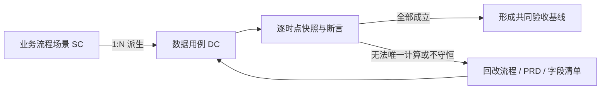

# [模块名]业务场景数据推演

> **版本**：V1.0
> **更新时间**：YYYY-MM-DD
> **文档状态**：探索中 / 待复验 / 可作为共同验收基线
> **适用范围**：需要用固定 SKU、数量、库存、金额或状态验证复杂业务规则的单据、跨系统流程和数据处理场景
> **层级定位**：实例验证层。本文从已编号的业务流程场景派生，通过固定输入、逐时点快照、公式和断言验证正式规则。本文不得新增业务状态、字段或处理规则；无法闭环时，应先修正业务流程推演、业务PRD或字段清单，再重新验算。

---

## 0. 使用规则

### 0.1 前置条件

正式编写前至少具备以下输入：

| 输入 | 最低要求 | 本文如何引用 |
| :--- | :--- | :--- |
| 业务流程推演 | 已有初稿，场景已分配稳定的`SC-`编号 | 每个数据用例引用一个来源场景及文档版本 |
| 业务规则 | 关键状态、数量、金额、库存、回写和异常口径已有依据 | 优先引用业务PRD的`R-`编号；PRD未形成时引用流程章节 |
| 字段清单 | 至少有粗纲，关键对象、字段名称和含义可识别 | 只使用正式字段名，不在本文重定义类型和枚举 |
| 业务边界 | 本期做什么、不做什么已明确 | 排除项写入覆盖矩阵，不擅自补规则 |

没有业务流程初稿时，可以先做探索性算例帮助发现问题，但文件必须标记“探索中”，且不得作为研发、测试或验收依据。

存量业务流程尚无`SC-`编号时，应先回到流程文档补充稳定场景ID，再编写正式数据用例；不得只在本文临时给上游场景编号。

| 文档状态 | 使用条件 | 是否可用于验收 |
| :--- | :--- | :---: |
| 探索中 | 上游规则仍在形成，算例仅用于暴露问题 | 否 |
| 待复验 | 上游规则/字段已变化，或仍有影响结果的待确认问题 | 否 |
| 可作为共同验收基线 | 全部P0用例通过，且无影响结果的未闭环问题 | 是 |

### 0.2 与业务流程推演的上下游关系



| 规则 | 要求 |
| :--- | :--- |
| 上游优先 | 先形成业务流程初稿，再形成正式数据推演 |
| 一对多 | 一个`SC-`场景可以派生多个`DC-`数据用例，分别验证正常值和边界值 |
| 不反向发明 | 数据用例不得为了“算通”自行增加字段、状态、单据或处理分支 |
| 发现问题回改 | 算不通时记录问题，回到权威文档修改并评审，再按新版本重跑受影响用例 |
| 结论可复现 | 相同的输入、规则版本和计算精度必须得到相同结果 |

### 0.3 何时需要单独输出本文

命中以下任一项时建议输出：

- 数量、金额或库存跨 3 个及以上对象变化。
- 同时存在预占、在途、累计完成、剩余可处理、缺量等多个数量口径。
- 行级 0 与整单 0、部分成功与整体失败、超量与重复回传的结果不同。
- 存在拆分、合并、分摊、寻源、FIFO、舍入或尾差。
- 存在跨组织、跨仓、镜像单据或多系统回写。
- 研发、测试、联调和前端 Mock 需要共用一组可计算的验收数据。

简单 CRUD、纯查询或无状态链的配置维护不需要单独输出本文。

### 0.4 文档职责边界

| 本文负责 | 本文不负责 |
| :--- | :--- |
| 固定共同基线、输入事件和每个用例的重置方式 | 定义新业务场景或替代业务流程推演 |
| 展示对象、状态、数量、金额、库存的逐时点变化 | 重定义字段类型、枚举、必填性和页面展隐 |
| 用公式、守恒关系和断言判断规则是否成立 | 描述页面布局、控件、Toast或技术实现 |
| 覆盖正常值、边界值、失败、重复和恢复结果 | 直接把示例值当成生产默认值或系统配置 |
| 为研发、测试、联调和Mock提供共同数据基线 | 替代测试步骤、环境准备和自动化测试脚本 |

---

## 1. 推演目标与依据

### 1.1 验证目标

| 维度 | 内容 |
| :--- | :--- |
| 核心问题 | [本次要用数据证明什么] |
| 验证对象 | [涉及的业务单、通知单、结果单、库存、资金或外部对象] |
| 关键口径 | [申请数量、通知数量、实际数量、累计数量、金额、库存等] |
| 成功标准 | [所有用例满足哪些状态、数量、金额和追溯断言] |
| 本期排除 | [明确不验证的业务类型、组织、计算或异常] |

### 1.2 引用基线

| 文档 | 文件/章节 | 版本/更新时间 | 本文引用内容 |
| :--- | :--- | :--- | :--- |
| 业务流程推演 | [文件名 + SC场景ID] | [版本] | [处理顺序、状态、异常] |
| 业务PRD | [文件名 + R规则ID] | [版本] | [正式业务规则] |
| 字段清单 | [文件名] | [成熟度/版本] | [字段名称、枚举、精度] |
| 全局规范 | [文件名 + 章节] | [版本/日期] | [三层单据、金额、库存等规则] |

> 引用文档发生规则性变更后，本文结论自动视为“待复验”，不得继续沿用原通过结论。

---

## 2. 共同基线数据

### 2.1 组织、仓库与业务主体

| 维度 | 示例值 | 说明 |
| :--- | :--- | :--- |
| 业务组织 | `[ORG001 示例组织]` | [承担什么业务职责] |
| 库存组织 | `[INV001 示例库存组织]` | [库存归属] |
| 来源仓/项目 | `[LW001 示例来源仓]` / `[项目A]` | [来源位置与业务属性] |
| 目标仓/项目 | `[LW002 示例目标仓]` / `[项目B]` | [目标位置与业务属性] |
| 外部系统 | `[WMS/SRM/POS等]` | [参与环节] |
| 币种/税率 | `[CNY]` / `[13%]` | 不涉及金额时删除 |
| 数量与金额精度 | [数量N位；单价N位；金额N位] | 必须与字段清单或全局规范一致 |

所有名称、编码和业务数据使用虚构值；单号格式遵循项目规则，但不得复制真实生产数据。

### 2.2 商品与初始快照

| SKU | 商品 | 初始业务数量 | 来源库存快照 | 在途库存快照 | 目标库存快照 | 含税单价 | 说明 |
| :--- | :--- | ---: | :--- | :--- | :--- | ---: | :--- |
| SKU-A | [示例商品A] | [N] | [总/可用/预占] | [总/可用] | [总/可用] | [N.NN] | [说明] |
| SKU-B | [示例商品B] | [N] | [总/可用/预占] | [总/可用] | [总/可用] | [N.NN] | [说明] |

必须在表头或说明中定义每种快照的顺序和含义，禁止仅写`500/400/100`而不说明各数字分别代表什么。

### 2.3 用例重置规则

默认每个数据用例独立执行，并从§2的共同基线重新开始；前一个用例的期末数据不带入后一个用例。

若必须连续验证多阶段过程，需在用例元信息中标记“链式用例”，明确引用前置`DC-`编号及其期末快照。禁止一部分用例默认重置、另一部分默认继承而不说明。

---

## 3. 场景与数据用例覆盖矩阵

### 3.1 编号规则

| 类型 | 格式 | 示例 | 说明 |
| :--- | :--- | :--- | :--- |
| 流程场景 | `SC-[类别][序号]` | `SC-N01` | 来自业务流程推演，不在本文新建或改义 |
| 数据用例 | `DC-[序号]` | `DC-01` | 本文内稳定唯一，不因章节调整复用旧ID |
| 验收断言 | `A-[用例ID]-[序号]` | `A-DC01-01` | 可被研发自测和测试用例引用 |

用例优先级只分两档：P0为决定主链路、库存/金额事实或异常收口是否成立的必验用例；P1为不改变核心结论的补充组合。P0未通过时，本文不得进入“可作为共同验收基线”状态。

### 3.2 覆盖矩阵

| DC编号 | 来源SC场景 | 验证主题 | 输入差异 | 预期关键结果 | 优先级 | 结论 |
| :--- | :--- | :--- | :--- | :--- | :---: | :--- |
| DC-01 | SC-N01 | 正常全量完成 | [基准数量] | [状态自然结束、数量守恒] | P0 | 待推演 |
| DC-02 | SC-E01 | 部分完成/缺量 | [一行缺量] | [已完成保留、差额按规则收口] | P0 | 待推演 |
| DC-03 | SC-E01 | 行级 0 | [单行0、整单>0] | [0行不生结果，其他行正常] | P0 | 待推演 |
| DC-04 | SC-E01 | 整单 0 | [所有行0] | [按正式规则拒收/处置] | P0 | 待推演 |
| DC-05 | SC-I01 | 超量/重复 | [超量或同一唯一ID重复] | [不重复生单、不重复累计] | P0 | 待推演 |

只保留实际适用的用例，并补充本业务特有的拆分、合并、寻源、分摊、舍入、取消、关闭、红冲、超时或恢复用例。

---

## 4. 单个数据用例写法

> §5开始的每个用例均复制本节结构。一个用例只验证一个主要变量；如果同时改变数量、状态、组织和失败条件，通常应拆成多个用例。

### DC-[序号]：[用例名称]

#### 4.1 用例元信息

| 项目 | 内容 |
| :--- | :--- |
| 来源场景 | [SC-编号 + 场景名称] |
| 验证规则 | [R-编号；PRD未形成时引用流程章节] |
| 用例类型 | 独立用例 / 链式用例（前置：DC-xx） |
| 本次唯一变量 | [相对共同基线只改变什么] |
| 验证目标 | [本用例要证明的唯一主要结论] |

#### 4.2 输入与前置条件

| 对象/事件 | 输入值 | 前置状态 | 业务含义 |
| :--- | :--- | :--- | :--- |
| [来源单据行] | [SKU-A，数量N] | [状态] | [说明] |
| [外部回传] | [唯一ID、实际数量、时间] | [状态] | [说明] |

未在本表声明变化的条件均继承§2共同基线。

#### 4.3 初始快照

| 对象/层级 | 标识 | 状态 | 业务数量 | 累计数量 | 剩余数量 | 库存/金额快照 | 关联对象 |
| :--- | :--- | :--- | ---: | ---: | ---: | :--- | :--- |
| [对象A头/行] | [单号/行号] | [状态] | [N] | [N] | [N] | [快照] | [对象B] |

#### 4.4 事件与数据变化时间线

| 时点 | 触发事件 | 处理对象 | 变更前 | 本次变化 | 变更后 | 新增/解除关系 |
| :--- | :--- | :--- | :--- | :--- | :--- | :--- |
| T0 | 初始 | [对象] | - | - | [初始值] | - |
| T1 | [事件] | [对象/字段口径] | [值] | [+N/-N/状态变化] | [值] | [关系] |

同一时点涉及多个对象时逐行列出。必须明确先后顺序的事件不得合并为一个模糊时点。

#### 4.5 单据链与状态结果

| 单据/对象 | 单号/唯一标识 | 头状态 | 行状态 | 本次数量 | 累计数量 | 来源/下游 |
| :--- | :--- | :--- | :--- | ---: | ---: | :--- |
| [对象A] | [编号] | [状态] | [状态/不适用] | [N] | [N] | [关联对象] |

状态名称只能使用字段清单或业务PRD中的正式枚举；不适用的状态维度写“不适用”，不得为了表格完整发明状态。

#### 4.6 数量、库存与金额变化

| 维度 | SKU/行 | 初始值 | 增加 | 减少 | 期末值 | 计算式 |
| :--- | :--- | ---: | ---: | ---: | ---: | :--- |
| 来源可用库存 | SKU-A | [N] | [N] | [N] | [N] | `初始 + 增加 - 减少` |
| 来源预占库存 | SKU-A | [N] | [N] | [N] | [N] | [公式] |
| 在途库存 | SKU-A | [N] | [N] | [N] | [N] | [公式] |
| 目标库存 | SKU-A | [N] | [N] | [N] | [N] | [公式] |
| 含税金额 | SKU-A | [N.NN] | [N.NN] | [N.NN] | [N.NN] | [公式与舍入顺序] |

删除不适用的维度。涉及分摊、FIFO、尾差或税额时，必须写出分配顺序、精度和最终尾差归属，不能只给结果。

#### 4.7 期末快照

| 对象/层级 | 期末状态 | 期末数量 | 库存/金额结果 | 后续允许动作 | 说明 |
| :--- | :--- | ---: | :--- | :--- | :--- |
| [对象A头/行] | [状态] | [N] | [结果] | [动作/无] | [说明] |

#### 4.8 守恒关系与验收断言

**守恒/计算关系**：

```text
[业务数量] = [已完成数量] + [在途数量] + [剩余可处理数量]
[期末库存] = [期初库存] + [有效增加] - [有效减少]
[上游累计数量] = SUM([有效下游结果数量])
```

按实际业务替换公式；不适用的公式删除，不得机械保留。

| 断言ID | 验收断言 | 实际结果 | 结论 |
| :--- | :--- | :--- | :---: |
| A-DCxx-01 | [给定输入后，哪个对象应得到什么状态/数量] | [计算结果] | 通过 / 不通过 |
| A-DCxx-02 | [哪些对象、库存或累计值不得变化] | [实际结果] | 通过 / 不通过 |
| A-DCxx-03 | [不得重复生单、重复累计或丢失追溯] | [实际结果] | 通过 / 不通过 |

#### 4.9 用例结论

| 检查项 | 结论 | 说明 |
| :--- | :--- | :--- |
| 结果是否唯一 | 是 / 否 | [相同输入是否存在多个可能结果] |
| 状态是否闭环 | 是 / 否 | [是否存在无出口状态] |
| 数据是否守恒 | 是 / 否 / 不适用 | [公式结果] |
| 追溯是否完整 | 是 / 否 | [来源行到结果行能否追溯] |
| 是否需回改上游 | 否 / 流程 / PRD / 字段清单 | [问题编号] |

---

## 5. 数据用例明细

> 从这里开始，按§4结构依次编写`DC-01`、`DC-02`……。不要只保留覆盖矩阵而省略计算过程。

### DC-01：[正常基准用例]

[复制§4完整结构]

### DC-02：[关键边界用例]

[复制§4完整结构]

---

## 6. 跨用例覆盖检查

| 边界类型 | 是否适用 | 对应用例 | 必须验证的结果 |
| :--- | :---: | :--- | :--- |
| 正常全量完成 | 是 / 否 | [DC] | 自然终态、全链路数量和关系闭环 |
| 部分完成/缺量 | 是 / 否 | [DC] | 已完成保留、差额处理、剩余量不误恢复 |
| 单行 0、整单大于 0 | 是 / 否 | [DC] | 0行与非0行分别按规则处理 |
| 整单 0 | 是 / 否 | [DC] | 拒收、保持原状或技术处置口径唯一 |
| 超量 | 是 / 否 | [DC] | 不超量累计、不生成错误结果 |
| 重复请求/回传 | 是 / 否 | [DC] | 幂等，不重复生单和累计 |
| 取消/关闭 | 是 / 否 | [DC] | 已完成、在途、剩余量和资源释放口径正确 |
| 红冲/反向处理 | 是 / 否 | [DC] | 原结果保留，反向影响和可红冲上限正确 |
| 失败/重试/超时 | 是 / 否 | [DC] | 已成功部分不重复，未知结果不盲重 |
| 拆分/合并/寻源/FIFO | 是 / 否 | [DC] | 分配顺序、来源贡献和总量一致 |
| 分摊/舍入/尾差 | 是 / 否 | [DC] | 精度、舍入层级和尾差归属唯一 |
| 跨组织/跨仓/镜像单据 | 是 / 否 | [DC] | 各方对象、库存和金额分别守恒 |

不适用项必须写明业务原因；不得仅因为当前没有数据而标记不适用。

---

## 7. 统一验收断言

| 断言ID | 适用用例 | 统一断言 | 依据 | 结论 |
| :--- | :--- | :--- | :--- | :---: |
| A-G01 | [全部/指定DC] | [例如：每张有效结果单均能追溯到来源业务行] | [SC/R编号] | 通过 / 不通过 |
| A-G02 | [指定DC] | [例如：重复唯一ID不得重复生单或累计] | [SC/R编号] | 通过 / 不通过 |

统一断言只写跨多个用例重复成立的业务结论；单用例特有断言仍放在对应`DC-`章节。

---

## 8. 问题回流与复验记录

### 8.1 未闭环问题

| 问题ID | 发现用例 | 问题 | 影响 | 应回改文档 | 负责人/状态 |
| :--- | :--- | :--- | :--- | :--- | :--- |
| Q-D01 | [DC] | [无法唯一计算/状态无出口/字段不足等] | [影响场景和对象] | 流程 / PRD / 字段清单 | [待确认] |

本文只能记录问题和验证结果。正式处理规则必须回写到对应权威文档，不能只在本表写一个临时口径后继续验收。

### 8.2 复验记录

| 日期 | 触发原因 | 上游版本变化 | 受影响用例 | 复验结果 |
| :--- | :--- | :--- | :--- | :--- |
| YYYY-MM-DD | [规则/字段/精度调整] | [文档版本或规则ID] | [DC列表] | 全部通过 / 部分不通过 |

---

## 9. 研发、测试与 Mock 复用

| 使用方 | 复用内容 | 约束 |
| :--- | :--- | :--- |
| 研发 | 输入、时点变化、守恒公式、断言ID | 实现结果不一致时先确认规则版本，不以代码现状反改预期 |
| 测试 | `DC-`用例、边界矩阵、`A-`断言 | 可扩充执行步骤，但不得改变业务预期 |
| 联调 | 外部输入、唯一ID、前后状态和结果对象 | 必须保留幂等、超量、0值和失败恢复用例 |
| 前端 Mock | 可展示的单据、状态和数量快照 | 枚举取自字段清单；本文示例不是新的字段SST |

---

## 10. 推演结论

| 检查项 | 结论 | 未通过用例/问题 |
| :--- | :--- | :--- |
| 正常链路 | 通过 / 不通过 | [DC/Q] |
| 边界与异常 | 通过 / 不通过 | [DC/Q] |
| 状态闭环 | 通过 / 不通过 | [DC/Q] |
| 数量/库存守恒 | 通过 / 不适用 / 不通过 | [DC/Q] |
| 金额/税额/分摊一致 | 通过 / 不适用 / 不通过 | [DC/Q] |
| 幂等与追溯 | 通过 / 不通过 | [DC/Q] |
| 是否可作为共同验收基线 | 是 / 否 | [未闭环条件] |

只有所有P0用例通过、且不存在会改变业务结果的待确认问题时，本文才能标记为“可作为共同验收基线”。

---

## 11. 交付前检查

- [ ] 每个`DC-`用例均引用已有`SC-`场景和规则版本。
- [ ] 共同基线定义了快照中每个数字的含义和计算精度。
- [ ] 独立用例均从共同基线重置；链式用例已明确前置用例。
- [ ] 一个用例只改变一个主要变量，输入与预期可复现。
- [ ] 每个关键时点都列出对象、状态、数量、库存/金额和关系变化。
- [ ] 所有期末值均有计算过程，不只给结论。
- [ ] 行级 0、整单 0、部分成功、超量和重复处理已覆盖或说明不适用。
- [ ] 拆分、合并、分摊、FIFO、舍入和尾差按实际业务覆盖。
- [ ] 数据用例没有新增字段、状态、单据或业务规则。
- [ ] 算不通的问题已回流到权威文档，受影响用例已在修改后复验。
- [ ] 示例数据均为虚构数据，不含生产数据。
- [ ] 研发、测试、联调和 Mock 可按`DC-`与`A-`编号引用同一验收口径。

---

## 修订记录

| 日期 | 版本 | 变更摘要 |
| :--- | :--- | :--- |
| YYYY-MM-DD | V1.0 | 新建业务场景数据推演模板，明确与业务流程推演的上下游关系及数据验证结构 |
