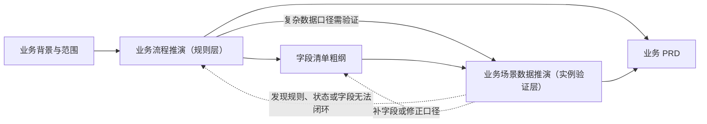
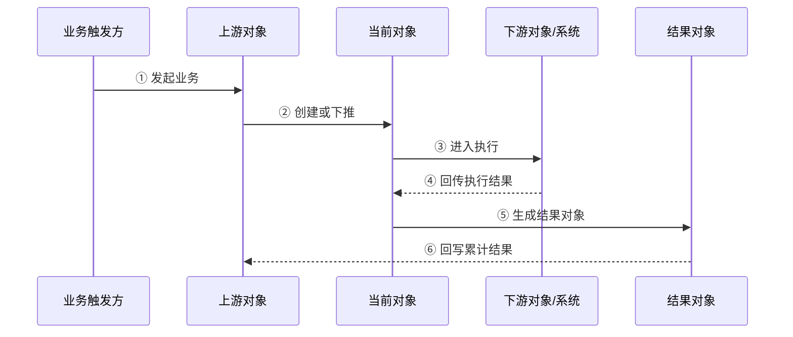

# [流程名称]业务流程推演

> **版本**：V2.1
> **更新时间**：YYYY-MM-DD
> **适用范围**：复杂业务单据、跨系统执行、上下游回写、数量/金额累计、取消/关闭/红冲等需要逐步验证的业务流程
> **层级定位**：规则层。用连续业务场景定义并验证“对象如何产生、状态如何变化、数量如何流转、异常如何收口”。本文是后续业务场景数据推演的上游依据，不重复字段枚举，不描述页面或技术实现。

---

## 0. 使用规则

### 0.1 前置输入

开始推演前至少确认：

| 输入 | 最低要求 |
| :--- | :--- |
| 业务范围 | 本期做什么、不做什么已明确 |
| 业务对象 | 涉及哪些单据、任务、结果记录或外部对象 |
| 上下游关系 | 谁创建谁、谁回写谁、头与行如何关联 |
| 核心口径 | 数量、金额、库存、价格等关键口径已有业务依据 |
| 全局规则 | 已读取本流程适用的项目级背景与全局规范 |

缺少依据的内容必须写入“待确认事项”，不得用通用经验替业务方做决定。

### 0.2 推演覆盖范围

复杂单据默认检查四类场景：

1. 正常完成。
2. 取消。
3. 关闭。
4. 红冲。

不适用的场景不能直接省略，必须写明“不适用对象 + 原因 + 替代处置”。跨系统流程还需补充失败、重复回传、部分成功、超时与重试场景。

### 0.3 文档职责边界

| 本文负责 | 本文不负责 |
| :--- | :--- |
| 定义业务场景、处理顺序、对象关系、状态流转和异常收口 | 定义字段类型、完整枚举、页面展隐 |
| 用少量代表性数据快照解释规则如何生效 | 穷举多组 SKU、数量、库存、金额和边界数据 |
| 验证正常、取消、关闭、红冲和异常是否闭环 | 描述页面布局、控件、Toast、Mock |
| 暴露流程断点、口径冲突和待确认项 | 设计接口路径、数据库表、错误码 |

### 0.4 与业务场景数据推演的关系

业务流程推演与业务场景数据推演不是平级的两套业务规则，也不是必须同时产生的“孪生文档”。前者先定义规则，后者按需从具体流程场景派生，用固定数据验证规则能否算通。

| 对比维度 | 业务流程推演 | 业务场景数据推演 |
| :--- | :--- | :--- |
| 核心问题 | 业务按什么规则运行 | 给定一组数据后，规则能否得到唯一、守恒的结果 |
| 文档层级 | 规则层、上游依据 | 实例验证层、下游验证物 |
| 内容重点 | 场景、步骤、对象、状态、回写、异常收口 | 固定基线、事件时点、逐对象快照、公式、断言 |
| 数据使用 | 代表性示例，用于解释规则 | 多组独立数据用例，用于验证边界 |
| 规则变更职责 | 可以提出并固化业务规则 | 不得新增状态、字段或规则；算不通时回改上游文档后重跑 |
| 是否必需 | 复杂业务流程原则上必需 | 按§0.5触发条件决定，可不单独输出 |

**正式依赖关系**：每个数据推演用例必须引用一个已编号的流程场景和对应文档版本；同一个流程场景可以派生多个数据用例。没有业务流程初稿时，只能做探索性算例，不得将其视为正式业务场景数据推演。

### 0.5 何时单独输出业务场景数据推演

命中以下任一项，建议使用`业务场景数据推演模板.md`另行输出`[模块名]业务场景数据推演.md`：

| 触发条件 | 典型问题 |
| :--- | :--- |
| 数量、金额或库存跨 3 个及以上对象变化 | 上游数量、通知数量、实际数量、结果数量是否守恒 |
| 同时存在多个容易混淆的数量口径 | 预占、在途、累计完成、剩余可处理、缺量如何互相换算 |
| 存在行级与整单级边界 | 单行 0、整单 0、部分成功、超量、重复回传结果不同 |
| 存在拆分、合并、分摊、寻源或舍入 | 一对多、多对一、FIFO、比例分摊、尾差归属能否算通 |
| 跨组织、跨仓或镜像单据联动 | 各组织、仓库和单据分别增减什么，期末是否一致 |
| 研发、测试、联调和 Mock 需要共用验收数据 | 需要把同一组输入、过程快照和断言复用为共同验收基线 |

仅有简单 CRUD、查询或配置维护，且不存在状态链和数量/金额守恒时，不必为了“文档齐全”机械新增数据推演。

---

## 1. 推演目标与业务边界

### 1.1 要解决的问题

| 维度 | 内容 |
| :--- | :--- |
| 业务问题 | [当前流程为什么需要新建或重构] |
| 推演目标 | [本次要验证哪些对象、状态、数量或异常] |
| 成功标准 | [达到什么结果才算流程闭环] |
| 本期范围 | [本期包含的组织、渠道、业务类型、单据层级等] |
| 本期不做 | [明确排除的能力及原因] |

### 1.2 关键假设与约束

| 编号 | 假设/约束 | 依据 | 若不成立的影响 |
| :--- | :--- | :--- | :--- |
| A01 | [例如：同一通知单只接受一次有效回传] | [业务确认/全局规范/项目文档] | [影响对象、状态或数量口径] |

---

## 2. 业务对象与关系

### 2.1 对象清单

| 对象 | 层级/类型 | 来源 | 创建触发 | 核心职责 | 生命周期终点 |
| :--- | :--- | :--- | :--- | :--- | :--- |
| [对象A] | 业务单/通知单/结果单/任务/外部对象 | [来源] | [触发条件] | [负责什么] | [自然完成/取消/关闭/红冲等] |

### 2.2 上下游关系图

### 2.3 关联与追溯关系

| 来源对象/层级 | 目标对象/层级 | 基数 | 关联键 | 建立时机 | 追溯用途 |
| :--- | :--- | :---: | :--- | :--- | :--- |
| [对象A行] | [对象B行] | 1:N / N:1 / 1:1 | [稳定业务关联键] | [创建/回写时] | [追踪执行数量、失败来源等] |

> 不能只写“按 SKU 关联”。当同一 SKU 可能重复出现时，必须补充来源行标识、批次、仓库、项目等能够唯一定位业务行的条件。

---

## 3. 场景目录

| 场景ID | 场景 | 是否适用 | 起点 | 终点 | 关键验证点 | 详见 |
| :--- | :--- | :---: | :--- | :--- | :--- | :--- |
| SC-N01 | 正常完成 | 是 / 否 | [起点] | [终点] | 状态、数量、上下游关系自然闭环 | §5 |
| SC-C01 | 取消 | 是 / 否 | [允许取消的状态] | [取消结果] | 已有下游如何处理、资源是否释放 | §6 |
| SC-L01 | 关闭 | 是 / 否 | [允许关闭的状态] | [关闭结果] | 剩余量如何处理、在途对象如何收尾 | §7 |
| SC-R01 | 红冲 | 是 / 否 | [已生效结果] | [冲销完成] | 原单是否保留、反向数量如何回写 | §8 |
| SC-E01 | 执行失败/部分成功 | 是 / 否 | [执行节点] | [重试/暂停/人工处理] | 已成功部分是否重复、失败如何恢复 | §9 |
| SC-I01 | 重复请求/重复回传 | 是 / 否 | [重复触发] | [幂等返回] | 是否重复生单、重复累计 | §9 |

> 场景ID在本流程、业务PRD和业务场景数据推演之间保持稳定。新增场景使用新ID，不因章节排序变化而复用旧ID。

---

## 4. 详细步骤写法

> §5～§9中的每个关键步骤均按本节结构填写。步骤必须能回答：谁触发、系统处理什么、产生什么对象、状态和数量如何变化、失败后怎么办。

### 步骤 [序号]：[步骤名称]

**步骤定义**：

| 项目 | 内容 |
| :--- | :--- |
| 所属场景/规则 | [SC-编号；如业务PRD已有规则编号，同时引用 R-编号] |
| 触发来源 | [人工动作/上游单据/外部系统/定时任务] |
| 前置条件 | [进入本步骤前必须满足的业务条件] |
| 输入 | [参与本步骤的对象、行范围、数量或关键参数] |
| 处理范围 | 整单 / 指定行 / 未处理剩余量 / 本次回传范围 |
| 处理规则 | [按顺序写清判断、分组、计算、生成、回写] |
| 输出 | [新对象、状态结果、数量结果、告警或待办] |
| 失败结果 | [失败时哪些内容不应变化，后续如何处理] |

**关键数据快照**：

| 对象/层级 | 关键标识 | 状态 | 本次数量 | 累计数量 | 剩余数量 | 关联对象 | 说明 |
| :--- | :--- | :--- | ---: | ---: | ---: | :--- | :--- |
| [对象A头/行] | [单号/行号] | [状态] | [N] | [N] | [N] | [对象B] | [说明] |

**状态与数量变化**：

| 对象/层级 | 字段/口径 | 变更前 | 本次变化 | 变更后 | 变化原因 |
| :--- | :--- | :--- | :--- | :--- | :--- |
| [对象A行] | [状态/累计数量/可执行数量] | [值] | [+N/-N/状态变化] | [值] | [触发规则] |

**新增或解除的关系**：

| 关系 | 变化 | 说明 |
| :--- | :--- | :--- |
| [对象A行 → 对象B行] | 新增 / 解除 / 保留 | [为什么变化] |

**检查结论**：

- [本步骤成立的关键依据]。
- [本步骤最容易出现的断点]。
- [需要带入下一步骤继续验证的状态或数量]。

---

## 5. 正常完成场景

### 5.1 正常流程总览

### 5.2 步骤清单

| 步骤 | 触发 | 核心处理 | 产生/更新对象 | 下一步条件 |
| :---: | :--- | :--- | :--- | :--- |
| ① | [触发] | [处理] | [对象] | [条件] |

> 按§4逐步展开每个关键步骤。不得用一张总流程图代替详细推演。

### 5.3 数量/金额时间线

| 时点 | 业务数量 | 已下推/已执行 | 累计结果 | 剩余可处理 | 金额/库存影响 | 说明 |
| :--- | ---: | ---: | ---: | ---: | :--- | :--- |
| T0 初始 | [N] | 0 | 0 | [N] | [无/影响] | [说明] |
| T1 [事件] | [N] | [N] | [N] | [N] | [影响] | [说明] |

> 本节只放能解释流程规则的一组代表性数据。若同一场景需要用多组 SKU、数量、库存或金额分别验证正常、缺量、整行 0、整单 0、超量、重复、拆分或尾差等结果，应改在《[模块名]业务场景数据推演》中展开，并在该文档中引用本场景ID。

### 5.4 正常结束判定

| 检查项 | 完成条件 | 未满足时的状态 |
| :--- | :--- | :--- |
| 上游对象 | [什么条件下自然结束] | [继续等待/异常] |
| 执行对象 | [什么条件下执行完成] | [继续执行/失败] |
| 结果对象 | [什么条件下生效] | [待处理/失败] |
| 数量/金额 | [应满足的恒等关系] | [差异处置] |

---

## 6. 取消场景

### 6.1 取消边界

| 对象 | 可取消状态/条件 | 不可取消条件 | 是否需要下游确认 | 取消后的终态 |
| :--- | :--- | :--- | :---: | :--- |
| [对象] | [条件] | [条件] | 是 / 否 | [状态] |

### 6.2 取消推演

按§4展开取消步骤，并额外说明：

- 已生成但未执行的下游对象如何处理。
- 执行中的下游对象是直接取消、进入取消中，还是不可取消。
- 已占用、预占或锁定的业务资源何时释放。
- 取消前已完成的数量、金额或库存影响是否保留。
- 取消失败时原状态是否保持不变。

### 6.3 取消后影响

| 影响对象 | 状态影响 | 数量/金额影响 | 关系影响 | 后续允许动作 |
| :--- | :--- | :--- | :--- | :--- |
| [对象] | [变化] | [变化] | [保留/解除] | [允许/禁止] |

---

## 7. 关闭场景

### 7.1 关闭边界

| 对象 | 关闭触发 | 关闭前置条件 | 剩余量处理 | 在途对象处理 | 关闭终态 |
| :--- | :--- | :--- | :--- | :--- | :--- |
| [对象] | [人工/系统] | [条件] | [放弃/保留/转新单] | [等待收尾/不允许关闭] | [状态] |

### 7.2 关闭推演

按§4展开关闭步骤，并额外说明：

- 关闭针对整单还是部分行。
- 是否存在“关闭中”，其进入和退出条件是什么。
- 关闭后剩余可处理数量是否清零，是否允许恢复。
- 已生成或在途下游是否继续完成。
- 补做业务是否必须新建业务单。

### 7.3 关闭后影响

| 影响对象 | 已完成部分 | 未完成部分 | 在途部分 | 后续处理 |
| :--- | :--- | :--- | :--- | :--- |
| [对象] | [保留口径] | [处理口径] | [处理口径] | [新建业务/等待收尾等] |

---

## 8. 红冲场景

### 8.1 红冲边界

| 原结果对象 | 可红冲条件 | 红冲对象 | 是否保留原单 | 影响范围 | 完成判定 |
| :--- | :--- | :--- | :---: | :--- | :--- |
| [结果单] | [条件] | [红字单/反向结果] | 是 | [数量/库存/金额/结算] | [条件] |

### 8.2 红冲推演

按§4展开红冲步骤，并额外说明：

- 红冲是新增反向结果，不直接改写原生效结果。
- 支持整单红冲还是部分行/部分数量红冲。
- 上游累计数量、金额、库存或结算结果如何反向回写。
- 原单、红冲单与再次正确处理之间如何追溯。
- 重复红冲、超量红冲如何拦截。

### 8.3 红冲前后对比

| 口径 | 红冲前 | 本次红冲 | 红冲后 | 校验关系 |
| :--- | ---: | ---: | ---: | :--- |
| [累计数量/库存/金额] | [N] | [-N] | [N] | [公式] |

---

## 9. 失败、部分成功与重复处理

| 场景 | 发生节点 | 已成功部分 | 未成功部分 | 状态结果 | 重试/后续处理 | 防重复要求 |
| :--- | :--- | :--- | :--- | :--- | :--- | :--- |
| 整体失败 | [节点] | [无/范围] | [范围] | [状态] | [重试/告警/人工] | [要求] |
| 部分成功 | [节点] | [范围] | [范围] | [状态] | [失败明细如何继续] | 已成功范围不得重复 |
| 重复请求/回传 | [节点] | [原结果] | - | 保持原结果 | 返回原处理结果/忽略 | 唯一业务标识幂等 |
| 并发变化 | [节点] | [已落结果] | [冲突范围] | [状态] | 刷新后重新判断 | 不得覆盖新状态 |
| 超时未知 | [节点] | [待核实] | [待核实] | [处理中/待确认] | 查明真实结果后再决定 | 不得盲目重复生单 |

> 失败原因可以用于展示和排查，但不要在没有业务依据时按失败原因发明多套控制流。

---

## 10. 状态、回写与一致性汇总

### 10.1 状态演变

| 对象/层级 | 步骤 | 业务状态 | 运行/执行状态 | 关闭/取消状态 | 触发事件 | 下一步 |
| :--- | :---: | :--- | :--- | :--- | :--- | :--- |
| [对象头/行] | ① | [状态] | [状态或不适用] | [状态或不适用] | [事件] | [下一步] |

状态维度必须按本模块正式规则填写。不同维度不得混成一个“万能状态”，也不得复制其他单据的状态枚举。

### 10.2 回写规则

| 编号 | 触发来源 | 目标对象/层级 | 回写口径 | 触发时机 | 计算/覆盖规则 | 失败时处理 |
| :--- | :--- | :--- | :--- | :--- | :--- | :--- |
| W01 | [来源] | [目标头/行] | [字段或业务口径] | [时机] | [SUM/覆盖/增量/重算] | [保持原值/待重试等] |

### 10.3 一致性检查

| 检查项 | 应满足关系 | 检查时机 | 不一致处理 |
| :--- | :--- | :--- | :--- |
| 数量守恒 | [例如：业务数量 = 已完成 + 在途 + 剩余] | [时机] | [处理] |
| 金额一致 | [公式] | [时机] | [处理] |
| 头行一致 | [头状态/汇总值如何由行得出] | [时机] | [处理] |
| 上下游一致 | [上游累计 = 下游有效结果汇总] | [时机] | [处理] |
| 追溯完整 | [所有结果均能追溯到来源行] | [时机] | [处理] |

---

## 11. 待确认事项与推演结论

### 11.1 待确认事项

| 编号 | 问题 | 影响场景 | 当前可选方案 | 建议 | 状态 |
| :--- | :--- | :--- | :--- | :--- | :--- |
| Q01 | [问题] | [正常/取消/关闭/红冲/异常] | [方案A/B] | [建议及理由] | 待确认 |

### 11.2 推演结论

| 检查项 | 结论 | 未闭环点/后续动作 |
| :--- | :--- | :--- |
| 正常流程 | 通过 / 不通过 | [问题] |
| 取消流程 | 通过 / 不适用 / 不通过 | [问题] |
| 关闭流程 | 通过 / 不适用 / 不通过 | [问题] |
| 红冲流程 | 通过 / 不适用 / 不通过 | [问题] |
| 失败与重复处理 | 通过 / 不通过 | [问题] |
| 状态闭环 | 通过 / 不通过 | [问题] |
| 数量/金额一致性 | 通过 / 不通过 | [问题] |
| 追溯关系 | 通过 / 不通过 | [问题] |
| 是否需独立数据推演 | 是 / 否 | [命中的§0.5条件；若是，列出需验证的SC场景] |

---

## 12. 交付前检查

- [ ] 已明确本期范围和不做范围。
- [ ] 所有业务对象都有来源、创建触发和生命周期终点。
- [ ] 正常、取消、关闭、红冲四类场景均已覆盖或说明不适用原因。
- [ ] 每个关键步骤都有前置条件、处理规则、状态/数量变化和失败结果。
- [ ] 头、行、上下游之间的关联键和基数明确。
- [ ] 数量、金额、库存等关键口径有时间线或守恒关系。
- [ ] 部分成功、重复请求、并发和超时不会造成重复生单或重复累计。
- [ ] 未把字段枚举、页面布局或技术实现写入本文。
- [ ] 所有未确认问题均已列入待确认事项。
- [ ] 场景ID稳定且可被业务PRD、数据推演和测试用例引用。
- [ ] 已按§0.5判断是否需要独立业务场景数据推演；需要时已列明待验证场景和口径。

---

## 修订记录

| 日期 | 版本 | 变更摘要 |
| :--- | :--- | :--- |
| YYYY-MM-DD | V2.1 | 明确规则层定位及与业务场景数据推演的上下游关系，补充触发条件和稳定场景ID |
| YYYY-MM-DD | V2.0 | 按连续场景、状态数量变化、异常与一致性闭环重构 |
