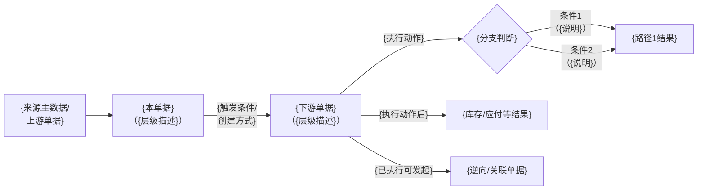
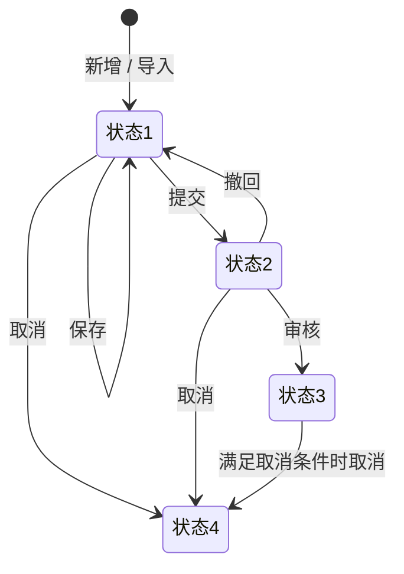

# 主PRD模板

> **定位**：一个单据模块或功能模块，只有一个主PRD。本模板覆盖两种场景：
> - **业务单据**：有状态机、上下游流转（采购订单、配销订单、收货通知单等）
> - **配置与规则**：有规则引擎、命中逻辑（税率配置、价格规则、编号规则等）
>
> **不适用**：主数据CRUD（无状态机，直接用字段清单 + 前端Demo版PRD）
>
> **内容边界**：
> - ✅ 本文件定义：业务规则、状态机、动作矩阵、权限、验收标准、边界异常处理
> - ❌ 不在本文件定义：字段本体（→ 字段清单）、页面控件/布局（→ 前端Demo版PRD）、REST接口/DB表结构（→ 技术设计）

---

## 使用说明

### 怎么判断是否需要主PRD

```
问题1：这个模块有状态机吗（待提交→待审核→已审核→已取消）？
  ├── 有，且有上下游单据流转（下推、回写） → 需要主PRD，用下文「业务单据」章节结构
  ├── 有，但很简单（启用/禁用），核心是规则/算法 → 需要主PRD，用下文「配置与规则」章节结构
  └── 没有 → 不需要主PRD，直接用 字段清单 + 前端Demo版PRD
```

### 怎么使用

1. 复制本模板，替换 `{占位符}` 为实际内容
2. 根据模块类型（业务单据 / 配置与规则），**只保留对应的章节结构**，删除不适用的部分
3. 规则统一编号（R01、R02…），便于跨文档引用和评审追踪
4. `<!-- 提示 -->` 标记的内容是写作指导，填写后删除

### 配套文档

| 需要了解的内容 | 查看文档 |
| :--- | :--- |
| 字段名称、类型、枚举值、必填性、计算公式 | 《{模块名称}字段清单》 |
| 页面结构、控件类型、交互规范 | 《{模块名称}_前端Demo版PRD》或拆分版 |
| 业务流程推演 | 《{场景名称}流程推演》 |

---
---

# A. 业务单据类 — 章节结构

> **适用场景**：有状态机、多单据联动、上下游流转的业务单据
> **典型代表**：采购订单、配销订单、采购收货通知单、配销发货通知单、其他出库单
> **蓝本来源**：基于配销订单PRD抽象，已脱敏

---

## {单据名称} PRD

> **版本**：V1.0 | {YYYY-MM-DD}
> **读者**：研发工程师、测试工程师、产品复核

---

### 1. 业务背景

<!-- 提示：用1-2段话讲清这张单据在业务中的角色。不写用户旅程，不铺垫历史，直接说"它是什么、解决什么问题"。如果有多种业务类型，用一张表区分。 -->

{一句话概括单据的业务本质和核心职责}

根据{区分维度}，{单据名称}分为以下几种业务类型：

| 业务类型 | 适用对象 | 是否产生{关键差异} | 典型场景 |
| :--- | :--- | :---: | :--- |
| **{类型1}** | {对象} | {是/否} | {一句话场景描述} |
| **{类型2}** | {对象} | {是/否} | {一句话场景描述} |

<!-- 提示：如果只有一种业务类型，删掉上表，在正文中说清楚即可 -->

---

### 2. 功能范围

**In Scope**：

- {功能1}
- {功能2}

**Out of Scope**：

- {不做的功能1}（{原因或归属说明}）
- {不做的功能2}（{后续期次规划}）

---

### 3. 单据定位

<!-- 提示：明确这张单据在三层架构中的位置（业务单/通知单/结果单），上下游关系，以及实体关系（1:N 等）。这3件事合在一起才能让研发和测试在动手前完整理解单据的位置。 -->

#### 3.1 基本定位

| 项目 | 内容 |
| :--- | :--- |
| 单据层级 | **第{N}层——{业务订单层/执行通知层/结果凭证层}（{意图/执行/凭证}）** |
| 核心职责 | 记录"{核心职责的一句话描述}" |
| 单据来源 | {来源方式1（如：手动创建）} / {来源方式2（如：系统自动下推）} |
| 下游单据 | {下游单据名称}（{生成方式：手动/自动}） |
| 间接下游/结果 | {结果单据名称}（{生成机制说明}） |

#### 3.2 系统链路图

<!-- 提示：用 Mermaid flowchart LR 展示本单据在系统链路中的位置；文字换行用 <br/>，不用 \n。节点包含：上游主数据来源 → 本单据 → 下游单据 → 结果（库存/应付/状态）。 -->



#### 3.3 实体关系说明

<!-- 提示：Mermaid 流程图体现时序，实体关系（1:N、N:1 等）需在此单独说明，两者缺一不可。 -->

| 关系 | 说明 |
| :--- | :--- |
| {本单据} : {上游主数据（如供应商）} | **N:1**（一张{本单据}只对应一个{上游}） |
| {本单据} : {下游单据} | **1:N**（一张{本单据}可对应多张{下游}，支持{业务场景}） |
| {本单据明细行} : {下游单据明细行} | **1:N**（一条明细行可分多次执行） |


### 4. 业务场景

<!-- 提示：场景分三类——主流程（核心业务路径）、支线（辅助操作）、辅助（异常/管理操作）。每个场景一句话说清"从哪到哪"。 -->

| 场景ID | 场景 | 类型 | 说明 |
| :--- | :--- | :--- | :--- |
| S01 | {核心场景1} | **主流程** | {操作链路} |
| S02 | {核心场景2} | **主流程** | {差异说明} |
| S03 | {导入批量创建} | **支线** | 下载模板→上传→预校验→确认→生成待提交草稿 |
| S04 | {撤回重提} | **支线** | 待审核→撤回→修改→重新提交 |
| S05 | {取消} | **辅助** | {分级取消逻辑} |
| S06 | {手动关闭} | **辅助** | {关闭条件和逻辑} |

---

### 5. 状态机

#### 5.1 单据状态

| 状态 | 含义 | 是否终态 |
| :--- | :--- | :---: |
| {状态1} | {含义} | 否 |
| {状态2} | {含义} | 否 |
| {状态3} | {含义} | 否 |
| {状态4} | {含义} | **是** |



#### 5.2 关闭状态（独立于单据状态）

<!-- 提示：关闭状态和单据状态是两个独立维度。单据状态控制"能做什么操作"，关闭状态控制"后续还有没有待执行的量"。如果不涉及关闭状态，删除此节。 -->

| 状态 | 触发条件 |
| :--- | :--- |
| 未关闭 | 存在至少一条未关闭的商品行 |
| 已关闭 | 所有商品行均已关闭 |

#### 5.3 状态流转表

> 本表是状态机的结构化展开，供研发/测试直接作为验收标准使用。

<!-- 提示：
  - 「前置条件」写清楚"且"/"或"关系，多个条件分行列出
  - 「二次确认」写出弹窗提示文案（产品决定文案，不是研发自己写）
  - 「失败处理」写出失败时系统的响应（Toast/Banner/阻断，以及文案模板）
  - 「后置影响」写清楚除状态变更外还有哪些级联影响（下游单据、回写字段等）
-->

| 当前状态 | 动作 | 前置条件 | 结果状态 | 二次确认 | 后置影响 | 失败处理 |
| :--- | :--- | :--- | :--- | :--- | :--- | :--- |
| {状态1} | 提交 | 商品明细不为空；必填字段已填写 | {状态2} | 无 | 触发审核通知 | Toast：「提交失败，{字段X}不满足条件」 |
| {状态2} | 撤回 | 无下游单据已审核 | {状态1} | 无 | — | Toast：「撤回失败，存在已审核的下游单据」 |
| {状态2} | 审核 | — | {状态3} | 无 | {下推通知单/触发结算} | — |
| {状态3} | 手动关闭 | 已审核；存在可下推数量>0 | {状态3}（不变） | 「确认关闭后，剩余未执行数量将不再下推，确认关闭？」 | 关闭状态→已关闭；行级剩余量清零 | — |
| {状态1/2} | 取消 | 见§7 取消规则 | {状态4} | 「确认取消后操作不可撤销，确认取消？」 | 单据关闭状态→已关闭；级联取消可取消的下游单据 | Toast：「取消失败，存在{状态}的下游单据，请先处理下游」 |

---

### 6. 动作能力矩阵

<!-- 提示：✅ = 允许；❌ = 不允许（不展示入口）；✅（条件） = 允许但有前置条件（在§7 规则中详细说明） -->

| 动作 | {状态1} | {状态2} | {状态3} | {状态4} |
| :--- | :----: | :----: | :----: | :----: |
| 编辑 | ✅ | ❌ | ❌ | ❌ |
| 提交 | ✅ | ❌ | ❌ | ❌ |
| 撤回 | ❌ | ✅ | ❌ | ❌ |
| 审核 | ❌ | ✅ | ❌ | ❌ |
| 下推 | ❌ | ❌ | ✅（条件） | ❌ |
| 取消 | ✅ | ✅ | 条件允许时 ✅ | ❌ |
| 手动关闭 | ❌ | ❌ | ✅（条件） | ❌ |
| 导出 | ✅ | ✅ | ✅ | ✅ |

---

### 7. 核心业务规则

<!-- 提示：
  - 按业务领域分组，每条规则统一编号（R01、R02…）
  - 每条规则用「条件 → 结果」格式写：什么情况下，系统做什么
  - 规则只写"是什么"和"怎么判断"，不写字段定义（→ 字段清单）
  - 经业务方确认的关键规则应注明确认日期，便于追溯
  - 规则正文应包含：判断条件、系统行为、边界情况（如有）
-->

**规则标准写法示例**：

> R01 **[业务类型联动]** 当业务类型变更时，系统重置「收货方」字段为空，并根据新业务类型控制「中转仓」字段的显隐。（确认日期：YYYY-MM-DD）
>
> R02 **[取价逻辑]** 系统按以下优先级取价：① SKU级专属价格 → ② 品牌级价格 → ③ 通用兜底价格；均未命中时阻断提交，提示「未找到 {SKU编码} 的适用价格」。

---

#### 7.1 {业务类型联动规则}

| 规则ID | 规则 | 确认日期 |
| :--- | :--- | :--- |
| R01 | {条件} → {系统行为}；{边界/反向场景说明} | {YYYY-MM-DD 或 —} |

#### 7.2 {价格/数量计算规则}

| 规则ID | 规则 | 确认日期 |
| :--- | :--- | :--- |
| R02 | {取价优先级，精确到哪个维度优先} | — |
| R03 | {未命中时的处理：阻断/降级/默认值} | — |

#### 7.3 {下推与回写规则}

| 规则ID | 规则 | 确认日期 |
| :--- | :--- | :--- |
| R04 | **[下推幂等]** {下推条件}；同一{单据}不允许重复下推同一{下游类型}，系统以{唯一键}做幂等校验 | — |
| R05 | **[数量回写]** {下游结果单}审核后，将{字段X}回写至{本单据}的{字段Y}；回写为累加逻辑，支持多次回写 | — |

#### 7.4 {价格与字段锁定规则}

<!-- 提示：凡是有"审核后锁定"逻辑的单据，必须明确哪些字段锁定、哪些字段仍可修改，以及价格来源/允许修改的范围。不能只写"审核后不可修改"了事。 -->

| 规则ID | 规则 | 确认日期 |
| :--- | :--- | :--- |
| R06 | **[审核锁定]** 审核通过后，以下字段锁定：{字段A}、{字段B}、{字段C}；以下字段仍可修改：{字段D}、{字段E} | — |
| R07 | **[价格来源]** {单据}创建时，系统从{主数据/价目表}自动带出参考价，允许人工调整；取价规则：{优先级说明} | — |
| R08 | **[价格锁定]** 审核后单价字段锁定，不可直接修改；如需调价，须{驳回后修改 / 另开变更单} | — |

#### 7.5 作废规则（分级判断）

<!-- 提示：作废是最容易有歧义的操作，必须按"下游状态"分级写清楚每种情况下系统怎么处理。注意：在本工程中，"草稿"支持物理删除（记录消失），"待审核/计划状态"支持作废（记录保留但失效），有已执行记录的不可作废。 -->

| 前置条件 | 系统行为 | 说明 |
| :--- | :--- | :--- |
| 草稿状态 | **物理删除**（记录消失，不可恢复） | 区别于作废；用于创建错误不想留痕的场景 |
| 下游单据不存在 或 全部已取消 | 直接作废，无需处理下游 | 最简单的场景 |
| 存在「{可取消状态}」的下游单据 | 级联取消全部可取消的下游，再作废本单 | 系统自动完成，无需用户逐一操作 |
| 存在「{不可取消状态/已执行}」的下游单据 | **阻断**，提示用户先处理下游 | 文案：「存在{状态}的{下游单据类型}，请先处理后再操作」 |

#### 7.6 关闭规则

| 规则ID | 规则 |
| :--- | :--- |
| R09 | **[软封存]** 手动关闭后，单据进入终态；已有下游单据仍继续执行，执行结果回写本单时仍正常接收 |
| R10 | **[行级自动关闭]** 当一行的累计执行数量 = 订单数量时，该行自动关闭；所有行均关闭后，整单自动→已完成 |
| R11 | **[关闭条件]** 手动关闭的前置条件：单据状态为{已审核/部分执行} 且 存在未执行数量>0 |
| R12 | **[草稿入库单阻断]** 执行关闭时，如存在草稿状态的下游单据，系统提示用户确认；确认后草稿下游单据不可继续执行 |

#### 作废与关闭的区别

<!-- 提示：作废和关闭是进销存类业务文档的高频易混点，必须保留此表。AI 生成 Demo 时，弹窗文案和按钮文案也需按此区分。 -->

| 维度 | 作废 | 关闭（缺量完结/软封存） |
| :--- | :--- | :--- |
| **含义** | 撤销未实际发生的业务意图，全部放弃 | 终止剩余流程，封存现状，已执行的保留 |
| **适用状态** | {无已执行下游的状态，如草稿/待审核/待执行} | {已有部分执行记录的状态，如部分入库/部分出库} |
| **单据状态变化** | → 已作废（终态，仍可查询） | → 已完成（终态） |
| **对已有下游的影响** | 无（此时没有已执行的下游） | 已确认的下游不受影响；草稿下游被阻断 |
| **后续回写** | 不接收 | 不接收（已完成，不接收新回写） |

---

### 8. 边界与异常处理

<!-- 提示：这是最容易被遗漏的一章。PM 需要明确定义以下场景的系统行为，否则研发会自行决策，导致各模块不一致。 -->

#### 8.1 并发控制

| 场景 | 处理方式 |
| :--- | :--- |
| 两个用户同时编辑同一张单据 | 后提交的一方提示「当前单据已被他人修改，请刷新后重试」，不覆盖先提交的结果 |
| 同一张单据被多人同时提交/审核 | 以数据库乐观锁为准，后操作者提示「操作失败，单据状态已变更，请刷新后重试」 |

#### 8.2 幂等操作约束

| 操作 | 幂等规则 |
| :--- | :--- |
| 下推 | 同一{本单据}对同一{下游单据类型}只允许下推一次；重复触发时系统返回已存在的下游单据号，不重复创建 |
| 回写 | {结果单据}的回写支持多次累加；同一{结果单号}重复回写时，以最新值覆盖，不重复累加 |
| 导入 | 同一导入批次（以{唯一键}判断）重复上传时，系统识别后提示「该批次已存在，是否覆盖？」 |

#### 8.3 接口异常处理

<!-- 提示：适用于有外部系统对接的单据（如回写来自WMS/金蝶）-->

| 场景 | 系统行为 |
| :--- | :--- |
| 外部系统回写超时（如WMS） | 记录异常日志；状态不变；支持手动触发重试 |
| 外部系统返回业务错误码 | 在「操作日志」中记录错误详情；Toast 提示「{操作}失败，{错误描述}」 |
| 下推通知单发送失败 | 本单据状态回滚；不生成部分创建的下游单据；Toast「下推失败，请重试」 |

#### 8.4 数量边界约束

| 场景 | 规则 |
| :--- | :--- |
| 回写数量超过订单数量 | 系统拒绝回写，记录告警日志，提示「回写数量超过订单数量，请核查」 |
| SKU 行数超出系统上限 | 单张单据最多允许 {N} 条 SKU 明细行；超出时阻断保存，提示「商品明细不可超过 {N} 行」 |
| 数量为 0 的商品行 | {允许保存但不允许提交 / 阻断保存}，提示「商品数量不可为0」 |

---

### 9. 验收重点

> 以下为核心风险点，研发自测与测试用例必须覆盖。验收标准写「输入条件 → 预期结果」格式，不写空话。

| # | 验收项 | 输入条件 | 预期结果 |
| :--- | :--- | :--- | :--- |
| V01 | **状态机正确性** | 对已取消单据触发「提交」操作 | 操作入口不展示（不渲染 disabled 按钮） |
| V02 | **取消分级判断** | 存在「已审核」状态下游单据时触发取消 | 操作被阻断，Toast 提示含下游单据类型和状态 |
| V03 | **下推幂等** | 对同一单据触发两次下推 | 第二次下推返回已存在的下游单据号，不重复创建 |
| V04 | **关闭软封存** | 关闭后，下游结果单继续回写 | 回写成功，本单累计执行数量正确更新 |
| V05 | **业务类型联动** | 切换业务类型时 | 联动字段按规则重置，不保留旧值 |
| V06 | **并发编辑** | A、B 同时打开同一单据并提交 | 后提交方收到提示，数据不被覆盖 |
| V07 | **数量回写累加** | 分两次回写同一商品行 | 累计执行数量 = 两次回写数量之和 |
| V08 | **{其他验收项}** | {输入条件} | {预期结果} |

---

### 修订记录 （按时间倒序）

| 日期 | 变更摘要 |
| :--- | :--- |
| {YYYY-MM-DD} | V1.0 初版 |

---
---

# B. 配置与规则类 — 章节结构

> **适用场景**：以规则引擎、命中逻辑、冲突校验为核心的配置管理模块
> **典型代表**：销售税率配置、采购价目表、编号规则、审批流配置
> **蓝本来源**：基于销售税率配置PRD抽象，已脱敏

---

## {模块名称} PRD

> **版本**：V1.0 | {YYYY-MM-DD}
> **读者**：研发工程师、测试工程师、产品复核

---

### 1. 模块目标

<!-- 提示：用1-2句话讲清这个配置模块的核心价值。重点回答"为什么需要这个配置，而不是硬编码"。 -->

{一句话说清模块做什么}

**核心价值**：{解释为什么用配置而非硬编码，配置变化时的业务收益}

{关键设计决策说明（如有）}

---

### 2. 功能范围

| 功能 | 说明 |
| :--- | :--- |
| {查看列表} | {说明} |
| {查看详情} | {说明} |
| {新增配置} | {说明} |
| {编辑配置} | {说明} |
| {启用/禁用} | {说明} |

**不在范围：**

- {不做的功能1}（{原因}）

---

### 3. 核心业务规则

<!-- 提示：这是配置类PRD的核心章节，通常占全文60%以上篇幅。按以下维度组织子节，没有的维度直接删除。 -->

#### 3.1 {配置模式/类型}

<!-- 提示：如果配置有多种模式（如"统一值 / 取主数据 / 手动导入"），用表格列出每种模式的系统行为和限制条件。 -->

| 模式 | 系统行为 | 限制 |
| :--- | :--- | :--- |
| {模式1} | {行为描述} | {限制条件} |
| {模式2} | {行为描述} | {限制条件} |

#### 3.2 命中优先级

<!-- 提示：如果同一查询条件可能命中多条规则，必须定义优先级。核心原则通常是"精确优先于泛化"。 -->

> **前置条件**：仅{生效条件}的规则参与优先级匹配。

| 优先级 | 规则类型 | 匹配维度 |
| :--- | :--- | :--- |
| **1（最高）** | {最精确的匹配维度组合} | {维度A + 维度B + 维度C} |
| **2** | {次精确} | {维度A + 维度B} |
| **3** | {更泛化} | {仅维度A} |
| 同级别时 | {消歧规则} | 如「创建时间更晚的优先」 |

#### 3.3 {读取/触发时机}

| 场景 | 触发时机 | 处理方式 | 说明 |
| :--- | :--- | :--- | :--- |
| {场景1} | {用户操作/系统自动} | {实时计算（不固化）/快照写入（固化到单据）} | {说明固化时机或计算依据} |
| {场景2} | {触发时机} | {处理方式} | — |

#### 3.4 未命中处理

<!-- 提示：配置类模块必须从以下三种策略中选一种，明确写出——不能含糊。 -->

**未命中处理策略**（三选一）：

| 策略 | 含义 | 适用场景 |
| :--- | :--- | :--- |
| **阻断提交** | 查不到规则时，操作被拒绝，不允许继续 | 税率、价格等强依赖配置 |
| **取默认值** | 查不到时，使用系统预设的兜底值 | 编号规则等非强约束配置 |
| **静默跳过** | 查不到时，该字段留空，不报错，不阻断 | 辅助性配置场景 |

> **本模块策略**：**{策略名}**

**阻断时的错误提示模板**（策略选「阻断提交」时必填）：

> `{具体到实体的错误提示模板，必须包含哪些变量让用户知道哪条数据没有命中，例如：「未找到商品 {SKU编码} 在 {渠道} 下的适用税率配置，请先维护」}`

#### 3.5 冲突校验

<!-- 提示：如果允许多条规则共存，必须定义什么构成"冲突"。如果规则间不存在冲突可能，删除此节。 -->

**冲突判定依据**

两条规则构成冲突，当且仅当以下所有维度**同时有交集**：

| 维度 | 有交集的判断条件 |
| :--- | :--- |
| **①{维度1}** | {判断条件，如：相同渠道 或 一者为"全部"} |
| **②{维度2}** | {判断条件} |

**合法共存场景（不阻断）**：

| 场景 | 原因 |
| :--- | :--- |
| {场景描述，如：同商品，一条P1精确规则+一条P2泛化规则} | 跨优先级，合法共存 |

**阻断场景（拒绝保存）**：

| 场景 | 优先级层 |
| :--- | :--- |
| {场景描述，如：同商品+同渠道+同效期的两条规则} | P{N} 内冲突 |

**校验触发时机**：

| 动作 | 校验时机 | 说明 |
| :--- | :--- | :--- |
| 保存配置 | 点击「保存」时实时校验 | 有冲突则阻断保存，不进入待审核；错误提示显示于表单顶部 Banner |
| 启用配置 | 点击「启用」时实时校验 | 检查是否与当前已启用规则冲突；有冲突则阻断启用 |
| 批量导入 | 导入预览阶段 | 冲突行标红，展示冲突原因；用户可选择跳过冲突行或中止导入 |

#### 3.6 {效期规则}

<!-- 提示：如果配置有生效/失效日期，定义效期判断逻辑。如果没有效期概念，删除此节。 -->

| 字段 | 行为 |
| :--- | :--- |
| **生效日期** | {必填/选填}；系统查询时取「生效日期 ≤ 当前日期」的规则参与命中 |
| **失效日期** | {必填/选填}；留空表示永久生效；系统查询时过滤「失效日期 < 当前日期」的规则 |
| **效期边界** | 生效日期当天 00:00:00 开始生效；失效日期当天 23:59:59 结束 |
| **时区** | 以{系统时区/用户所在时区}为准 |

**效期冲突补充规则**：

- 新建规则的效期与已存在同级规则的效期**有重叠**时，视为冲突（无论是否完全重叠）
- 新建规则的生效日期 > 已存在规则失效日期，允许共存（时间段不重叠）

---

### 4. 状态机

<!-- 提示：配置类模块的状态机通常很简单（启用/禁用），用文字+表格即可。 -->

```
[{状态1}（启用）] ←——{禁用}——→ [{状态2}（禁用）]
```

| 操作 | 前置状态 | 后置状态 | 触发方式 | 二次确认提示 | 对历史单据的影响 |
| :--- | :--- | :--- | :--- | :--- | :--- |
| {禁用} | {启用} | {禁用} | 手动 | 「禁用后新单据将无法命中此规则，确认禁用？」 | {历史已固化的单据不受影响} |
| {启用} | {禁用} | {启用} | 手动 | {是否需要确认，一般启用不需要} | — |

---

### 5. 边界与异常处理

#### 5.1 并发冲突配置

| 场景 | 处理方式 |
| :--- | :--- |
| 两人同时新增相同维度组合的规则 | 以数据库唯一约束为准，后提交者收到冲突报错，提示「已存在相同条件的规则，请刷新后确认」 |
| 编辑时他人同时修改同一条规则 | 后提交者提示「当前规则已被他人修改，请刷新后重试」 |

#### 5.2 禁用/删除对历史数据的影响

| 操作 | 对历史单据的影响 | 对新单据的影响 |
| :--- | :--- | :--- |
| 禁用规则 | 历史已固化使用该规则的单据**不受影响** | 新单据不再命中此规则 |
| {删除规则（如果支持）} | 同禁用；逻辑删除，历史可追溯 | 新单据不再命中 |
| 修改规则内容 | {历史快照是否随之变更？通常不变更} | 新单据使用最新规则 |

---

### 6. 验收重点

> 验收标准写「输入条件 → 预期结果」格式，不写空话。

| # | 验收项 | 输入条件 | 预期结果 |
| :--- | :--- | :--- | :--- |
| V01 | **命中优先级正确性** | 同时存在 P1 精确规则和 P2 泛化规则，查询条件同时匹配两者 | P1 精确规则胜出，P2 不参与计算 |
| V02 | **冲突校验准确性** | 新建与已启用规则完全相同维度的配置 | 保存时阻断，Banner 提示冲突规则编号 |
| V03 | **跨级合法共存** | P1 内和 P2 内各一条相同商品的规则 | 不触发冲突，保存成功 |
| V04 | **未命中阻断** | 查询一个没有任何规则命中的商品 | 操作被阻断，Toast 提示中含具体的商品编码 |
| V05 | **效期边界** | 规则生效日期为今天，今天凌晨 00:00 查询 | 可以命中 |
| V06 | **禁用不影响历史** | 禁用一条规则后，查看使用该规则的历史单据 | 历史单据的税率/价格字段不变 |
| V07 | **启用冲突校验** | 启用一条与已启用规则冲突的规则 | 启用被阻断，提示冲突规则信息 |
| V08 | **{其他验收项}** | {输入条件} | {预期结果} |

---

### 修订记录

| 日期 | 变更摘要 |
| :--- | :--- |
| {YYYY-MM-DD} | V1.0 初版 |
