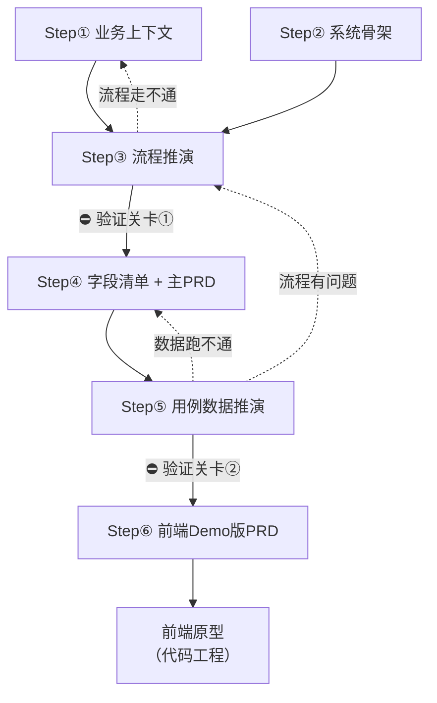

# 文档模板执行索引

> **定位**：AI 进入模板目录时的**第一个入口文件**。定义模板的执行顺序、依赖关系和跳过条件。
>
> **使用方式**：当用户要求"帮我设计 XX 模块"或"从头输出 XX 的文档"时，AI 应先读本文件，按顺序确认每一步的产出物。

---

## 目录结构与执行顺序对应关系

| 目录 | 对应步骤 | 内容 |
| :--- | :--- | :--- |
| `01-业务上下文/` | Step① | 业务背景、范围、关键决策 |
| `02-流程推演与验证/` | Step③⑤ | 业务流程推演（规则层）+ 业务场景数据推演（实例验证层） |
| `03-业务PRD/` | Step④ | 主PRD、主数据PRD、状态机设计 |
| `04-前端Demo PRD/` | Step⑥ | Demo PRD 模板 + 简单型/标准型文档集 |
| `05-全局规范/` | 全程 | 跨模块字段校验规范（被 Demo PRD 引用） |

## 执行顺序总览

```
宏观层 ─────────────────────────────────────────────────────
  Step① 业务上下文        → 01-业务上下文/业务上下文模板.md
  Step② 系统骨架          → 无固定模板（Mermaid 图 + 表格）
  Step③ 场景流程推演      → 02-流程推演与验证/业务流程推演说明模板.md
                            ⛔ 验证关卡①：流程走不通，回 ①② 调整
中观层 ─────────────────────────────────────────────────────
  Step④ 字段清单 + 主PRD  → 字段清单模板（04-前端Demo PRD 文档集）+ 03-业务PRD/主PRD模板.md（标准型）
                            简单型不写主PRD，业务规则合并到 Step⑥ 的 PRD 模板
  Step⑤ 用例数据推演      → 02-流程推演与验证/业务场景数据推演模板.md
                            ⛔ 验证关卡②：数据跑不通，回 ④ 或 ③ 调整
微观层 ─────────────────────────────────────────────────────
  Step⑥ 前端Demo版PRD    → 04-前端Demo PRD/标准型页面&模块的PRD文档集（复杂单据，按页面拆分）
                            或 04-前端Demo PRD/简单型页面&模块的PRD文档集（主 PRD + Demo PRD 合一）
        前端原型           → 无模板（代码工程）
```

---

## 逐步执行指南

### Step① 业务上下文

| 项目 | 说明 |
| :--- | :--- |
| **模板** | `01-业务上下文/业务上下文模板.md` |
| **输入** | 用户提供的业务背景、痛点、范围 |
| **产出** | `{业务域名称}_业务上下文.md` |
| **粒度** | 按业务域，一域一份 |
| **跳过条件** | 用户已提供完整的业务背景文档，或项目已有业务上下文 |

### Step② 系统骨架

| 项目 | 说明 |
| :--- | :--- |
| **模板** | 无固定模板 |
| **产出** | 实体关系图（Mermaid ER）+ 模块流转表 + 共享机制说明 |
| **跳过条件** | 单模块设计、项目已有系统骨架 |

### Step③ 场景流程推演

| 项目 | 说明 |
| :--- | :--- |
| **模板** | `02-流程推演与验证/业务流程推演说明模板.md` |
| **前置依赖** | Step① 业务上下文（知道做什么场景） |
| **产出** | `{场景名称}_业务流程推演.md`，场景分配稳定 `SC-` 编号 |
| **粒度** | 按业务场景，一场景一份 |
| **跳过条件** | 极简单模块（如主数据CRUD）无流程可推 |
| **关卡** | ⛔ 流程走不通 → 回 Step① 或 ② 调整 |

### Step④ 字段清单 + 主PRD

| 项目 | 说明 |
| :--- | :--- |
| **模板** | 字段清单模板（`04-前端Demo PRD/简单型页面&模块的PRD文档集/` 或 `标准型页面&模块的PRD文档集/`）+ `03-业务PRD/主PRD模板.md` |
| **前置依赖** | Step③ 流程推演（知道有哪些字段和规则） |
| **产出** | `{模块名}字段清单.md` + `{模块名}PRD.md`（如需） |
| **粒度** | 按模块，一模块各一份 |
| **主PRD 跳过条件** | 简单型模块（主数据CRUD、外部只读接入）→ 不单独写主PRD，业务规则合并到 Demo PRD（即简单型 `PRD模板.md`） |
| **主PRD 选型** | 业务单据 → A 部分；配置与规则 → B 部分（详见主PRD模板头部选型指南） |

> ⚠️ **执行顺序约束**：先写字段清单，再写主PRD。主PRD 引用字段清单中的字段名称，不重复定义。

### Step⑤ 用例数据推演

| 项目 | 说明 |
| :--- | :--- |
| **模板** | `02-流程推演与验证/业务场景数据推演模板.md` |
| **前置依赖** | Step④ 字段清单 + 主PRD（有具体字段和规则才能代入数据） |
| **产出** | `{模块名}业务场景数据推演.md`，每个用例引用 Step③ 的 `SC-` 场景编号 |
| **跳过条件** | 极简模块（无金额计算、无状态机、无上下游流转） |
| **关卡** | ⛔ 数据跑不通 → 回 Step④ 修正字段/规则，必要时回 Step③ |

### Step⑥ 前端Demo版PRD

| 项目 | 说明 |
| :--- | :--- |
| **模板** | 先读 `04-前端Demo PRD/标准型页面&模块的PRD文档集/` 或 `简单型页面&模块的PRD文档集/` 对应模板 |
| **前置依赖** | 简单型：Step④ 字段清单（业务规则在本文件内写）；标准型：Step④ 字段清单 + 主PRD |
| **产出** | 简单型：`{模块名}_PRD.md`（主 PRD + Demo PRD 合一）+ 页面骨架；标准型：按页面拆分（列表页/新增编辑页/详情页）+ 页面骨架 |
| **选型** | 无审核流/外部同步/下游单据生成 → 简单型（合一）；否则 → 标准型（拆分） |
| **维护形态** | 写简单型前先选：标准主数据=独立详情/表单页；轻量配置/字典=工作台+弹窗（必读 `07-UI规范库/08-轻量配置与弹窗表单约定.md`），禁止照搬操作日志详情页 |
| **校验规范** | 新增/编辑页必须引用 `05-全局规范/进销存新增编辑表单字段全局校验规范.md` |

---

## 依赖关系图



---

## 快速参考：常见任务 → 从哪一步开始

| 用户要求 | 从哪步开始 | 说明 |
| :--- | :--- | :--- |
| "帮我设计 XX 模块"（从零开始） | Step① | 全流程 |
| "我已有业务背景，帮我做流程推演" | Step③ | 跳过 ①② |
| "帮我写 XX 的字段清单和PRD" | Step④ | 确认业务背景和流程已有 |
| "帮我生成 XX 的前端Demo版PRD" | Step⑥ | 确认字段清单已存在 |
| "帮我出 XX 的前端原型" | Step⑥ → 代码 | 确认 Demo PRD 已存在 |
| "帮我验证 XX 的数据闭环" | Step⑤ | 确认字段清单和主PRD已有 |

---

## 模板文件清单

| 文件名 | Step | 说明 |
| :--- | :--- | :--- |
| `01-业务上下文/业务上下文模板.md` | ① | 业务背景+范围+关键决策 |
| `02-流程推演与验证/业务流程推演说明模板.md` | ③ | 规则层：场景定义、状态变化、数量流转、异常收口 |
| `02-流程推演与验证/业务场景数据推演模板.md` | ⑤ | 实例验证层：固定数据跑通流程闭环 |
| `03-业务PRD/主PRD模板.md` | ④ | A.业务单据 + B.配置规则（含选型指南） |
| `03-业务PRD/PRD模板-主数据.md` | ④ | 重型主数据类功能 PRD（有审核流、多组织权限） |
| `03-业务PRD/状态机设计模板.md` | ④ | 单据状态机输出格式 |
| `04-前端Demo PRD/简单型页面&模块的PRD文档集/字段清单模板.md` | ④ | 简单模块字段定义 SST |
| `04-前端Demo PRD/简单型页面&模块的PRD文档集/页面骨架模板.md` | ⑥ | 简单模块页面结构、区域顺序、字段投影 |
| `04-前端Demo PRD/简单型页面&模块的PRD文档集/PRD模板.md` | ④⑥ | 简单模块 PRD（主 PRD + Demo PRD 合一，含业务规则+页面规格） |
| `04-前端Demo PRD/标准型页面&模块的PRD文档集/字段清单模板.md` | ④ | 复杂单据字段定义 SST |
| `04-前端Demo PRD/标准型页面&模块的PRD文档集/页面骨架模板.md` | ⑥ | 页面结构、区域顺序、字段投影 |
| `04-前端Demo PRD/标准型页面&模块的PRD文档集/前端Demo_列表页模板.md` | ⑥ | 复杂单据-列表页 |
| `04-前端Demo PRD/标准型页面&模块的PRD文档集/前端Demo_新增编辑页模板.md` | ⑥ | 复杂单据-新增/编辑页 |
| `04-前端Demo PRD/标准型页面&模块的PRD文档集/前端Demo_详情页模板.md` | ⑥ | 复杂单据-详情页 |
| `04-前端Demo PRD/Demo PRD模板（含校验规范）.md` | ⑥ | Demo PRD 编写原则（页面级规格输入，不重复定义字段） |
| `05-全局规范/进销存新增编辑表单字段全局校验规范.md` | 全程 | 全系统共用字段输入、校验时机、错误反馈规范 |
