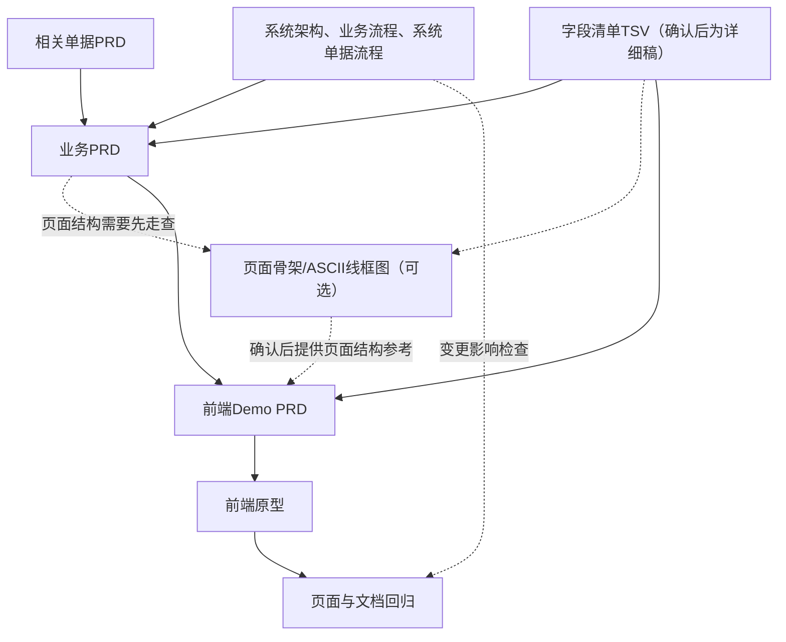

# QS-JXC 产品经理使用AI输出相关产出物的工作流与方法论

很多产品经理第一次让AI参与PRD和原型工作时，都会遇到一个类似的问题：资料越整理越多，字段清单、业务PRD、页面骨架、Demo PRD、原型各有一份，最后却说不清谁是依据，哪份文件需要更新，哪份只是为了走查临时生成的。

QS-JXC当前采用一条更简单的主线：跨模块的系统架构、业务流程和系统单据流程作为上游依据，字段清单作为字段事实源，业务PRD承接单据自身的业务契约，前端Demo PRD负责页面表现和交互细节。页面骨架只在页面结构需要先走查时使用，不是每个模块都必须生成的固定产物。

这套方法要解决的不是“把所有文档都补齐”，而是让每个产出物只承担一类问题，并且让AI知道下一步应该依据什么、不能擅自补什么。

## 一、先明确：AI不是从空白开始写PRD

在QS-JXC项目中，AI进入具体模块设计时，通常已经有以下上游资料：

- 系统架构说明：说明系统边界、模块关系和模块定位；
- 业务流程和系统单据流程：说明跨角色的业务接力，以及单据、库存、往来等系统处理关系；
- 相关单据PRD：说明上下游单据各自负责什么，避免在当前单据中重复定义；
- 字段清单TSV：说明当前模块有哪些字段，以及字段的基本定义。

这意味着，产品经理不需要为了形式完整，再为每个模块机械增加一份业务流程推演文档或用例数据推演文档。

如果已有业务流程和系统单据流程能够说明跨模块业务怎么走，直接把它们作为业务PRD的输入和关联阅读入口即可，不要把完整流程复制进每一张单据 PRD。只有在现有资料无法回答当前单据的关键问题时，才需要在单据 PRD中补足具体缺口。比如状态之间无法衔接、数量口径互相冲突、下游单据的触发时点不明确，这时应补足单据边界和规则，而不是为了“流程完整”新增一套重复文档。

## 二、最终工作流

QS-JXC的标准产出链路可以收敛为：



具体顺序是：

1. 读取系统架构、业务流程、系统单据流程和必要的相关单据PRD，确认模块在系统中的位置、上下游边界和交接点。
2. 先整理字段清单初稿，用于临时过渡和范围走查；字段确认后生成详细稿，并以详细稿作为后续维护的字段事实源。
3. 编写业务PRD，整理背景、需求范围、功能清单、业务对象、状态流转、状态—功能矩阵、核心规则、异常边界和关联文档入口。
4. 如果页面结构尚不清楚，再根据业务PRD和字段清单快速画页面骨架或ASCII线框图；如果已有页面方案或 Demo PRD足以承载页面走查，则跳过此步。
5. 编写前端Demo PRD，补齐页面结构、控件、交互、校验和反馈；Demo PRD只把业务PRD中的规则翻译成页面表现，不重新创造业务规则。
6. 根据前端Demo PRD开发或生成前端原型。
7. 对照业务PRD、字段清单、相关流程文档和Demo PRD做一次交叉回归检查。

这条链路中，页面骨架是可选的中间产物，字段清单不是业务PRD，完整业务/系统流程也不是单据PRD的重复副本。每份文档只承担自己的问题。

## 三、不同产出物各自负责什么

### 1. 跨模块流程和相关单据PRD：业务上下文源

单据 PRD不是跨模块流程的替代品。对于采购订单这类上下游关系明显的单据，通常要先读取并关联三类资料：

- 业务流程文件：说明业务由谁发起、谁接力、谁做决策，以及业务如何结束；
- 系统单据流程文件：说明单据如何衔接，以及收货、库存、成本、应付等系统结果何时发生；
- 相关单据 PRD：说明上游或下游单据各自负责什么，避免当前 PRD重复定义别的单据的细节。

这些资料是当前单据 PRD的业务上下文和边界依据。当前 PRD需要保留本单据的关键交接点、生效点、回写结果和异常边界，并提供明确的阅读入口；不需要复制完整的流程图、时序图或下游单据规则。

### 2. 字段清单TSV：字段事实源

> **初稿与详细稿的维护边界：** 字段清单初稿是从粗纲到详细稿之间的临时过渡产物，用于先搭建字段范围、补齐讨论材料和支持阶段性走查。字段确认并生成详细稿后，以详细稿作为当前字段事实源；后续字段变更、下游同步和回归检查都以详细稿为入口。初稿可以保留作过程记录，但不再继续更新和维护，也不能与详细稿并列作为两个现行版本。

TSV只维护字段本身的稳定信息，建议保留：

```text
字段分组
字段名称
字段类型
字段来源
必填条件
取值、格式或枚举
字段说明
字段级约束
计算或回写说明
```

例如“采购数量”可以记录：

```text
字段名称：采购数量
字段类型：整数
字段来源：用户填写
必填条件：提交审核时必填
取值范围：正整数，大于0
字段说明：本次向供应商采购的数量
字段级约束：必须为正整数
```

字段清单不需要承载所有页面细节。为了避免TSV过宽，不建议把以下内容不断增加到字段清单中：

- 查询区第几个位置；
- 控件占几列；
- placeholder；
- 下拉列表的具体样式；
- 远程搜索的触发方式；
- 加载中、空结果和失败反馈；
- 错误提示出现在哪里；
- 页面布局和按钮排列。

这些内容属于页面交互，应放在前端Demo PRD。

字段清单也不应该维护一份对应的模块级Markdown副本。否则会同时出现：

```text
采购订单字段清单.tsv
采购订单字段清单.md
```

一旦两份文件都可以被修改，就会出现新的疑问：哪一份才是最新字段定义？因此，当前方案只保留TSV作为字段数据载体；详细稿生成并确认后，由详细稿作为字段唯一来源。需要阅读和走查时，通过表格工具、编辑器或预览方式查看，不再额外维护一份Markdown字段清单。

### 3. 业务PRD：业务规则源

业务PRD负责回答“这个单据或模块在业务上负责什么、支持什么、受到什么约束”。它不是所有相关资料的合集，至少应整理以下内容：

- 业务背景和要解决的问题；
- 本期需求范围和非本期范围；
- 功能清单；
- 业务对象和宏观关系，必要时附概念 ER 图；
- 状态流转；
- 状态—功能矩阵；
- 核心业务规则；
- 跨字段、跨状态和跨单据约束；
- 异常处理；
- 业务生效点及下游影响；
- 关联业务流程、系统单据流程、字段清单和页面 Demo 的阅读入口。

例如，“采购数量必须大于0”可以在字段清单中作为字段级约束；但“提交审核时所有明细行都必须通过数量校验”“入库数量不得超过未入库数量”，属于业务动作和上下游规则，应写入业务PRD。

业务PRD不需要重复维护完整字段表，不需要复制完整业务流程和系统流程，也不需要描述每个输入框使用什么前端组件。页面范围最多保留页面清单和关联入口，详细页面结构由前端Demo PRD负责。

业务PRD也不强制单独维护“业务验收标准”章节。状态流转表、业务规则表和异常处理表中的前置条件、系统结果和阻断结果，本身就应该是可验证的业务口径；详细测试用例或验收清单应在需要时独立生成，避免和业务规则重复维护。

### 4. 页面骨架：可选的快速走查中间产物

页面骨架的目的，是在页面结构还没有形成方案时，把业务PRD和字段清单快速摆到页面上，供产品经理确认页面结构是否合理。它是可选的中间产物，不是每个模块都必须创建的固定文件。

如果已有页面方案、截图或前端Demo PRD足以完成页面走查，可以直接进入前端Demo PRD，不必为了满足流程形式创建一份空的页面骨架文件。

它主要表达：

- 本期有哪些页面和容器；
- 页面从上到下有哪些区域；
- 字段大致放在哪个区域；
- 表格有哪些核心列；
- 主要动作大致放在哪里；
- 是否需要弹窗、抽屉或选择器。

采购订单页面骨架可以先画成：

```text
采购订单列表
├── 状态Tab
├── 查询区
├── 工具栏
└── 订单表格

采购订单新增/编辑
├── 基本信息
├── 采购信息
├── 商品明细
└── 页面操作区

采购订单详情
├── 页头、状态和动作
├── 基本信息
├── 采购信息
├── 商品明细
├── 关联采购入库单
└── 制单信息
```

页面骨架不负责：

- 状态流转；
- 按钮显示条件；
- 完整校验规则；
- 控件类型和组件参数；
- 搜索远程请求；
- 错误提示和Toast；
- Mock数据；
- 接口和代码实现。

页面骨架是中间产物，可以快速修改，甚至在确认后被下一版覆盖。它不是业务规则源，也不是页面交互的完整规格。如果文件没有实际内容，也不能被其他文档当作当前依据。

### 5. 前端Demo PRD：页面表现和交互源

前端Demo PRD负责回答“字段在这个页面上具体怎么操作”。它可以按列表页、新增编辑页、详情页拆分。

前端Demo PRD中应补充：

- 控件类型；
- 字段展示格式；
- placeholder和空态；
- 是否支持清空；
- 搜索方式和搜索结果展示；
- 字段联动；
- 输入校验的触发时机；
- 错误提示的位置和文案；
- 保存、提交、审核等动作的页面反馈；
- 不同状态下的页面表现；
- 分页、排序、展开收起和弹窗行为；
- Mock数据覆盖的状态和边界。

例如，字段清单只需要记录：

```text
供应商：主数据引用，选择启用中的供应商，展示编码和名称。
```

列表页Demo PRD再具体写：

```text
供应商筛选控件使用可搜索单选下拉框，支持按编码或名称查询。
选项展示“供应商编码 + 供应商名称”，支持清空。
搜索结果为空时展示“暂无匹配供应商”。
```

前端Demo PRD可以描述状态对应的页面表现，但不能自行创造状态、动作或业务规则。按钮是否显示，必须来自业务PRD中的状态—操作矩阵。

## 四、字段约束、业务规则和页面交互如何分层

“字段约束”这个词经常导致文档重复，最好拆成三类：

| 类型 | 示例 | 负责文档 |
|---|---|---|
| 字段事实 | 类型是整数、来源是用户填写、最大长度200 | 字段清单TSV |
| 业务约束 | 审核后不可修改、入库数量不能超过未入库数量 | 业务PRD |
| 页面约束 | 失焦时校验、错误显示在明细行下方、使用NumberInput | 前端Demo PRD |

再以采购数量为例：

```text
字段清单TSV：正整数，大于0。

业务PRD：提交审核时，每个有效商品明细行都必须填写采购数量；审核通过后不可修改。

前端Demo PRD：使用NumberInput；失焦时执行格式校验；提交审核时执行全量校验；错误定位到对应明细行。
```

这三层不是重复，而是在回答三个不同问题：字段是什么、业务怎么限制、页面怎么让用户完成操作。

## 五、文件应该如何组织

模板和实际业务产出物分开。模板放在模板库，实际模块文件放在对应业务模块目录。

一个模块的实际文档包可以是：

```text
采购订单/
├── 采购订单主PRD.md
├── 采购订单_页面骨架.md（可选）
└── 前端Demo_PRD合集/
    ├── 采购订单_列表页.md
    ├── 采购订单_新增编辑页.md
    └── 采购订单_详情页.md
```

业务流程、系统单据流程和相关单据PRD可以放在各自的公共目录或单据目录，由主 PRD中的“关联文档与阅读入口”引用。字段清单TSV放在字段清单目录，由主 PRD或模块索引引用。目录可以暂时同时保留“初稿”和“详细稿”两个文件，但确认前由初稿承担过渡和走查作用；详细稿生成并确认后，主 PRD、Demo PRD和其他下游文档应引用详细稿。模块目录不再复制一份 Markdown 字段清单。

这样组织的好处是：

- 一个业务模块的主 PRD和页面 Demo集中在一起，跨模块流程和字段基线仍由各自的公共文档承载；
- 详细稿成为确认后的字段唯一来源，初稿只保留作过程记录；
- Demo PRD可以按页面拆分，不让单个文件过长；
- 页面骨架只有在确实需要页面结构走查时才创建；
- 关联文档有明确入口，读者不需要在目录中猜测完整流程在哪里；
- 模板和实际文档不会混淆。

## 六、让AI输出时，先给边界，再给任务

不要只对AI说“帮我写采购订单PRD”或“帮我生成页面”。AI需要知道输入材料和每份文件的职责。

一个可复用的任务结构是：

```text
输入材料：
1. 系统架构说明、业务流程和系统单据流程
2. 当前字段清单详细稿TSV；如果详细稿尚未生成，再读取字段清单初稿作为临时输入
3. 相关上下游单据PRD
4. 已确认的项目级规则

当前任务：
只输出采购订单业务PRD / 页面骨架 / 列表页Demo PRD中的一种。

权威边界：
- 字段名称、类型、来源、枚举和字段级约束以TSV为准。
- 当前单据的业务背景、功能、状态、动作和规则以业务PRD为准。
- 跨模块角色接力以业务流程文件为准，跨单据系统处理以系统单据流程文件为准。
- 页面骨架只表达结构，不新增业务规则；如果没有实际内容，不把它当作依据。
- Demo PRD只表达页面控件、交互、校验和反馈，不创造新的字段、状态或业务动作。

输出要求：
- 不重复维护上游文档已经确认的内容。
- 完整业务流程、系统流程、字段表和页面细节只建立关联入口，不在当前产物中复制。
- 发现缺失或冲突时列出问题，不自行补全为已确认事实。
- 输出完成后列出受影响的下游文档。
```

AI最好一次只完成一个层次的产物。先让它读取流程资料和TSV，形成业务PRD；如果页面结构需要先走查，再画页面骨架；如果不需要，可以直接根据业务PRD和TSV生成Demo PRD。一次要求AI同时生成所有文件，看起来节省时间，实际上更容易把字段、规则和页面细节混在一起。

## 七、变更时先改哪份文件

后续维护时，先判断变化属于哪一层：

| 变化 | 第一修改入口 | 后续检查 |
|---|---|---|
| 字段名称、类型、来源、枚举变化 | 字段清单详细稿TSV | 业务PRD、页面骨架、Demo PRD |
| 字段级范围、格式、计算变化 | 字段清单详细稿TSV | 业务PRD、Demo PRD、原型 |
| 状态、动作、业务规则变化 | 业务PRD | 字段清单详细稿TSV、页面骨架、Demo PRD |
| 跨角色业务流程变化 | 业务流程文件 | 受影响的单据PRD、页面 Demo和相关业务规则 |
| 跨单据系统处理变化 | 系统单据流程文件 | 受影响的单据PRD、字段清单和页面 Demo |
| 页面结构或字段位置变化 | 页面骨架（如使用）或前端Demo PRD | 其他页面产出物、原型和页面关联入口 |
| 控件、校验时机、反馈文案变化 | 前端Demo PRD | 原型 |

页面骨架或 Demo 变化不一定要修改业务PRD；跨角色流程和业务状态变化也不能只修改页面 Demo。先找真正的上游，再同步受影响的下游文件。跨模块流程文件变化后，还要检查各单据 PRD中的关联入口和本单据边界是否仍然成立。

## 八、交付前的最小检查

每次让AI生成一组产出物后，至少检查以下内容：

- 业务PRD中的字段名称是否都能在当前字段清单详细稿TSV找到；
- 业务PRD有没有重复定义或改写字段枚举、类型和必填性；
- 如果存在页面骨架，是否只包含页面结构，没有混入完整业务规则；
- Demo PRD是否使用了字段清单中不存在的字段；
- Demo PRD是否创造了操作矩阵中不存在的按钮或状态；
- 搜索、表单校验和反馈是否落在具体页面交互中；
- 业务PRD中的功能编号是否与状态—功能矩阵、页面 Demo中的操作对应；
- 主 PRD中的流程、字段和页面关联入口是否能打开，并且说明了各自负责什么；
- 主 PRD是否重复复制了完整业务流程、系统流程、字段表或页面规格；
- 业务PRD、页面骨架（如有）和Demo PRD中的页面范围是否一致；
- 字段、状态、动作发生变化后，旧名称和旧规则是否还残留在下游文件中。

## 结语：少一份重复文件，反而更容易让AI做对

AI参与产品设计时，文件越多不代表上下文越完整。真正重要的是每份文件都知道自己负责什么，其他文件不重复抢同一个职责。

QS-JXC当前最小、清晰的文档链路是：

```text
系统架构说明、业务流程、系统单据流程、相关单据PRD
→ 字段清单初稿
→ 字段确认后的详细稿TSV
→ 业务PRD
→ 页面骨架（可选）
→ 前端Demo PRD
→ 前端原型
→ 测试用例或验收清单（按需独立生成）
```

其中，确认后的详细稿TSV是字段唯一来源，业务PRD是当前单据业务规则来源，业务流程和系统单据流程分别是跨角色流程和跨单据系统处理的来源，页面骨架是可选的快速走查产物，前端Demo PRD是页面表现和交互来源，测试用例或验收清单按需独立承载验证工作。只要这些边界不混，AI输出的文件就能被逐层检查、逐层修正，而不会因为增加一份“看起来更完整”的文档，反而制造新的版本冲突。
