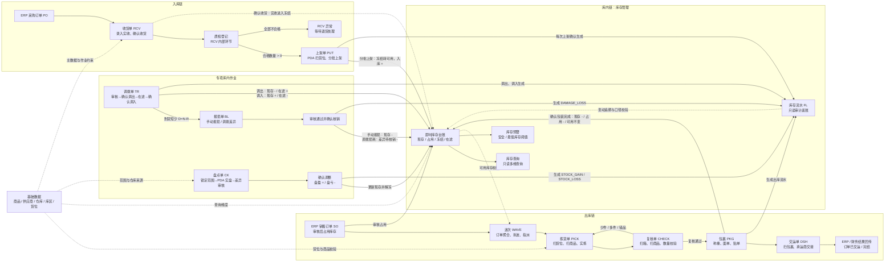
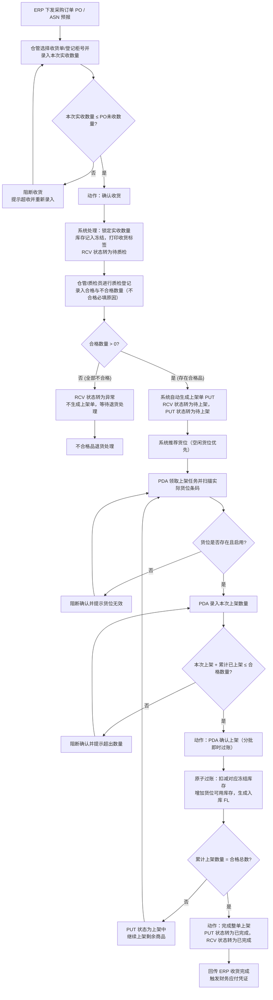
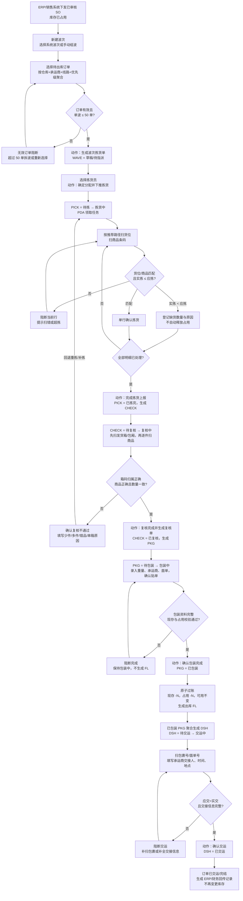

# Forge WMS 产品结构图与核心交互流程

> 梳理范围：`prd-docs/` 下基础数据、入库、出库、库存、盘点、报损、调拨共 117 份 Markdown PRD，并以 `front-prototype/src/pages/` 中的列表、详情和执行页核对交互入口。
>
> 口径原则：单据流转和库存过账以各模块主 PRD 及业务流程推演为准；前端原型用于确认页面路径、动作按钮和当前 Demo 落地方式。

## 1. 产品结构图

### 1.1 结构解读

| 业务域 | 核心单据 / 页面 | 上下游关系 | 库存边界 |
|:--|:--|:--|:--|
| 基础数据 | 商品、供应商、仓库、库区、货位 | 为收货、上架、拣货、库存、盘点、调拨提供 SSOT 和作业校验 | 主数据本身不过账，停用后不进入新作业候选 |
| 入库 | `PO → RCV → 质检 → PUT` | RCV 由 PO 下推；质检是 RCV 内部环节；合格品自动生成 PUT | 收货确认进入冻结；PUT 每次上架确认即冻结转可用并生成 FL |
| 出库 | `SO → WAVE → PICK → CHECK → PKG → DSH` | 波次组织订单，后续单据由上一环节系统下推，不允许无来源新建 | SO 审核先占用；WAVE/PICK/CHECK 不实扣；PKG 包装完成是唯一实扣点；DSH 不再过账 |
| 库存 | 即时库存、库存流水 FL、库存预警 | 承接所有作业结果，向业务单据提供可用、冻结、在途校验 | 查询和预警均只读；库存只能被业务动作改变，FL 不允许编辑或删除 |
| 盘点 | `CK` | 创建范围、冻结、PDA 实盘、差异报告、主管审核、确认调整在 CK 内闭环 | 只有“审核通过并确认调整”才按盘盈/盘亏更新现存并生成 FL |
| 报损 | `BL` | 来源为手动报损或 TR 到货短少；一道主管/财务审核 | 手动报损待审核时冻结，核销时现存减少；调拨损耗只减“差异待核销”，不二次减现存 |
| 调拨 | `TR` | WMS 创建或 ERP 下发；审核后调出，调入仓实收；短少自动生成 BL | 调出现存减少并进入在途；调入按实收增加现存、清理在途；在途不可销售 |

## 2. 入库链核心交互流程

### 2.1 前端原型交互映射

| 环节 | 前端页面 | 核心交互 / 按钮 | 流转结果 |
|:--|:--|:--|:--|
| 收货登记 | `InboundList.tsx` / `InboundForm.tsx` / `InboundDetail.tsx` | 新建收货单、选择 PO、录入“本次实收数量”、“确认收货” | RCV 状态由“待收货”转为“待质检”，库存记入冻结 |
| 质检登记 | `InboundDetail.tsx` | 点击“质检登记”、录入合格与不合格数量/原因、点击“质检合格放行”或“质检全部不合格退货” | 判定合格时状态转为“待上架”，系统自动生成上架单 PUT；判定全部不合格时转为“异常”，不生成上架单 |
| 上架分配/查看 | `PutawayList.tsx` / `PutawayDetail.tsx` | 查看上架任务列表、查看实际上架货位与推荐货位、领取上架任务 | 查看作业进度，关联库存流水 FL |
| PDA 上架确认 | `PdaInbound.tsx` | 输入收货单号、选择商品、PDA 扫实际货位条码、录入实际上架数量、“确认上架” | 分批即时过账（冻结转可用并即时生成对应的入库 FL）；全部完成后 PUT 和 RCV 均转为“已完成”，并回传 ERP 触发财务应付 |

### 2.2 入库状态与库存过账要点

1. **无源不新建**：收货单（RCV）必须从 ERP 的采购订单（PO）或 ASN 下推生成，不支持无来源手动新建，确保进销存主账一致。
2. **收货即冻结**：“确认收货”时仅将本次实收数量锁入待质检状态，库存过账表现为“质检/待上架冻结”，此阶段库存不可销售、不可出库。
3. **质检登记在单据内闭环**：质检是收货单的内部环节，不生成独立的 QC 业务单据。质检合格数量大于 0 时，系统自动下推生成上架单（PUT）；全部不合格时转为异常单，不生成 PUT。
4. **PDA 分批即时过账**：上架作业使用 PDA 执行，支持多货位分批上架。PDA 每次提交上架确认时即时过账（扣减冻结库存、增加指定货位的可用库存、即时生成对应的入库 FL），不等待整单完成。
5. **已完成状态触发回传**：当累计上架数量等于合格总数时，上架单（PUT）与收货单（RCV）同步转为“已完成”状态，触发 WMS 向 ERP 回传收货回执，并向财务系统发送入库应付消息。

## 3. 出库链核心交互流程

### 3.1 前端原型交互映射

| 环节 | 前端页面 | 核心交互 / 按钮 | 流转结果 |
|:--|:--|:--|:--|
| 波次 | `WaveList.tsx` / `WaveForm.tsx` / `WaveDetail.tsx` | 新建波次、选择订单、“生成波次拣货单”、“确定分配并下推拣货” | WAVE 进入拣货中，生成/关联 PICK |
| 拣货 | `PickingForm.tsx` / `PickingList.tsx` / `PickingDetail.tsx` | 单行“确认拣货”、数量阻断、“完成拣货上报” | 拣货完成，进入 CHECK |
| 复核 | `CheckForm.tsx` / `CheckList.tsx` / `CheckDetail.tsx` | 单行“复核确认”、全量一致校验、“复核完成并生成复核单” | 通过后进入 PKG；PRD 要求差异时可退回 PICK |
| 包装 | `PackageForm.tsx` / `PackageList.tsx` / `PackageDetail.tsx` | 维护包裹重量和面单，“确认包装完成” | 生成 PKG 记录，扣现存、释放占用、生成 FL，进入 DSH |
| 交运 | `ShipForm.tsx` / `ShipList.tsx` / `ShipDetail.tsx` | 核对包裹、录入交接时间，“确认交运” | 订单完结并回传；按 PRD 口径不再库存过账 |

### 3.2 出库状态与库存过账要点

1. **WAVE 是调度和进度容器**：原型用 `DRAFT → PICKING → PICKED → CHECKED → SHIPPED` 表达出库整体进度；PICK、CHECK、PKG、DSH 仍是独立业务单据。
2. **占用在波次之前发生**：SO 审核时已将可用库存转为占用；WAVE 只聚合已进入出库链的需求，不重复占用。
3. **PICK 和 CHECK 不实扣**：拣货完成、复核通过或复核退回均不减现存、不释放占用、不生成 FL。
4. **PKG 是唯一出库实扣点**：“确认包装完成”必须将 PKG 完成、现存减少、占用释放、FL 生成作为一个原子动作；任一校验失败均整体回滚。
5. **DSH 是链尾交接单**：只接收已包装 PKG，负责承运商交接、订单完结和结果回传，不再变更现存、占用、可用，也不再生成出库 FL。

## 4. 口径差异与使用说明

| 事项 | PRD 权威口径 | 当前前端原型 | 本文档处理 |
|:--|:--|:--|:--|
| 出库实扣时点 | PKG “确认包装完成”扣现存、释放占用并生成 FL；DSH 不过账 | `PackageForm.tsx` 已按此执行，但 `ShipForm.tsx` 仍存在“确认交运装车（扣减库存）”及相关说明 | 两张图均以 PRD 为准：包装完成过账，交运只完结与回传 |
| 收货流水时点 | RCV 确认后实收进入冻结；PUT 每次上架确认时生成入库 FL | `InboundDetail.tsx` 的收货确认提示中出现“已生成收货流水” | 产品结构图以 PUT 上架确认为入库 FL 生成点 |
| 质检不合格处理 | 质检全不合格直接在 RCV 内标记为“异常”状态并保留轨迹，不生成 PUT，后续进入退货闭环 | `InboundDetail.tsx` 中质检不合格判定会调用 API 将单据物理“作废（VOIDED）”并阻断后续步骤 | 核心交互图以 PRD 权威口径为准，标记状态为“异常”以支撑二期退货流程，不作废单据 |
| 复核异常回退 | CHECK 少件、多件、错品、串箱必须填原因并退回 PICK 重拣/补拣 | 当前 `CheckForm.tsx` 主要实现“数量完全一致才可完成”，未完整展开退回拣货交互 | 核心交互图保留 PRD 完整回退闭环，不以 Demo 简化代替产品设计 |
| 二期模块 | TR 调拨、BL 报损在主 PRD 中标注为二期规划 | 前端 Demo 已提供列表、表单、详情 and 审核/执行动作 | 产品结构图纳入完整产品架构，但不将 Demo 实现等同于一期上线范围 |

## 5. 产品设计边界

- 所有状态变更必须由动作按钮、PDA 扫码确认或系统下推事件触发，不允许直接编辑状态字段。
- RCV、PUT、PICK、CHECK、PKG、DSH 是作业执行链，不增加审核流；CK、BL、TR 涉及账实调整或资产核销，需要主管/审核人动作。
- 库存查询、库存流水、库存预警都是只读页面，不提供新增、编辑、删除或手工调整库存入口。
- 不展开第三方快递/运输接口、轨迹或运费结算；DSH 仅保留 ERP/财务结果回传的产品级口径。
- 质检是收货单 RCV 的内部环节，不单独生成 QC 单；盘点差异报告和确认调整在 CK 内闭环，不拆独立差异调整单。
