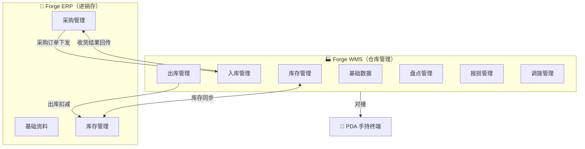

# Forge 产品架构图

> 基于 forge-wms + forge-erp 当前 PRD 现状梳理
> 生成时间：2026-07-09
> 品牌口径：强盛科技 = 演示公司 | Forge = 系统/产品品牌

---

## 一、总览：双系统关系



---

## 二、Forge ERP（进销存系统）

### 模块全景

| 一级模块 | 二级模块 | PRD 状态 | 说明 |
|----------|----------|----------|------|
| **基础资料** | 商品管理 | ✅ 已有 | 商品档案（字段清单+主PRD+Demo） |
| | 供应商管理 | ✅ 已有 | 供应商档案 |
| | 客户管理 | ✅ 已有 | 客户档案 |
| | 仓库管理 | ✅ 已有 | 仓库档案 |
| **采购管理** | 采购订单 | ✅ 已有 | PO（完整 5 件套） |
| | 采购入库单 | ✅ 已有 | PI（执行层，来自PO） |
| | 采购退货单 | ✅ 已有 | PR（退货申请） |
| | 采购退货出库单 | ✅ 已有 | PRO（退货执行） |
| **库存管理** | 即时库存查询 | ✅ 已有 | 现存/占用/可用三口径 |
| | 库存流水查询 | ✅ 已有 | 变动追溯 |
| **销售管理** | — | 🔲 待建 | 销售订单、零售收银 |
| **往来管理** | — | 🔲 待建 | 收付款、对账 |

### 采购链路

```
采购订单(PO) → 采购入库单(PI) → 库存增加
采购退货单(PR) → 采购退货出库单(PRO) → 库存减少
```

### 系统架构（Demo 版技术栈）

```
┌─────────────────────────────────┐
│         前端 React + TS         │
│        Tailwind CSS             │
├─────────────────────────────────┤
│     存储 Dexie.js (IndexedDB)    │
├─────────────────────────────────┤
│        构建 Vite                 │
└─────────────────────────────────┘
        ↕ 数据同步（未来）
┌─────────────────────────────────┐
│    后端 Spring Boot + MySQL      │
│    PDA Android 终端              │
└─────────────────────────────────┘
```

---

## 三、Forge WMS（仓库管理系统）

### 模块全景

| 一级模块 | 二级单据 | PRD 状态 | 说明 |
|----------|----------|----------|------|
| **基础数据** | 商品档案 | ✅ 已有 | WMS 侧主数据 |
| | 供应商档案 | ✅ 已有 | |
| | 仓库档案 | ✅ 已有 | 全国 6 仓 |
| | 库区 | ✅ 已有 | 仓内分区 |
| | 货位 | ✅ 已有 | 最小存储单元 |
| **入库管理** | 收货单(ASN) | ✅ 已有 | 到货登记 → 质检 |
| | 上架单(PT) | ✅ 已有 | 质检合格 → 上架到货位 |
| **出库管理** | 波次(Wave) | ✅ 已有 | 订单汇批、分配库存 |
| | 拣货单(PK) | ✅ 已有 | PDA 指引拣货 |
| | 复核单(CHK) | ✅ 已有 | 拣货后校验 |
| | 包裹(PKG) | ✅ 已有 | 打包称重 |
| | 交运单(SHP) | ✅ 已有 | 交接物流 |
| **库存管理** | 库存查询 | ✅ 已有 | 即时库存（现存/占用/可用） |
| | 库存流水 | ✅ 已有 | 变动明细追溯 |
| | 库存预警 | ✅ 已有 | 安全库存/效期预警 |
| **盘点管理** | 盘点单 | ✅ 已有 | 明盘/盲盘、差异处理 |
| **报损管理** | 报损单(BL) | ✅ 已有 | 独立 8 件套模块 |
| **调拨管理** | 调拨单(TR) | ✅ 已有 | 仓间实物调拨（二期） |

### 核心作业链

```
【入库链】
  采购订单(PO) → 收货单(ASN) → 上架单(PT) → 货位上架 → 库存增加

【出库链】
  销售订单 → 波次(Wave) → 拣货单(PK) → 复核单(CHK) → 包裹(PKG) → 交运单(SHP) → 库存减少

【库内链】
  盘点单 → 盘盈/盘亏 → 库存调整
  报损单 → 审批 → 库存扣减（独立模块，非出库附属）
  调拨单 → 调出仓出库 → 调入仓收货 → 在途可追踪
```

### 系统外部关系

```
        ┌──────────┐
        │ ERP/SCM  │ ← 采购订单下发 / 收货结果回传
        └────┬─────┘
             │
    ┌────────┴────────┐
    │   Forge WMS     │
    └────────┬────────┘
             │
    ┌────────┼────────┐
    │        │        │
    ▼        ▼        ▼
┌──────┐ ┌──────┐ ┌──────┐
│ 财务  │ │ PDA  │ │ WCS  │
│ 系统  │ │ 终端  │ │(未来) │
└──────┘ └──────┘ └──────┘
```

---

## 四、两系统模块对应关系

| 业务域 | Forge ERP | Forge WMS | 关系 |
|--------|-----------|-----------|------|
| 商品 | 商品档案 | 商品档案 | 同步（ERP为源） |
| 供应商 | 供应商档案 | 供应商档案 | 同步（ERP为源） |
| 仓库 | 仓库档案 | 仓库档案+库区+货位 | ERP 管仓，WMS 管位 |
| 采购入库 | 采购入库单(PI) | 收货单+上架单 | PI 确认 → WMS 收货执行 |
| 采购退货 | 采购退货出库单(PRO) | （出库链承接） | PRO 确认 → WMS 出库执行 |
| 库存 | 即时库存+流水 | 库存查询+流水+预警 | 双系统同步，WMS 更细粒度 |
| 盘点 | — | 盘点单 | WMS 独占 |
| 报损 | — | 报损单 | WMS 独占 |
| 调拨 | 一期（轻） | 二期（实物） | ERP 一期做账务级，WMS 二期做仓间实物 |

---

## 五、当前完成度

```
Forge ERP
├── 基础资料    ████████░░ 80%（缺员工/组织）
├── 采购管理    ██████████ 100%（PO+PI+PR+PRO 四件套）
├── 库存管理    ████████░░ 80%（即时库存+流水，缺库存调整）
├── 销售管理    ░░░░░░░░░░ 0%
└── 往来管理    ░░░░░░░░░░ 0%

Forge WMS
├── 基础数据    ██████████ 100%
├── 入库管理    ██████████ 100%
├── 出库管理    ██████████ 100%（波次→拣货→复核→包裹→交运）
├── 库存管理    ██████████ 100%（查询+流水+预警）
├── 盘点管理    ██████████ 100%
├── 报损管理    ██████████ 100%（8件套独立模块）
└── 调拨管理    ██████████ 100%（二期实物调拨）
```

---

## 六、关键设计决策（memory 同步）

| 决策 | 内容 |
|------|------|
| 品牌口径 | 强盛科技=公司，Forge=产品，并存不冲突 |
| 报损定位 | BL 为独立 8 件套模块，非出库附属 |
| 调拨分期 | ERP 一期（门店↔后仓账务级），WMS 二期（仓间实物+在途不可销售） |
| 数量口径 | 三数量分离（订单数≠实收数≠入库数）；库存三口径（现存/占用/可用） |
| 播种定位 | 不是独立模块，是出库链第 3 步（→面试时注意） |
| 效期/统计/供应商预约 | 真实项目 V2/V3 做过，forge 暂未纳入（→面试可讲但分清） |
