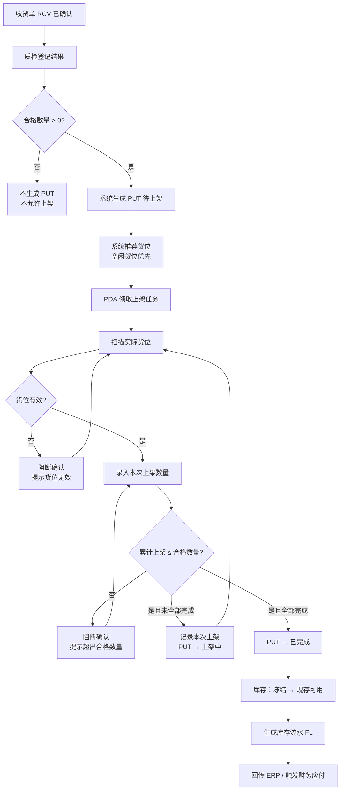
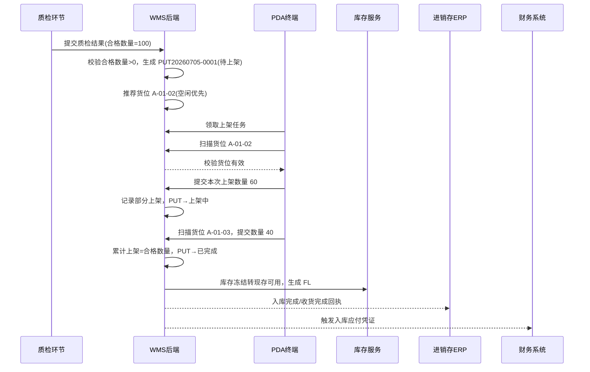

# 上架单_业务流程推演

> 角色：业务流程推演 | 类型：执行作业单
> 使用 2026 年示例数据，推演质检合格生成 PUT 到 PDA 上架完成、库存转可用的全过程。

## 1. 沙盘数据

| 项 | 值 |
|:--|:--|
| 来源收货单 | RCV20260705-0001 |
| 来源质检记录 | QC20260705-0001 |
| 上架单号 | PUT20260705-0001 |
| 仓库 | 上海一仓 |
| 商品 | SKU10086 防静电周转箱 600x400x280 |
| 合格数量 | 100 件 |
| 推荐货位 | A-01-02 |
| 上架人 | 仓管员-陈明 |
| 操作日期 | 2026-07-05 |

## 2. 业务流程图

## 3. 系统时序图

## 4. 主流程步骤

| 步骤 | 角色 | 输入 | 系统处理 | 输出 |
|:--:|:--|:--|:--|:--|
| 1 | 质检员 | 合格数量 | 校验合格数量>0 | 可生成 PUT |
| 2 | WMS | RCV/质检数据 | 生成 PUT，带入商品和合格数量 | PUT 待上架 |
| 3 | WMS | 仓库、商品 | 推荐空闲货位 | 推荐货位 |
| 4 | 仓管 PDA | 实际货位条码 | 校验货位有效性 | 可录入数量 |
| 5 | 仓管 PDA | 本次上架数量 | 校验累计≤合格数量 | 记录上架明细 |
| 6 | WMS | 累计数量 | 判断是否全部完成 | 上架中或已完成 |
| 7 | 库存服务 | 已确认上架数量 | 冻结转现存可用，生成 FL | 可用库存增加 |
| 8 | 系统 | 入库完成事件 | 回传 ERP，触发财务 | 下游同步 |

## 5. 示例推演

### 5.1 第一次上架

| 字段 | 值 |
|:--|:--|
| 合格数量 | 100 件 |
| 历史已上架 | 0 件 |
| 实扫货位 | A-01-02 |
| 本次上架 | 60 件 |
| 累计上架 | 60 件 |
| 状态 | 上架中 |

### 5.2 第二次上架

| 字段 | 值 |
|:--|:--|
| 历史已上架 | 60 件 |
| 实扫货位 | A-01-03 |
| 本次上架 | 40 件 |
| 累计上架 | 100 件 |
| 状态 | 已完成 |
| 库存结果 | 100 件转现存可用，生成 FL |

## 6. 异常流程

### 6.1 质检不合格

- 条件：合格数量=0。
- 处理：不生成 PUT，不允许上架。
- 结果：货品等待退货/异常处理，库存不转可用。

### 6.2 扫描无效货位

- 条件：货位不存在、停用或不属于当前仓库。
- 处理：阻断确认，提示货位无效。
- 结果：PUT 状态不变，不写入上架明细。

### 6.3 上架超量

- 条件：合格 100，历史已上架 60，本次录入 50。
- 处理：阻断确认，提示累计上架数量不能大于合格数量。
- 结果：需调整本次上架数量≤40。

## 7. 流程边界

- PUT 不登记质检结果，只读取质检合格数量。
- PUT 不处理退货；质检不合格品不生成上架任务。
- 只有 PDA 确认上架后的数量才进入现存可用并生成 FL。
