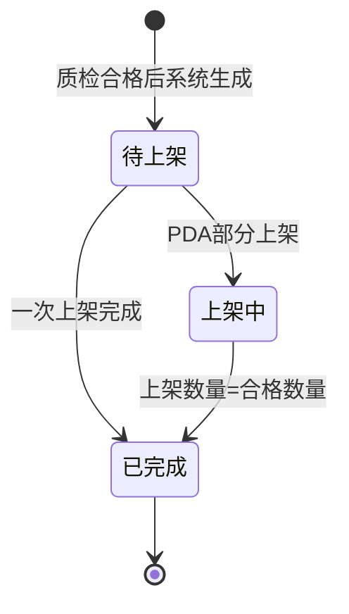

# 上架单_业务规则规格

> 角色：业务规则规格 | 类型：执行作业单
> 覆盖上架单状态机、货位推荐、PDA 扫码校验、数量校验和库存过账时点。

## 1. 状态机

| 当前状态 | 动作 | 目标状态 | 触发端 | 前置条件 | 后置结果 |
|:--|:--|:--|:--|:--|:--|
| - | 生成上架单 | 待上架 | 系统 | 质检完成且合格数量>0 | 生成 PUT，带入来源 RCV 和合格数量 |
| 待上架 | 确认部分上架 | 上架中 | PDA | 货位和数量校验通过，累计<合格数量 | 记录货位和数量，更新进度 |
| 待上架 | 一次上架完成 | 已完成 | PDA/系统 | 本次上架后累计=合格数量 | 库存转可用，生成 FL |
| 上架中 | 继续上架 | 上架中 | PDA | 本次上架后累计<合格数量 | 继续记录多货位明细 |
| 上架中 | 完成上架 | 已完成 | PDA/系统 | 累计上架数量=合格数量 | 库存转可用，生成 FL |

状态字段只读，必须由动作按钮或 PDA 确认触发；不增加审核流。

## 2. 前置规则

| 编号 | 规则 | 说明 |
|:--|:--|:--|
| PUT-R01 | 来源必需 | PUT 必须来源于 RCV 质检合格结果，不允许无来源新增 |
| PUT-R02 | 质检前置 | 质检未完成、全部不合格、合格数量=0 时，不生成 PUT |
| PUT-R03 | 来源锁定 | 来源 RCV、商品、合格数量继承质检结果，不可在 PUT 中修改 |
| PUT-R04 | 单号规则 | PUT 单号按 `PUT{YYYYMMDD}-{4位序号}` 生成，不可编辑 |

## 3. 货位推荐规则

| 编号 | 规则 | 说明 |
|:--|:--|:--|
| LOC-R01 | 空闲优先 | context 明确推荐货位“空闲货位优先” |
| LOC-R02 | 同仓限制 | 推荐货位必须属于当前 PUT 仓库 |
| LOC-R03 | 启用限制 | 停用货位不得推荐，不得上架 |
| LOC-R04 | 可存储限制 | 收货区、退货区等非存储用途货位不作为默认推荐；若基础数据未标识用途，需产品补充 |
| LOC-R05 | 可为空 | 无合适推荐货位时允许为空，由 PDA 人工扫描指定实际货位 |
| LOC-R06 | 人工指定 | 人工指定货位仍必须通过货位有效性校验 |

## 4. PDA 扫码与数量校验

| 编号 | 场景 | 校验规则 | 错误提示/反馈 |
|:--|:--|:--|:--|
| SCAN-R01 | 扫货位 | 货位条码必须存在且属于当前仓库 | `货位无效或不属于当前仓库`，语音+震动 |
| SCAN-R02 | 停用货位 | 停用货位不可上架 | `货位已停用，不可上架` |
| SCAN-R03 | 非存储货位 | 非存储用途货位默认不可上架 | `该货位不可用于上架` |
| QTY-R01 | 本次数量 | 本次上架数量必须为正整数 `>0` | `本次上架数量必须大于 0` |
| QTY-R02 | 累计上限 | `历史已上架 + 本次上架 ≤ 合格数量` | `累计上架数量不能大于合格数量` |
| QTY-R03 | 多货位 | 同一商品可多次确认到不同货位 | 每次记录独立货位和数量 |

## 5. 库存过账规则

| 编号 | 规则 | 说明 |
|:--|:--|:--|
| INV-R01 | 上架前库存 | 质检期间库存状态为冻结，不可销售/占用 |
| INV-R02 | 过账触发 | PDA 确认上架并使对应数量完成上架时，库存从冻结转为现存可用 |
| INV-R03 | 流水生成 | 上架确认生成库存流水 FL，记录时间、仓库、货位、商品、变动类型、数量、变动后现存 |
| INV-R04 | 分批上架 | 分批上架时按每次实际确认数量写入货位库存和 FL；整单累计完成后 PUT 状态变为已完成 |
| INV-R05 | 不提前可用 | 待上架、上架中未确认到货位的剩余数量不得转可用 |

## 6. 上下游规则

| 方向 | 数据 | 触发 | 规则 |
|:--|:--|:--|:--|
| RCV/质检 → PUT | 合格商品与数量 | 质检完成且合格数量>0 | 系统生成 PUT |
| PUT → 库存 | 货位、商品、上架数量 | PDA 确认上架 | 库存转现存可用，生成 FL |
| PUT → ERP | 收货完成回执 | 入库完成 | 按模块主 PRD，上架完成后回传 ERP |
| PUT → 财务 | 入库应付凭证 | 采购入库确认 | 上架完成后触发财务应付 |

## 7. 完成判定

| 判定项 | 规则 |
|:--|:--|
| 明细完成 | `putaway_qty = qualified_qty` |
| 单据完成 | 全部明细完成 |
| 库存可用 | 仅已确认上架的数量进入现存可用 |
| 终态 | PUT 状态=已完成后不可继续修改数量和货位 |

## 8. 不确定性

- context 仅说明“空闲货位优先”，未定义容量、批次、ABC 分类、同 SKU 合并等高级推荐策略；本文不展开复杂算法。
- 用户提到“暂存/在途”，但 context/06 入库质检期间正式库存状态为冻结，本文按冻结→可用写过账。
