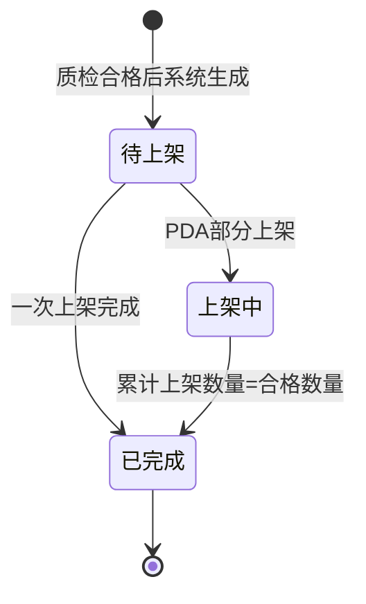

# 上架单主PRD

> 角色：主PRD | 类型：执行作业单
> 权威层级：context/ > 入库管理主PRD > 本文件
> 关联文件：`上架单字段清单.md` `上架单_业务规则规格.md` `上架单_业务流程推演.md` `上架单_用例数据推演.md`

## 1. 业务背景

上架单（PUT）是 Forge WMS 入库链路末环，承接质检合格后的收货结果，指导仓管通过 PDA 将合格品放入实际货位。上架确认后，系统把库存从质检冻结/待上架状态转为现存可用，并生成库存流水 FL，同时支撑 ERP 收货完成回执和财务应付触发。

入库前两环解决“收到多少”和“是否合格”，上架单解决“合格品放到哪里、何时变成可用库存”。如果没有上架单，货品即使已经到仓，也无法形成可销售、可出库的可靠库存；货位错误还会造成后续拣货找不到货、账实不符。

## 2. 功能范围

### 2.1 In Scope

| 功能 | 端 | 说明 |
|:--|:--|:--|
| 质检合格生成上架单 | 系统 | 仅质检有合格品时生成 PUT，质检未过不可上架 |
| 推荐货位 | 系统 | 根据仓库、商品和货位空闲情况推荐货位，空闲货位优先 |
| PDA 领取上架任务 | PDA | 仓管查看待上架任务并开始作业 |
| 扫描货位 | PDA | 扫描实际货位条码，带入实际上架货位 |
| 确认上架数量 | PDA | 输入本次上架数量，支持一单多货位分批上架 |
| 上架完成过账 | 系统 | 累计上架数量达到合格数量后，库存转现存可用并生成 FL |
| PC 列表/详情查看 | PC | 查看上架任务、进度、货位和库存流水关联 |

### 2.2 Out Scope

- 不提供无来源手工新增上架单；PUT 必须来自质检合格的 RCV。
- 不增加审核流，不出现待审核、已审核、反审核等状态。
- 不在上架单内登记质检结果；质检结果由质检环节维护。
- 不处理完整退货流程；质检不合格品不生成上架任务。
- 不涉及 PDA、扫码枪、货架硬件选型。

## 3. 单据定位

| 项 | 说明 |
|:--|:--|
| 单据名称 | 上架单 |
| 单据编码 | PUT |
| 单号规则 | `PUT{YYYYMMDD}-{4位序号}`，如 `PUT20260705-0001` |
| 上游来源 | 收货单 RCV 质检合格结果 |
| 下游去向 | 库存流水 FL、ERP 收货完成回执、财务入库应付凭证 |
| 业务定位 | 记录合格品最终放入哪个货位，是库存转现存可用的触发凭证 |
| 生成方式 | 质检完成且合格数量>0 后系统生成 |

> 口径说明：模块主 PRD 将 PUT 定义为“收货单质检合格后系统自动生成”。本文件按该口径细化，严禁绕过质检合格前置。

## 4. 业务场景

| # | 场景 | 示例 | 系统处理 |
|:--:|:--|:--|:--|
| 1 | 正常上架 | 合格 100 件，推荐货位 A-01-02，一次上架 100 件 | PUT 变为已完成，库存转可用，生成 FL |
| 2 | 一单多货位 | 合格 100 件，A-01-02 上 60 件，A-01-03 上 40 件 | 第一次后上架中，累计 100 后完成 |
| 3 | 人工指定货位 | 推荐货位为空或现场需调整 | PDA 扫描实际货位，记录人工指定结果 |
| 4 | 上架超量 | 合格 100 件，累计已上 60，本次录 50 | 阻断确认，提示累计上架不能超过合格数量 |
| 5 | 扫错货位 | 货位不存在、停用或不属于当前仓库 | 阻断确认并提示货位无效 |
| 6 | 质检未通过 | RCV 全部不合格 | 不生成 PUT，不允许上架 |

## 5. 状态机摘要

上架单是执行层作业单，不包含审核流。状态按模块主 PRD §7.2：待上架、上架中、已完成。

| 状态 | 含义 | 可执行动作 | 进入条件 |
|:--|:--|:--|:--|
| 待上架 | 已生成上架任务，尚未确认上架 | PDA 上架确认 | 质检有合格品 |
| 上架中 | 已完成部分货位上架，仍有余量 | 继续上架 | 累计上架数量 < 合格数量 |
| 已完成 | 合格数量全部上架 | 查看详情 | 累计上架数量 = 合格数量 |

## 6. 规则摘要

| # | 规则 | 摘要 |
|:--:|:--|:--|
| R1 | 质检前置 | 仅质检合格数量>0 可生成 PUT；质检未过不可上架 |
| R2 | 单号不可编辑 | PUT 单号由系统按 `PUT{YYYYMMDD}-{4位序号}` 生成 |
| R3 | 状态按钮触发 | 状态只能由 PDA 确认上架等动作触发，不允许直接改状态 |
| R4 | 推荐货位 | 系统推荐空闲货位优先，推荐可为空，允许人工指定 |
| R5 | 货位校验 | 实际货位必须存在、启用、属于当前仓库，可用于存储 |
| R6 | 数量校验 | 本次上架数量为正整数，累计上架数量不得超过合格数量 |
| R7 | 库存过账 | 上架完成时库存从冻结/待上架转现存可用，并生成 FL |
| R8 | 快照追溯 | 商品、合格数量、来源 RCV 在 PUT 中快照存储 |

## 7. 字段清单入口

字段的唯一事实来源见 `上架单字段清单.md`。本主 PRD 只保留核心字段摘要：

| 分类 | 核心字段 |
|:--|:--|
| 上架头 | 上架单号、来源收货单号、仓库、状态、上架人、合格总数、已上架总数、待上架总数 |
| 上架明细 | 商品、合格数量、推荐货位、实际货位、本次上架数量、累计上架数量 |
| 系统字段 | 创建时间、开始时间、完成时间、库存流水号、操作记录 |

## 8. 验收标准

| # | 验收项 | 验收标准 |
|:--:|:--|:--|
| AC1 | 前置控制 | 质检未完成或合格数量=0 时，不生成 PUT 且不可上架 |
| AC2 | 单号规则 | PUT 单号符合 `PUT{YYYYMMDD}-{4位序号}`，每日从 0001 递增 |
| AC3 | 状态流转 | PUT 按待上架 → 上架中 → 已完成流转，无审核状态 |
| AC4 | 推荐货位 | 系统展示推荐货位，空闲货位优先；可记录人工指定货位 |
| AC5 | 货位校验 | 扫描无效货位时阻断确认 |
| AC6 | 数量校验 | 累计上架数量超过合格数量时阻断 |
| AC7 | 过账时点 | 仅上架完成时库存转现存可用并生成 FL |
| AC8 | 页面规范 | PDA 大字体、大按钮、扫码优先、关键操作语音+震动反馈 |

## 9. 不确定性

- `context/04` 和 `context/06` 明确上架完成后库存从冻结转可用。用户提到“暂存/在途”，但当前 context 的正式库存状态为可用、占用、冻结、在途；本文将上架前入库货品按质检/待上架冻结口径处理，不新增“暂存”库存状态。
- 推荐货位算法仅在 context 中说明“空闲货位优先”，未给出更细的容量、批次、ABC 分类规则；本文只写空闲优先和人工指定，复杂算法标为后续扩展。
