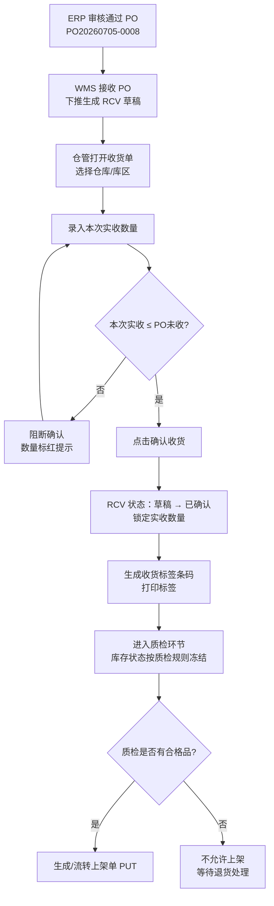
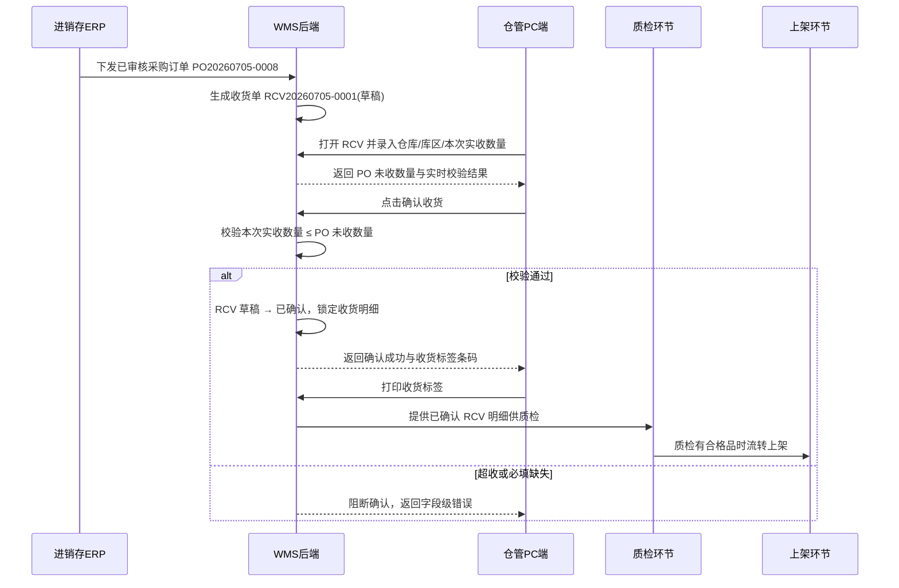

# 收货单_业务流程推演

> 角色：业务流程推演 | 类型：执行作业单
> 覆盖收货单从 PO 下推到确认收货、打印标签、进入质检/上架的业务与系统交互。

## 1. 示例数据

| 项 | 值 |
|:--|:--|
| 采购单号 | PO20260705-0008 |
| 收货单号 | RCV20260705-0001 |
| 供应商 | 苏州星河包装材料有限公司 |
| 仓库/库区 | 上海一仓 / 收货区 |
| 商品 | SKU10086 防静电周转箱 600x400x280 |
| 采购数量 | 100 件 |
| 历史已收 | 40 件 |
| PO 未收 | 60 件 |
| 本次实收 | 60 件 |
| 操作人 | 仓管员-陈明 |
| 操作日期 | 2026-07-05 |

## 2. 业务流程图

## 3. 系统时序图

## 4. 主流程步骤

| 步骤 | 角色 | 输入 | 系统处理 | 输出 |
|:--:|:--|:--|:--|:--|
| 1 | ERP | 已审核 PO | 下发采购订单到 WMS | PO 数据进入 WMS |
| 2 | WMS | PO 明细 | 生成 RCV 草稿，带入 PO 快照 | RCV 草稿 |
| 3 | 仓管 | 到货实物 | 打开 RCV，核对供应商和商品 | 可录入页面 |
| 4 | 仓管 | 仓库/库区、本次实收数量 | 保存草稿或确认收货 | 草稿保存或进入校验 |
| 5 | WMS | 本次实收数量、PO 未收数量 | 校验超收、必填、数量格式 | 成功或错误提示 |
| 6 | WMS | 校验通过数据 | 锁定 RCV，写入确认人/确认时间 | RCV 已确认 |
| 7 | 仓管 | 已确认 RCV | 打印收货标签 | 标签贴到货物/托盘 |
| 8 | 质检 | 已确认 RCV 明细 | 登记质检结果 | 合格品进入上架，不合格品等待处理 |

## 5. 异常流程

### 5.1 超收阻断

- 条件：`本次实收数量 > PO未收数量`。
- 示例：PO 未收 60 件，仓管录入 65 件。
- 系统处理：确认收货失败，明细行本次实收数量标红，提示“本次实收数量不能大于 PO 未收数量”。
- 结果：RCV 保持草稿，仓管修改数量后重新确认。

### 5.2 质检全部不合格

- 条件：后续质检结果为全部不合格。
- 系统处理：不生成上架单，不允许流转到上架，收货单详情仅展示关联进度为异常。
- 结果：等待退货处理；一期可记录不合格原因，完整退货流程为二期。

### 5.3 重复确认

- 条件：已确认 RCV 再次触发确认接口。
- 系统处理：阻断，提示“已确认收货单不可重复确认”。
- 结果：RCV 保持已确认。

## 6. 流程边界

- 收货单确认不是入库完成；入库完成以质检通过后的上架确认作为库存可用触发点。
- 收货单不写审核状态，不做反审核。
- 收货单允许展示后续质检、上架进度，但不把这些进度作为自身状态。
