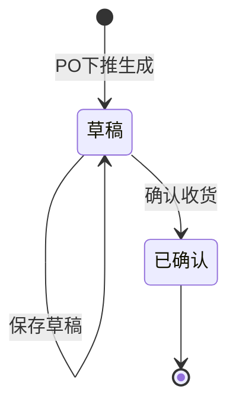

# 收货单_业务规则规格

> 角色：业务规则规格 | 类型：执行作业单
> 覆盖收货单状态机、校验、计算、动作按钮和上下游约束。

## 1. 状态机

收货单是执行层单据，只保留收货动作自身状态，不增加审核流。

| 当前状态 | 动作 | 目标状态 | 触发端 | 前置条件 | 后置结果 |
|:--|:--|:--|:--|:--|:--|
| - | PO 下推生成 | 草稿 | 系统 | ERP PO 已审核通过并下发 | 生成 RCV 单号，带入 PO 快照 |
| 草稿 | 保存草稿 | 草稿 | PC | 用户有收货单维护权限 | 保存仓库、库区、数量、备注，不触发下游 |
| 草稿 | 确认收货 | 已确认 | PC | 全量校验通过 | 锁定实收数量，写入确认人/时间，生成收货标签 |
| 已确认 | 打印标签 | 已确认 | PC | 标签条码已生成 | 记录打印次数和最后打印时间 |

## 2. 动作按钮规则

| 按钮 | 展示状态 | 点击后校验 | 说明 |
|:--|:--|:--|:--|
| 保存草稿 | 草稿 | 宽松校验 | 仅保存当前录入内容，不改变状态 |
| 确认收货 | 草稿 | 全量严格校验 | 状态变更按钮；校验通过后变为已确认 |
| 打印标签 | 已确认 | 标签存在性 | 打印收货标签；不可用于草稿 |
| 查看详情 | 草稿、已确认 | 无 | 进入详情页 |

按钮不可用时隐藏，不展示灰色 disabled 态。状态字段只读，不能通过下拉或编辑字段直接修改。

## 3. 关键业务规则

| 编号 | 规则 | 详细说明 | 错误提示 |
|:--|:--|:--|:--|
| RCV-R01 | PO 来源必需 | 收货单必须由 ERP 下发 PO 下推生成，不允许无 PO 新建 | `收货单必须关联采购订单` |
| RCV-R02 | 单号系统生成 | RCV 单号按 `RCV{YYYYMMDD}-{4位序号}` 生成，序号每日从 0001 起，已确认单号不回收 | `收货单号由系统生成，不可编辑` |
| RCV-R03 | 快照存储 | 供应商、商品编码、商品名称、规格、单位、采购数量继承 PO 并作为历史快照保存 | - |
| RCV-R04 | 实收数量正整数 | 确认时每一行本次实收数量必须为正整数且 `>0` | `本次实收数量必须为大于 0 的整数` |
| RCV-R05 | 超收阻断 | `本次实收数量 ≤ PO未收数量`，任一行不满足则整单不能确认 | `本次实收数量不能大于 PO 未收数量` |
| RCV-R06 | 部分收货允许 | 本次实收数量可小于 PO 未收数量；未收余量继续保留在 PO 收货进度中 | - |
| RCV-R07 | 已确认不可改数量 | 收货单已确认后，明细数量、仓库、库区不可修改 | `已确认收货单不可修改` |
| RCV-R08 | 质检未过不可上架 | 后续质检全部不合格时，不生成上架单，不允许流转到上架 | `质检未通过，不可上架` |
| RCV-R09 | 库存不直接可用 | 收货确认不直接增加可用库存；可用库存由后续 PDA 上架确认触发 | - |
| RCV-R10 | 备注长度 | 单据备注、行备注均不超过 200 字符 | `备注不能超过 200 字符` |

## 4. 校验规则

### 4.1 保存草稿

| 校验项 | 是否阻断 | 说明 |
|:--|:--:|:--|
| RCV 单号存在 | 是 | PO 下推时已生成 |
| 来源 PO 存在 | 是 | 无来源不能保存 |
| 仓库/库区有效 | 是 | 必须为启用状态且库区属于仓库 |
| 数量格式为整数 | 是 | 出现小数、负数、非数字时阻断 |
| 实收数量为空 | 否 | 草稿允许暂存，但确认时必填 |
| 超收 | 是 | 即使草稿也提示并阻断严重超收数据保存 |

### 4.2 确认收货

| 校验项 | 是否阻断 | 说明 |
|:--|:--:|:--|
| 状态为草稿 | 是 | 已确认不能重复确认 |
| 仓库/库区必填 | 是 | 空值标红 |
| 至少一条明细 | 是 | PO 必须有有效商品行 |
| 每行本次实收数量必填 | 是 | 空值标红 |
| 每行本次实收数量 `>0` | 是 | 数量必须为正整数 |
| 每行本次实收数量 `≤ PO未收数量` | 是 | 超收阻断 |
| 收货日期不超过当前日期 | 是 | 补录场景除外，补录需有权限 |

## 5. 计算规则

| 编号 | 字段/动作 | 公式/逻辑 | 示例 |
|:--|:--|:--|:--|
| CAL-01 | PO 未收数量 | `采购数量 - 历史已收数量` | 采购 100，已收 40，未收 60 |
| CAL-02 | 本次实收合计 | `Σ 本次实收数量` | 2 行分别 30、20，合计 50 |
| CAL-03 | PO 收货进度 | `历史已收数量 + 本次实收数量` | 已收 40，本次 30，确认后累计 70 |
| CAL-04 | 标签条码 | 系统按标签规则生成，至少关联 RCV 单号、PO 单号、SKU、数量 | `RCV20260705-0001-01` |
| CAL-05 | 打印次数 | 打印成功后 `print_count + 1` | 0 → 1 |

## 6. 上下游规则

| 方向 | 数据 | 触发 | 规则 |
|:--|:--|:--|:--|
| ERP → WMS | PO | ERP 审核通过 | WMS 按 PO 下推生成 RCV 草稿 |
| WMS → 质检 | RCV 已确认数据 | 确认收货后 | 质检读取 RCV 实收数量；质检不改 RCV 数量 |
| WMS → 上架 | 质检合格数据 | 质检通过后 | 仅合格数量可生成 PUT；质检未过不可上架 |
| WMS → ERP | 收货完成回执 | 入库确认 | 按 `02-上下游关联系统`，入库确认后回传 |
| WMS → 财务 | 入库应付凭证 | 采购入库确认 | 由入库完成链路触发，不由草稿触发 |

## 7. 库存规则

- 收货确认后，商品进入后续质检链路；质检期间库存状态为冻结，不可销售。
- 上架完成后库存从冻结转为可用，并生成库存流水 FL。
- 收货单不直接扣减、释放或占用销售库存。
