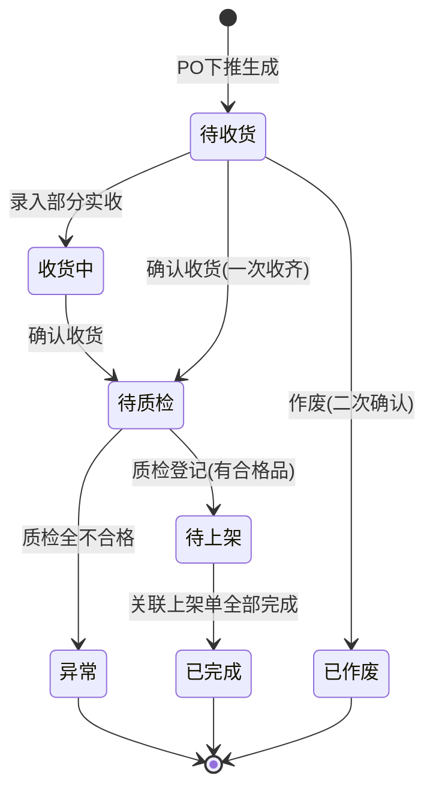

# 收货单_业务规则规格

> 角色：业务规则规格 | 类型：执行作业单
> 覆盖收货单状态机、校验、计算、动作按钮和上下游约束。

## 1. 状态机

收货单是执行层单据，不增加审核流。状态变更只通过动作按钮触发。

| 当前状态 | 动作 | 目标状态 | 触发端 | 前置条件 | 后置结果 |
|:--|:--|:--|:--|:--|:--|
| - | PO 下推生成 | 待收货 | 系统 | ERP PO 已审核通过并下发 | 生成 RCV 单号，带入 PO 快照 |
| 待收货 | 保存草稿（录入部分） | 收货中 | PC | 用户有收货单维护权限 | 保存实收数量，单据进入收货中 |
| 待收货 / 收货中 | 确认收货 | 待质检 | PC | 实收数量全量录入并通过校验 | 锁定实收数量，写入确认人/时间，生成标签，库存记入冻结 |
| 待收货 | 作废 | 已作废 | PC | 用户有作废权限且处于待收货状态 | 单据作废，不可编辑，二次确认弹窗 |
| 待质检 | 质检登记 | 待上架 / 异常 | PC | 合格+不合格=实收，且必填不合格原因 | 登记结果。若合格数>0则生成上架单并转待上架；若合格数=0则转异常 |
| 待上架 | PDA上架确认 | 已完成 | PDA/系统 | 关联上架单全部上架完成 | RCV 状态变更为已完成 |

## 2. 动作按钮规则

| 按钮 | 展示状态 | 点击后校验 | 说明 |
|:--|:--|:--|:--|
| 保存草稿 | 待收货、收货中 | 宽松校验 | 保存当前录入的实收数量和备注，状态变为“收货中”或保持不变 |
| 确认收货 | 待收货、收货中 | 全量严格校验 | 确认本次收货；校验通过后状态变为“待质检”，库存记入冻结，生成标签 |
| 作废 | 待收货 | 权限校验与二次确认 | 作废收货单；校验通过后状态变为“已作废” |
| 打印标签 | 待质检、待上架、已完成、异常 | 标签存在性 | 打印收货标签；不可用于待收货/收货中/已作废状态 |
| 质检登记 | 待质检 | 合格数校验与不合格原因校验 | 登记质检结果；校验合格品>0转“待上架”（生成上架单），全不合格转“异常” |
| 查看详情 | 所有状态 | 无 | 进入详情页 |

按钮不可用时隐藏，不展示灰色 disabled 态。状态字段只读，不能通过直接编辑进行修改。

## 3. 关键业务规则

| 编号 | 规则 | 详细说明 | 错误提示 |
|:--|:--|:--|:--|
| RCV-R01 | PO 来源必需 | 收货单必须由 ERP 下发 PO 下推生成，不允许无 PO 新建 | `收货单必须关联采购订单` |
| RCV-R02 | 单号系统生成 | RCV 单号按 `RCV{YYYYMMDD}-{4位序号}` 生成，序号每日从 0001 起，已确认单号不回收 | `收货单号由系统生成，不可编辑` |
| RCV-R03 | 快照存储 | 供应商、商品编码、商品名称、规格、单位、采购数量继承 PO 并作为历史快照保存 | - |
| RCV-R04 | 实收数量正整数 | 确认时每一行本次实收数量必须为正整数且 `>0` | `本次实收数量必须为大于 0 的整数` |
| RCV-R05 | 超收阻断 | `本次实收数量 ≤ PO未收数量`，任一行不满足则整单不能确认 | `本次实收数量不能大于 PO 未收数量` |
| RCV-R06 | 部分收货允许 | 本次实收数量可小于 PO 未收数量；未收余量继续保留在 PO 收货进度中 | - |
| RCV-R07 | 锁定不可改 | 确认收货进入待质检后，明细实收数量、仓库、库区不可修改 | `已确认收货不可修改` |
| RCV-R08 | 不合格强控 | 质检登记时若有不合格数量，必须填写不合格原因；若合格数量为0，不生成上架单且收货单转为异常 | `有不合格数量时必须选择不合格原因` |
| RCV-R09 | 库存不直接可用 | 收货确认不直接增加可用库存；可用库存由后续 PDA 上架确认触发 | - |
| RCV-R10 | 备注长度 | 单据备注、行备注均不超过 200 字符 | `备注不能超过 200 字符` |
| RCV-R11 | 过账联动 | 后续上架单在 PDA 端分批即时过账，当累计上架数量等于合格总数时，收货单状态自动变更为已完成 | - |

## 4. 校验规则

### 4.1 保存草稿

| 校验项 | 是否阻断 | 说明 |
|:--|:--:|:--|
| RCV 单号存在 | 是 | PO 下推时已生成 |
| 来源 PO 存在 | 是 | 无来源不能保存 |
| 仓库/库区有效 | 是 | 必须为启用状态且库区属于仓库 |
| 数量格式为整数 | 是 | 出现小数、负数、非数字时阻断 |
| 实收数量为空 | 否 | 允许暂存，但确认收货时必填 |
| 超收 | 是 | 即使保存草稿也提示并阻断严重超收数据保存 |

### 4.2 确认收货

| 校验项 | 是否阻断 | 说明 |
|:--|:--:|:--|
| 状态为待收货/收货中 | 是 | 非待收货或收货中状态不可确认收货 |
| 仓库/库区必填 | 是 | 空值标红 |
| 至少一条明细 | 是 | PO 必须有有效商品行 |
| 每行本次实收数量必填 | 是 | 空值标红 |
| 每行本次实收数量 `>0` | 是 | 数量必须为正整数 |
| 每行本次实收数量 `≤ PO未收数量` | 是 | 超收阻断 |
| 收货日期不超过当前日期 | 是 | 补录场景除外，补录需有权限 |

### 4.3 质检登记

| 校验项 | 是否阻断 | 说明 |
|:--|:--:|:--|
| 状态为待质检 | 是 | 只有待质检单据可进行质检登记 |
| 合格数量必填 | 是 | 空值标红，合格数量必须为正整数且 ≥0 |
| 合格数量 ≤ 本次实收数量 | 是 | 合格数量不得大于实收数量 |
| 有不合格数量时原因必填 | 是 | 不合格数量 > 0 时，原因必须选择且可录入备注 |
| 合格数量 + 不合格数量 = 本次实收数量 | 是 | 数量需守恒，计算不匹配时阻断 |

## 5. 计算规则

| 编号 | 字段/动作 | 公式/逻辑 | 示例 |
|:--|:--|:--|:--|
| CAL-01 | PO 未收数量 | `采购数量 - 历史已收数量` | 采购 100，已收 40，未收 60 |
| CAL-02 | 本次实收合计 | `Σ 本次实收数量` | 2 行分别 30、20，合计 50 |
| CAL-03 | PO 收货进度 | `历史已收数量 + 本次实收数量` | 已收 40，本次 30，确认后累计 70 |
| CAL-04 | 标签条码 | 系统按标签规则生成，至少关联 RCV 单号、PO 单号、SKU、数量 | `RCV20260705-0001-01` |
| CAL-05 | 打印次数 | 打印成功后 `print_count + 1` | 0 → 1 |

## 6. 上下游规则

| 方向 | 数据 | 触发 | 规则 |
|:--|:--|:--|:--|
| ERP → WMS | PO | ERP 审核通过 | WMS 按 PO 下推生成 RCV 待收货单 |
| RCV 确认 → 质检登记 | RCV 实收明细 | 确认收货后 | 状态变为待质检，直接在此单据上录入质检合格/不合格数量和原因 |
| RCV 质检登记 → PUT | 合格商品与数量 | 质检登记完成且合格数 > 0 | 系统自动生成上架单 PUT，RCV 状态转为待上架 |
| PUT 上架 → 库存 | 货位、商品、实际上架数 | PDA 确认上架 | 库存转现存可用，分批即时生成 FL，累计完成触发下游 |
| WMS → ERP | 收货完成回执 | 上架完成已完成 | 上架单全部完成（即 RCV 转已完成）后回传 ERP |
| WMS → 财务 | 入库应付凭证 | 采购入库确认 | 上架单全部完成（即 RCV 转已完成）后触发财务应付 |

## 7. 库存规则

- 确认收货进入待质检后，商品记入冻结库存；质检及待上架期间，库存状态均为冻结，不可销售。
- PDA 每次确认上架时，即时将实际上架货位的对应数量库存从冻结转为现存可用，并即时生成对应的库存流水 FL。
- 收货单不直接扣减、释放或占用销售库存。
