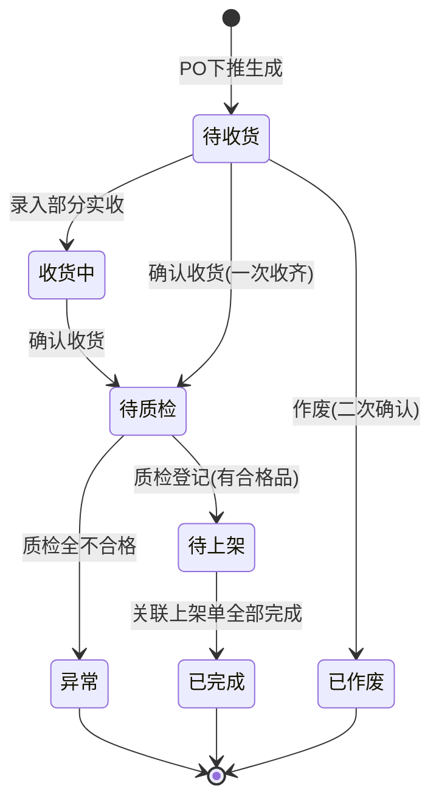

# 收货单主PRD

> 角色：主PRD | 类型：执行作业单
> 权威层级：context/ > 入库管理主PRD > 本文件
> 关联文件：`收货单字段清单.md` `收货单_业务规则规格.md` `收货单_业务流程推演.md` `收货单_用例数据推演.md`

## 1. 业务背景

收货单（RCV）是 Forge WMS 入库链路第一环，用于承接进销存 ERP 审核通过后下发的采购订单 PO，记录仓库实际收到的商品、数量、仓库/库区和收货标签信息。收货确认后，单据进入后续质检与上架链路，最终由上架确认触发库存可用、库存流水、ERP 收货回执和财务应付凭证。

当前业务痛点来自纸质收货和人工比对，容易造成数据录入滞后及账实不符。本PRD规范收货作业，提供超收拦截、质检登记及上架生成的完整系统流转。

## 2. 功能范围

### 2.1 In Scope

- 基于采购订单 PO 下推创建收货单 RCV。
- 仓管人员录入本次实收数量，强控超收（实收 ≤ PO 未收数量）。
- 确认收货后库存记入冻结，在 RCV 单内登记质检结果（合格数量、不合格数量、不合格原因）。
- 质检有合格品时系统自动下推生成上架单 PUT。
- 确认收货后可打印收货标签。

### 2.2 Not In Scope

- 不做无 PO 来源的手工收货。
- 不做多级审核流，收货单是执行层单据。
- 质检登记是 RCV 内的一个环节（质检后填入合格数量、不合格数量和原因），不再使用独立的外部质检单及QC单号。
- 不在收货单内执行上架；上架由上架单和 PDA 作业页处理。
- 不涉及硬件选型、打印机驱动、PDA 设备选型。
- 不删除模块主 PRD 内容，本文件是对 RCV 的单据级引用与细化。

## 3. 单据定位

| 项 | 说明 |
|:--|:--|
| 单据名称 | 收货单 |
| 单据编码 | RCV |
| 单号规则 | `RCV{YYYYMMDD}-{4位序号}`，如 `RCV20260705-0001` |
| 上游来源 | 进销存 ERP 审核通过后下发的采购订单 PO |
| 下游去向 | 上架单 PUT、库存流水 FL、ERP 收货回执、财务应付 |
| 业务定位 | 记录采购到货“实际收到多少、质检结果如何”，是后续上架的源头凭证 |
| 生成方式 | PO 下推生成，系统带入供应商、商品、采购数量等 PO 快照 |

> 口径说明：收货单状态机根据业务流程节点进行推进，完全对齐模块主 PRD §7.1。

## 4. 业务场景

| # | 场景 | 示例 | 系统处理 |
|:--:|:--|:--|:--|
| 1 | 正常收货 | PO 采购 100 件，本次实收 100 件 | 校验通过，确认收货后进入待质检状态，库存记入冻结，生成收货标签 |
| 2 | 部分收货 | PO 采购 100 件，已收 40 件，本次实收 30 件 | 确认收货 30 件，PO 未收余量保留，收货单进入待质检状态 |
| 3 | 超收阻断 | PO 未收 60 件，本次录入 65 件 | 确认收货阻断，实收数量标红提示 |
| 4 | 多商品收货 | 同一 PO 含 2 个 SKU，到货数量不同 | 按行录入实收，确认收货时逐行校验 PO 未收数量 |
| 5 | 收货后打印标签 | RCV 已确认收货，需要贴箱/托盘标签 | 确认收货后进入待质检状态，允许打印收货标签 |
| 6 | 质检登记有合格品 | 实收 100 件，质检登记合格 90 件，不合格 10 件且必填原因 | 系统自动生成上架单 PUT，收货单状态转为待上架，不合格品登记后等待二期处理 |
| 7 | 质检登记全不合格 | 实收 100 件，质检登记合格 0 件，不合格 100 件且必填原因 | 不生成上架单，收货单状态转为异常，等待退货处理 |

## 5. 状态机

收货单自身不承载审核流，状态按模块主 PRD §7.1 对齐。

| 状态 | 含义 | 可执行动作 | 进入条件 |
|:--|:--|:--|:--|
| 待收货 | PO 下推后未收货 | 录入实收 / 确认收货 / 作废 | PO 下推生成 |
| 收货中 | 已录入部分实收但未确认 | 继续录入 / 确认收货 | 录入部分实收 |
| 待质检 | 已确认收货，等质检登记 | 质检登记 | 确认收货（一次收齐或收货中确认） |
| 待上架 | 质检登记完成，有合格品待上架 | （由上架单驱动） | 质检登记合格数量 > 0 |
| 异常 | 质检登记全不合格 | 转退货（二期） | 质检登记合格数量 = 0 |
| 已完成 | 全部合格品已完成上架 | 查看详情 | 关联的上架单全部完成 |
| 已作废 | 收货单作废 | — | 待收货状态下作废并二次确认 |

## 6. 规则摘要

| # | 规则 | 摘要 |
|:--:|:--|:--|
| R1 | 无源不新建 | 收货单必须从 PO 下推生成，不能手工新建无来源收货单 |
| R2 | 单号不可编辑 | RCV 单号由系统按 `RCV{YYYYMMDD}-{4位序号}` 生成 |
| R3 | 超收阻断 | 本次实收数量必须 `≤ PO未收数量`，否则确认收货阻断 |
| R4 | 数量正整数 | 实收数量为正整数，确认时必须 `>0` |
| R5 | 快照存储 | 供应商、商品、规格、单位、采购数量按 PO 下发时快照保存 |
| R6 | 状态按钮触发 | 状态只能通过动作按钮（确认收货、质检登记、作废等）变化，不允许直接编辑状态字段 |
| R7 | 不合格闭环 | 质检有不合格数量时必须填写原因，一期仅登记，退货二期 |
| R8 | 标签追溯 | 确认收货后可打印收货标签，条码用于后续上架扫描追溯 |

## 7. 字段清单入口

字段的唯一事实来源见 `收货单字段清单.md`。本主 PRD 不重复维护完整字段定义，只保留核心字段摘要：

| 分类 | 核心字段 |
|:--|:--|
| 单据头 | 收货单号、来源采购单号、供应商、仓库、库区、单据状态、创建人、创建时间、确认人、确认时间 |
| 明细行 | 商品编码、商品名称、规格、单位、采购数量、已收数量、PO 未收数量、本次实收数量、合格数量、不合格数量、不合格原因 |
| 标签 | 收货标签条码、打印次数、最后打印时间 |
| 备注 | 备注 |

## 8. 验收标准

| # | 验收项 | 验收标准 |
|:--:|:--|:--|
| AC1 | PO 下推 | ERP 下发 PO 后，WMS 可生成 RCV 待收货单，且 PO、供应商、商品信息只读带入 |
| AC2 | 单号规则 | RCV 单号符合 `RCV{YYYYMMDD}-{4位序号}`，每日从 0001 递增 |
| AC3 | 草稿/收货中保存 | 待收货/收货中状态可保存仓库、库区、实收数量和备注；状态不被人工编辑 |
| AC4 | 超收阻断 | 任一明细行本次实收数量大于 PO 未收数量时，确认收货失败并标红提示 |
| AC5 | 确认收货 | 校验通过后点击确认，状态从待收货/收货中转为待质检，库存记入冻结 |
| AC6 | 标签打印 | 待质检及后续状态的 RCV 可打印标签，待收货/收货中不可打印正式收货标签 |
| AC7 | 质检上架边界 | 质检登记有合格品时系统自动生成上架单 PUT，状态转为待上架；全不合格则状态转为异常，不生成上架单 |
| AC8 | 页面规范 | PC 表格默认 20 条/页，危险操作二次确认，按钮不可用时隐藏 |

## 9. 不确定性

- 收货单状态机已与模块主 PRD §7.1 完全对齐，包含待收货、收货中、待质检、待上架、异常、已完成、已作废 7 个状态，明确了质检登记为收货单内环节的单据流。
