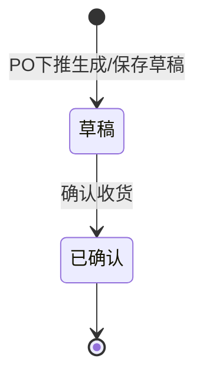

# 收货单主PRD

> 角色：主PRD | 类型：执行作业单
> 权威层级：context/ > 入库管理主PRD > 本文件
> 关联文件：`收货单字段清单.md` `收货单_业务规则规格.md` `收货单_业务流程推演.md` `收货单_用例数据推演.md`

## 1. 业务背景

收货单（RCV）是 Forge WMS 入库链路第一环，用于承接进销存 ERP 审核通过后下发的采购订单 PO，记录仓库实际收到的商品、数量、仓库/库区和收货标签信息。收货确认后，单据进入后续质检与上架链路，最终由上架确认触发库存可用、库存流水、ERP 收货回执和财务应付凭证。

当前业务痛点来自纸质收货和人工比对：到货后仓管需要手工核对 PO，超收/漏收发现滞后；收货标签不统一，质检和上架难以追溯；收货结果不能及时传递给后续环节，造成账实同步延迟。

## 2. 功能范围

### 2.1 In Scope

| 功能 | 端 | 说明 |
|:--|:--|:--|
| 基于 PO 创建收货单 | PC | 从 ERP 下发的 PO 下推生成，不允许无来源手工新建 |
| 收货单草稿维护 | PC | 选择仓库/库区，录入本次实收数量，保存草稿 |
| 超收校验 | PC | 确认收货时校验实收数量不得超过 PO 未收数量 |
| 确认收货 | PC | 通过动作按钮触发，收货单从草稿变为已确认 |
| 收货标签打印 | PC | 已确认后生成并打印收货标签条码，供质检、上架扫描追溯 |
| 关联进度查看 | PC | 展示后续质检单、上架单和入库完成状态，不改变收货单自身状态机 |

### 2.2 Not In Scope

- 不做无 PO 来源的手工收货。
- 不做多级审核流，收货单是执行层单据。
- 不在收货单内登记质检合格/不合格结果；质检结果由质检环节维护。
- 不在收货单内执行上架；上架由上架单和 PDA 作业页处理。
- 不涉及硬件选型、打印机驱动、PDA 设备选型。
- 不删除模块主 PRD 内容，本文件是对 RCV 的单据级引用与细化。

## 3. 单据定位

| 项 | 说明 |
|:--|:--|
| 单据名称 | 收货单 |
| 单据编码 | RCV |
| 单号规则 | `RCV{YYYYMMDD}-{4位序号}`，如 `RCV20260705-0001` |
| 上游来源 | 进销存 ERP 审核通过后下发的采购订单 PO |
| 下游去向 | 质检单/质检登记、上架单 PUT、库存流水 FL、ERP 收货回执、财务应付 |
| 业务定位 | 记录采购到货“实际收到多少”，是后续质检和上架的源头凭证 |
| 生成方式 | PO 下推生成，系统带入供应商、商品、采购数量等 PO 快照 |

> 口径说明：模块主 PRD 中的 RCV 状态机包含“待质检、待上架、已完成”等链路进度。本单据级 PRD 按本次约束收敛为收货执行状态：`草稿`、`已确认`。质检和上架状态在后续单据或关联进度中展示。

## 4. 业务场景

| # | 场景 | 示例 | 系统处理 |
|:--:|:--|:--|:--|
| 1 | 正常收货 | PO 采购 100 件，本次实收 100 件 | 校验通过，确认收货，生成收货标签 |
| 2 | 部分收货 | PO 采购 100 件，已收 40 件，本次实收 30 件 | 本次确认 30 件，PO 未收余量保留为 30 件 |
| 3 | 超收阻断 | PO 未收 60 件，本次录入 65 件 | 确认收货阻断，实收数量标红提示 |
| 4 | 多商品收货 | 同一 PO 含 2 个 SKU，到货数量不同 | 按行录入实收，逐行校验 PO 未收数量 |
| 5 | 收货后打印标签 | RCV 已确认，需要贴箱/托盘标签 | 允许打印收货标签，标签包含 RCV、PO、SKU、数量 |
| 6 | 收货后质检不通过 | 后续质检发现全部不合格 | 不允许流转到上架，等待退货处理；收货单仅展示关联异常 |

## 5. 状态机

收货单自身只表达收货执行状态，不承载审核流。

| 状态 | 含义 | 可执行动作 | 进入条件 |
|:--|:--|:--|:--|
| 草稿 | 已从 PO 下推，仓管可录入本次实收数量 | 保存草稿、确认收货 | PO 已下发且未确认收货 |
| 已确认 | 收货数量已确认，后续进入质检/上架链路 | 打印标签、查看详情 | 全量校验通过并点击“确认收货” |

## 6. 规则摘要

| # | 规则 | 摘要 |
|:--:|:--|:--|
| R1 | 无源不新建 | 收货单必须从 PO 下推生成，不能手工新建无来源收货单 |
| R2 | 单号不可编辑 | RCV 单号由系统按 `RCV{YYYYMMDD}-{4位序号}` 生成 |
| R3 | 超收阻断 | 本次实收数量必须 `≤ PO未收数量`，否则确认收货阻断 |
| R4 | 数量正整数 | 实收数量为正整数，确认时必须 `>0` |
| R5 | 快照存储 | 供应商、商品、规格、单位、采购数量按 PO 下发时快照保存 |
| R6 | 状态按钮触发 | 状态只能通过“确认收货”按钮变化，不允许直接编辑状态字段 |
| R7 | 后续强控 | 质检未过不可流转到上架；收货单仅展示该关联结果 |
| R8 | 标签追溯 | 已确认后可打印收货标签，条码用于后续质检、上架扫描追溯 |

## 7. 字段清单入口

字段的唯一事实来源见 `收货单字段清单.md`。本主 PRD 不重复维护完整字段定义，只保留核心字段摘要：

| 分类 | 核心字段 |
|:--|:--|
| 单据头 | 收货单号、来源采购单号、供应商、仓库、库区、单据状态、创建人、创建时间、确认人、确认时间 |
| 明细行 | 商品编码、商品名称、规格、单位、采购数量、已收数量、PO 未收数量、本次实收数量 |
| 标签 | 收货标签条码、打印次数、最后打印时间 |
| 备注 | 备注 |

## 8. 验收标准

| # | 验收项 | 验收标准 |
|:--:|:--|:--|
| AC1 | PO 下推 | ERP 下发 PO 后，WMS 可生成 RCV 草稿，且 PO、供应商、商品信息只读带入 |
| AC2 | 单号规则 | RCV 单号符合 `RCV{YYYYMMDD}-{4位序号}`，每日从 0001 递增 |
| AC3 | 草稿保存 | 草稿可保存仓库、库区、实收数量和备注；状态不被人工编辑 |
| AC4 | 超收阻断 | 任一明细行本次实收数量大于 PO 未收数量时，确认收货失败并标红提示 |
| AC5 | 确认收货 | 全量校验通过后点击确认，状态从草稿变为已确认 |
| AC6 | 标签打印 | 已确认 RCV 可打印标签，草稿不可打印正式收货标签 |
| AC7 | 质检上架边界 | 收货单不直接生成可用库存；质检未过时不可流转到上架 |
| AC8 | 页面规范 | PC 表格默认 20 条/页，危险操作二次确认，按钮不可用时隐藏 |

## 9. 不确定性

- 模块主 PRD 曾将 RCV 作为全链路状态载体，本文件按本次红线将收货单状态收敛为 `草稿 → 已确认`；若后续研发实现仍需要链路状态，建议新增“关联进度/入库进度”字段，不改变收货单自身状态机。
