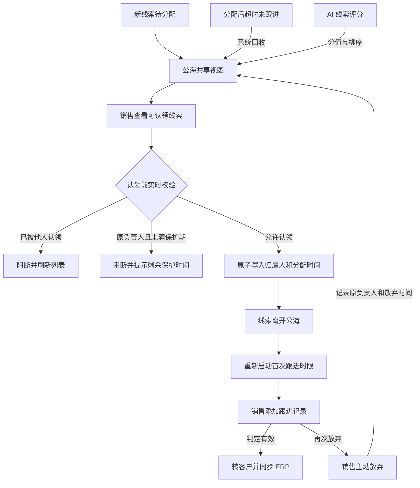
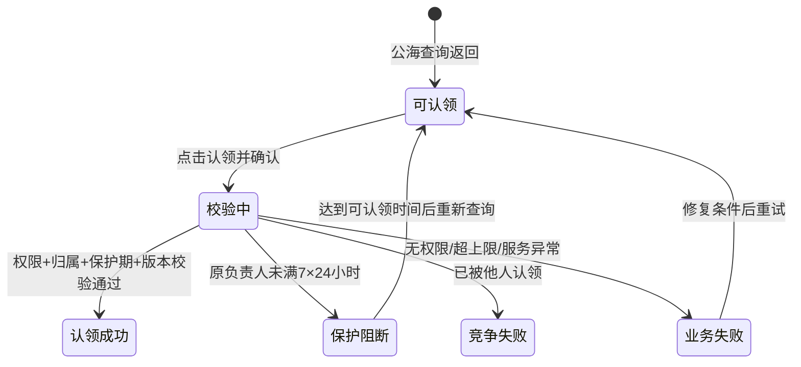

# 公海主PRD

> **版本**：V2.0 | 2026-07-18
> **读者**：研发工程师、测试工程师、产品复核、项目经理
> **对象属性**：公海是线索共享视图，不是独立主数据对象
> **字段定义 SSOT**：《线索字段清单》《公海字段清单》
> **规则权威源**：`context/04-核心业务流程详解.md`

---

### 1. 业务背景

公海用于承接暂未分配、超时回收和主动放弃的线索，使企业线索资源能够在销售团队中再次流动，而不是沉淀在个人名下。

没有公海机制时存在以下问题：

1. 新线索等待主管分配，销售无法主动承接空闲资源。
2. 销售名下线索长期未跟进，其他人不可见也无法接手。
3. 主动放弃的线索直接沉没，没有二次激活机会。
4. 高 AI 评分线索与低价值线索混排，认领效率低。
5. 多人同时认领同一线索，容易产生撞客和归属争议。
6. 原负责人放弃后立即重新认领，可能规避超时回收与过程考核。
7. 保护期边界口径不清，第 7 天是否允许认领容易产生争议。
8. 认领后未重新启动跟进时钟，线索可能继续被搁置。
9. 公海列表暴露过多联系信息，可能造成数据越权。
10. 认领失败没有明确反馈，用户误以为已取得归属。
11. 公海被误当成独立线索副本，可能导致字段和状态双写。
12. 已转客户或已被他人认领的线索若残留，会造成错误操作。

本模块通过统一入池口径、AI 评分排序、原负责人保护、并发认领和认领后归属变更，建立可审计的共享线索资源池。

**定位句**：公海是 CRM 线索的共享认领视图，线索本身仍以 CRM 线索对象为 SSOT；公海只提供筛选、查看和认领，不复制、不编辑、不删除线索。

---

### 2. 功能范围

**In Scope**：

- 展示符合入池条件的线索共享视图。
- 展示新线索、超时回收和主动放弃等入池来源。
- 按 AI 评分默认排序。
- 按来源、行业、评分、入池时间和入池类型筛选。
- 所有销售查看其权限允许的公海线索。
- 销售单条认领线索。
- 认领前执行最新归属与保护期校验。
- 认领成功后写入归属和分配时间。
- 认领成功后重新启动首次跟进时限。
- 原负责人保护期内禁止重新认领自己放弃的线索。
- 其他销售在符合可见与可认领条件时不受原负责人保护限制。
- 多人并发认领时保证唯一成功。
- 认领成功后从公海实时移除。
- 记录入池与认领审计日志。
- AI 评分缺失或失败时提供稳定排序降级。

**Out of Scope**：

- 公海内编辑线索；原因：必须先认领获得归属。
- 公海内删除线索；原因：主数据不提供删除。
- 公海内直接转客户；原因：转客户属于线索跟进流程。
- 公海内直接新增跟进；原因：必须先完成认领。
- 公海批量认领；原因：一期优先保证单条并发正确性。
- 自动分配策略配置；原因：属于线索管理和 AI 评分路由。
- 线索评分模型维护；原因：属于 AI 线索评分模块。
- 营销培育动作；原因：营销自动化不在一期范围。
- 客户档案新增；原因：客户 SSOT 在 ERP。
- 商机创建；原因：线索转客户后在客户上下文创建。
- 公海资源删除或归档；原因：公海是查询视图，无独立生命周期。

---

### 3. 对象定位

#### 3.1 在系统中的位置

| 项目 | 内容 |
|------|------|
| 对象类型 | 线索共享视图 / 资源流转层 |
| 核心职责 | 将无当前有效归属的线索开放给销售认领 |
| 数据来源 | 新建待分配、超时回收、销售主动放弃 |
| 权威对象 | CRM 线索 |
| 下游动作 | 认领后回到线索分配与跟进流程 |
| AI 关系 | 使用线索 AI 评分排序，不在公海重复计算模型 |
| 关联关系 | 一条线索在一个时刻至多出现为一条公海记录 |
| 写操作 | 仅认领事务写回线索归属与分配时间 |
| 数据边界 | 公海不产生独立业务编号或独立字段副本 |
| 保护对象 | 原负责人放弃后的再次认领行为 |

#### 3.2 系统链路图

链路约束：

- 公海只读取线索记录，不创建线索副本。
- 认领成功是离开公海的唯一手工动作。
- 原负责人保护不阻断其他销售的合法认领。
- 已转客户或已有有效归属的线索不进入公海结果。
- 认领后线索后续状态变化遵循线索主 PRD。

#### 3.3 实体关系说明

| 关系 | 基数 | 说明 | 约束 |
|------|:---:|------|------|
| 线索 : 公海视图记录 | 1:0..1 | 线索满足入池条件时出现在公海 | 公海无独立持久化副本 |
| 线索 : 入池事件 | 1:N | 同一线索可多次被回收或放弃 | 每次记录来源、时间和原负责人 |
| 线索 : 认领事件 | 1:N | 线索可在不同周期被不同销售认领 | 同一时刻只有一次认领成功 |
| 销售 : 公海线索 | N:M | 多个销售可查看多个公海线索 | 具体可见范围受权限控制 |
| 原负责人 : 保护期 | 1:N | 原负责人对自己放弃的线索受保护限制 | 仅限制再次认领，不等于全员隐藏 |
| AI评分 : 公海视图 | 1:1 | 使用线索最新成功评分 | 失败时不阻断展示和认领 |

实体一致性要求：

1. 公海视图的线索编号与线索对象完全一致。
2. 入池类型是视图展示口径，定义来自《公海字段清单》。
3. 认领事务成功后不能仍返回在下一次公海查询中。
4. 保护期必须基于最近一次主动放弃事件计算。
5. 超时回收没有“主动放弃原负责人保护”语义。
6. 认领事件必须记录操作者和成功或失败结果。

---

### 4. 业务场景

| 场景ID | 场景 | 类型 | 触发角色 | 说明 |
|--------|------|------|----------|------|
| S01 | 销售认领新进入公海的线索 | **主流程** | 销售 | 校验通过后写入归属并离开公海 |
| S02 | 其他销售认领原负责人放弃的线索 | **支线** | 销售 | 其他销售不受原负责人保护限制 |
| S03 | 原负责人保护期内再次认领 | **异常** | 原负责人 | 未满 7×24 小时时阻断并提示剩余时间 |
| S04 | 两名销售同时认领同一线索 | **异常** | 两名销售 | 仅一个事务成功，另一方刷新最新归属 |
| S05 | 评分服务失败时浏览和认领 | **支线** | 系统 / 销售 | 使用历史评分或无评分降级，不阻断认领 |

#### S01 销售认领新进入公海的线索

- 前置：线索满足公海入池条件。
- 前置：当前销售具有认领权限。
- 动作：点击“认领”并二次确认。
- 校验：线索仍无有效归属。
- 结果：写入认领销售与当前分配时间。
- 后置：线索从公海移除并重新启动跟进时限。
- 反馈：`线索认领成功，请及时跟进`。

#### S02 其他销售认领原负责人放弃的线索

- 前置：线索由销售 A 主动放弃。
- 动作：销售 B 在保护期内查看并认领。
- 规则：保护期只限制原负责人 A 再次认领。
- 结果：销售 B 校验通过后可正常认领。
- 后置：原负责人保护记录保留作审计。
- 约束：销售 B 仍受权限、并发与持有上限规则约束。

#### S03 原负责人保护期内再次认领

- 前置：当前销售是最近一次主动放弃的原负责人。
- 边界：距离放弃时间小于 7×24 小时。
- 动作：点击“认领”。
- 结果：阻断，线索保持在公海。
- 提示：`你在保护期内不可再次认领该线索，可于{可认领时间}后重试`。
- 第 7 天整：达到 7×24 小时后允许认领。

#### S04 两名销售同时认领同一线索

- 前置：两人均在列表中看到同一线索。
- 动作：两人几乎同时确认认领。
- 处理：后端按线索版本或条件更新原子执行。
- 结果：首个成功，第二个失败。
- 失败提示：`该线索已被其他销售认领`。
- 页面：失败方移除该行并刷新后台计数。

#### S05 评分服务失败时浏览和认领

- 有历史成功评分：展示历史评分并标注更新时间。
- 无历史评分：显示 `--`，按入池时间降级排序。
- 公海查询不因评分失败而整体失败。
- 认领规则不依赖评分结果是否存在。
- 评分恢复后列表刷新最新值。

---

### 5. 状态机

#### 5.1 认领事务状态

> 公海没有独立业务状态。本节描述一次认领动作的事务状态，不新增线索或公海业务字段。

| 事务状态 | 含义 | 是否终态 |
|----------|------|:--------:|
| 可认领 | 当前查询快照满足认领入口展示条件 | 否 |
| 校验中 | 正在执行权限、归属、保护期和版本校验 | 否 |
| 认领成功 | 归属更新已提交，线索离开公海 | 是 |
| 保护阻断 | 原负责人仍处于保护期 | 是（本次动作） |
| 竞争失败 | 线索已被他人抢先认领或版本变化 | 是（本次动作） |
| 业务失败 | 权限、持有上限或服务异常导致失败 | 是（本次动作） |

#### 5.2 状态机图

#### 5.3 状态流转表（核心交付物）

| 当前状态 | 动作 | 前置条件 | 结果状态 | 二次确认 | 后置影响 | 失败处理 |
|----------|------|----------|----------|:--------:|----------|----------|
| 可认领 | 点击认领 | 用户有认领权限；线索在当前列表 | 校验中 | 是 | 锁定当前按钮，提交认领请求 | 前端参数异常时解除锁定；Toast `认领请求失败` |
| 校验中 | 校验通过并写入 | 无有效归属；版本一致；保护期允许；未超持有上限 | 认领成功 | 否 | 写入归属与分配时间；启动跟进时限；从公海移除 | 事务失败整体回滚；线索仍在公海；允许重试 |
| 校验中 | 原负责人保护校验 | 当前用户是原负责人且未满 7×24 小时 | 保护阻断 | 否 | 不写任何业务字段；记录失败事件 | 提示准确可认领时间；按钮恢复可用 |
| 校验中 | 并发归属校验 | 查询后线索已被其他销售认领 | 竞争失败 | 否 | 当前行从列表移除；刷新计数 | Toast `该线索已被其他销售认领` |
| 校验中 | 权限校验失败 | 角色无认领权限或数据范围变化 | 业务失败 | 否 | 不写数据 | Toast `无权认领该线索`；刷新列表 |
| 校验中 | 持有上限失败 | 当前销售已达到线索持有上限 | 业务失败 | 否 | 不写数据 | Toast `已达到线索持有上限，请先处理现有线索` |
| 校验中 | 服务异常 | 后端超时或写入异常 | 业务失败 | 否 | 事务回滚，不确定时主动查询结果 | Toast `认领失败，请重试`；不得重复归属 |
| 保护阻断 | 到期后重新认领 | 当前时间大于等于放弃时间 + 7×24 小时 | 校验中 | 是 | 重新执行全部实时校验 | 若已被他人认领则进入竞争失败 |

#### 5.4 动作能力矩阵

| 动作 | 新线索入池 | 超时回收 | 主动放弃-其他销售 | 主动放弃-原负责人保护中 | 已认领 |
|------|:----------:|:--------:|:------------------:|:------------------------:|:------:|
| 查看摘要 | ✅ | ✅ | ✅ | ✅ | ❌，不在公海 |
| 查看详情 | 按权限 | 按权限 | 按权限 | 按权限 | ❌，不在公海 |
| 认领 | ✅ | ✅ | ✅ | ❌ | ❌ |
| 编辑 | ❌ | ❌ | ❌ | ❌ | 公海不提供 |
| 添加跟进 | ❌ | ❌ | ❌ | ❌ | 认领后在线索详情操作 |
| 删除 | ❌ | ❌ | ❌ | ❌ | ❌ |

动作约束：

- 不可用动作不渲染。
- 原负责人保护中可查看，但认领入口不展示并给出保护提示。
- 已被认领记录应从下一次查询结果消失。
- 接口不能依赖前端入口隐藏，必须重新校验。

---

### 6. 核心业务规则

#### 6.1 入池与展示规则

| 规则ID | 规则 |
|--------|------|
| R01 | 公海展示满足共享条件的线索：新建待分配、分配后超时回收、销售主动放弃或判定无效但保留观察；已转客户、已有有效归属或不具备可见权限的线索不得返回。 |

#### 6.2 认领与归属规则

| 规则ID | 规则 |
|--------|------|
| R02 | 认领必须通过单条原子事务写回线索归属与分配时间；成功后立即离开公海并重新启动首次跟进时限，同一时刻只允许一个销售认领成功。 |

#### 6.3 保护期规则

| 规则ID | 规则 |
|--------|------|
| R03 | 销售主动放弃线索后，最近一次放弃的原负责人在 7×24 小时内不可再次认领；其他销售不受该原负责人保护限制；达到第 7 天整允许原负责人重新参与认领。 |

#### 6.4 数据与操作边界

| 规则ID | 规则 |
|--------|------|
| R04 | 公海是线索查询视图，只允许查看与认领；不得在公海编辑、删除、添加跟进或转客户，字段、状态和 AI 评分均以线索 SSOT 为准。 |

规则优先级：

1. 数据可见权限。
2. 线索当前归属与可认领性。
3. 原负责人保护期。
4. 销售持有上限。
5. 版本并发校验。
6. 原子写入与后置任务。

---

### 7. AI 串联规则（CRM特有）

| AI 节点 | 触发时机 | 输入维度 | 输出 | 执行动作 | 失败处理 |
|---------|----------|----------|------|----------|----------|
| 线索评分展示 | 公海查询时读取线索最新评分 | 由线索评分模型定义 | 最新成功分值与更新时间 | 用于默认排序和视觉分层，不自动替用户认领 | 有历史值时展示历史值；无历史值时显示 `--`，按入池时间降级排序 |
| 评分刷新 | 线索评分任务完成 | 由线索评分模型定义 | 新评分版本 | 局部刷新对应行与排序 | 刷新失败保留旧值，不影响认领 |

AI 约束：

- 公海不重复计算评分模型。
- 评分不是认领前置条件。
- 高分不绕过权限、保护期或持有上限。
- 评分失败不隐藏线索。
- 评分更新导致排序变化时不打断正在进行的认领弹窗。
- 已认领线索不因评分回调重新出现在公海。
- 页面明确显示历史评分时间，避免误解为实时值。

---

### 8. 权限设计

#### 8.1 数据可见范围

| 角色 | 可见范围 | 说明 |
|------|----------|------|
| 销售 | 组织授权范围内的公海线索 | 联系信息按权限脱敏 |
| 销售主管 | 本团队可认领公海线索 | 可查看入池审计摘要 |
| 系统管理员 | 全部公海线索 | 用于联调和异常排查 |
| 只读审计角色 | 授权历史与当前数据 | 不可认领 |

可见性规则：

- 原负责人保护期不等于不可见。
- 保护期中的原负责人可查看线索摘要和可认领时间。
- 详情深链接继续执行数据权限校验。
- 公海不展示超出角色权限的敏感联系方式。
- 导出能力一期不提供，避免批量泄露共享线索。

#### 8.2 操作权限矩阵

| 操作 | 销售 | 销售主管 | 系统管理员 | 只读审计 |
|------|:----:|:--------:|:------------:|:--------:|
| 查看公海列表 | ✅ | ✅ | ✅ | ✅ |
| 查看线索摘要 | 授权范围 | 团队范围 | 全部 | 授权范围 |
| 认领 | ✅ | ✅ | ✅ | ❌ |
| 原负责人保护期认领 | ❌ | 作为原负责人时❌ | 作为原负责人时❌ | ❌ |
| 编辑线索 | ❌ | ❌ | ❌ | ❌ |
| 添加跟进 | ❌ | ❌ | ❌ | ❌ |
| 删除线索 | ❌ | ❌ | ❌ | ❌ |
| 查看入池审计 | ❌ | 团队范围 | 全部 | 授权范围 |

权限失败：

- 无权入口不展示。
- 接口返回 403。
- 不写入归属或分配时间。
- Toast `无权认领该线索`。

---

### 9. 边界与异常处理

#### 9.1 并发控制

| 场景 | 处理方式 |
|------|----------|
| 两人同时认领 | 条件更新或版本锁保证一人成功，失败方刷新最新归属 |
| 认领与自动分配并发 | 使用同一归属原子条件，首个成功者生效 |
| 认领与线索转客户并发 | 转客户只可能由已有归属线索发起；公海认领发现状态变化时失败 |
| 弹窗打开后线索被认领 | 确认时实时校验，失败并从列表移除 |

#### 9.2 去重与幂等

| 场景 | 处理方式 |
|------|----------|
| 用户重复点击确认 | 前端禁用按钮，后端使用请求键返回首次结果 |
| 网络超时后重试 | 先按请求键和线索归属查询最终结果 |
| 重复入池事件 | 同一来源事件不生成重复公海记录 |
| 重复认领事件 | 已由当前用户成功认领时返回首次成功结果 |

#### 9.3 数量与时间边界

| 场景 | 输入 | 处理方式 |
|------|------|----------|
| 保护期前一秒 | 放弃后 6天23:59:59 | 原负责人阻断 |
| 保护期边界 | 放弃后恰好 7×24 小时 | 原负责人允许重新认领 |
| 保护期后一秒 | 放弃后 7天00:00:01 | 原负责人允许重新认领 |
| 其他销售立即认领 | 放弃后任意时间，且满足可见条件 | 不受原负责人保护限制 |
| 超时回收入池 | 非主动放弃事件 | 不应用主动放弃保护 |
| 当前销售达到持有上限 | 认领确认时 | 阻断并提示先处理现有线索 |
| 已转客户残留行 | 查询缓存未刷新 | 认领校验阻断并移除该行 |
| AI 评分缺失 | 无成功评分 | 展示 `--`，按入池时间排序 |
| 服务超时结果不确定 | 认领请求超时 | 查询最终归属后再决定反馈 |

异常审计：

- 记录线索编号、认领人、原负责人、入池事件和请求时间。
- 保护阻断记录可认领时间。
- 并发失败记录最终归属人标识。
- 技术日志不向普通销售暴露其他人的敏感信息。
- 成功认领记录新的跟进时限起点。

---

### 10. 验收重点

| # | 验收项 | 输入条件 | 预期结果 |
|---|--------|----------|----------|
| V01 | 新线索正常认领 | 一条无归属的新线索进入公海；销售有权限且未超持有上限 | 二次确认后认领成功；写入归属与分配时间；线索离开公海；启动跟进时限 |
| V02 | 原负责人 7 天保护边界 | 原负责人分别在 6天23:59:59、7天整、7天后一秒认领自己放弃的线索 | 第一次阻断并提示可认领时间；后两次进入正常实时校验流程 |
| V03 | 其他销售例外 | 销售 A 主动放弃后未满 7 天；销售 B 有权限并点击认领 | 销售 B 不受原负责人保护限制；校验通过即可认领 |
| V04 | 并发唯一成功 | 两名销售同时确认认领同一条线索 | 仅一人成功；另一人收到已被认领提示；列表和计数刷新；无重复归属 |
| V05 | AI 失败降级 | 一条线索有历史评分，另一条从未评分；模拟评分服务失败 | 第一条展示历史值和时间；第二条显示 `--`；两条均可按业务规则认领 |

补充验收：

- [ ] 公海不创建独立线索副本。
- [ ] 列表不展示编辑、删除、跟进或转客户入口。
- [ ] 已转客户和已有归属线索不返回。
- [ ] 超时回收与主动放弃保护语义区分正确。
- [ ] 所有认领请求后端重新校验。
- [ ] 认领失败不改变线索字段。
- [ ] 无权限用户无法通过接口绕过。
- [ ] 认领成功后重新计算跟进时限。

---

### 11. 修订记录

| 日期 | 版本 | 变更摘要 |
|------|------|----------|
| 2026-07-18 | V1.0 | 初版，定义公海展示与认领 |
| 2026-07-18 | V2.0 | 对齐 v2.0 模板，补齐链路、实体、场景、认领事务、R01-R04、原负责人保护边界、AI 降级、权限和验收 |
