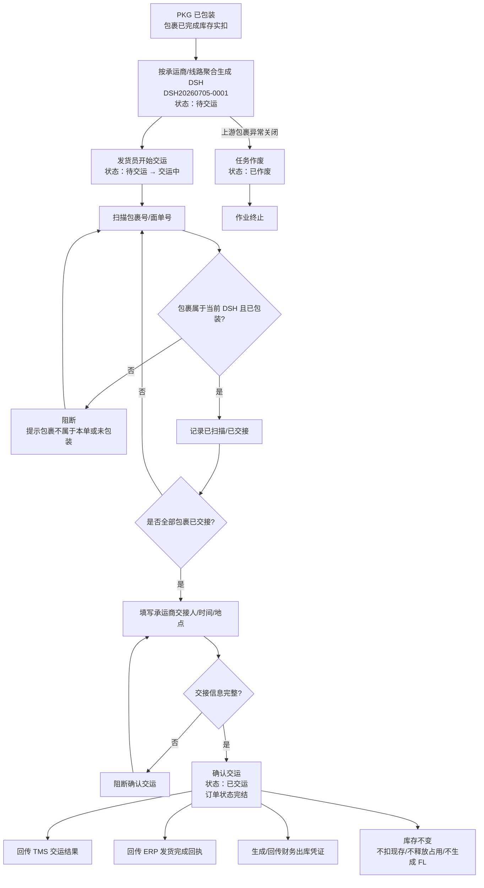
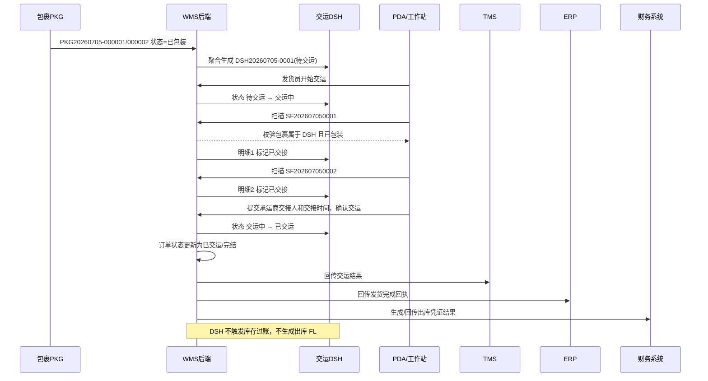

# 交运单_业务流程推演

> 角色：业务流程推演 | 类型：执行作业单
> 使用 2026 年示例数据，推演已包装包裹聚合、交接承运商、回传 TMS/ERP/财务和订单完结。

## 1. 沙盘数据

| 项 | 值 |
|:--|:--|
| 来源波次 | WAVE20260705-0001 |
| 来源包裹 | PKG20260705-000001、PKG20260705-000002 |
| 交运单号 | DSH20260705-0001 |
| 仓库 | 上海一仓 |
| 承运商 | SF 顺丰 |
| 线路 | 浦东普通线 |
| 发货员 | 发货员-吴磊 |
| 承运商交接人 | 顺丰交接员-李明 |
| 实际交接时间 | 2026-07-05 10:20:00 |

### 1.1 包裹明细

| 行 | 包裹号 | 面单号 | 重量(kg) | 包裹状态 |
|:--:|:--|:--|--:|:--|
| 1 | PKG20260705-000001 | SF202607050001 | 2.450 | 已包装 |
| 2 | PKG20260705-000002 | SF202607050002 | 0.850 | 已包装 |

## 2. 业务流程图

## 3. 系统时序图

## 4. 主流程步骤

| 步骤 | 角色 | 输入 | 系统处理 | 输出 |
|:--:|:--|:--|:--|:--|
| 1 | 系统 | 已包装 PKG | 按承运商/线路聚合 | DSH 待交运 |
| 2 | 发货员 | 开始交运 | 校验用户权限 | DSH 交运中 |
| 3 | 发货员 | 包裹号/面单号 | 校验包裹归属和状态 | 明细已扫描或阻断 |
| 4 | 发货员 | 承运商交接信息 | 校验交接人、时间、地点 | 允许确认交运 |
| 5 | 系统 | 确认交运 | 更新 DSH 状态和订单状态 | DSH 已交运，订单完结 |
| 6 | 系统 | 交运结果 | 触发 TMS/ERP/财务回传记录 | 回传状态更新 |
| 7 | 系统 | 交运动作 | 不触发库存过账 | 现存/占用/可用不变 |

## 5. 示例推演

### 5.1 正常交运

| 项 | 值 |
|:--|:--|
| 交运单号 | DSH20260705-0001 |
| 承运商 | SF 顺丰 |
| 应交包裹数 | 2 |
| 实交包裹数 | 2 |
| 承运商交接人 | 顺丰交接员-李明 |
| 实际交接时间 | 2026-07-05 10:20:00 |
| 结果 | DSH 已交运，订单已交运/完结，回传任务生成 |

### 5.2 库存边界

| 阶段 | 现存 | 占用 | 可用 | FL |
|:--|--:|--:|--:|:--|
| PKG 包装完成后 | 110 | 0 | 110 | 已由 PKG 生成 |
| DSH 交运确认后 | 110 | 0 | 110 | 不新增 |

## 6. 异常流程

### 6.1 扫错包裹

- 条件：当前 DSH 归属顺丰，实扫中通包裹 `PKG20260705-000099`。
- 处理：阻断计入，提示“包裹不属于当前交运单”。
- 结果：实交包裹数不增加，DSH 保持交运中。

### 6.2 包裹未包装

- 条件：实扫包裹状态不是已包装。
- 处理：阻断交运，提示“包裹未包装完成，不能交运”。
- 结果：不允许确认交运。

### 6.3 少交

- 条件：应交 2 个包裹，只扫 1 个。
- 处理：确认交运时阻断，提示“存在未交接包裹”。
- 结果：需补扫齐全或处理异常后再确认。

### 6.4 回传失败

- 条件：DSH 已交运，TMS 回传失败。
- 处理：TMS 回传状态=失败，记录失败原因，允许重试。
- 结果：DSH 仍为已交运，不回滚订单完结，不触发库存过账。

## 7. 流程边界

- DSH 不提供新增入口，只由已包装 PKG 聚合生成。
- DSH 确认交运=订单状态完结。
- DSH 不扣现存、不释放占用、不生成出库 FL。
- DSH 回传 TMS/ERP/财务只记录业务结果，不展开第三方接口协议。
