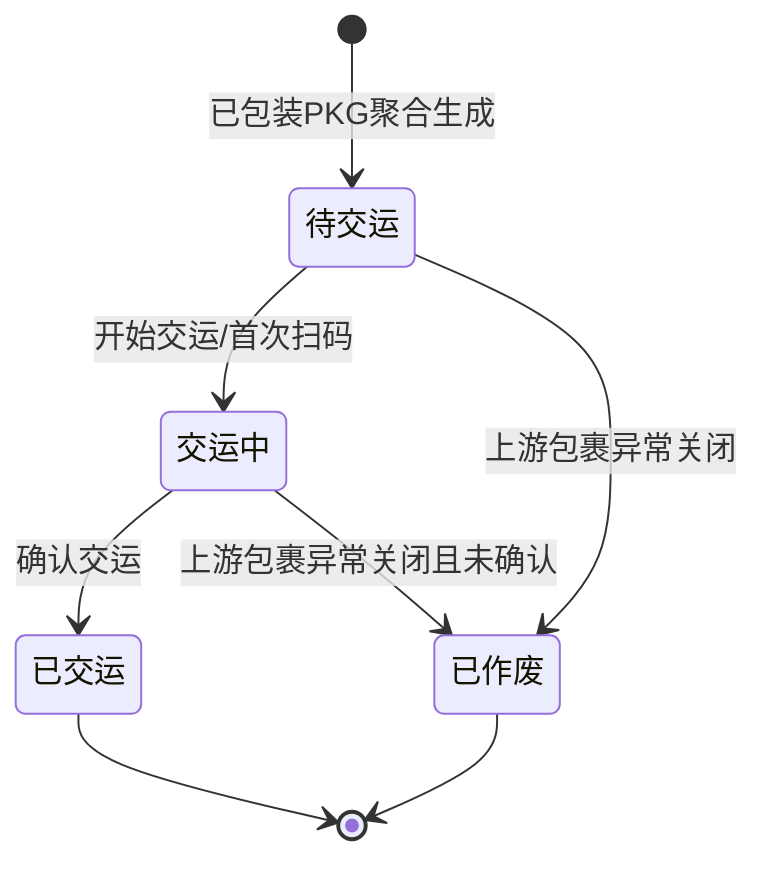

# 交运单_业务规则规格

> 角色：业务规则规格 | 类型：执行作业单
> 覆盖交运单状态机、包裹扫描校验、承运商交接校验、TMS/ERP/财务回传、订单完结和库存边界。

## 1. 状态机

| 当前状态 | 动作 | 目标状态 | 触发端 | 前置条件 | 后置结果 |
|:--|:--|:--|:--|:--|:--|
| - | PKG 聚合生成 | 待交运 | 系统 | 包裹状态=已包装，且未被其他有效 DSH 聚合 | 生成 DSH，带入包裹列表和承运商 |
| 待交运 | 开始交运 | 交运中 | PDA/工作站 | 当前用户有发货权限 | 写入发货员、开始时间 |
| 交运中 | 扫包裹/面单 | 交运中 | PDA/工作站 | 包裹属于当前 DSH 且已包装 | 更新扫描状态和实交数量 |
| 交运中 | 确认交运 | 已交运 | PDA/工作站 | 包裹数量一致，交接信息完整 | 写入交运时间，订单完结，触发回传 |
| 待交运/交运中 | 作废/关闭任务 | 已作废 | 系统/PC | 上游包裹异常且未确认交运 | DSH 终止，不回传完结 |

## 2. 动作按钮规则

| 按钮/动作 | 展示状态 | 校验 | 说明 |
|:--|:--|:--|:--|
| 开始交运 | 待交运 | 用户权限 | 进入交运中 |
| 扫包裹/面单 | 交运中 | 包裹归属、状态、承运商 | 扫错包裹阻断并记录异常 |
| 填写交接信息 | 交运中 | 交接人、地点、时间 | 确认交运前必填 |
| 确认交运 | 交运中 | 数量一致且无异常 | 状态变为已交运，触发完结和回传 |
| 重试回传 | 已交运 | 存在回传失败 | 仅重试 TMS/ERP/财务回传，不改变交运结果 |
| 作废/关闭 | 待交运、交运中 | 未确认交运 | 已交运后不允许作废 |

按钮不可用时隐藏，不展示灰色 disabled 态。状态字段只读，不允许直接编辑。

## 3. 来源规则

| 编号 | 规则 | 说明 |
|:--|:--|:--|
| DSH-R01 | 来源必需 | DSH 必须由已包装 PKG 聚合生成，不允许用户手工新增 |
| DSH-R02 | 来源锁定 | 包裹号、面单号、承运商、重量、来源波次继承 PKG，不可在 DSH 中修改 |
| DSH-R03 | 单号规则 | DSH 单号按 `DSH{YYYYMMDD}-{4位序号}` 生成，不可编辑 |
| DSH-R04 | 重复聚合拦截 | 同一已包装 PKG 不得进入多个有效 DSH |
| DSH-R05 | 承运商聚合 | 同一 DSH 内包裹承运商必须一致；不同承运商分单交运 |

## 4. 交接校验规则

| 编号 | 场景 | 校验规则 | 错误提示/反馈 |
|:--|:--|:--|:--|
| HAND-R01 | 扫包裹 | 实扫包裹号/面单号必须属于当前 DSH | `包裹不属于当前交运单` |
| HAND-R02 | 包裹状态 | 包裹状态必须为已包装 | `包裹未包装完成，不能交运` |
| HAND-R03 | 承运商一致 | 包裹承运商必须与 DSH 头部承运商一致 | `承运商不一致，请核对` |
| HAND-R04 | 重复扫描 | 已扫描包裹重复扫描时提示已扫描，不重复计数 | `该包裹已扫描` |
| HAND-R05 | 数量一致 | 实交包裹数必须等于应交包裹数 | `存在未交接包裹，不能确认交运` |
| HAND-R06 | 交接人必填 | 承运商交接人、交接地点、实际交接时间必填 | `请完善承运商交接信息` |

## 5. 回传与完结规则

| 编号 | 规则 | 说明 |
|:--|:--|:--|
| SYNC-R01 | 触发时点 | 确认交运成功后触发 TMS/ERP/财务回传任务 |
| SYNC-R02 | TMS 回传 | 记录交运单、包裹号、面单号、承运商、交接时间和交接结果 |
| SYNC-R03 | ERP 发货回执 | 回传销售订单发货完成结果，推动 ERP 侧出库完成 |
| SYNC-R04 | 财务出库凭证 | 生成或触发财务销售出库凭证/应收相关记录，具体接口不展开 |
| SYNC-R05 | 回传失败 | DSH 状态仍为已交运；对应同步状态标记失败，允许重试 |
| SYNC-R06 | 重试幂等 | 重试回传不得重复完结订单，也不得触发库存过账 |

## 6. 订单状态规则

| 编号 | 规则 | 说明 |
|:--|:--|:--|
| ORDER-R01 | 完结时点 | 交运确认=订单状态完结 |
| ORDER-R02 | 完结范围 | DSH 明细包裹关联的销售订单/出库需求进入已交运/完结 |
| ORDER-R03 | 部分交运 | 本期不支持带少交差异确认交运；需全部包裹交接后确认 |
| ORDER-R04 | 回传失败不回滚 | 回传失败不撤销已交运状态，只保留重试入口和失败记录 |

## 7. 库存边界规则

| 编号 | 规则 | 说明 |
|:--|:--|:--|
| INV-R01 | 已实扣来源 | 库存已在上游 PKG 确认包装完成时实扣 |
| INV-R02 | DSH 不过账 | 确认交运不扣现存、不释放占用、不生成出库 FL |
| INV-R03 | 三口径不变 | DSH 确认前后现存、占用、可用均不因交运动作变化 |
| INV-R04 | FL 查询 | 若需查看出库 FL，应跳转上游 PKG 关联库存流水 |
| INV-R05 | 下游无库存动作 | DSH 是出库链尾，不再产生库存过账环节 |

## 8. 权限规则

| 角色 | 权限 | 说明 |
|:--|:--|:--|
| 发货员 | 开始交运、扫码、填写交接信息、确认交运 | PDA/工作站主体角色 |
| 仓库主管 | 查看列表/详情、处理交接异常、必要时代交运 | 异常处理需记录操作人 |
| 只读账号 | 查看列表/详情 | 产品/测试复核 |
| 系统 | 聚合 PKG 生成 DSH、触发回传、完结订单 | 无人工新增入口 |

## 9. 完成判定

| 判定项 | 规则 |
|:--|:--|
| 包裹可交运 | 包裹状态=已包装，且属于当前 DSH |
| 明细完成 | 包裹扫描成功且交接结果=已交接 |
| 单据完成 | 全部包裹已交接，交接信息完整 |
| 订单完结 | DSH 状态=已交运后触发订单完结 |
| 回传完成 | TMS/ERP/财务同步状态均为已回传或已生成 |
