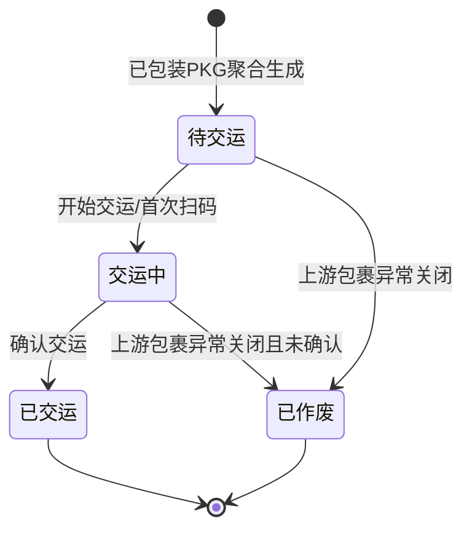

# 交运单主PRD

> 角色：主PRD | 类型：执行作业单
> 权威层级：context/ > 出库管理主PRD > 包裹套件 > 本文件
> 关联文件：`交运单字段清单.md` `交运单_业务规则规格.md` `交运单_业务流程推演.md` `交运单_用例数据推演.md`

## 1. 业务背景

交运单（DSH）是 Forge WMS 出库链最后一环，来源于上游已包装包裹（PKG）的聚合。仓库发货人员按承运商、线路或交接批次聚合包裹，现场扫描包裹号或面单号，与承运商交接人核对数量，确认交接后回传 TMS/ERP/财务所需的发货完成结果，并推动订单状态完结。

在日均 20,000+ 单、6 个仓库并行作业的场景中，交运环节的核心目标是确保“已包装包裹确实交给对应承运商”，避免漏交、错交、重复交接，以及仓库和承运商交接数量不一致。

交运单不做任何库存过账。库存实扣已经在上游包裹（PKG）确认包装完成时发生：现存减少、占用释放、生成 FL。DSH 只负责交接、回传和订单完结，不扣现存、不释放占用、不生成出库 FL。

## 2. 功能范围

### 2.1 In Scope

| 功能 | 端 | 说明 |
|:--|:--|:--|
| PKG 聚合生成 DSH | 系统 | 只能由已包装包裹聚合下推生成，不提供手工新增入口 |
| 交运任务领取/开始 | PDA/工作站 | 发货员开始承运商交接作业 |
| 包裹扫描交接 | PDA/工作站 | 扫描包裹号或面单号，校验是否属于当前 DSH |
| 交接数量核对 | PDA/工作站 | 核对应交包裹数、实交包裹数和差异 |
| 承运商交接确认 | PDA/工作站 | 记录承运商、交接人、车牌/批次、交接时间 |
| 回传 TMS/ERP/财务结果 | 系统 | 交运确认后写入回传任务/结果，不展开第三方接口协议 |
| 订单状态完结 | 系统 | 交运确认后把出库订单推进到已交运/完结 |
| PC 列表/详情查看 | PC | 查看交运状态、包裹清单、交接记录和回传结果 |

### 2.2 Out Scope

- 不提供“新增交运单”入口，DSH 必须由已包装 PKG 聚合生成。
- 不增加审核流，不出现待审核、已审核、反审核等状态。
- 不在 DSH 中执行拣货、复核、包装、称重、贴面单。
- 不在 DSH 中扣减现存库存、不释放占用、不生成出库 FL。
- 不展开真实快递/运输 API 协议、轨迹订阅、运费结算和异常理赔。
- 不处理交运后撤销、退回仓内或逆向库存冲销；如需支持，应另立异常流程。

## 3. 单据定位

| 项 | 说明 |
|:--|:--|
| 单据名称 | 交运单 |
| 单据编码 | DSH |
| 单号规则 | `DSH{YYYYMMDD}-{4位序号}`，如 `DSH20260705-0001` |
| 上游来源 | 已包装包裹 PKG 聚合生成 |
| 下游去向 | 出库链终点；回传 TMS/ERP/财务并完结订单 |
| 业务定位 | 聚合包裹、交接承运商、记录交接结果、推动订单状态完结 |
| 生成方式 | 系统按承运商/线路/交接批次聚合已包装 PKG，不允许无来源创建 |

## 4. 业务场景

| # | 场景 | 示例 | 系统处理 |
|:--:|:--|:--|:--|
| 1 | 正常交运 | DSH 聚合顺丰浦东 2 个包裹，现场实扫 2 个 | 允许确认交运，订单完结，回传结果 |
| 2 | 扫描不属于本单包裹 | 当前 DSH 为顺丰，误扫中通包裹 | 阻断并提示包裹不属于当前交运单 |
| 3 | 包裹未包装完成 | 扫到状态不是已包装的 PKG | 阻断，不允许交运 |
| 4 | 少交 | 应交 10 个包裹，实扫 9 个 | 不允许确认交运，需补扫或移出异常处理 |
| 5 | 承运商交接人缺失 | 未填写承运商交接人或交接时间 | 阻断确认交运 |
| 6 | 回传失败 | 已确认交运，但 TMS/ERP/财务回传失败 | DSH 保持已交运，回传状态标记失败，可重试 |
| 7 | 库存边界 | 交运确认后查看库存 | 现存、占用、可用均不因 DSH 改变，不生成 FL |

## 5. 状态机

交运单是执行层作业单，只保留交运执行状态，不加审核流。TMS/ERP/财务回传结果用独立同步状态记录，不作为审核状态。

| 状态 | 含义 | 可执行动作 | 进入条件 |
|:--|:--|:--|:--|
| 待交运 | 已由已包装包裹聚合，等待交接承运商 | 开始交运、查看详情 | 包裹状态=已包装 |
| 交运中 | 正在扫描包裹并核对承运商交接信息 | 扫包裹、填写交接信息、确认交运 | 发货员开始作业或首次扫码 |
| 已交运 | 包裹已交接承运商，订单状态完结 | 查看详情、重试回传 | 全部包裹交接校验通过并确认交运 |
| 已作废 | 交运任务被异常关闭 | 查看详情 | 未交运前上游包裹异常关闭 |

## 6. 规则摘要

| # | 规则 | 摘要 |
|:--:|:--|:--|
| R1 | 来源必需 | DSH 必须由已包装 PKG 聚合生成，不允许手工新增 |
| R2 | 单号不可编辑 | DSH 单号按 `DSH{YYYYMMDD}-{4位序号}` 系统生成 |
| R3 | 状态按钮触发 | 状态由“开始交运/确认交运”等动作触发，不允许直接编辑 |
| R4 | 包裹状态校验 | 只有已包装且属于本 DSH 的包裹可交运 |
| R5 | 数量一致 | 实扫包裹数必须等于应交包裹数，才允许确认交运 |
| R6 | 交接信息必填 | 承运商、交接人、交接时间必填 |
| R7 | 回传完结 | 确认交运后回传 TMS/ERP/财务结果，并完结订单状态 |
| R8 | 库存边界 | DSH 不扣现存、不释放占用、不生成出库 FL |
| R9 | 链尾边界 | DSH 是出库执行链尾，不再流转到库存过账环节 |

## 7. 字段清单入口

字段的唯一事实来源见 `交运单字段清单.md`。本主 PRD 只保留字段分类摘要：

| 分类 | 核心字段 |
|:--|:--|
| 交运头 | 交运单号、承运商、线路、交接人、交接时间、交接地点、状态、回传状态 |
| 交运明细 | 包裹号、面单号、承运商、重量、扫描状态、交接结果 |
| 系统字段 | 创建人、创建时间、开始时间、确认时间、关联包裹、回传记录、操作记录 |

## 8. 验收标准

| # | 验收项 | 验收标准 |
|:--:|:--|:--|
| AC1 | 来源控制 | 系统不提供新增入口，DSH 只能由已包装 PKG 聚合生成 |
| AC2 | 单号规则 | DSH 单号符合 `DSH{YYYYMMDD}-{4位序号}`，每日递增 |
| AC3 | 包裹校验 | 非本单包裹或未包装完成包裹不能交运 |
| AC4 | 数量校验 | 应交包裹数与实交包裹数一致后才允许确认交运 |
| AC5 | 交接信息 | 承运商交接人、交接时间必填 |
| AC6 | 回传结果 | 交运确认后生成 TMS/ERP/财务回传记录，失败可重试 |
| AC7 | 订单完结 | 交运确认后订单状态进入已交运/完结 |
| AC8 | 库存口径 | DSH 确认不改变现存、占用、可用，不生成出库 FL |

## 9. 不确定性

- TMS/ERP/财务的真实接口协议、字段映射和重试策略未在 context 中展开。本文只定义 DSH 需要记录回传任务、回传结果和失败重试入口，不编写第三方接口细节。
- 交运后发现承运商拒收、丢件或包裹退回的逆向处理未在 context 中定义，本文不纳入 DSH 正向主流程。
