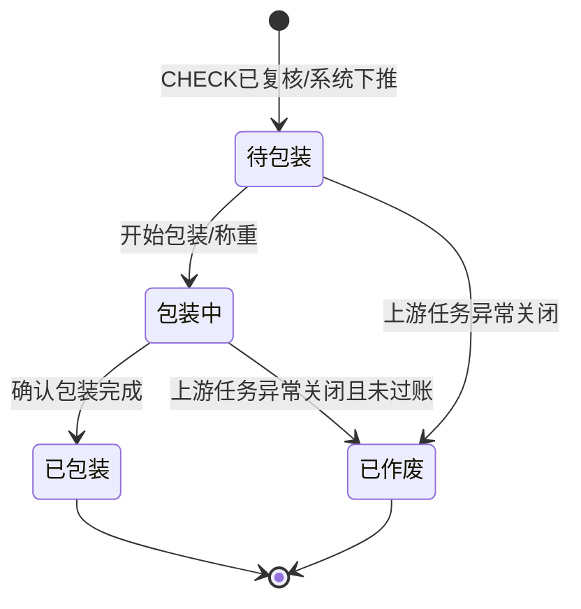

# 包裹_业务规则规格

> 角色：业务规则规格 | 类型：执行作业单
> 覆盖包裹状态机、称重/面单校验、确认包装完成、库存过账、FL 生成和下游交运边界。

## 1. 状态机

| 当前状态 | 动作 | 目标状态 | 触发端 | 前置条件 | 后置结果 |
|:--|:--|:--|:--|:--|:--|
| - | CHECK 下推生成 | 待包装 | 系统 | CHECK 状态=已复核 | 生成 PKG，带入出库明细和承运商信息 |
| 待包装 | 开始包装 | 包装中 | PDA/工作站 | 当前用户有包装权限 | 写入包装员、包装台、开始时间 |
| 包装中 | 称重/面单/贴单 | 包装中 | PDA/工作站 | 包裹未完成 | 更新重量、面单和贴单状态 |
| 包装中 | 确认包装完成 | 已包装 | PDA/工作站 | 包装校验通过，库存过账和 FL 生成成功 | 写入完成时间，状态已包装，流转 DSH |
| 待包装/包装中 | 作废/关闭任务 | 已作废 | 系统/PC | 上游异常关闭且 PKG 未过账 | 包装任务终止，不生成 FL |

## 2. 动作按钮规则

| 按钮/动作 | 展示状态 | 校验 | 说明 |
|:--|:--|:--|:--|
| 开始包装 | 待包装 | 用户权限 | 进入包装中 |
| 称重 | 包装中 | 重量大于 0 | 可由电子秤带入或人工录入 |
| 生成/录入面单 | 包装中 | 承运商存在 | Demo 版可系统模拟生成或人工录入 |
| 打印面单 | 包装中 | 面单号存在 | 打印成功后状态为已打印 |
| 确认已贴单 | 包装中 | 面单已打印 | 包装员确认面单已贴到包裹 |
| 确认包装完成 | 包装中 | 全量校验 + 库存校验 | 成功后触发库存实扣和 FL 生成 |
| 作废/关闭 | 待包装、包装中 | 上游异常且未过账 | 已包装后不允许作废 |

按钮不可用时隐藏，不展示灰色 disabled 态。状态字段只读，不允许直接编辑。

## 3. 来源规则

| 编号 | 规则 | 说明 |
|:--|:--|:--|
| PKG-R01 | 来源必需 | PKG 必须由已复核 CHECK 下推生成，不允许用户手工新增 |
| PKG-R02 | 来源锁定 | 来源 CHECK、PICK、WAVE、仓库、出库商品明细继承上游，不可在 PKG 中修改 |
| PKG-R03 | 单号规则 | PKG 单号按 `PKG{YYYYMMDD}-{6位序号}` 生成，不可编辑 |
| PKG-R04 | 重复下推拦截 | 同一有效 CHECK 不得重复生成多个待包装 PKG |
| PKG-R05 | 下游限制 | 只有已包装 PKG 可以进入 DSH |

## 4. 包装校验规则

| 编号 | 场景 | 校验规则 | 错误提示/反馈 |
|:--|:--|:--|:--|
| PACK-R01 | 称重 | `package_weight_kg > 0` | `请先完成包裹称重` |
| PACK-R02 | 承运商 | `carrier_code` 必须存在且启用 | `请选择承运商` |
| PACK-R03 | 面单号 | `waybill_no` 必须存在 | `请先生成或录入面单号` |
| PACK-R04 | 面单打印 | `waybill_print_status=printed` | `请先打印面单` |
| PACK-R05 | 贴单确认 | `label_attached=true` | `请确认面单已贴到包裹` |
| PACK-R06 | 出库明细 | 至少一条明细，且所有 `outbound_qty>0` | `包裹明细为空或数量异常` |
| PACK-R07 | 重复完成 | `status=packed` 或 `post_status=posted` 时阻断 | `包裹已完成，请勿重复提交` |

## 5. 库存过账规则

| 编号 | 规则 | 说明 |
|:--|:--|:--|
| INV-R01 | 触发时点 | 只有点击“确认包装完成”且包装校验通过后触发库存过账 |
| INV-R02 | 实扣科目 | 每条明细按出库数量扣减现存，并释放同等数量占用 |
| INV-R03 | 可用口径 | 包装完成后可用保持不变；原因是 SO 审核时已把可用转入占用 |
| INV-R04 | FL 生成 | 包装完成同事务生成一条库存流水 FL，单号按 `FL{YYYYMMDD}-{8位序号}` |
| INV-R05 | 事务原子性 | PKG 状态更新、库存三口径更新、FL 生成必须一起成功；任一步失败则整体回滚 |
| INV-R06 | 幂等控制 | 已包装或已生成 FL 的 PKG 再次提交时不得再次影响库存 |
| INV-R07 | 交运边界 | DSH 只做交接和状态完结，不再触发库存过账 |

## 6. 库存校验规则

| 编号 | 校验 | 规则 | 失败处理 |
|:--|:--|:--|:--|
| STOCK-R01 | 现存充足 | `before_on_hand_qty >= outbound_qty` | 阻断包装完成，提示库存现存不足 |
| STOCK-R02 | 占用充足 | `before_allocated_qty >= outbound_qty` | 阻断包装完成，提示占用数量不足 |
| STOCK-R03 | 出库数量 | `outbound_qty > 0` | 阻断包装完成 |
| STOCK-R04 | 快照一致 | 库存快照需取包装完成提交时的最新值 | 快照过期则刷新后重试 |
| STOCK-R05 | 结果计算 | `after_on_hand_qty = before_on_hand_qty - outbound_qty`；`after_allocated_qty = before_allocated_qty - outbound_qty`；`after_available_qty = before_available_qty` | 结果写入明细快照 |

## 7. FL 生成规则

| 编号 | 规则 | 说明 |
|:--|:--|:--|
| FL-R01 | 生成时点 | 与确认包装完成同事务生成 |
| FL-R02 | 单号规则 | `FL{YYYYMMDD}-{8位序号}`，如 `FL20260705-00000001` |
| FL-R03 | 来源单据 | `source_doc_type=PKG`，`source_doc_no=pkg_no` |
| FL-R04 | 变动类型 | `outbound_pack` 包装完成出库 |
| FL-R05 | 变动数量 | 记录出库数量为负数，用于表达现存减少 |
| FL-R06 | 追溯字段 | 记录仓库、货位、商品、包裹号、操作人、过账时间 |

## 8. 权限规则

| 角色 | 权限 | 说明 |
|:--|:--|:--|
| 包装员 | 开始包装、称重、生成/录入面单、打印、确认贴单、确认包装完成 | PDA/工作站主体角色 |
| 仓库主管 | 查看列表/详情、处理包装异常、必要时代包装 | 异常处理需记录操作人 |
| 只读账号 | 查看列表/详情 | 产品/测试复核 |
| 系统 | CHECK 下推生成 PKG、库存过账、FL 生成、流转 DSH | 无人工新增入口 |

## 9. 完成判定

| 判定项 | 规则 |
|:--|:--|
| 包装资料完整 | 重量、承运商、面单、打印、贴单均满足校验 |
| 库存可过账 | 现存和占用均足以覆盖出库数量 |
| 单据完成 | 包装资料完整 + 库存过账成功 + FL 已生成 |
| 下游流转 | PKG 状态=已包装后流转 DSH |
| 不可重复完成 | 已包装 PKG 不允许再次触发库存更新或 FL 生成 |
