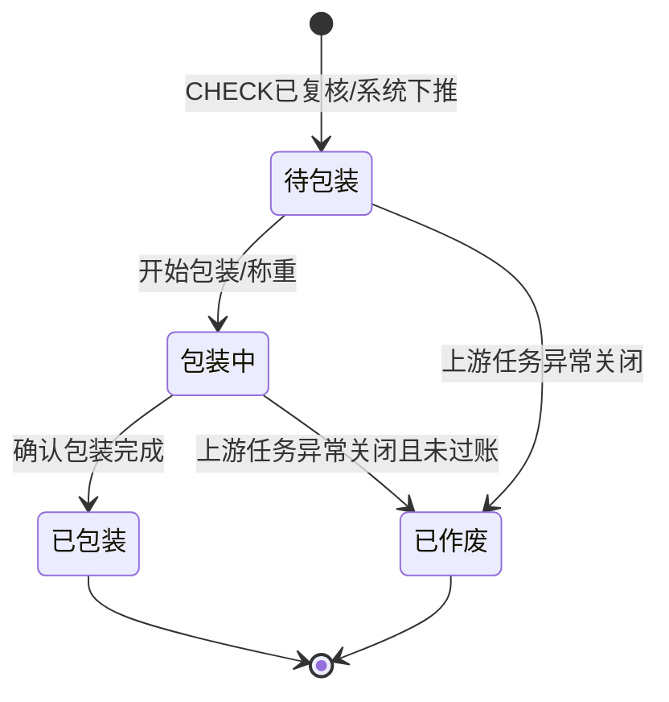

# 包裹主PRD

> 角色：主PRD | 类型：执行作业单
> 权威层级：context/ > 出库管理主PRD > 复核单套件 > 本文件
> 关联文件：`包裹字段清单.md` `包裹_业务规则规格.md` `包裹_业务流程推演.md` `包裹_用例数据推演.md`

## 1. 业务背景

包裹（PKG）是 Forge WMS 出库执行层作业单，来源于上游复核单（CHECK）复核通过后的系统下推。包装员在包装台或 PDA 端完成称重、选择/确认承运商、生成或录入面单、打印并贴面单，最后点击“确认包装完成”。

在出库链路中，包裹位于复核和交运之间，是订单从仓内作业转为可交接承运商包裹的关键节点。包裹号、重量、面单和承运商信息会成为下游交运（DSH）的交接依据。

包裹也是整条出库链唯一的库存实扣点：确认包装完成时，系统扣减现存、释放对应占用，并生成库存流水 FL；可用保持不变，因为销售订单审核时已经从可用中转入占用。复核、拣货、交运均不再触发该库存动作。

## 2. 功能范围

### 2.1 In Scope

| 功能 | 端 | 说明 |
|:--|:--|:--|
| CHECK 通过下推 PKG | 系统 | 只能由已复核的 CHECK 生成，不提供手工新增入口 |
| 开始包装 | PDA/工作站 | 包装员领取待包装任务，进入包装中 |
| 包裹称重 | PDA/工作站 | 录入或读取包裹重量，作为包装完成必填项 |
| 承运商确认 | PDA/工作站 | 继承上游波次/订单承运商，也允许按权限确认调整 |
| 面单生成/录入 | PDA/工作站 | 生成或录入面单号，支持 Demo 版模拟面单打印 |
| 面单打印与贴单 | PDA/工作站 | 打印面单并标记贴单完成 |
| 确认包装完成 | PDA/工作站 | 状态变为已包装，同步触发库存实扣和 FL 生成 |
| 流转交运 | 系统 | 包装完成后进入 DSH 待交运 |
| PC 列表/详情查看 | PC | 查看包裹状态、重量、面单、库存过账和下游交运关联 |

### 2.2 Out Scope

- 不提供“新增包裹”入口，PKG 必须来自已复核 CHECK。
- 不增加审核流，状态只表达包装执行进度。
- 不在 PKG 中执行复核、拣货、交运动作；这些属于 CHECK、PICK、DSH。
- 不对接真实快递/运输 API；面单号和承运商按 Demo 版模拟或人工录入。
- 不做 PDA、扫码枪、电子秤、打印机硬件选型。
- 不处理包装完成后的退货、撤销出库或逆向库存回滚；如需支持，应另立异常/冲销规则。

## 3. 单据定位

| 项 | 说明 |
|:--|:--|
| 单据名称 | 包裹 |
| 单据编码 | PKG |
| 单号规则 | `PKG{YYYYMMDD}-{6位序号}`，如 `PKG20260705-000001` |
| 上游来源 | 复核单 CHECK 已复核后系统下推 |
| 下游去向 | 交运单 DSH；包装完成后进入待交运 |
| 业务定位 | 记录称重、面单、承运商、包装完成结果，并触发出库库存实扣 |
| 生成方式 | 系统根据 CHECK 复核通过结果生成，不允许无来源创建 |

## 4. 业务场景

| # | 场景 | 示例 | 系统处理 |
|:--:|:--|:--|:--|
| 1 | 正常包装 | CHECK 已复核，包裹称重 2.45kg，生成面单 SF202607050001 | 允许确认包装完成，触发库存实扣并流转交运 |
| 2 | 未称重 | 包装员未录入重量直接完成 | 阻断完成，提示先完成称重 |
| 3 | 未贴面单 | 面单号为空或打印状态未完成 | 阻断完成，提示先生成/录入面单并打印 |
| 4 | 承运商缺失 | 上游未带出承运商 | 要求选择承运商后才允许完成 |
| 5 | 库存校验失败 | 包装完成时现存或占用不足以覆盖出库数量 | 阻断过账，不变更 PKG 状态，不生成 FL |
| 6 | 重复点击完成 | 已包装的 PKG 再次点击完成 | 阻断重复过账，提示包裹已完成 |
| 7 | 交运接收 | 包装完成后进入 DSH | 交运只做承运商交接，不再触发库存过账 |

## 5. 状态机

包裹是执行层作业单，只保留包装执行状态，不加审核流。

| 状态 | 含义 | 可执行动作 | 进入条件 |
|:--|:--|:--|:--|
| 待包装 | 已由 CHECK 下推，等待包装员处理 | 开始包装、查看详情 | CHECK 状态=已复核 |
| 包装中 | 已开始称重、面单或贴单作业 | 称重、生成/录入面单、打印面单、确认包装完成 | 包装员开始作业或首次录入包装信息 |
| 已包装 | 包装完成，库存已实扣，FL 已生成 | 查看详情、查看交运单 | 完成校验、库存过账和 FL 生成均成功 |
| 已作废 | 包装任务被异常关闭 | 查看详情 | 上游异常关闭且 PKG 尚未完成过账 |

## 6. 规则摘要

| # | 规则 | 摘要 |
|:--:|:--|:--|
| R1 | 来源必需 | PKG 必须由已复核 CHECK 下推生成，不允许手工新增 |
| R2 | 单号不可编辑 | PKG 单号按 `PKG{YYYYMMDD}-{6位序号}` 系统生成 |
| R3 | 状态按钮触发 | 状态由“开始包装/确认包装完成”等动作触发，不允许直接编辑 |
| R4 | 包装完成前校验 | 重量、承运商、面单、贴单状态、出库明细必须完整 |
| R5 | 库存实扣点 | 只有“确认包装完成”触发现存扣减、占用释放和 FL 生成 |
| R6 | 可用口径 | 包装完成后可用保持不变，避免重复影响销售可用量 |
| R7 | 过账原子性 | PKG 状态完成、库存更新、FL 生成必须一起成功或一起失败 |
| R8 | 防重复过账 | 已包装或已有 FL 的 PKG 不允许再次触发库存实扣 |
| R9 | 下游边界 | PKG 完成后进入 DSH；交运确认不再触发库存过账 |

## 7. 字段清单入口

字段的唯一事实来源见 `包裹字段清单.md`。本主 PRD 只保留字段分类摘要：

| 分类 | 核心字段 |
|:--|:--|
| 包裹头 | 包裹号、来源复核单、仓库、承运商、重量、面单号、面单打印状态、包装状态、库存过账状态、FL 单号 |
| 包裹明细 | 商品、出库数量、货位、批次、单位、库存过账数量、过账结果 |
| 系统字段 | 创建人、创建时间、开始时间、完成时间、包装员、包装台、关联交运单、操作记录 |

## 8. 验收标准

| # | 验收项 | 验收标准 |
|:--:|:--|:--|
| AC1 | 来源控制 | 系统不提供新增入口，PKG 只能由已复核 CHECK 下推生成 |
| AC2 | 单号规则 | PKG 单号符合 `PKG{YYYYMMDD}-{6位序号}`，每日递增 |
| AC3 | 完成校验 | 未称重、无承运商、无面单或未贴单时不能确认包装完成 |
| AC4 | 库存过账 | 确认包装完成后，现存减少出库数量，占用减少同等数量，可用不变 |
| AC5 | FL 生成 | 包装完成时生成一条 FL，单号符合 `FL{YYYYMMDD}-{8位序号}` |
| AC6 | 原子性 | 库存更新或 FL 生成失败时，PKG 不得变为已包装 |
| AC7 | 幂等控制 | 已包装的 PKG 重复提交不会再次扣减库存 |
| AC8 | 下游边界 | 交运只接收已包装包裹，不再触发库存过账 |

## 9. 不确定性

- 多 SKU 包裹在库存流水物理表中是否拆成多条 SKU 级流水，context 未展开。本文按本次需求口径写为一次包装完成生成一条 FL 过账记录，明细出库数量在包裹明细中保留。
- 面单号在真实项目中可能来自承运商接口；本 Demo 不涉及第三方物流 API，因此只要求支持系统模拟生成或人工录入。
