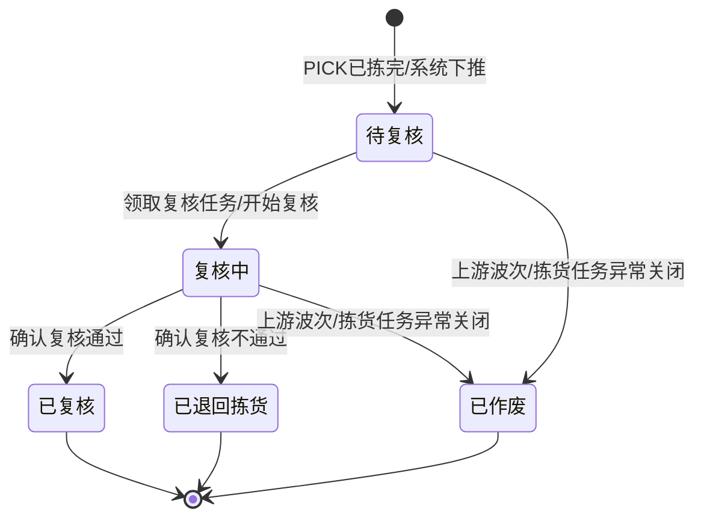

# 复核单_业务规则规格

> 角色：业务规则规格 | 类型：执行作业单
> 覆盖复核单状态机、扫码校验、数量不符处理、复核不通过回退拣货和库存边界。

## 1. 状态机

| 当前状态 | 动作 | 目标状态 | 触发端 | 前置条件 | 后置结果 |
|:--|:--|:--|:--|:--|:--|
| - | PICK 下推生成 | 待复核 | 系统 | PICK 状态=已拣完 | 生成 CHECK，带入箱码和应复核明细 |
| 待复核 | 领取/开始复核 | 复核中 | PDA/工作站 | 当前用户有复核权限 | 写入复核员、开始时间 |
| 复核中 | 扫箱/扫商品 | 复核中 | PDA/工作站 | 箱码和商品校验通过或记录错扫 | 更新实复核数、待扫描数量和扫码记录 |
| 复核中 | 确认复核通过 | 已复核 | PDA/工作站 | 全部明细已匹配且无错品/串箱 | 写入完成时间，流转 PKG |
| 复核中 | 确认复核不通过 | 已退回拣货 | PDA/工作站 | 存在已确认数量差异、错品或串箱；退回原因已填 | CHECK 终止，关联 PICK 回到重拣/补拣处理 |
| 待复核/复核中 | 作废/关闭任务 | 已作废 | 系统/PC | 上游波次或拣货任务异常关闭 | 作废本复核任务，不流转包装 |

## 2. 动作按钮规则

| 按钮/动作 | 展示状态 | 校验 | 说明 |
|:--|:--|:--|:--|
| 开始复核 | 待复核 | 用户权限 | 进入复核中，写入复核员和开始时间 |
| 扫发货箱/包厢 | 复核中 | 箱码归属 | 扫错箱码阻断并记录异常 |
| 扫商品 | 复核中 | 商品归属 | 未扫箱前不允许确认商品 |
| 确认复核通过 | 复核中 | 全部明细已匹配 | 状态变为已复核并流转 PKG |
| 确认复核不通过 | 复核中 | 存在已确认差异或未匹配明细经确认少件，且原因必填 | 状态变为已退回拣货 |
| 作废/关闭 | 待复核、复核中 | 上游异常关闭 | 状态变为已作废 |

按钮不可用时隐藏，不展示灰色 disabled 态。状态字段只读，不允许直接编辑。

## 3. 来源规则

| 编号 | 规则 | 说明 |
|:--|:--|:--|
| CHECK-R01 | 来源必需 | CHECK 必须由已拣完 PICK 下推生成，不允许用户手工新增 |
| CHECK-R02 | 来源锁定 | 来源 PICK、来源 WAVE、仓库、发货箱/包厢、应复核明细继承上游，不可在 CHECK 中修改 |
| CHECK-R03 | 单号规则 | CHECK 单号按 `CHECK{YYYYMMDD}-{4位序号}` 生成，不可编辑 |
| CHECK-R04 | 重复下推拦截 | 同一有效 PICK 不得重复生成多个待复核 CHECK；退回后再次复核的任务形态见不确定性说明 |

## 4. 扫码校验规则

| 编号 | 场景 | 校验规则 | 错误提示/反馈 |
|:--|:--|:--|:--|
| SCAN-R01 | 扫发货箱/包厢 | 实扫箱码必须属于当前 CHECK | `箱码不属于当前复核单`，语音+震动 |
| SCAN-R02 | 未扫箱先扫商品 | 当前箱码未校验通过时不允许商品确认 | `请先扫描发货箱` |
| SCAN-R03 | 扫商品 | 实扫商品必须属于当前发货箱/订单明细 | `商品不属于当前复核单，请核对` |
| SCAN-R04 | 重复扫同一商品 | 扫描次数累计为实复核数；超过应复核数时标记多件差异 | `数量已超过应复核数，请确认差异` |
| SCAN-R05 | 扫到未预期商品 | 记录错品异常，不计入匹配明细 | `发现错品，需退回拣货处理` |
| SCAN-R06 | 离线扫码 | PDA 可离线缓存扫描记录，但同步时仍以后端 CHECK 状态和明细为准 | 冲突时提示重新同步 |

## 5. 数量校验规则

| 编号 | 规则 | 说明 | 错误提示 |
|:--|:--|:--|:--|
| QTY-R01 | 应复核数只读 | 应复核数来自 PICK/订单应出库结果，不可手工修改 | - |
| QTY-R02 | 实复核数累计 | 实复核数由扫码累计，授权补录需记录原因 | - |
| QTY-R03 | 少件差异 | 复核员确认不通过时，若 `actualCheckQty < shouldCheckQty`，则 `diffType=SHORT` | `复核数量不足，不能通过` |
| QTY-R04 | 多件差异 | `actualCheckQty > shouldCheckQty` 时 `diffType=OVER` | `复核数量超出，不能通过` |
| QTY-R05 | 通过条件 | 仅当所有明细 `lineStatus=MATCHED` 且无错品/串箱时允许通过 | `存在未匹配或差异，不能确认通过` |
| QTY-R06 | 差异确认 | 存在已确认差异，或复核员将未匹配数量确认为少件时，只能确认复核不通过并选择退回原因 | `请选择退回原因` |

## 6. 数量不符处理

| 编号 | 场景 | 处理规则 |
|:--|:--|:--|
| DIFF-R01 | 少件 | 标记差异数量为负数，复核不通过，回退拣货补拣 |
| DIFF-R02 | 多件 | 标记差异数量为正数，复核不通过，回退拣货核对串货/多拣 |
| DIFF-R03 | 错品 | 记录错品 SKU 和扫码记录，复核不通过，回退拣货 |
| DIFF-R04 | 串箱 | 记录错误箱码，复核不通过，不允许流转包装 |
| DIFF-R05 | 条码异常 | 可由有权限人员补录或确认不通过；补录必须留下操作记录 |
| DIFF-R06 | 差异关闭 | 差异不得在 CHECK 内直接改应复核数抹平；必须通过重拣/补拣后重新复核 |

## 7. 复核不通过回退拣货

| 编号 | 规则 | 说明 |
|:--|:--|:--|
| RETURN-R01 | 退回触发 | 已确认数量差异、错品、串箱任一存在，或未匹配数量经确认少件时，可点击“确认复核不通过” |
| RETURN-R02 | 原因必填 | 退回原因必填；原因=其他时退回说明必填且 ≤200 字符 |
| RETURN-R03 | CHECK 终态 | 确认不通过后，CHECK 状态变为已退回拣货，不允许继续扫码 |
| RETURN-R04 | 回到 PICK | 系统将关联 PICK 标记为需重拣/补拣，拣货员处理后再进入复核 |
| RETURN-R05 | 不生成 PKG | 已退回拣货的 CHECK 不得生成或流转 PKG |
| RETURN-R06 | 记录可追溯 | 退回动作写入操作记录，包含复核员、时间、原因、差异明细 |

## 8. 权限规则

| 角色 | 权限 | 说明 |
|:--|:--|:--|
| 复核员 | 领取任务、扫箱、扫商品、确认通过、确认不通过 | PDA/工作站主体角色 |
| 仓库主管 | 查看列表/详情、处理条码异常、必要时代复核 | 异常补录需记录操作人 |
| 拣货员 | 查看被退回的来源 PICK，不直接修改 CHECK | 回退后处理重拣/补拣 |
| 只读账号 | 查看列表/详情 | 产品/测试复核 |
| 系统 | PICK 下推生成 CHECK、状态汇总、流转 PKG、回退 PICK | 无人工新增入口 |

## 9. 库存过账规则

| 编号 | 规则 | 说明 |
|:--|:--|:--|
| INV-R01 | 占用来源 | 按 `06-库存管理规则`，SO 审核触发占用，可用转占用 |
| INV-R02 | CHECK 生成 | CHECK 由 PICK 完成下推生成，不新增占用，不扣减现存 |
| INV-R03 | 扫码复核 | 扫箱、扫商品、确认数量只记录校验结果，不生成 FL |
| INV-R04 | 复核通过 | CHECK 已复核只允许流转 PKG，不扣现存、不释放占用、不生成 FL |
| INV-R05 | 复核不通过 | 回退拣货不扣现存、不释放占用、不生成 FL |
| INV-R06 | 扣减时点 | 包装完成才触发库存扣减：现存-N、占用-N、可用不变，并生成 FL |

## 10. 完成判定

| 判定项 | 规则 |
|:--|:--|
| 明细匹配 | `actualCheckQty = shouldCheckQty`、`diffType=NONE` 且 `lineStatus=MATCHED` |
| 明细差异 | 少件、多件、错品、串箱任一发生 |
| 单据通过 | 所有明细均匹配，且无差异行 |
| 单据退回 | 至少一条明细存在差异，复核员确认不通过并填写原因 |
| 下游流转 | 只有状态=已复核的 CHECK 可以流转 PKG |
