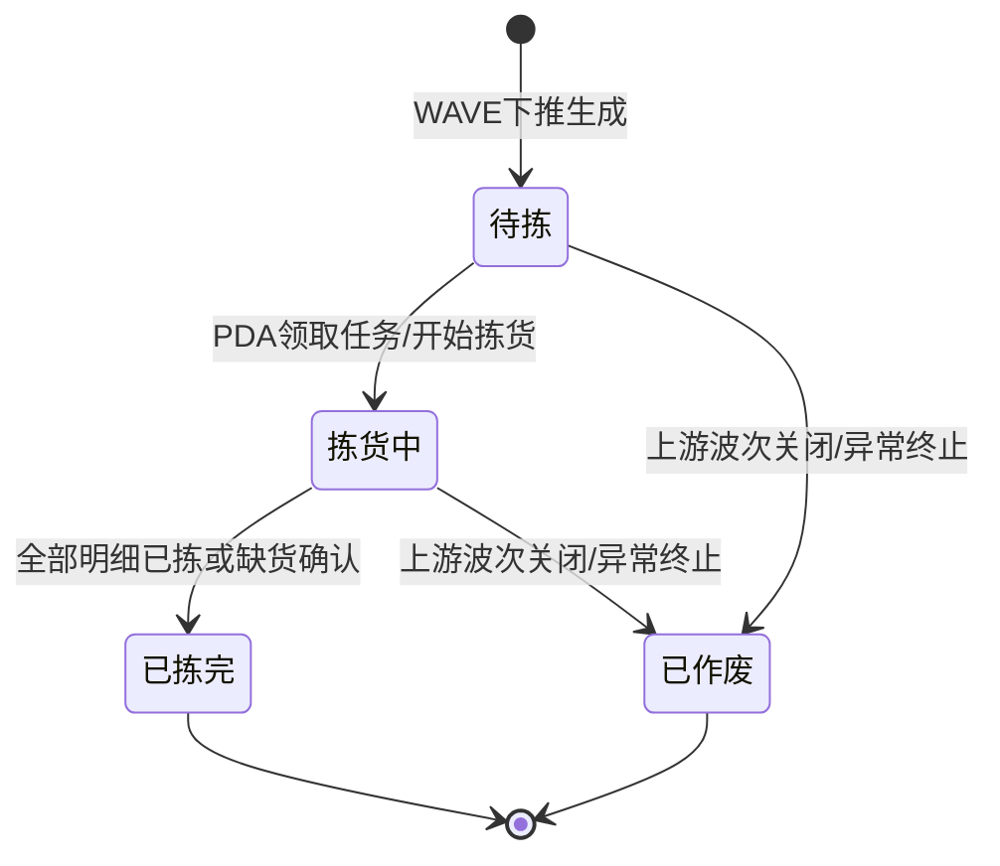

# 拣货单_业务规则规格

> 角色：业务规则规格 | 类型：执行作业单
> 覆盖拣货单状态机、PDA 扫码校验、缺货处理、权限和库存过账规则。

## 1. 状态机

| 当前状态 | 动作 | 目标状态 | 触发端 | 前置条件 | 后置结果 |
|:--|:--|:--|:--|:--|:--|
| - | WAVE 下推生成 | 待拣 | 系统 | 波次已分配拣货员并下推 | 生成 PICK，带入波次和拣货明细 |
| 待拣 | 领取任务 | 拣货中 | PDA | 当前用户为拣货员或有代拣权限 | 写入领取时间，任务进入执行 |
| 拣货中 | 确认明细 | 拣货中 | PDA | 货位、商品、数量校验通过 | 更新明细实拣/缺货数量 |
| 拣货中 | 完成拣货 | 已拣完 | PDA/系统 | 所有明细已拣或缺货确认 | 写入完成时间，流转复核 |
| 待拣/拣货中 | 作废/关闭任务 | 已作废 | 系统/PC | 上游波次异常关闭且本单未拣完 | 作废本任务，释放波次关联 |

## 2. 动作按钮规则

| 按钮/动作 | 展示状态 | 校验 | 说明 |
|:--|:--|:--|:--|
| 领取任务 | 待拣 | 用户权限 | PDA 领取后进入拣货中 |
| 扫货位 | 拣货中 | 货位匹配 | 扫错货位阻断 |
| 扫商品 | 拣货中 | 商品匹配 | 扫错商品阻断 |
| 确认数量 | 拣货中 | 数量范围 | 超拣阻断 |
| 登记缺货 | 拣货中 | 原因必填 | 记录缺货数量和原因 |
| 完成拣货 | 拣货中 | 全部明细完成 | 状态变为已拣完 |
| 作废/关闭 | 待拣、拣货中 | 上游波次关闭 | 状态变为已作废 |

按钮不可用时隐藏，不展示灰色 disabled 态。状态字段只读，不允许直接编辑。

## 3. 来源规则

| 编号 | 规则 | 说明 |
|:--|:--|:--|
| PICK-R01 | 来源必需 | PICK 必须由 WAVE 下推生成，不允许用户手工新增 |
| PICK-R02 | 来源锁定 | 来源波次、仓库、拣货模式、拣货员、应拣明细继承 WAVE，不可在 PICK 中修改 |
| PICK-R03 | 单号规则 | PICK 单号按 `PICK{YYYYMMDD}-{4位序号}` 生成，不可编辑 |
| PICK-R04 | 重复下推拦截 | 同一 WAVE 不得重复生成有效 PICK；若复核回退，应回到原 PICK 或补拣任务，具体按后续规则确认 |

## 4. PDA 扫码校验

| 编号 | 场景 | 校验规则 | 错误提示/反馈 |
|:--|:--|:--|:--|
| SCAN-R01 | 扫货位 | 实扫货位必须等于当前明细推荐货位 | `货位不匹配，请扫描 A-01-02`，语音+震动 |
| SCAN-R02 | 扫商品 | 实扫商品必须等于当前明细 SKU | `商品不匹配，请核对商品`，语音+震动 |
| SCAN-R03 | 未扫货位先扫商品 | 当前明细未完成货位校验时不允许商品确认 | `请先扫描货位` |
| SCAN-R04 | 重复扫同一商品 | 已完成明细重复扫描时提示已完成 | `该商品已完成拣货` |
| SCAN-R05 | 离线扫码 | PDA 可离线缓存扫描记录，但同步时仍需后端校验状态和数量 | 冲突时提示重新同步 |

## 5. 数量校验

| 编号 | 规则 | 说明 | 错误提示 |
|:--|:--|:--|:--|
| QTY-R01 | 实拣整数 | 实拣数量必须为整数，允许 0 作为缺货登记前置 | `实拣数量必须为整数` |
| QTY-R02 | 不得负数 | 实拣数量不得小于 0 | `实拣数量不能小于 0` |
| QTY-R03 | 超拣阻断 | 实拣数量不得大于应拣数量 | `实拣数量不能大于应拣数量` |
| QTY-R04 | 完整拣货 | 实拣数量=应拣数量时，明细状态为已拣 | - |
| QTY-R05 | 缺货拣货 | 实拣数量<应拣数量时，必须登记缺货原因 | `请登记缺货原因` |

## 6. 缺货处理规则

| 编号 | 规则 | 说明 |
|:--|:--|:--|
| SHORT-R01 | 缺货计算 | `缺货数量 = 应拣数量 - 实拣数量` |
| SHORT-R02 | 原因必填 | 缺货数量>0 时，缺货原因必填 |
| SHORT-R03 | 其他说明 | 缺货原因=其他时，行备注必填且 ≤200 字符 |
| SHORT-R04 | 完成条件 | 缺货已登记的明细可视为拣货处理完成，但带异常标记流转复核/订单处理 |
| SHORT-R05 | 不自动释放占用 | 缺货登记不自动释放库存占用；是否释放或补货由后续订单/异常规则处理 |

## 7. 权限规则

| 角色 | 权限 | 说明 |
|:--|:--|:--|
| 拣货员 | 领取本人任务、扫码、确认数量、登记缺货、完成拣货 | PDA 主体角色 |
| 仓库主管 | 查看列表/详情、必要时代拣或处理异常 | 异常处理需记录操作人 |
| 只读账号 | 查看列表/详情 | 产品/测试复核 |
| 系统 | WAVE 下推生成 PICK、状态汇总、流转复核 | 无人工入口 |

## 8. 库存过账规则

| 编号 | 规则 | 说明 |
|:--|:--|:--|
| INV-R01 | 占用来源 | 按 `06-库存管理规则`，SO 审核触发占用，可用转占用 |
| INV-R02 | PICK 生成 | PICK 由 WAVE 下推生成，不新增占用，不扣减现存 |
| INV-R03 | 拣货确认 | PDA 确认实拣只记录作业结果，不生成库存流水 FL |
| INV-R04 | 扣减时点 | 按 `05-出库流程详解` 和出库主 PRD，包装完成触发库存扣减（扣减现存、释放占用，即现存-N、占用-N，可用不变）并生成 FL |
| INV-R05 | 缺货占用 | 缺货登记不自动释放占用，需由订单取消、补货或异常处理规则决定 |

## 9. 完成判定

| 判定项 | 规则 |
|:--|:--|
| 明细完成 | `actual_pick_qty = should_pick_qty`，状态为已拣 |
| 明细缺货完成 | `actual_pick_qty < should_pick_qty` 且缺货原因已填，状态为缺货完成 |
| 单据完成 | 所有明细状态均为已拣或缺货完成 |
| 下游流转 | 单据完成后流转复核，复核不通过可回退拣货 |
