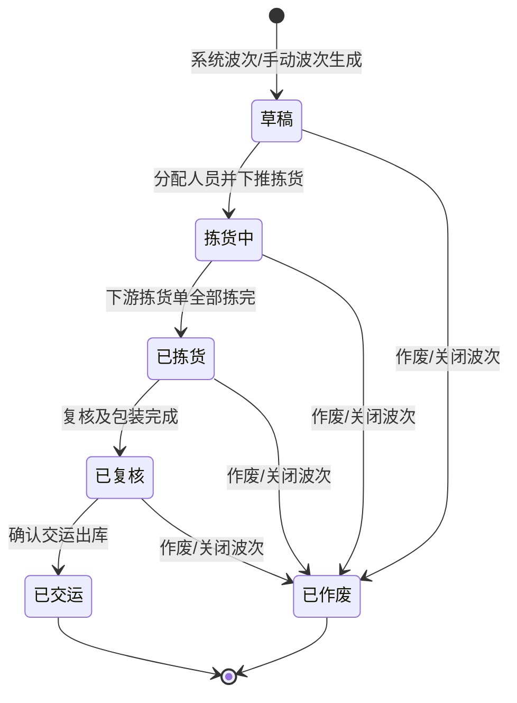

# 波次_业务规则规格

> 角色：业务规则规格 | 类型：业务单据
> 覆盖波次状态机、聚合规则、手动组波、权限、库存占用/扣减口径和动作按钮。

## 1. 状态机

| 当前状态 | 动作 | 目标状态 | 触发端 | 前置条件 | 后置结果 |
|:--|:--|:--|:--|:--|:--|
| - | 系统聚合生成 | 草稿 | 系统 | 存在待波次出库需求 | 生成 WAVE，写入聚合维度和明细，状态为草稿 |
| - | 手动生成 | 草稿 | PC | 用户圈选有效出库需求 | 生成 WAVE，明细状态变为已入波次，状态为草稿 |
| 草稿 | 分配并下推拣货 | 拣货中 | PC/系统 | 拣货员有效，明细未取消 | 生成或关联 PICK，写入下推时间，状态变为拣货中 |
| 拣货中 | 下游拣货单全部拣完 | 已拣货 | 系统 | 关联的所有拣货单均已完成 | 状态变更为已拣货 |
| 已拣货 | 复核与包装完成 | 已复核 | 系统 | 复核单完成且包装贴单完毕 | 状态变更为已复核 |
| 已复核 | 确认交运出库 | 已交运 | PC | 包裹完成交接并确认交运 | 状态变更为已交运，流转完结 |
| 草稿 / 拣货中 / 已拣货 / 已复核 | 关闭/作废波次 | 已作废 | PC | 二次确认，关闭原因必填 | 波次异常终止，状态变更为已作废 |

## 2. 动作按钮规则

| 按钮 | 展示状态 | 校验 | 说明 |
|:--|:--|:--|:--|
| 新建手动波次 | 列表页 | 权限 | 打开新增编辑页，圈选出库需求 |
| 分配拣货员 | 草稿 | 用户有效 | 分配拣货员，不直接做 PDA 拣货 |
| 下推拣货 | 草稿 | 明细有效、拣货员有效 | 状态变为拣货中，生成/关联 PICK |
| 作废波次 | 草稿、拣货中、已拣货、已复核 | 二次确认、原因必填 | 终态为已作废 |
| 查看详情 | 全部状态 | 无 | 查看波次头、明细和关联进度 |

按钮不可用时隐藏，不展示灰色 disabled 态。状态字段只读，不允许直接编辑。

## 3. 系统波次聚合规则

| 编号 | 规则 | 说明 |
|:--|:--|:--|
| WAVE-R01 | 聚合来源 | 仅聚合 ERP/销售系统下发、已审核、待波次的出库需求 |
| WAVE-R02 | 聚合维度 | 按仓库、承运商、线路、发货优先级分组；context 明确承运商+线路+优先级，仓库用于避免跨仓作业 |
| WAVE-R03 | 定时触发 | 系统波次由定时任务触发；具体频率 context 未说明，Demo 可配置但不写死生产频率 |
| WAVE-R04 | 单波次上限 | 单波次最多 50 单，超过 50 单自动拆分 |
| WAVE-R05 | 拆波顺序 | 同组内优先级相同的需求按创建时间先后进入波次；若有更精细排序需另行确认 |
| WAVE-R06 | 重复入波次拦截 | 已在未完成/未关闭波次中的出库需求，不得再次进入新波次 |
| WAVE-R07 | 已取消排除 | 已取消或已关闭的出库需求不得进入波次 |

## 4. 手动波次规则

| 编号 | 规则 | 说明 |
|:--|:--|:--|
| WAVE-M01 | 适用场景 | 紧急订单、异常处理、需要人工优先组织的出库需求 |
| WAVE-M02 | 选择范围 | 仅可选择待波次、未取消、未进入其他未完成波次的出库需求 |
| WAVE-M03 | 数量上限 | 手动波次同样遵守单波次 50 单上限 |
| WAVE-M04 | 维度建议 | 推荐同仓库、同承运商、同线路组波；是否允许跨承运商/跨线路为不确定项，需产品复核 |
| WAVE-M05 | 保存结果 | 生成后状态为草稿，记录创建人、创建时间和明细快照 |

## 5. 权限规则

| 角色 | 权限 | 说明 |
|:--|:--|:--|
| 仓库主管 | 查看、新建手动波次、分配拣货员、下推拣货、关闭波次 | 管理波次组织 |
| 仓管员 | 查看波次、查看分配给自己的任务 | 不负责关闭波次 |
| 系统任务 | 生成系统波次、自动拆波 | 无人工账号操作 |
| 产品/测试只读账号 | 查看列表和详情 | 用于复核演示数据 |

## 6. 库存占用与扣减规则

| 编号 | 规则 | 说明 |
|:--|:--|:--|
| INV-R01 | 占用触发点 | 按 `06-库存管理规则`，销售订单 SO 审核触发占用：可用转占用 |
| INV-R02 | 波次生成 | 波次生成不新增库存占用，不扣减现存，只组织已进入出库链路的需求 |
| INV-R03 | 拣货阶段 | 拣货超量由 PICK/PDA 规则拦截；波次只展示关联进度 |
| INV-R04 | 扣减触发点 | 按 `05-出库流程详解`，包装完成触发库存扣减（扣减现存、释放占用，即现存-N、占用-N，可用不变）并生成 FL |
| INV-R05 | 交运结果 | 交运确认是订单状态完结并回传进销存，不另行触发库存过账 |

## 7. 校验规则

### 7.1 生成波次

| 校验项 | 是否阻断 | 说明 |
|:--|:--:|:--|
| 出库需求状态为待波次 | 是 | 已取消、已入未完成波次不可加入 |
| 单波次订单数 ≤50 | 是 | 超出自动拆波或手动提示拆分 |
| 仓库有效 | 是 | 仓库必须启用 |
| 承运商/线路/优先级有效 | 是 | 系统波次聚合维度必填 |
| 明细数量为正整数 | 是 | `wave_qty >0` 且 `≤ order_qty` |

### 7.2 下推拣货

| 校验项 | 是否阻断 | 说明 |
|:--|:--:|:--|
| 状态为草稿 | 是 | 非草稿状态不可下推 |
| 拣货员有效 | 是 | 用户必须启用且有拣货权限 |
| 明细未取消 | 是 | 下推前重新校验出库需求状态 |
| 未重复下推 | 是 | 已有关联 PICK 时不可重复生成 |

### 7.3 关闭波次

| 校验项 | 是否阻断 | 说明 |
|:--|:--:|:--|
| 状态允许关闭/作废 | 是 | 已交运状态不可作废 |
| 关闭原因必填 | 是 | ≤200 字符 |
| 二次确认 | 是 | 危险操作必须确认 |

## 8. 计算规则

| 字段 | 公式/逻辑 | 示例 |
|:--|:--|:--|
| 订单数 | `count(distinct demand_no)` | 3 个 SO = 3 单 |
| SKU 数 | `count(distinct sku_code)` | SKU-A、SKU-B = 2 个 SKU |
| 总件数 | `Σ wave_qty` | 6+4+8=18 件 |
| 拆波数量 | `ceil(同组订单数 / 50)` | 126 单拆为 3 个波次 |
