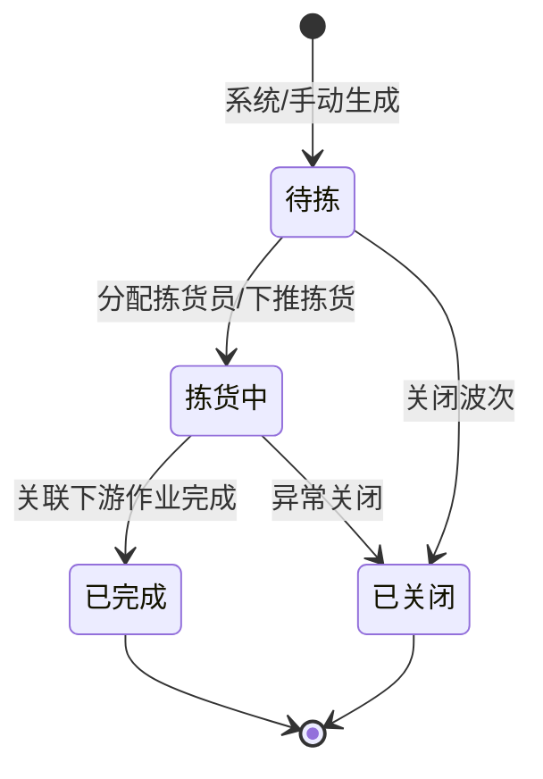

# 波次主PRD

> 角色：主PRD | 类型：业务单据
> 权威层级：context/ > 出库管理主PRD > 本文件
> 关联文件：`波次字段清单.md` `波次_业务规则规格.md` `波次_业务流程推演.md` `波次_用例数据推演.md`

## 1. 业务背景

波次（WAVE）是 Forge WMS 出库作业的组织单元，用于把进销存 ERP 下发并已审核的销售订单 SO，按承运商、线路、发货优先级等维度聚合成一组可执行的出库任务。波次生成后，下游依次流转到拣货（PICK）、复核（CHECK）、包裹（PKG）和交运（DSH）。

在日均 20,000+ 单、6 个仓库并行作业的场景下，如果订单直接散落给拣货员，会出现路径混乱、重复走位、漏拣错拣、优先级订单无法及时处理等问题。波次的价值是先把“哪些订单应该一起处理”组织好，再把任务下推给拣货环节执行。

## 2. 功能范围

### 2.1 In Scope

| 功能 | 端 | 说明 |
|:--|:--|:--|
| 系统波次 | 系统 | 按承运商、线路、发货优先级自动聚合出库需求，定时触发 |
| 手动波次 | PC | 仓管手动圈选出库需求生成波次，用于紧急订单或异常处理 |
| 波次切分 | 系统 | 单波次上限 50 单，超出自动拆分为多个波次 |
| 分配拣货员 | PC | 对待拣波次分配拣货员，准备下推拣货任务 |
| 下推拣货 | 系统/PC | 波次进入拣货中后生成或关联 PICK |
| 波次关闭 | PC | 待拣或异常无法继续处理的波次可关闭，需二次确认 |
| 关联进度查看 | PC | 查看拣货、复核、包装、交运进度，不在波次内执行下游作业细节 |

### 2.2 Out Scope

- 不做多级审核流，波次是作业组织单元，不是审批单据。
- 不在波次内执行 PDA 拣货扫描、复核扫描、包装称重、交运交接；这些属于下游单据。
- 不做三期智能波次引擎，例如动态路径优化、机器学习分单。
- 不对接快递公司 API，不做物流轨迹实时跟踪。
- 不修改 `出库管理主PRD.md`，本文件只是对 WAVE 的单据级引用与细化。

## 3. 单据定位

| 项 | 说明 |
|:--|:--|
| 单据名称 | 波次单 |
| 单据编码 | WAVE |
| 单号规则 | `WAVE{YYYYMMDD}-{4位序号}`，如 `WAVE20260705-0001` |
| 上游来源 | ERP/销售系统下发并审核通过的销售订单 SO，进入 WMS 后形成出库需求 |
| 下游去向 | 拣货单 PICK、复核单 CHECK、包裹 PKG、交运单 DSH、库存流水 FL |
| 业务定位 | 聚合多个出库需求，组织拣货任务，是出库作业起点 |
| 生成方式 | 系统定时自动聚合，或仓管手动圈选生成 |

## 4. 业务场景

| # | 场景 | 示例 | 系统处理 |
|:--:|:--|:--|:--|
| 1 | 系统自动波次 | 顺丰、浦东线路、普通优先级有 38 单待出库 | 定时任务生成 1 个系统波次 |
| 2 | 波次自动拆分 | 同承运商/线路/优先级有 126 单 | 拆为 3 个波次：50、50、26 单 |
| 3 | 手动紧急波次 | 客服标记 5 单加急 | 仓管圈选 5 单生成手动波次，优先下推拣货 |
| 4 | 分配拣货员 | 待拣波次 WAVE20260705-0001 | 主管分配拣货员，进入拣货中 |
| 5 | 下游完成 | 关联 PICK/CHECK/PKG/DSH 全部完成 | 波次状态汇总为已完成 |
| 6 | 异常关闭 | 波次尚未开始，订单取消或线路异常 | 二次确认后关闭波次，释放组织关系；库存释放以订单取消规则为准 |

## 5. 状态机摘要

波次状态表达组织单元自身的推进情况，不展开下游单据执行明细。

| 状态 | 含义 | 可执行动作 | 说明 |
|:--|:--|:--|:--|
| 待拣 | 波次已生成，尚未开始拣货 | 分配拣货员、下推拣货、关闭 | 对应模块概览中的草稿/待作业口径 |
| 拣货中 | 已进入拣货作业 | 查看进度、异常关闭 | 拣货执行细节在 PICK 中处理 |
| 已完成 | 波次关联出库链路完成 | 查看详情 | 终态 |
| 已关闭 | 波次被取消或异常终止 | 查看详情 | 终态，不物理删除 |

## 6. 规则摘要

| # | 规则 | 摘要 |
|:--:|:--|:--|
| R1 | 单号系统生成 | WAVE 单号按 `WAVE{YYYYMMDD}-{4位序号}` 生成，不可编辑 |
| R2 | 系统聚合维度 | 系统波次按承运商、线路、发货优先级聚合，定时触发 |
| R3 | 单波次上限 | 单波次最多 50 单，超过自动拆波 |
| R4 | 手动波次 | 仓管手动圈选待出库需求生成，适用于紧急订单和异常处理 |
| R5 | 状态按钮触发 | 状态变更必须通过按钮触发，不允许直接编辑状态字段 |
| R6 | 库存占用口径 | SO 审核触发占用；波次生成不新增占用，仅组织已进入出库链路的需求 |
| R7 | 库存扣减口径 | 包装完成为库存扣减触发点并生成 FL，波次生成不扣减库存 |
| R8 | 下游边界 | 波次只组织任务，不承载拣货扫描、复核扫描、称重包装、交运交接细节 |

## 7. 字段清单入口

字段的唯一事实来源见 `波次字段清单.md`。本主 PRD 只保留字段分类摘要：

| 分类 | 核心字段 |
|:--|:--|
| 波次头 | 波次单号、波次类型、状态、仓库、承运商、线路、发货优先级、拣货模式、拣货员、订单数、SKU 数、总数量 |
| 波次明细 | 出库需求单号、SO 行号、商品、订单数量、占用数量、波次数量、收货人区域 |
| 系统字段 | 创建人、创建时间、下推拣货时间、完成时间、关闭原因、关联 PICK/CHECK/PKG/DSH 进度 |

## 8. 验收重点

| # | 验收项 | 验收标准 |
|:--:|:--|:--|
| AC1 | 单号规则 | WAVE 单号符合 `WAVE{YYYYMMDD}-{4位序号}`，每日从 0001 递增 |
| AC2 | 系统聚合 | 同承运商、同线路、同发货优先级的待出库需求可自动聚合 |
| AC3 | 自动拆波 | 同组需求超过 50 单时，系统自动拆分多个波次 |
| AC4 | 手动波次 | 仓管可圈选待出库需求生成手动波次，已入其他未完成波次的需求不可重复加入 |
| AC5 | 状态流转 | 待拣、拣货中、已完成、已关闭只能通过动作按钮变化 |
| AC6 | 库存口径 | 波次生成不扣减库存；包装完成才扣减可用库存并生成 FL |
| AC7 | 页面规范 | PC 表格默认 20 条/页，关闭等危险操作需二次确认，按钮不可用时隐藏 |
| AC8 | 下游边界 | 波次详情展示下游进度，但不在波次页面实现拣货/复核/包装执行 |

## 9. 不确定性

- `context/05` 明确“包装完成=库存扣减触发点”，`context/06` 明确“SO审核触发占用”。因此本文按“波次生成不新增库存占用、不扣减库存”处理。若真实系统把波次作为二次锁库节点，需要补充专门的库存锁定规则。
- `context/06` 的出库动作表述为“PDA拣货→交运确认”，更像出库链路范围；本文的库存扣减时点以 `context/05` 业务规则中更明确的“包装完成”为准。
- 手动波次是否允许跨承运商/跨线路混合，context 未明确。本文按“推荐同仓库、同承运商、同线路；紧急异常可由权限控制例外”标注，需产品复核确认。
