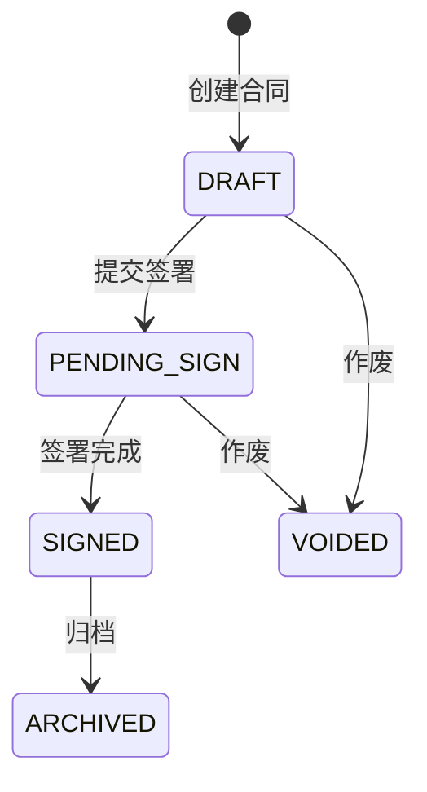

# 合同主PRD

> **版本**：V1.0 | 2026-07-18
> **读者**：研发工程师、测试工程师、产品复核

---

## 1. 业务背景

合同是商机成交的法律载体。商机推到合同签订阶段时，触发合同创建→签署→归档流程。合同管理解决的核心问题：销售签约有留痕、合同状态可追踪、签署完成后自动触发商机赢单。

---

## 2. 功能范围

**In Scope:**
- 合同创建（由商机 CONTRACT 阶段触发，或手动创建）
- 合同编辑（草稿态）
- 合同签署（模拟在线签署）
- 合同归档/作废
- 关联商机、关联客户

**Out of Scope:**
- 电子签章、实名认证——对接第三方签章服务，DEMO 模拟
- 合同模板库——二期

---

## 3. 对象定位

| 项目 | 内容 |
|------|------|
| 来源 | 商机推进到 CONTRACT 阶段自动创建 / 手动创建 |
| 下游 | 签署完成→触发商机赢单(WON) |
| 关联 | 一个合同关联一个商机(1:1)，关联一个客户 |
| 互锁 | 合同作废时解除1:1绑定，商机退回谈判阶段；合同 PENDING_SIGN 及以上时商机只读不可回退 |

---

## 4. 状态机

### 4.1 状态

| 状态 | 含义 | 终态 |
|------|------|:---:|
| DRAFT | 草稿 | 否 |
| PENDING_SIGN | 待签署 | 否 |
| SIGNED | 已签署 | 是 |
| ARCHIVED | 已归档 | 是 |
| VOIDED | 已作废 | 是 |

### 4.2 状态机图

### 4.3 状态流转表

| 当前状态 | 动作 | 前置条件 | 结果状态 | 后置影响 |
|----------|------|---------|---------|---------|
| DRAFT | 提交签署 | 必填字段完整 | PENDING_SIGN | 通知签约方 |
| PENDING_SIGN | 签署完成 | 签署确认 | SIGNED | 触发商机赢单且合同金额回写覆盖商机预计金额 |
| SIGNED | 归档 | — | ARCHIVED | 终态 |
| DRAFT/PENDING_SIGN | 作废 | 必填原因 | VOIDED | 终态；联动将关联商机阶段回退至 NEGOTIATION |

### 4.4 互锁与约束规则

1. **只读互锁**：当合同进入 `PENDING_SIGN`（待签署）及以上阶段时，关联商机自动变为只读状态，销售不可对其进行手动阶段推进或退回。
2. **解绑重置**：当合同被执行作废进入 `VOIDED`（已作废）状态时，系统自动解除当前合同与商机的 1:1 绑定关系，允许商机自动退回到 `NEGOTIATION` 重新发起新合同流程。

---

## 5. AI 串联

合同签署完成 → 自动触发商机推进到 WON → 下推 ERP 销售订单。这是 CRM→ERP 的核心闭环节点。

---

## 6. 验收

| # | 验收项 | 预期结果 |
|---|--------|---------|
| V01 | 商机触发合同创建 | CONTRACT阶段自动生成合同草稿 |
| V02 | 签署完成→赢单 | 合同SIGNED→商机WON→ERP订单 |
| V03 | 作废阻断 | 已签署合同不可作废 |
