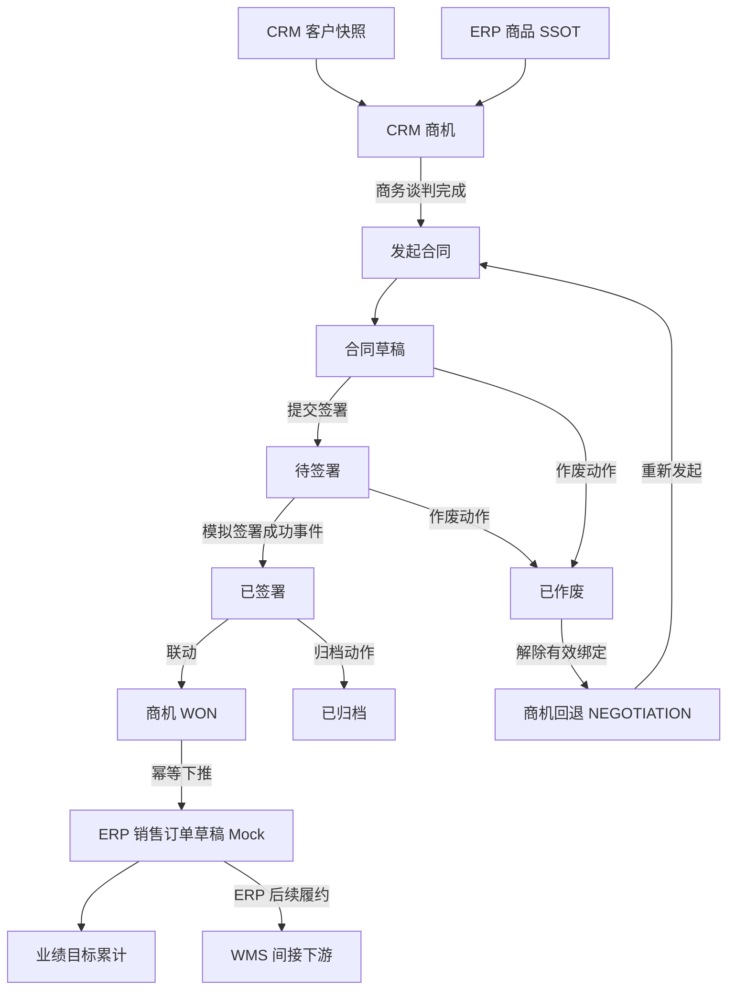
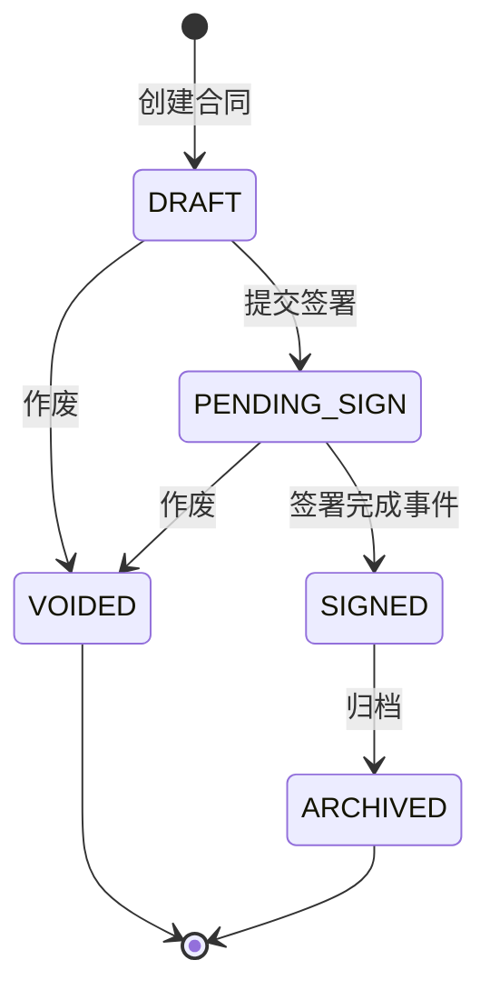
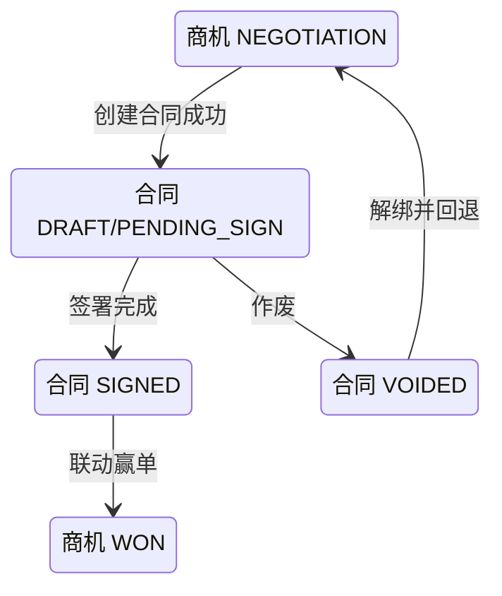

# 合同主PRD

> **版本**：V2.0 | 2026-07-18
> **读者**：研发工程师、测试工程师、产品复核、项目经理
> **字段定义 SSOT**：《合同字段清单》
> **引用原则**：本文描述流程、动作和联动，不重复定义字段取值、必填性或长度。

---

### 1. 业务背景

合同是商机从商务谈判走向可确认成交的法律与业务载体。在 Forge CRM Demo 中，合同模块通过模拟创建、提交签署、签署完成、归档和作废，验证商机、合同与 ERP 订单之间的关键闭环。

没有统一合同管理时存在以下问题：

1. 合同与商机依靠人工记忆关联，无法证明成交来源。
2. 销售在商机中直接标记赢单，缺少合同签署这一事实门槛。
3. 合同状态分散在邮件和聊天工具中，主管无法追踪签署进度。
4. 同一商机可能重复发起多份有效合同，造成金额和状态冲突。
5. 待签署合同作废后商机仍停留合同阶段，销售流程被锁死。
6. 合同签署完成后商机未自动赢单，业绩与真实签约不一致。
7. 商机赢单后 ERP 订单草稿需要重复录入，容易漏单或重单。
8. 合同金额与商机预计金额缺乏明确回写口径。
9. 已签署合同仍可能被误作废，破坏既成业务事实。
10. 多次签署回调可能重复触发赢单和 ERP 建单。
11. 外部签署或 ERP 服务失败时缺少可追踪的降级方案。
12. 历史合同被删除后无法审计，不符合主数据留痕要求。

本模块通过合同状态机和跨对象事务控制，确保“发起合同→签署完成→商机赢单→ERP 订单草稿”的顺序正确，并保证“合同作废→解绑→商机回退谈判”完整执行。

**定位句**：合同是 CRM 商机成交的签约控制对象；它不实现真实电子签章，但负责以签署事实驱动商机赢单，并以作废事实解除绑定和回退销售流程。

---

### 2. 功能范围

**In Scope**：

- 从商机谈判阶段发起合同。
- 从合同列表手动新建并关联符合条件的商机。
- 自动继承关联客户与商机上下文。
- 生成合同编号。
- 草稿状态维护合同信息。
- 提交合同进入待签署。
- 模拟在线签署完成事件。
- 签署完成后写入签署结果。
- 签署完成后联动关联商机赢单。
- 商机赢单后触发 ERP 销售订单草稿 Mock。
- 已签署合同执行归档。
- 草稿或待签署合同执行作废。
- 作废时记录动作原因到审计日志。
- 作废后解除有效合同绑定。
- 作废后联动商机回退至谈判阶段。
- 展示合同列表、详情、关联对象和联动结果。
- 所有不可逆动作二次确认。
- 外部联动失败提供重试和审计。

**Out of Scope**：

- 真实电子签章；原因：Demo 只模拟签署结果。
- 实名认证与证书管理；原因：依赖第三方签章平台。
- 合同模板库；原因：一期聚焦状态和跨模块联动。
- 合同条款在线编辑器；原因：不验证富文本法务协作。
- 合同审批流；原因：一期无审批角色和节点设计。
- 合同变更、补充协议与续签；原因：属于二期合同生命周期能力。
- 已签署合同作废；原因：签署事实不可逆，需未来变更流程处理。
- 合同删除；原因：业务对象统一保留历史，不提供删除。
- 纸质合同附件存储；原因：Demo 不建设文件服务。
- ERP 正式订单审核；原因：订单 SSOT 在 ERP。
- WMS 发货；原因：CRM 不直接对接 WMS。
- 法务合规意见管理；原因：不在一期验证范围。

---

### 3. 对象定位

#### 3.1 在系统中的位置

| 项目 | 内容 |
|------|------|
| 对象类型 | 合同（签约控制层） |
| 核心职责 | 固化签署过程并驱动商机赢单或作废回退 |
| 来源 | 商机谈判阶段发起，或合同列表手动创建并关联可用商机 |
| 上游对象 | CRM 商机、CRM 客户快照、ERP 商品引用 |
| 下游对象 | 商机赢单事件、ERP 销售订单草稿、业绩目标 |
| 关联基数 | 一个有效合同关联一个商机；一个商机同一时刻至多一个有效合同 |
| 主数据边界 | 客户与商品来自 ERP；合同状态在 CRM 内权威 |
| 删除策略 | 不提供删除；草稿或待签署通过作废终止 |
| 终态 | 归档或作废 |
| 关键互锁 | 有效合同进入待签署后，关联商机禁止手工推进或回退 |

#### 3.2 系统链路图

链路约束：

- 商机必须先有有效客户和商品上下文。
- 合同创建成功后商机才进入合同阶段。
- 合同签署完成是商机赢单的唯一合同侧触发。
- 合同作废与商机回退必须在同一业务事务内完成。
- ERP 下推失败不回滚合法签署事实。
- CRM 不直接调用 WMS。

#### 3.3 实体关系说明

| 关系 | 基数 | 说明 | 约束 |
|------|:---:|------|------|
| 客户 : 合同 | 1:N | 同一客户可因不同商机产生多份合同 | 客户基础档案来自 ERP 快照 |
| 商机 : 有效合同 | 1:0..1 | 同一时刻最多一份未作废合同 | 作废后允许重新发起 |
| 商机 : 历史合同 | 1:N | 重复发起周期保留作废历史 | 历史合同不可删除 |
| 合同 : 签署事件 | 1:N | 可接收重复回调或重试事件 | 同一事件只处理一次 |
| 合同 : ERP订单草稿 | 1:0..1 | 签署并赢单后产生订单草稿 | 订单 SSOT 在 ERP |
| 合同 : 审计日志 | 1:N | 创建、编辑、提交、签署、归档、作废均留痕 | 动作原因存日志，不伪造主表字段 |
| 合同 : 系统用户 | N:1 | 每份合同由创建人负责维护 | 主管可查看团队数据 |

实体一致性要求：

1. 合同关联客户必须与关联商机的客户一致。
2. 合同保存时重新校验商机未绑定其他有效合同。
3. 合同作废后保留历史关联，但解除“当前有效合同”指针。
4. 合同签署事件必须匹配当前有效绑定。
5. ERP 订单草稿返回结果以关联摘要展示，不在 CRM 维护订单主数据。
6. 合同金额用于成交事实与订单草稿，不静默覆盖历史审计。

---

### 4. 业务场景

| 场景ID | 场景 | 类型 | 触发角色 | 说明 |
|--------|------|------|----------|------|
| S01 | 商机发起合同并签署完成 | **主流程** | 销售 / 系统 | 创建草稿、提交签署、签署后联动赢单与 ERP 订单 |
| S02 | 已签署合同归档 | **支线** | 销售主管 | 确认资料完整后归档，保留只读历史 |
| S03 | 待签署合同作废并回退商机 | **支线** | 销售 | 填写动作原因，作废、解绑并回退谈判 |
| S04 | 已签署合同尝试作废 | **异常** | 销售 | 系统阻断并提示走未来变更流程 |
| S05 | 签署或 ERP 联动重复与失败 | **异常** | 系统 | 幂等处理、保留签署事实并提供重试 |

#### S01 商机发起合同并签署完成

- 前置：商机处于允许发起合同的阶段。
- 前置：不存在其他有效合同。
- 动作：创建合同草稿并继承关联上下文。
- 动作：草稿提交签署。
- 事件：模拟签署服务返回成功。
- 结果：合同进入已签署。
- 后置：商机联动进入赢单。
- 后置：下推一份 ERP 销售订单草稿。

#### S02 已签署合同归档

- 前置：合同已签署且关联结果一致。
- 动作：销售主管点击“归档”。
- 确认：提示归档后不可编辑。
- 结果：合同进入归档终态。
- 后置：保留商机赢单与 ERP 订单结果。
- 约束：归档不重复触发赢单或订单。

#### S03 待签署合同作废并回退商机

- 前置：合同处于允许作废状态。
- 输入：作废动作原因，写入审计日志。
- 确认：提示将解除绑定并回退商机。
- 事务一：合同进入作废终态。
- 事务二：解除当前有效合同绑定。
- 事务三：商机回退至谈判阶段并恢复可推进。
- 任一步失败：全部回滚，避免合同和商机不一致。

#### S04 已签署合同尝试作废

- 前置：合同已签署或已归档。
- 动作：通过旧页面或接口尝试作废。
- 结果：动作入口不展示，接口仍阻断。
- 提示：`已签署合同不可作废，如需变更请走合同变更流程`。
- 数据：合同与商机均不变化。
- 审计：记录非法状态操作请求。

#### S05 签署或 ERP 联动重复与失败

- 重复签署事件：只处理第一次合法事件。
- 商机赢单联动失败：合同保持已签署，进入联动补偿队列。
- ERP 下推失败：商机保持赢单，显示同步失败并允许重试。
- 重复 ERP 重试：使用同一业务幂等键。
- 最终结果：不得生成重复订单草稿。

---

### 5. 状态机

#### 5.1 对象状态

> 完整状态定义以《合同字段清单》为准。本节只说明业务语义。

| 状态 | 业务含义 | 是否终态 |
|------|----------|:--------:|
| `DRAFT` | 合同草稿，可维护并提交签署 | 否 |
| `PENDING_SIGN` | 已提交，等待模拟签署结果 | 否 |
| `SIGNED` | 签署事实已确认，可继续归档 | 否 |
| `ARCHIVED` | 已归档，只读保留 | 是 |
| `VOIDED` | 已作废，只读保留 | 是 |

#### 5.2 状态机图

跨对象联动：

#### 5.3 状态流转表（核心交付物）

| 当前状态 | 动作 | 前置条件 | 结果状态 | 二次确认 | 后置影响 | 失败处理 |
|----------|------|----------|----------|:--------:|----------|----------|
| 新建 | 保存合同 | 表单校验通过；商机可签约；不存在有效合同 | `DRAFT` | 否 | 生成编号；建立有效绑定；商机进入合同阶段 | 整体回滚；保持新增页；Toast `合同创建失败` |
| `DRAFT` | 保存修改 | 当前版本一致；操作者有编辑权限 | `DRAFT` | 否 | 更新合同信息与审计日志 | 保持原数据；映射字段错误；Toast `保存失败` |
| `DRAFT` | 提交签署 | 合同信息完整；有效绑定一致 | `PENDING_SIGN` | 是 | 锁定编辑；发送模拟签署通知 | 保持草稿；Toast `提交签署失败` |
| `PENDING_SIGN` | 签署完成 | 签署事件合法且未处理；绑定一致 | `SIGNED` | 否 | 写入签署结果；联动商机赢单；触发 ERP 订单下推 | 保留签署事实；联动失败进入补偿队列；展示失败节点 |
| `SIGNED` | 归档 | 商机已赢单；联动结果一致；有归档权限 | `ARCHIVED` | 是 | 合同进入只读终态；保留关联 | 保持已签署；Toast `归档失败，请重试` |
| `DRAFT` | 作废 | 动作原因通过校验；有权限 | `VOIDED` | 是 | 解除有效绑定；商机回退谈判；记录原因 | 任一步失败整体回滚；Toast `作废失败，合同与商机均未变更` |
| `PENDING_SIGN` | 作废 | 尚未签署；动作原因通过校验；有权限 | `VOIDED` | 是 | 取消待签署任务；解绑；商机回退谈判 | 任一步失败整体回滚；Toast `作废失败，合同与商机均未变更` |
| `SIGNED` | 作废请求 | 已存在签署事实 | `SIGNED` | 否 | 无 | 阻断；Toast `已签署合同不可作废，如需变更请走合同变更流程` |
| `ARCHIVED` | 作废请求 | 已归档 | `ARCHIVED` | 否 | 无 | 阻断；同上 |

#### 5.4 动作能力矩阵

| 动作 | DRAFT | PENDING_SIGN | SIGNED | ARCHIVED | VOIDED |
|------|:-----:|:------------:|:------:|:--------:|:------:|
| 查看 | ✅ | ✅ | ✅ | ✅ | ✅ |
| 编辑 | ✅ | ❌ | ❌ | ❌ | ❌ |
| 提交签署 | ✅ | ❌ | ❌ | ❌ | ❌ |
| 模拟签署完成 | ❌ | 按权限 | ❌ | ❌ | ❌ |
| 归档 | ❌ | ❌ | ✅ | ❌ | ❌ |
| 作废 | ✅ | ✅ | ❌ | ❌ | ❌ |
| 查看商机 | ✅ | ✅ | ✅ | ✅ | ✅ |
| 查看 ERP 订单 | ❌ | ❌ | 依同步结果 | 依同步结果 | ❌ |
| 删除 | ❌ | ❌ | ❌ | ❌ | ❌ |

矩阵约束：

- 状态变化只通过动作按钮或合法签署事件触发。
- 合同状态不在新增编辑表单中直接修改。
- 不可用动作不渲染。
- 已作废合同仍可查看历史关联和审计日志。

---

### 6. 核心业务规则

#### 6.1 创建与绑定规则

| 规则ID | 规则 |
|--------|------|
| R01 | 合同必须关联一个满足签约条件的商机，关联客户必须与商机客户一致；同一商机同一时刻至多绑定一份未作废合同。 |
| R02 | 合同创建成功后才能建立有效绑定并把商机推进至合同阶段；任一步失败必须整体回滚，不产生孤立合同或错误商机阶段。 |

#### 6.2 签署与赢单规则

| 规则ID | 规则 |
|--------|------|
| R03 | 只有草稿可提交签署；进入待签署后合同信息锁定，关联商机禁止手工推进或回退。 |
| R04 | 合法签署完成事件将合同置为已签署，并联动商机进入赢单；随后以商机为幂等键下推一份 ERP 销售订单草稿。 |

#### 6.3 作废与归档规则

| 规则ID | 规则 |
|--------|------|
| R05 | 草稿或待签署合同作废时必须提供动作原因；作废、解绑和商机回退谈判必须事务一致，已签署或已归档合同不得作废。 |
| R06 | 已签署合同可执行归档并进入只读终态；合同不提供删除，归档不重复触发商机赢单或 ERP 订单下推。 |

执行优先级：

1. 操作权限。
2. 当前合同状态。
3. 关联商机状态与绑定唯一性。
4. 字段清单校验。
5. 版本并发校验。
6. 合同状态事务。
7. 商机与 ERP 后置联动。
8. 审计与反馈。

---

### 7. AI 串联规则（CRM特有）

合同不独立计算 AI 结果，但它位于 AI 商机预测闭环的关键执行节点：预测辅助推进，签署事实才允许成交。

| AI/自动化节点 | 触发时机 | 输入 | 输出 | 执行动作 | 失败处理 |
|---------------|----------|------|------|----------|----------|
| 商机预测刷新 | 合同创建成功、签署完成、合同作废后 | 商机阶段、合同关联结果、客户画像、跟进频率 | 最新成交概率 | 回写商机最新预测展示，不改变合同状态 | 预测失败不阻断合同动作；商机保留上次成功结果 |
| 成交自动化 | 合同签署完成 | 合同标识、商机标识、签署结果 | 商机赢单事件 | 联动商机 WON 并触发 ERP 订单草稿 | 商机联动失败进入补偿队列；不得回滚签署事实 |
| 回退自动化 | 合同作废 | 合同标识、商机标识、作废事件 | 商机回退事件 | 解绑并回退谈判 | 必须与合同作废事务一致；失败整体回滚 |

自动化约束：

- AI 概率不能替代合同签署事实。
- 高概率商机也不能跳过合同状态机直接赢单。
- 预测失败不阻断提交签署、签署完成或作废。
- 签署联动失败展示待补偿状态。
- 补偿成功后刷新商机和 ERP 结果。
- 同一签署事件只触发一次成交自动化。

---

### 8. 权限设计

#### 8.1 数据可见范围

| 角色 | 可见范围 | 说明 |
|------|----------|------|
| 销售 | 自己负责商机的合同 | 可维护草稿和发起签署 |
| 销售主管 | 本团队合同 | 可签署确认、归档和处理业务异常 |
| 系统管理员 | 全部合同 | 可联调与重试外部同步 |
| 只读审计角色 | 授权范围内全部历史合同 | 仅查看 |

数据范围约束：

- 客户与商机链接继续执行各自数据权限。
- ERP 订单摘要不扩大合同可见范围。
- 深链接访问必须重新校验。
- 作废历史对授权审计角色可见。

#### 8.2 操作权限矩阵

| 操作 | 销售 | 销售主管 | 系统管理员 | 只读审计 |
|------|:----:|:--------:|:------------:|:--------:|
| 查看合同 | 自己负责 | 团队范围 | 全部 | 授权范围 |
| 新建合同 | 关联商机范围 | 团队商机 | ✅ | ❌ |
| 编辑草稿 | 自己负责 | 团队范围 | ✅ | ❌ |
| 提交签署 | 自己负责 | 团队范围 | ✅ | ❌ |
| 模拟签署完成 | ❌ | ✅ | ✅ | ❌ |
| 作废未签署合同 | 自己负责 | 团队范围 | ✅ | ❌ |
| 归档已签署合同 | ❌ | ✅ | ✅ | ❌ |
| 重试商机联动 | ❌ | ✅ | ✅ | ❌ |
| 重试 ERP 下推 | ❌ | ✅ | ✅ | ❌ |
| 删除合同 | ❌ | ❌ | ❌ | ❌ |

权限失败处理：

- 无权入口不展示。
- 直接接口返回 403。
- 不改变合同、商机或 ERP 请求状态。
- Toast `无权执行该操作`。

---

### 9. 边界与异常处理

#### 9.1 并发控制

| 场景 | 处理方式 |
|------|----------|
| 同一商机同时创建两份合同 | 通过有效绑定唯一约束，只允许一份创建成功 |
| 编辑草稿与提交签署并发 | 版本号乐观锁，首个成功动作生效 |
| 作废与签署回调并发 | 以签署服务已确认事实和事务时间排序；冲突进入人工异常队列，不静默覆盖 |
| 归档与 ERP 重试并发 | 归档不阻断幂等 ERP 重试，两个结果独立记录 |

#### 9.2 去重与幂等

| 场景 | 处理方式 |
|------|----------|
| 重复创建点击 | 客户端请求键返回首次创建结果 |
| 重复提交签署 | 当前已待签署时返回首次提交结果 |
| 重复签署回调 | 以签署事件标识去重，只联动一次赢单 |
| 重复商机赢单事件 | 商机已赢单时返回当前结果，不重复写业绩 |
| 重复 ERP 下推 | 以商机标识为业务幂等键，禁止第二份订单草稿 |
| 重复作废确认 | 已作废时返回首次结果，不重复回退商机 |

#### 9.3 数量、时间与业务边界

| 场景 | 处理方式 |
|------|----------|
| 商机已有有效合同 | 阻断创建并跳转现有合同 |
| 关联客户与商机客户不一致 | 阻断保存，关联客户只允许继承 |
| 草稿信息不完整提交签署 | 阻断并聚焦第一个缺失项 |
| 待签署期间编辑 | 不展示编辑入口，接口拒绝 |
| 已签署合同作废 | 阻断并提示走合同变更流程 |
| 已归档合同作废 | 阻断，保持归档终态 |
| 作废原因不合规 | 阻断弹窗提交并保留输入 |
| 作废回退失败 | 合同作废整体回滚，不产生半完成状态 |
| 签署回调缺少绑定 | 拒绝联动并进入异常队列 |
| 商机赢单失败 | 合同保持已签署，补偿任务重试 |
| ERP 订单下推失败 | 商机保持赢单，显示失败并允许幂等重试 |
| 合同金额与预计金额不同 | 以合同签署金额作为成交和订单草稿输入，保留历史预计值用于复盘 |
| 终态编辑或删除 | 不展示入口，接口阻断 |

异常审计：

- 记录合同编号、原状态、目标状态、操作者和时间。
- 作废动作原因写入审计日志。
- 签署事件记录外部事件标识。
- 联动失败记录合同、商机和请求标识。
- 用户文案不暴露签章或 ERP 技术凭证。

---

### 10. 验收重点

| # | 验收项 | 输入条件 | 预期结果 |
|---|--------|----------|----------|
| V01 | 正常签署成交闭环 | 一条谈判阶段商机且无有效合同；创建合同、提交签署、模拟签署完成 | 合同依次进入草稿、待签署、已签署；商机进入赢单；仅生成一份 ERP 订单草稿 |
| V02 | 作废联动回退 | 一份草稿或待签署合同；输入合规作废原因并确认 | 合同进入作废；解除有效绑定；商机回退谈判；重新发起合同入口恢复 |
| V03 | 已签署作废阻断 | 合同已签署或已归档；通过页面或接口请求作废 | 页面不展示入口；接口阻断；合同和商机不变；提示走合同变更流程 |
| V04 | 重复签署与订单幂等 | 对同一待签署合同重复发送相同签署事件，并重试 ERP 下推 | 合同只签署一次；商机只赢单一次；业绩只累计一次；ERP 仅一份订单草稿 |
| V05 | 联动失败与补偿 | 签署成功后模拟商机联动失败，再模拟 ERP 下推超时后恢复 | 签署事实保留；商机联动可补偿；ERP 使用同一幂等键重试；页面展示每个节点结果 |

补充验收：

- [ ] 合同状态不可在表单直接编辑。
- [ ] 同一商机同一时刻只有一份有效合同。
- [ ] 关联客户与商机客户始终一致。
- [ ] 待签署后合同信息只读。
- [ ] 签署完成是商机赢单的唯一合同侧触发。
- [ ] 作废、解绑和商机回退事务一致。
- [ ] 合同不提供删除。
- [ ] CRM 不直接操作 WMS。

---

### 11. 修订记录

| 日期 | 版本 | 变更摘要 |
|------|------|----------|
| 2026-07-18 | V1.0 | 初版，定义合同签署与商机联动 |
| 2026-07-18 | V2.0 | 对齐 v2.0 模板，补齐全链路、实体、场景、状态失败处理、R01-R06、作废回退、签署赢单、权限、异常与验收 |
