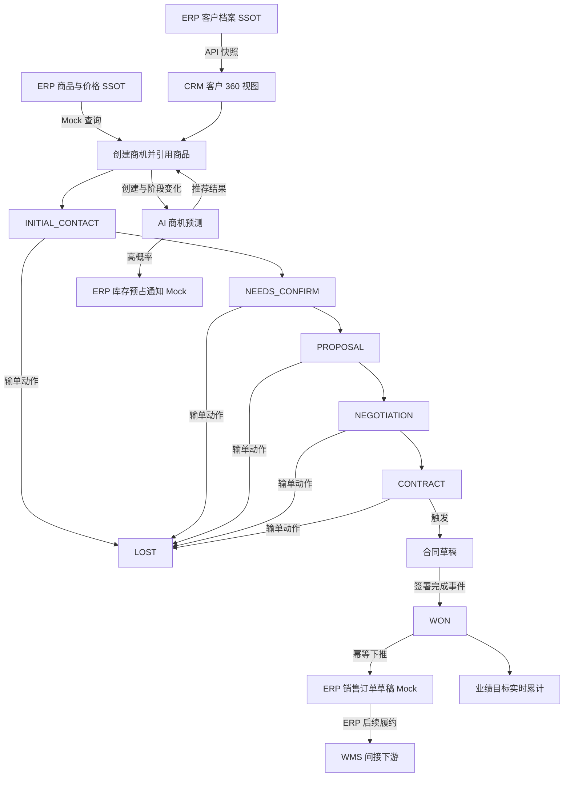
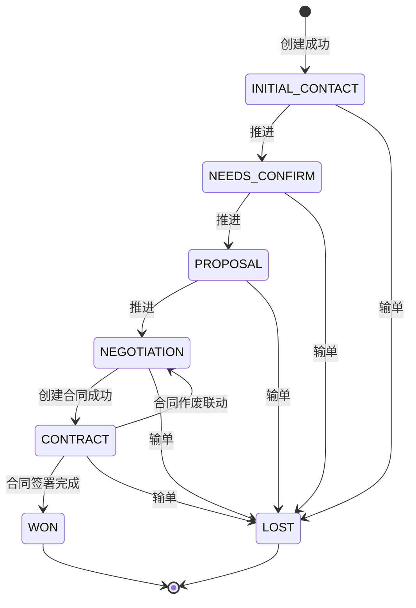

# 商机主PRD

> **版本**：V2.0 | 2026-07-18
> **读者**：研发工程师、测试工程师、产品复核、项目经理
> **字段定义 SSOT**：《商机字段清单》
> **引用原则**：本文只描述业务规则，不重复定义字段取值、枚举、必填性或长度限制。

---

### 1. 业务背景

商机是 Forge CRM 从客户意向走向销售成交的核心过程对象，负责把分散的需求、商品、金额、跟进和合同信息组织成可管理、可预测、可复盘的销售管道。

强盛科技在没有统一商机管理时存在以下问题：

1. 销售用个人表格记录机会，主管无法获得统一的 pipeline 视图。
2. 阶段口径由个人解释，同名阶段代表的业务完成度不一致。
3. 商机可被主观越级推进，金额预测与真实业务动作脱节。
4. 商品信息靠销售手输，无法确保引用的是 ERP 权威商品。
5. 报价、谈判和合同之间缺乏结构化链路，过程证据难追溯。
6. 输单原因不沉淀，同类失败重复发生，复盘缺少数据基础。
7. 成交概率依赖销售主观判断，主管难以提前配置产能与库存。
8. 高概率商机未及时通知 ERP，库存预占窗口容易被错过。
9. 合同签署与商机赢单靠人工同步，可能出现状态不一致。
10. 赢单后需要在 ERP 重复录入客户、商品和金额，效率低且易错。
11. 客户历史订单未进入预测上下文，推荐商品缺少事实依据。
12. 终态商机仍可能被误编辑，影响业绩目标和历史报表稳定性。

本模块的目标是建立“客户意向→需求确认→方案报价→商务谈判→合同签订→赢单/输单”的可审计闭环，并通过 AI 预测与 ERP Mock 串联验证 CRM 对销售执行和交易触发的控制能力。

**定位句**：商机是 CRM 的销售转化控制对象；客户档案与商品价格的 SSOT 仍在 ERP，商机只引用权威数据并负责过程推进、成交预测、合同联动和订单草稿触发。

---

### 2. 功能范围

**In Scope**：

- 基于 CRM 客户快照创建商机。
- 从 ERP Mock 商品列表引用商品。
- 维护商机业务信息和预计结果。
- 按既定阶段逐级推进商机。
- 在任意非终态执行输单关闭。
- 输单时沉淀复盘原因。
- 提供列表视图和阶段看板视图。
- 支持看板相邻阶段拖拽推进。
- 创建与阶段变化时触发 AI 商机预测。
- 输出成交概率和推荐商品。
- 高概率预测触发 ERP 库存预占通知 Mock。
- 低概率或预测失败时提供明确降级反馈。
- 进入合同阶段时触发合同草稿。
- 合同签署完成后联动商机赢单。
- 赢单后下推 ERP 销售订单草稿 Mock。
- 汇总跟进记录并回写最近业务活动。
- 为业绩目标模块提供赢单金额和创建量数据。

**Out of Scope**：

- ERP 商品、价格与库存主数据维护；原因：权威源在 ERP。
- ERP 销售订单正式审核与履约；原因：订单 SSOT 在 ERP。
- WMS 发货操作；原因：CRM 不直接对接 WMS。
- 真实库存锁定；原因：Demo 仅验证 Mock 通知链路。
- 真实电子签章；原因：一期合同签署为模拟动作。
- 报价审批流；原因：一期只记录商机推进结果，二期再引入审批。
- 折扣权限体系；原因：依赖 ERP 价格政策，当前不在 CRM 范围。
- 佣金与提成计算；原因：属于财务或绩效结算域。
- 商机批量导入；原因：一期优先保证单条业务链路正确。
- 商机阶段自定义；原因：阶段是跨模块联动的固定协议。
- 已赢单或已输单后的重开；原因：保护历史报表和目标结算稳定性。

---

### 3. 对象定位

#### 3.1 在系统中的位置

| 项目 | 内容 |
|------|------|
| 对象类型 | 商机（销售转化层） |
| 核心职责 | 管理客户意向到成交或输单的完整销售过程 |
| 来源 | 销售基于已有客户创建，或从客户详情快捷创建 |
| 上游对象 | ERP 客户档案快照、ERP 商品与订单历史、CRM 跟进记录 |
| 下游对象 | 合同、ERP 库存预占通知、ERP 销售订单草稿、业绩目标 |
| 主数据边界 | 客户与商品只引用 ERP 权威数据，CRM 不独立维护 |
| 生命周期 | 创建后进入首阶段，逐级推进，最终进入赢单或输单终态 |
| 关联关系 | 一个客户可有多个商机；一个商机对应一个客户 |
| 数据责任 | 商机阶段、预测结果和跟进链路的 SSOT 在 CRM |

#### 3.2 系统链路图

链路控制说明：

- 商机不得直接创建 ERP 客户或商品主数据。
- `WON` 不由表单字段修改，只接受合同签署完成动作。
- ERP Mock 失败时，商机保持原状态并显示可重试反馈。
- WMS 只接收 ERP 后续单据，CRM 不直接调用 WMS。

#### 3.3 实体关系说明

| 关系 | 基数 | 说明 | 约束 |
|------|:---:|------|------|
| 客户 : 商机 | 1:N | 一个客户可因不同需求产生多个商机 | 商机必须关联已存在的客户快照 |
| 商机 : 商品 | N:M | 一个商机可引用多个 ERP 商品 | 商品只能从 ERP Mock 选择 |
| 商机 : 跟进记录 | 1:N | 多次沟通挂载到同一商机 | 跟进记录保存后参与预测 |
| 商机 : 合同 | 1:1 | 一个有效商机同一时刻只绑定一个有效合同 | 作废后解绑，允许重新生成 |
| 商机 : ERP订单草稿 | 1:1 | 赢单后生成一个销售订单草稿 | 通过业务幂等键防止重复下推 |
| 商机 : AI预测快照 | 1:N | 创建和每次阶段变更产生预测版本 | 页面展示最新成功版本 |
| 商机 : 业绩目标 | N:1 | 商机创建量与赢单金额进入销售月度目标 | 以责任销售和业务发生月归集 |
| 商机 : 系统用户 | N:1 | 商机归属于创建销售 | 主管可见团队数据但不改变历史创建人 |

实体一致性要求：

1. 客户快照更新不回写 ERP，只在下一次同步时覆盖 CRM 快照。
2. 商品失效后既有商机保留历史引用，新商机不得再次选择。
3. 合同签署事件必须携带商机标识和合同标识。
4. ERP 订单草稿返回编号后以关联数据展示，不改变商机字段定义。
5. AI 预测快照只追加，不覆盖历史结果，便于复盘模型变化。

---

### 4. 业务场景

| 场景ID | 场景 | 类型 | 触发角色 | 说明 |
|--------|------|------|----------|------|
| S01 | 创建并逐级推进至合同签署 | **主流程** | 销售 | 关联客户与商品，按顺序推进，合同签署后赢单并下推 ERP |
| S02 | AI 预测高概率并通知库存预占 | **支线** | 系统 | 创建或阶段变化后达到高概率，发送预占通知 Mock |
| S03 | 非终态商机输单关闭 | **支线** | 销售 | 发起输单，填写原因，二次确认后进入终态 |
| S04 | 越级推进被阻断 | **异常** | 销售 | 尝试跨越相邻阶段，系统拒绝并提示唯一可达阶段 |
| S05 | 合同或 ERP 联动失败 | **异常** | 系统 | 依赖服务失败时不改变商机阶段，记录失败并允许重试 |

#### S01 创建并逐级推进至合同签署

- 前置：操作者具有商机新增权限。
- 前置：关联客户快照可用。
- 输入：商机表单字段和 ERP 商品引用。
- 过程：系统生成商机并触发首次预测。
- 过程：每次推进仅允许进入相邻下一阶段。
- 过程：进入合同阶段时生成合同草稿。
- 结果：合同签署事件将商机置为赢单。
- 后置：系统下推 ERP 销售订单草稿并累计业绩。

#### S02 AI 预测高概率并通知库存预占

- 前置：商机未处于终态。
- 触发：创建成功或阶段推进成功。
- 输入：客户画像、历史订单、跟进频率、商品匹配和阶段停留。
- 结果：展示最新成交概率与推荐商品。
- 后置：达到高概率阈值时发送 ERP 库存预占通知 Mock。
- 异常：预测超时不阻断主业务操作。

#### S03 非终态商机输单关闭

- 前置：当前状态为任一非终态。
- 动作：点击“输单”。
- 输入：填写输单原因。
- 确认：弹窗明确告知关闭后不可恢复。
- 结果：商机进入输单终态。
- 后置：关闭未完成的预测提醒，不生成 ERP 订单。

#### S04 越级推进被阻断

- 前置：商机处于任一可推进阶段。
- 动作：通过看板拖拽或接口请求跳过阶段。
- 结果：前端阻止放置或接口返回业务错误。
- 状态：商机保持原阶段。
- 提示：`阶段必须逐级推进，当前仅可推进至下一阶段`。
- 审计：记录越级请求但不写阶段变更记录。

#### S05 合同或 ERP 联动失败

- 合同创建失败：商机保持谈判阶段。
- 合同签署回调验签失败：商机保持合同阶段。
- ERP 订单下推失败：商机保持赢单，但订单同步标记失败并支持重试。
- 同一幂等键重试：返回首次成功结果，不创建重复订单。
- 页面反馈：展示具体失败节点和重试入口。

---

### 5. 状态机

#### 5.1 对象状态

> 状态的完整枚举定义以《商机字段清单》为准，本文只说明业务语义。

| 状态 | 业务含义 | 是否终态 |
|------|----------|:--------:|
| `INITIAL_CONTACT` | 已创建并开始初步接触 | 否 |
| `NEEDS_CONFIRM` | 已进入需求确认 | 否 |
| `PROPOSAL` | 已进入方案报价 | 否 |
| `NEGOTIATION` | 已进入商务谈判 | 否 |
| `CONTRACT` | 已进入合同签订 | 否 |
| `WON` | 合同签署完成，商机成交 | 是 |
| `LOST` | 商机输单关闭 | 是 |

#### 5.2 状态机图

#### 5.3 状态流转表（核心交付物）

| 当前状态 | 动作 | 前置条件 | 结果状态 | 二次确认 | 后置影响 | 失败处理 |
|----------|------|----------|----------|:--------:|----------|----------|
| 新建 | 保存商机 | 表单校验通过；客户快照有效 | `INITIAL_CONTACT` | 否 | 生成编号；触发首次 AI 预测 | 保持新增页并定位错误字段；Toast `商机创建失败，请重试` |
| `INITIAL_CONTACT` | 推进 | 需求信息满足规则；操作者有推进权限 | `NEEDS_CONFIRM` | 是 | 写入阶段时间；触发 AI 预测 | 保持原状态；Toast `推进失败，请检查需求信息` |
| `NEEDS_CONFIRM` | 推进 | 已引用有效 ERP 商品 | `PROPOSAL` | 是 | 写入阶段时间；触发 AI 预测 | 保持原状态；Toast `请先关联有效商品` |
| `PROPOSAL` | 推进 | 报价相关业务信息满足规则 | `NEGOTIATION` | 是 | 写入阶段时间；触发 AI 预测 | 保持原状态；Toast `推进失败，请完善报价信息` |
| `NEGOTIATION` | 发起合同 | 合同创建输入完整；不存在有效合同 | `CONTRACT` | 是 | 创建合同草稿；回写合同关联；触发 AI 预测 | 合同创建回滚；保持原状态；Toast `合同创建失败，商机未推进` |
| `CONTRACT` | 合同签署完成 | 回调合法；合同与商机绑定一致 | `WON` | 否 | 写入赢单时间；下推 ERP 订单草稿；更新业绩 | 回调失败保持原状态；记录错误；Toast `签署结果同步失败` |
| `CONTRACT` | 合同作废 | 合同允许作废；原因已填写 | `NEGOTIATION` | 是 | 解除合同绑定；商机恢复可推进 | 任一步失败均回滚；Toast `合同作废联动失败` |
| 任一非终态 | 输单 | 输单原因校验通过；操作者有权限 | `LOST` | 是 | 写入阶段时间；停止预测提醒；保留复盘记录 | 保持原状态；聚焦输单原因；Toast `请输入输单原因` |
| `WON` | 查看 | 记录存在且有查看权限 | `WON` | 否 | 仅展示历史与 ERP 结果 | 无权限时展示 403 页面 |
| `LOST` | 查看 | 记录存在且有查看权限 | `LOST` | 否 | 仅展示历史与输单复盘 | 无权限时展示 403 页面 |

#### 5.4 动作能力矩阵

| 动作 | INITIAL | NEEDS | PROPOSAL | NEGOTIATION | CONTRACT | WON | LOST |
|------|:------:|:-----:|:--------:|:-----------:|:--------:|:---:|:----:|
| 查看 | ✅ | ✅ | ✅ | ✅ | ✅ | ✅ | ✅ |
| 编辑 | ✅ | ✅ | ✅ | ❌ | ❌ | ❌ | ❌ |
| 添加跟进 | ✅ | ✅ | ✅ | ✅ | ✅ | ❌ | ❌ |
| 推进 | ✅ | ✅ | ✅ | ✅ | ❌ | ❌ | ❌ |
| 发起合同 | ❌ | ❌ | ❌ | ✅ | ❌ | ❌ | ❌ |
| 输单 | ✅ | ✅ | ✅ | ✅ | ✅ | ❌ | ❌ |
| 查看合同 | ❌ | ❌ | ❌ | ❌ | ✅ | ✅ | 依关联结果 |
| 查看 ERP 订单 | ❌ | ❌ | ❌ | ❌ | ❌ | ✅ | ❌ |

矩阵约定：

- `✅` 表示满足权限后展示动作入口。
- `❌` 表示不渲染入口，不使用 disabled 按钮代替。
- “依关联结果”表示存在历史合同时展示只读入口。
- 所有状态变化必须由动作触发，表单不可编辑商机阶段。

---

### 6. 核心业务规则

#### 6.1 创建与引用规则

| 规则ID | 规则 |
|--------|------|
| R01 | 商机必须关联可用的 CRM 客户快照；客户正式档案仍以 ERP 为 SSOT，CRM 不允许在商机表单内新建或修改客户主数据。 |
| R02 | 商机推进到需求确认后的后续阶段前，必须引用至少一个有效 ERP 商品；失效商品只保留历史展示，不允许新增引用。 |

#### 6.2 阶段推进规则

| 规则ID | 规则 |
|--------|------|
| R03 | 商机只能按状态机逐级推进；看板拖拽、按钮操作和接口调用统一校验，不允许越级、回退或直接修改阶段字段。 |
| R04 | 进入合同阶段必须先成功创建合同草稿；合同签署完成是进入赢单的唯一业务触发，合同作废必须联动回退至谈判阶段。 |

#### 6.3 关闭与下推规则

| 规则ID | 规则 |
|--------|------|
| R05 | 任一非终态均可执行输单，但输单原因必须通过字段清单约束；赢单和输单均为不可手工回退终态。 |
| R06 | 赢单后以商机为幂等业务键下推一个 ERP 销售订单草稿；重试不得重复建单，ERP 失败不得回退已确认的合同签署事实。 |

规则执行优先级：

1. 权限校验。
2. 当前状态校验。
3. 版本号并发校验。
4. 字段清单校验。
5. 关联对象有效性校验。
6. 状态更新与后置联动。
7. 审计日志与反馈。

---

### 7. AI 串联规则（CRM特有）

| AI 节点 | 触发时机 | 输入维度 | 输出 | 执行动作 | 失败处理 |
|---------|----------|----------|------|----------|----------|
| 商机预测 | 创建成功后、每次阶段变化后 | 客户画像、历次订单、跟进频率、商品匹配、阶段停留 | 成交概率、预测版本、解释摘要 | 更新最新预测；高概率时通知销售主管并向 ERP 发库存预占通知 Mock | 不阻断创建或推进；保留上次成功结果并标注更新时间；无历史结果时显示 `暂不可用` |
| 商品推荐 | 进入需求确认时、手动刷新时 | 客户行业、历史订单、相似客户、当前需求 | 推荐商品列表 | 只提供建议，销售确认后才加入商品明细 | 展示空推荐态；Toast `推荐服务暂不可用，可手动选择商品` |
| 流失提示 | 每日任务或阶段停留异常时 | 阶段停留、跟进间隔、预测变化 | 风险提示 | 向责任销售生成跟进提醒 | 记录任务失败，次日重算，不改变商机阶段 |

AI 执行约束：

- AI 输出不直接改变商机阶段。
- AI 推荐不自动写入商品明细。
- 高概率只触发库存预占通知，不代表真实库存锁定成功。
- 每次预测保存请求时间、完成时间、结果和失败原因。
- 新预测失败时不得清空上一次成功概率。
- 页面必须区分“最新结果”和“正在重新计算”。
- 终态商机不再自动触发新预测。
- AI 服务恢复后允许人工点击重试。

---

### 8. 权限设计

#### 8.1 数据可见范围

| 角色 | 可见数据范围 | 说明 |
|------|--------------|------|
| 销售 | 自己创建或负责的商机 | 可查看关联客户必要快照与自身跟进 |
| 销售主管 | 本团队全部商机 | 可进行团队 pipeline 走查 |
| 系统管理员 | 全部商机 | 用于系统配置、联调和故障排查 |
| 只读审计角色 | 授权范围内全部历史商机 | 仅查看，不可触发业务动作 |

数据范围补充：

- 客户关联查询只返回操作者可见的客户。
- ERP 商品查询不因销售角色改变商品主数据权限。
- 跨团队链接访问必须再次校验数据权限。
- 导出结果遵循与列表完全相同的数据范围。

#### 8.2 操作权限矩阵

| 操作 | 销售 | 销售主管 | 系统管理员 | 只读审计 |
|------|:----:|:--------:|:------------:|:--------:|
| 查看可见商机 | ✅ | ✅ | ✅ | ✅ |
| 新增商机 | ✅ | ✅ | ✅ | ❌ |
| 编辑早期阶段 | 仅本人 | 团队内 | ✅ | ❌ |
| 添加跟进 | 仅本人 | 团队内 | ✅ | ❌ |
| 推进阶段 | 仅本人 | 团队内 | ✅ | ❌ |
| 发起合同 | 仅本人 | 团队内 | ✅ | ❌ |
| 执行输单 | 仅本人 | 团队内 | ✅ | ❌ |
| 查看输单原因 | 仅可见数据 | 团队内 | ✅ | ✅ |
| 重试 AI 预测 | 仅本人 | 团队内 | ✅ | ❌ |
| 重试 ERP 下推 | ❌ | ✅ | ✅ | ❌ |
| 导出列表 | 仅本人数据 | 团队数据 | 全部数据 | 授权数据 |

权限失败统一处理：

- 页面入口不展示无权动作。
- 直接调用接口返回 403。
- Toast 使用 `无权执行该操作`。
- 权限失败不得改变任何业务数据。

---

### 9. 边界与异常处理

#### 9.1 并发控制

| 场景 | 处理方式 |
|------|----------|
| 两人同时推进同一商机 | 以版本号乐观锁控制，后提交者失败并刷新最新阶段 |
| 一人输单同时另一人推进 | 首个成功事务生效，后续动作提示状态已变化 |
| 合同签署回调与输单并发 | 合同事件校验当前绑定；冲突进入人工处理队列，不静默覆盖 |
| 重复拖拽触发多次请求 | 前端请求期间锁定卡片，后端仍以版本号兜底 |

#### 9.2 去重与幂等

| 场景 | 处理方式 |
|------|----------|
| 重复点击保存 | 使用客户端请求键，返回首次创建结果 |
| 重复阶段推进请求 | 当前状态与目标状态已一致时返回成功快照，不重复写日志 |
| 重复合同签署回调 | 以合同事件标识去重，只执行一次赢单联动 |
| 重复 ERP 订单下推 | 以商机标识作为业务幂等键，禁止生成第二份草稿 |
| 重复库存预占通知 | 以预测版本和商机标识组合去重 |

#### 9.3 数量、时间与业务边界

| 场景 | 处理方式 |
|------|----------|
| 越级推进 | 阻断，保持原阶段，提示当前唯一可推进阶段 |
| 反向拖拽 | 阻断，不展示回退能力 |
| 输单原因留空或不合规 | 阻断并聚焦输单原因，提示 `请输入输单原因` |
| 终态编辑 | 不展示编辑入口，接口拒绝写入 |
| 客户快照已失效 | 阻断创建，提示先等待 ERP 同步或重新选择客户 |
| ERP 商品已失效 | 既有历史只读保留，新引用阻断 |
| 合同未签署却请求赢单 | 阻断，提示 `合同签署完成后方可赢单` |
| 合同创建超时 | 商机保持谈判阶段，允许从详情页重试 |
| ERP 下推超时 | 商机保持赢单，订单同步结果标记处理中并允许查询 |
| AI 预测超时 | 主流程继续，显示上次成功结果或不可用状态 |
| 预计日期早于当前日期 | 按字段清单和页面校验阻断保存 |
| 商品明细为空却推进 | 阻断，提示 `请先关联有效商品` |

异常审计要求：

- 记录商机标识、操作者、原阶段、目标阶段和请求时间。
- 外部依赖异常记录请求标识，不记录敏感凭证。
- 用户可见文案与技术日志分离。
- 可重试异常必须展示明确重试入口。
- 不可重试异常必须说明需补充的数据或权限。

---

### 10. 验收重点

| # | 验收项 | 输入条件 | 预期结果 |
|---|--------|----------|----------|
| V01 | 完整赢单闭环 | 新建商机；客户可用；商品有效；逐级推进；合同签署成功 | 阶段按顺序变化；签署后进入赢单；仅生成一份 ERP 订单草稿；业绩同步累计 |
| V02 | 越级推进阻断 | 当前处于初步接触；尝试拖到方案报价或直接调用跨级接口 | 前端与接口均阻断；阶段不变；提示只能推进至下一阶段；不写阶段日志 |
| V03 | 输单必填与终态锁定 | 任一非终态点击输单；原因留空后再填写合规内容确认 | 留空时阻断并聚焦；填写后进入输单；编辑、推进和再次输单入口消失 |
| V04 | AI 预测及失败降级 | 创建商机后先返回成功预测，再模拟预测超时并推进阶段 | 成功结果展示；失败不阻断推进；保留上次结果并标记更新时间；出现重试入口 |
| V05 | 合同与 ERP 异常幂等 | 合同创建首次失败后重试成功；签署回调重复两次；ERP 下推首次超时后重试 | 首次失败不推进；重试后进入合同；只赢单一次；只生成一份订单草稿；错误可追踪 |

补充验收检查：

- [ ] 所有状态变化均由动作按钮或外部合法事件触发。
- [ ] 表单中没有可编辑的商机阶段控件。
- [ ] 客户、商品和订单边界符合 ERP SSOT 约束。
- [ ] 看板和列表对同一商机展示一致阶段。
- [ ] 无权动作既不展示也无法通过接口绕过。
- [ ] 终态数据不因后续 AI 任务发生变化。
- [ ] 合同作废后商机准确回退并解除绑定。
- [ ] 所有外部调用均有失败反馈与幂等保护。

---

### 11. 修订记录

| 日期 | 版本 | 变更摘要 |
|------|------|----------|
| 2026-07-17 | V1.0 | 初版，定义商机基础流程 |
| 2026-07-18 | V2.0 | 对齐 CRM v2.0 模板，补齐链路、实体、场景、状态前后置、规则、AI 降级、权限、异常与验收 |
