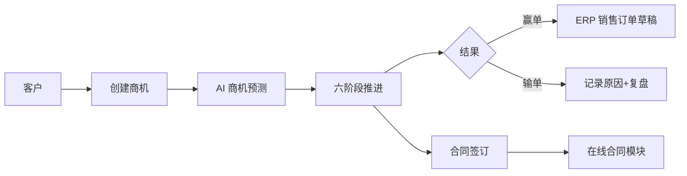
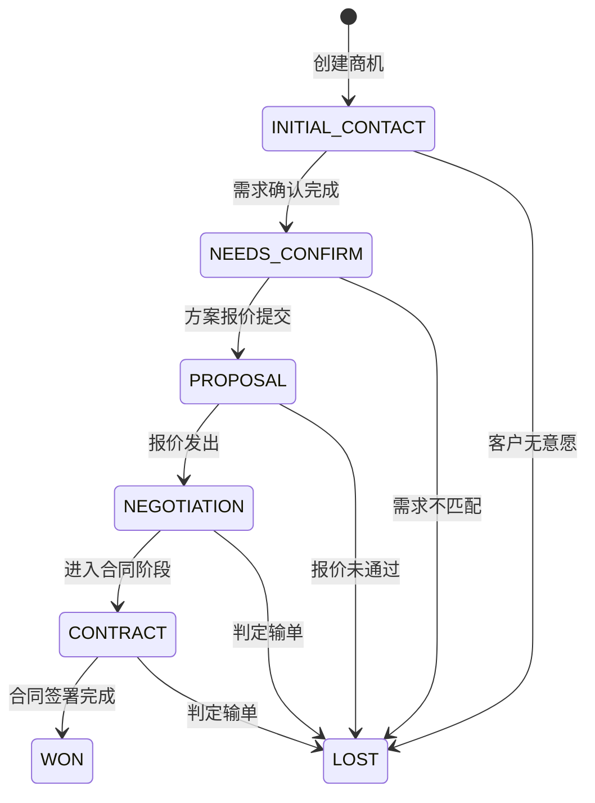

# 商机主PRD

> **版本**：V1.0 | 2026-07-17
> **读者**：研发工程师、测试工程师、产品复核

---

## 1. 业务背景

商机是 CRM 从"线索转化"到"成交变现"的核心转化层。线索转客户后,销售针对客户创建商机,经历六个阶段从初步接触到赢单/输单,最终赢单时下推 ERP 生成销售订单。

没有统一的商机管理:
- 销售各自维护自己的客户意向,主管无法掌握团队 pipeline
- 报价靠口头/邮件,无留痕,后续扯皮
- 丢单原因不记录,无法复盘——同样的坑反复踩
- 预测成交靠拍脑袋,没有数据支撑
- 赢单后手动在 ERP 重建订单,客户信息重复录入

---

## 2. 功能范围

**In Scope:**
- 商机创建(关联客户+商品)
- 六阶段推进(初步接触→需求确认→方案报价→商务谈判→合同签订→赢单/输单)
- 预计金额/预计成交日期
- 商机看板(按阶段分组)
- AI 商机预测(成交概率+推荐商品)
- 赢单→ERP 销售订单草稿
- 输单原因记录

**Out of Scope:**
- 在线合同签署——对接已有合同模块,商机只触发签约流程
- 报价审批流——一期仅记录报价,审批归二期
- 佣金计算——归财务模块

---

## 3. 对象定位

### 3.1 在系统中的位置

| 项目 | 内容 |
|------|------|
| 对象类型 | 商机(销售转化层) |
| 核心职责 | 管理从客户意向到成交的全过程,驱动销售 pipeline 可视化 |
| 来源 | 手动创建(关联已有客户) |
| 下游 | 赢单→ERP 销售订单草稿;合同签订→在线合同模块 |
| 关联关系 | 一个客户可有多个商机(1:N);一个商机关联一个客户(1:1) |

### 3.2 系统链路图

---

## 4. 业务场景

| 场景ID | 场景 | 类型 | 说明 |
|--------|------|------|------|
| S01 | 创建商机并推进到赢单 | **主流程** | 销售创建商机,逐阶段推进,最终赢单下推 ERP |
| S02 | 方案报价阶段申请折扣 | **支线** | 标准报价之外需要特批折扣 |
| S03 | 合同签订对接在线合同 | **支线** | 推到合同签订阶段,触发在线合同模块 |
| S04 | 商务谈判后输单 | **支线** | 谈判阶段判定无法成交,记录输单原因 |
| S05 | AI 预测高成交概率 | **主流程** | AI 根据客户画像+跟进频率预测成交概率 |

---

## 5. 状态机

### 5.1 对象状态

| 状态 | 含义 | 是否终态 |
|------|------|:--------:|
| INITIAL_CONTACT | 初步接触 | 否 |
| NEEDS_CONFIRM | 需求确认 | 否 |
| PROPOSAL | 方案报价 | 否 |
| NEGOTIATION | 商务谈判 | 否 |
| CONTRACT | 合同签订 | 否 |
| WON | 赢单 | 是 |
| LOST | 输单 | 是 |

### 5.2 状态机图

### 5.3 状态流转表

| 当前状态 | 动作 | 前置条件 | 结果状态 | 后置影响 |
|----------|------|---------|---------|---------|
| INITIAL_CONTACT | 推进 | 需求描述已填写 | NEEDS_CONFIRM | 记录推进时间 |
| NEEDS_CONFIRM | 推进 | 已关联商品 | PROPOSAL | AI 商机预测更新 |
| PROPOSAL | 推进 | 报价金额>0 | NEGOTIATION | 记录报价信息 |
| NEGOTIATION | 推进 | 确认启动在线合同流程 | CONTRACT | 触发在线合同模块 |
| CONTRACT | 赢单 | 合同签署完成且合同编号已生成 | WON | 下推 ERP 销售订单草稿 |
| 任意非终态 | 输单 | 必填输单原因 | LOST | 记录原因+输单时间 |

### 5.4 动作能力矩阵

| 动作 | INITIAL | NEEDS | PROPOSAL | NEGOT | CONTRACT | WON | LOST |
|------|:---:|:---:|:---:|:---:|:---:|:---:|:---:|
| 查看 | ✅ | ✅ | ✅ | ✅ | ✅ | ✅ | ✅ |
| 编辑 | ✅ | ✅ | ✅ | ❌ | ❌ | ❌ | ❌ |
| 推进 | ✅ | ✅ | ✅ | ✅ | ✅ | ❌ | ❌ |
| 输单 | ✅ | ✅ | ✅ | ✅ | ✅ | ❌ | ❌ |

---

## 6. 核心业务规则

| 规则ID | 规则 |
|--------|------|
| R01 | 商机必须关联客户 |
| R02 | 推进到"需求确认"时必须关联至少一个商品(从 ERP 商品列表选择) |
| R03 | 输单必须填写原因,不可跳过 |
| R04 | 赢单时自动生成 ERP 销售订单草稿,携带客户+商品+报价信息 |
| R05 | 合同签订阶段触发在线合同模块,合同签署完成后才可赢单 |
| R06 | 终态(WON/LOST)不可回退 |

---

## 7. AI 串联规则

| AI 节点 | 触发时机 | 输入 | 输出 | 执行动作 |
|---------|---------|------|------|---------|
| 商机预测 | 创建时+每次阶段变更 | 客户画像+历次订单+商品+金额 | 成交概率 0-100% | 高概率→通知销售主管;低概率→提示补充信息 |
| 商品推荐 | 推进到需求确认时 | 客户行业+历史订单+相似客户 | 推荐商品列表(TOP5) | 销售可选择加入商机关联商品 |

---

## 8. 权限设计

| 角色 | 可见范围 | 操作 |
|------|---------|------|
| 销售 | 自己创建的商机 | 创建/编辑/推进/输单 |
| 销售主管 | 团队全部商机 | 查看/转派 |
| 管理员 | 全部 | 全部 |

---

## 9. 验收重点

| # | 验收项 | 输入条件 | 预期结果 |
|---|--------|---------|---------|
| V01 | 六阶段全流程 | 创建→逐阶段推进→赢单 | 每阶段状态正确流转,赢单后 ERP 订单生成 |
| V02 | 输单必填原因 | 任意阶段点击输单,原因留空 | 阻断,提示"请输入输单原因" |
| V03 | 需求确认须关联商品 | 推进到需求确认,未关联商品 | 阻断,提示"请至少关联一个商品" |
| V04 | AI 商机预测 | 创建商机 | 自动计算成交概率并展示 |
| V05 | 赢单下推 ERP | 合同签署完成,点击赢单 | ERP 收到销售订单草稿(含客户+商品+金额) |

---

## 10. 修订记录

| 日期 | 变更摘要 |
|------|---------|
| 2026-07-17 | V1.0 初版 |
