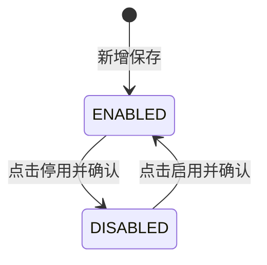

# 仓库档案主PRD

> 版本：V1.0 | 更新时间：2026-07-07
> 读者：研发、测试、产品复核
> 文档定位：仓库档案属于基础数据主数据，本文定义业务边界、档案定位、维护规则与验收口径。字段明细以《仓库档案字段清单》为唯一来源。

---

## 1. 业务背景

Forge WMS 一期采用单一仓库单货主模式，仓库档案是全系统仓储作业的主数据地基。采购入库、销售出库、库存查询、盘点、调拨、PDA 现场作业都需要先明确作业仓库，再向下带出库区与货位。

全国 6 个仓库、日出库 20,000+ 单的业务规模下，仓库档案需要解决三个问题：

- 统一仓库编码、名称、类型、地址、负责人等基础识别口径。
- 为入库、出库、库存、盘点、调拨等业务提供可引用的启用仓库候选。
- 向下约束库区、货位等基础数据的归属关系，保证现场作业和库存查询的仓库口径一致。

---

## 2. 功能范围

### 2.1 In Scope

- 仓库档案新增、编辑、查询、详情查看。
- 仓库类型、负责人、地址、备注等基础资料维护。
- 仓库启用 / 停用管理；状态变更必须通过动作按钮触发。
- 为库区管理、货位管理提供所属仓库来源。
- 为入库、出库、库存查询、库存流水、库存预警、盘点、调拨、PDA 作业提供仓库引用口径。
- 前端 Demo 使用 Dexie.js 模拟仓库档案数据、列表筛选、新增编辑、详情展示与启停用交互。

### 2.2 Out of Scope

- 多货主、多组织、多法人仓库权限模型。
- 仓库容量、库容利用率、作业班次、承运线路、自动补货策略等高级能力。
- 与第三方物流系统、硬件设备的对接。
- 仓库物理删除；主数据不提供删除，统一通过“停用 / 启用”处理。
- 后端接口、数据库表结构与服务端权限实现。

---

## 3. 档案定位

| 项目 | 内容 |
| :--- | :--- |
| 档案类型 | 基础数据主数据 |
| 维护主体 | WMS 基础数据管理员 / 仓储管理人员 |
| 核心职责 | 统一仓库识别口径，控制仓库是否可被新业务引用 |
| 上游关系 | ERP/SCM 下发采购订单、销售订单时可携带目标仓 / 发货仓，WMS 按仓库档案校验仓库是否存在且启用 |
| 下游关系 | 库区、货位继承仓库归属；入库、出库、库存、盘点、调拨、PDA 作业引用仓库编码与名称 |
| 状态模型 | `ENABLED` / `DISABLED` |

---

## 4. 字段摘要

| 字段组 | 代表字段 | 摘要说明 |
| :--- | :--- | :--- |
| 基础识别 | 仓库编码、仓库名称、仓库类型 | 用于系统内唯一识别仓库，并区分主仓、分仓、门店仓等业务角色 |
| 责任与地址 | 负责人、仓库地址 | 用于业务查询、现场联系与作业追责 |
| 经营控制 | 状态 | 控制仓库能否进入新业务单据、库区和货位维护的候选范围 |
| 补充说明 | 备注 | 记录仓库特殊说明，不作为系统判断条件 |
| 系统字段 | 创建时间、最后修改时间 | 用于 Demo 数据展示与变更追踪 |

字段类型、必填性、枚举值与校验规则以《仓库档案字段清单》为准；主PRD不重复定义。

---

## 5. 维护规则

### 5.1 新增规则

| 规则ID | 规则 |
| :--- | :--- |
| WH-R01 | 新增仓库时必须填写仓库编码、仓库名称、仓库类型、负责人、仓库地址。 |
| WH-R02 | 仓库编码为全局唯一主键，新增保存时校验不可重复。 |
| WH-R03 | 仓库编码保存后作为下游引用主键，编辑页不允许修改。 |
| WH-R04 | 新增成功后仓库状态默认为 `ENABLED`，不在新增表单中提供状态下拉。 |

### 5.2 编辑规则

| 规则ID | 规则 |
| :--- | :--- |
| WH-R11 | 仓库名称、类型、负责人、地址、备注允许维护，但不得影响历史单据已记录的仓库信息。 |
| WH-R12 | 仓库编码编辑态只读；前端不提供可编辑输入后再报错的交互。 |
| WH-R13 | 状态字段不允许在新增 / 编辑表单中直接修改，只能通过列表页或详情页的“启用 / 停用”动作按钮触发。 |

### 5.3 状态机

| 当前状态 | 可用动作 | 动作后状态 | 规则 |
| :--- | :--- | :--- | :--- |
| `ENABLED` | 停用 | `DISABLED` | 停用后不再进入新业务候选范围，历史数据仍可查询 |
| `DISABLED` | 启用 | `ENABLED` | 启用后重新进入新业务候选范围 |

### 5.4 引用规则

| 引用方 | 引用方式 | 规则 |
| :--- | :--- | :--- |
| 库区管理 | 所属仓库 | 只允许选择启用仓库；库区保存仓库编码与仓库名称 |
| 货位管理 | 所属仓库、所属库区 | 仓库必须启用，且库区必须归属于该仓库 |
| 入库管理 | 入库仓库 | 新建收货 / 上架相关单据时只允许选择启用仓库 |
| 出库管理 | 发货仓库 | 波次、拣货、复核、包裹、交运链路引用仓库口径 |
| 库存管理 | 查询维度 | 启用 / 停用仓库均可查询历史库存与流水，停用仓库需明确展示状态 |
| 盘点 / 调拨 | 作业仓库 | 新建作业单只允许选择启用仓库；历史单据不因仓库停用而隐藏 |

### 5.5 停用与启用规则

- 停用 / 启用必须由动作按钮触发，并弹出二次确认。
- 停用仓库不物理删除，不级联删除库区、货位、库存、单据。
- 停用仓库不进入新单、新库区、新货位维护的候选范围。
- 停用仓库仍允许在历史单据、库存查询、库存流水中展示，用于追溯。
- 按通用规范，按钮不可用时隐藏，不展示灰色 disabled 态。

---

## 6. 验收

| 验收ID | 验收项 | 验收标准 |
| :--- | :--- | :--- |
| AC01 | 字段完整性 | 新增 / 编辑页覆盖仓库编码、名称、类型、负责人、地址、备注等字段，必填项缺失时禁止保存 |
| AC02 | 编码唯一性 | 新增重复仓库编码时阻断保存，并提示“仓库编码已存在” |
| AC03 | 编码不可编辑 | 编辑已有仓库时仓库编码只读，不允许修改 |
| AC04 | 状态按钮驱动 | 状态不能通过表单下拉直接修改，只能点击“停用”或“启用”按钮触发 |
| AC05 | 无物理删除 | 列表、详情、表单均不提供删除入口 |
| AC06 | 停用引用限制 | 停用仓库不进入新业务单据、库区、货位的候选范围 |
| AC07 | 历史可追溯 | 停用仓库在历史单据、库存查询、库存流水中仍可展示，并明确状态 |
| AC08 | Demo 数据 | Mock 仓库日期使用 2026 年，列表筛选、新增编辑、启停用后数据可刷新展示 |

---

## 7. 不确定性说明

| 事项 | 当前处理 | 需复核点 |
| :--- | :--- | :--- |
| 仓库类型枚举 | 采用当前前端 Demo 已存在的 `MAIN`、`BRANCH`、`STORE` 口径 | context 未单独定义仓库类型枚举，如真实项目枚举不同，以产品复核后更新字段清单 |
| 停用前业务校验 | 当前按主数据通用规则：停用仅限制新业务引用，不删除历史数据 | 是否需要校验未完结单据、库存余额后才允许停用，context 未明确 |
| 停用原因 | 当前字段清单不定义停用原因，Demo 仅做二次确认 | 如需审计停用原因，应补充字段并同步调整 Demo |
