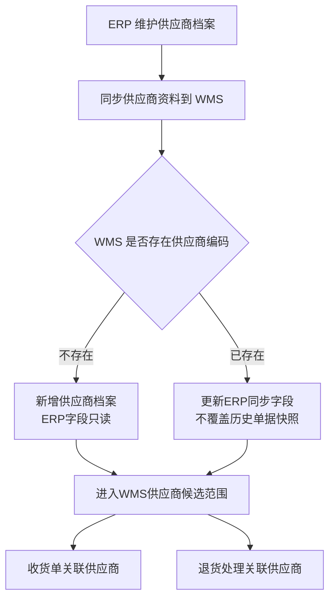
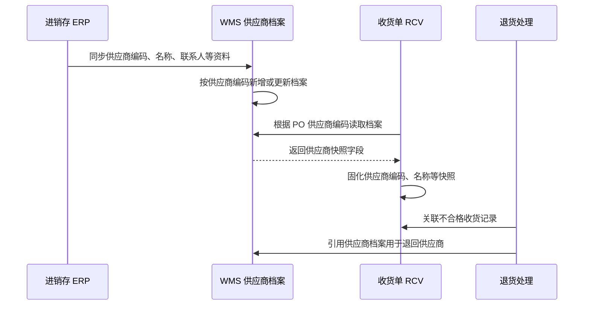
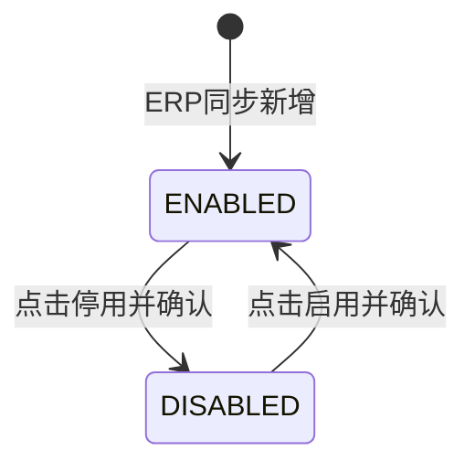

# 供应商档案主PRD

> 版本：V1.0 | 更新时间：2026-07-07
> 读者：研发、测试、产品复核
> 文档定位：供应商档案属于基础数据主数据。本文定义 WMS 侧业务边界、ERP 同步机制、引用规则、状态维护规则与验收口径。字段明细以《供应商档案字段清单》为唯一来源。

---

## 1. 业务背景

供应商档案是 Forge WMS 入库链路使用的供应商主数据，来源于进销存 ERP。ERP 负责维护供应商的编码、名称、联系人、联系电话、地址、结算方式等资料；WMS 负责在收货、质检不合格退货处理等仓储场景中引用这些资料。

在 WMS 中，供应商档案需要解决三个问题：

- 承接 ERP 供应商主数据，保证收货单、采购退货等场景使用统一供应商口径。
- 在收货单中固化供应商快照，避免供应商档案后续变更影响历史单据追溯。
- 通过 WMS 本地启用 / 停用控制供应商是否进入新业务候选范围，不提供物理删除。

---

## 2. 功能范围

### 2.1 In Scope

- 从 ERP 同步供应商基础资料到 WMS。
- 供应商列表查询、详情查看、同步信息展示。
- ERP 同步字段在 WMS 侧只读展示，不支持 WMS 人工修改。
- WMS 本地启用 / 停用管理；状态变更必须通过动作按钮触发。
- 为收货单 RCV 提供供应商编码、供应商名称等快照字段来源。
- 为退货处理提供供应商关联口径；退货流程本身不在本档案 PRD 中展开。
- 前端 Demo 使用 Dexie.js 模拟供应商同步数据、列表筛选、同步新增预览、详情展示与启停用交互，Mock 日期使用 2026 年。

### 2.2 Out of Scope

- 在 WMS 中新增、修改 ERP 供应商主数据。
- 供应商准入审批、评级、绩效、协同门户、对账门户。
- 复杂税务模型、付款登记、财务结算规则维护。
- 第三方物流系统、硬件设备、外部供应商门户对接。
- 供应商物理删除；主数据不提供删除，统一通过“停用 / 启用”处理。
- 后端接口、数据库表结构与服务端权限实现。

---

## 3. 档案定位

| 项目 | 内容 |
| :--- | :--- |
| 档案类型 | 基础数据主数据 |
| 上游来源 | 进销存 ERP 供应商档案 |
| WMS 维护主体 | WMS 基础数据管理员 / 仓储管理人员 |
| 核心职责 | 承接 ERP 供应商资料，控制 WMS 新业务是否可引用该供应商 |
| 直接服务 | 收货单 RCV、质检不合格退货处理、历史入库单据查询 |
| 状态模型 | `ENABLED` / `DISABLED` |
| 数据口径 | ERP 字段只读同步；WMS 单据引用时按快照存储 |

---

## 4. 同步机制

### 4.1 同步范围

ERP 为供应商资料的主维护系统。WMS 接收 ERP 同步的供应商字段，包括供应商编码、供应商名称、供应商简称、联系人、联系电话、联系地址、结算方式、账期天数、税率等。字段名称、类型、必填性与校验规则以《供应商档案字段清单》为准。

### 4.2 只读规则

| 规则ID | 规则 |
| :--- | :--- |
| SUP-SYNC-01 | ERP 同步字段在 WMS 侧只读，不允许在 WMS 新增 / 编辑页直接修改。 |
| SUP-SYNC-02 | WMS 不回写 ERP 供应商资料；供应商资料变更应在 ERP 完成后再同步到 WMS。 |
| SUP-SYNC-03 | 同步以供应商编码作为唯一匹配键；编码相同则更新只读字段，编码不存在则新增 WMS 供应商档案记录。 |
| SUP-SYNC-04 | 同步不得覆盖历史收货单、退货单中已固化的供应商快照字段。 |
| SUP-SYNC-05 | WMS 本地状态用于控制新业务候选范围；状态不在编辑表单中直接修改，只能通过启用 / 停用动作按钮变更。 |

### 4.3 同步流程

---

## 5. WMS 用途

| 场景 | 使用方式 | 规则 |
| :--- | :--- | :--- |
| 收货单 RCV | 供应商随 ERP PO 下发，并在 RCV 中只读展示 | 收货单保存供应商编码、供应商名称等快照；档案后续变更不影响既有 RCV |
| 收货列表 / 详情 | 按供应商查询或展示来源供应商 | 已停用供应商仍可在历史单据中展示 |
| 质检不合格退货处理 | 使用原收货单供应商快照或供应商档案辅助追溯 | 当前 context 仅明确“不合格退货处理”，退货单据流程不在本 PRD 展开 |
| 供应商候选过滤 | 新业务只允许引用启用供应商 | 停用供应商不进入新收货、退货等新业务候选范围 |

---

## 6. 业务场景

| 场景ID | 场景 | 系统处理 |
| :--- | :--- | :--- |
| SUP-S01 | ERP 新增供应商并同步到 WMS | WMS 按供应商编码新增记录，ERP 字段只读展示，默认进入启用状态 |
| SUP-S02 | ERP 修改供应商联系人或电话 | WMS 下次同步后更新档案展示，不影响历史收货单快照 |
| SUP-S03 | 收货单关联供应商 | RCV 继承 PO 供应商并固化供应商编码、名称等快照字段 |
| SUP-S04 | 停用供应商 | WMS 用户点击“停用”并确认后，供应商不再进入新业务候选范围 |
| SUP-S05 | 启用供应商 | WMS 用户点击“启用”并确认后，供应商重新进入新业务候选范围 |
| SUP-S06 | 查看历史供应商 | 停用供应商仍可在历史收货单、库存追溯、退货记录中展示 |

---

## 7. 维护规则

### 7.1 ERP 同步字段维护规则

| 规则ID | 规则 |
| :--- | :--- |
| SUP-R01 | 供应商编码为供应商唯一标识，WMS 不允许修改。 |
| SUP-R02 | 供应商名称、简称、联系人、电话、地址、结算方式、账期天数、税率等字段由 ERP 同步，WMS 侧只读。 |
| SUP-R03 | ERP 同步字段在列表、详情、新增同步预览、编辑页中均不得提供可编辑控件。 |
| SUP-R04 | WMS 单据已保存的供应商快照不随供应商档案更新而变更。 |

### 7.2 WMS 本地维护规则

| 规则ID | 规则 |
| :--- | :--- |
| SUP-R11 | WMS 可维护供应商本地状态 `status`，用于控制是否进入新业务候选范围。 |
| SUP-R12 | 新同步入 WMS 的供应商默认状态为 `ENABLED`，如需与 ERP 状态联动需另行确认。 |
| SUP-R13 | 停用供应商时弹出二次确认；是否必填停用原因以字段清单为准。 |
| SUP-R14 | 启用 / 停用只能通过动作按钮触发，不允许在表单中直接修改状态字段。 |
| SUP-R15 | 不提供删除入口，不做物理删除，不级联删除历史单据。 |

### 7.3 状态机

| 当前状态 | 可用动作 | 动作后状态 | 规则 |
| :--- | :--- | :--- | :--- |
| `ENABLED` | 停用 | `DISABLED` | 停用后不再进入 WMS 新业务供应商候选范围，历史数据仍可查看 |
| `DISABLED` | 启用 | `ENABLED` | 启用后重新进入 WMS 新业务供应商候选范围 |

### 7.4 引用规则

| 引用方 | 引用字段 | 规则 |
| :--- | :--- | :--- |
| ERP PO | 供应商编码、供应商名称 | PO 下发时带入供应商信息；WMS 按 PO 创建 RCV |
| 收货单 RCV | 供应商编码、供应商名称 | 继承 PO，并作为收货单快照字段只读保存 |
| 退货处理 | 供应商编码、供应商名称、联系人、电话 | 优先使用原单快照追溯供应商；新建退货候选需供应商启用 |
| 历史查询 | 供应商编码、供应商名称、状态 | 启用 / 停用供应商均允许在历史单据中展示 |

---

## 8. 字段清单入口

字段的唯一事实来源见《供应商档案字段清单》。本主 PRD 不重复维护完整字段定义，只保留字段摘要：

| 字段组 | 代表字段 | 摘要说明 |
| :--- | :--- | :--- |
| 基础识别 | 供应商编码、供应商名称、供应商简称 | 来源 ERP，同步只读，用于识别供应商 |
| 联系信息 | 联系人、联系电话、联系地址 | 来源 ERP，同步只读，用于收货异常沟通和退货联系 |
| 经营信息 | 结算方式、账期天数、税率 | 来源 ERP，同步只读；WMS 展示，不在仓储流程中维护 |
| WMS 控制 | 状态、停用原因 | WMS 本地维护；状态只允许按钮触发 |
| 系统字段 | 来源系统、最后同步时间、创建时间、最后修改时间 | 用于同步追踪和 Demo 展示 |

---

## 9. 验收

| 验收ID | 验收项 | 验收标准 |
| :--- | :--- | :--- |
| AC01 | ERP 同步只读 | 供应商编码、名称、简称、联系人、电话、地址、结算方式等 ERP 字段在 WMS 页面均只读，不可编辑保存 |
| AC02 | 编码唯一 | WMS 按供应商编码识别同步记录，重复编码更新同一档案，不生成重复供应商 |
| AC03 | 收货关联 | ERP PO 下推后，RCV 可只读展示供应商编码、名称，并保存为单据快照 |
| AC04 | 快照不回写 | 修改供应商档案后，历史 RCV 中已保存的供应商快照不变化 |
| AC05 | 状态按钮驱动 | 状态不能通过表单下拉直接修改，只能点击“停用”或“启用”按钮触发 |
| AC06 | 无物理删除 | 列表、详情、表单均不提供删除入口 |
| AC07 | 停用引用限制 | 停用供应商不进入新业务候选范围，历史单据仍可展示 |
| AC08 | Demo 数据 | 前端 Demo Mock 数据使用 2026 年日期，列表筛选、同步新增预览、详情、启停用后数据可刷新展示 |

---

## 10. 不确定性说明

| 事项 | 当前处理 | 需复核点 |
| :--- | :--- | :--- |
| ERP 供应商状态是否同步 | 本版将 WMS `status` 作为本地候选控制字段处理，新同步记录默认 `ENABLED` | 若 ERP 停用状态需要强制同步到 WMS，应补充同步优先级与冲突规则 |
| 停用原因 | ERP 参照物有停用原因，本版字段清单保留 WMS `disabledReason`，停用时填写 | WMS 一期是否必须采集停用原因，context 未明确 |
| 供应商简称 | 用户要求字段包含简称，本版定义为 ERP 同步只读字段 | ERP 参照物未展示简称字段，如 ERP 实际无该字段，WMS 可隐藏或展示 `-` |
| 退货流程 | 本版仅定义供应商档案对退货处理的引用口径 | 退货单据流程、状态机、字段清单需在对应退货模块 PRD 中定义 |
