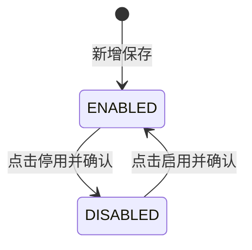
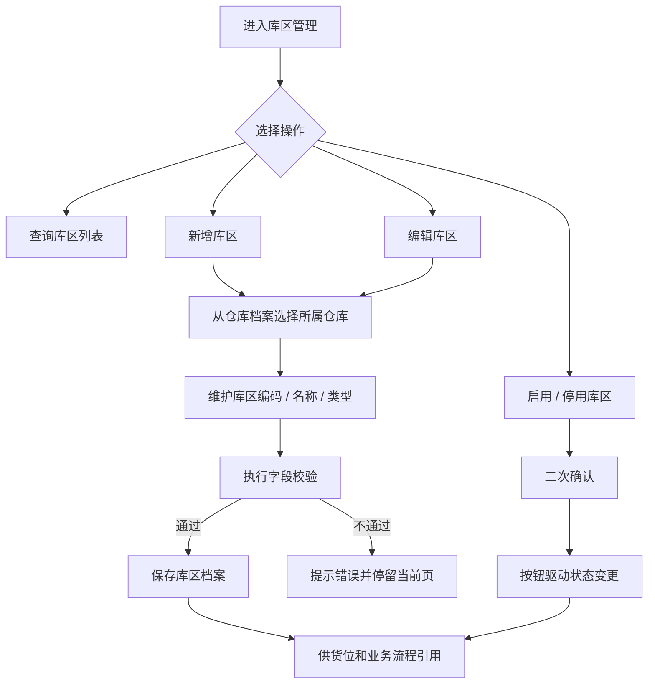
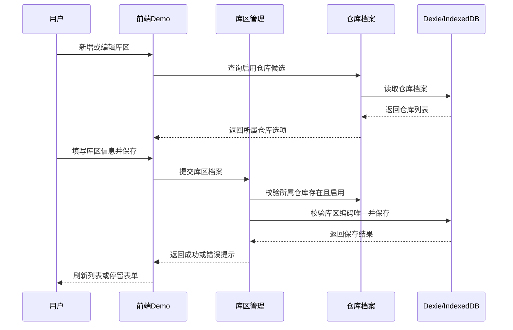

# 库区主PRD

> 版本：V1.0 | 更新时间：2026-07-07
> 读者：研发、测试、产品复核
> 文档定位：库区属于基础数据主数据，本文定义业务背景、功能范围、隶属仓库定位、库区类型、维护规则与验收口径。字段明细以《库区字段清单》为唯一事实来源。

---

## 1. 业务背景

库区是仓库内的功能分区，用于把仓库空间按作业用途拆分为收货区、存储区、拣货区、退货区、发货区。库区是货位的上级主数据，货位再向下承载货架编号、层、列和条码绑定。

Forge WMS 一期覆盖全国 6 个仓库，日出库 20,000+ 单。入库收货、上架、出库拣货、库存查询、库存流水和盘点都需要按仓库、库区、货位逐层定位。如果库区口径不统一，下游货位和库存数据会出现归属不清，现场作业也难以按区域组织。

---

## 2. 功能范围

### 2.1 In Scope

- 库区档案新增、编辑、查询、详情查看。
- 库区编码、名称、类型、所属仓库、状态等基础资料维护。
- 库区启用 / 停用管理；状态变更必须通过动作按钮触发。
- 为货位管理提供所属库区来源，并向下约束货位归属。
- 为入库、出库、库存查询、库存流水、盘点、调拨等流程提供库区筛选和追溯维度。
- 前端 Demo 使用 2026 年 Mock 数据展示列表、新增编辑、详情和启停用交互。

### 2.2 Out of Scope

- 仓库档案维护。所属仓库来源于仓库档案，本模块不自建仓库。
- 货位结构维护。货架编号、层、列、货位条码由货位管理负责。
- 库区容量、面积、温控、作业路径、库容利用率等高级属性。
- 第三方物流系统、硬件设备、PDA 扫码硬件选型。
- 物理删除库区。主数据不提供删除，统一通过停用处理。

---

## 3. 档案定位：隶属仓库

| 项目 | 内容 |
| :--- | :--- |
| 档案类型 | 基础数据主数据 |
| 所属模块 | 基础数据管理 |
| 数据层级 | 仓库档案 > 库区 > 货位 |
| 上游 SSOT | 仓库档案 |
| 下游引用 | 货位管理、收货单 RCV、上架单 PUT、拣货单 PICK、库存查询、库存流水 FL、盘点、调拨 |
| 唯一标识 | `code` |
| 状态模型 | `ENABLED` / `DISABLED` |

### 3.1 隶属仓库规则

- 新增或编辑库区时，所属仓库必须从仓库档案选择。
- 所属仓库字段不允许手工录入，不允许在库区管理内新建仓库。
- 一个库区只能隶属一个仓库。
- 新增库区时仅允许选择启用仓库。
- 仓库停用后，该仓库下历史库区仍可查询；是否允许继续编辑历史库区，context 未明确，本版按“不可作为新业务候选”处理。

---

## 4. 库区类型枚举

库区类型严格按 `context/03-主要功能模块和清单.md` 定义，只允许以下五类，不扩展质检区、暂存区、异常区等未定义类型。

| 枚举值 | 展示文案 | 说明 |
| :--- | :--- | :--- |
| `RECEIVING` | 收货区 | 用于收货、待验、待上架前的入库接收区域 |
| `STORAGE` | 存储区 | 用于常规库存存放，也是默认上架推荐的主要区域 |
| `PICKING` | 拣货区 | 用于出库拣货作业 |
| `RETURN` | 退货区 | 用于退货、异常退回等处理区域 |
| `SHIPPING` | 发货区 | 用于复核、包装后待交运区域 |

枚举值、字段类型和校验细节以《库区字段清单》为准；本节只说明业务含义。

---

## 5. 维护规则

### 5.1 新增规则

| 规则ID | 规则 |
| :--- | :--- |
| ZONE-R01 | 新增库区必须填写库区编码、库区名称、库区类型、所属仓库。 |
| ZONE-R02 | 所属仓库必须来自仓库档案，且为启用状态。 |
| ZONE-R03 | 库区编码按 `context/11` 执行编码校验：字母 + 数字，不可重复。 |
| ZONE-R04 | 库区类型只能选择收货区、存储区、拣货区、退货区、发货区五类。 |
| ZONE-R05 | 新增保存成功后默认状态为 `ENABLED`，新增表单不提供状态下拉。 |

### 5.2 编辑规则

| 规则ID | 规则 |
| :--- | :--- |
| ZONE-R11 | 库区编码是唯一标识，编辑页只读，不允许修改。 |
| ZONE-R12 | 库区名称、库区类型、所属仓库、备注允许维护，保存时重新校验。 |
| ZONE-R13 | 所属仓库仍必须从仓库档案选择，不允许手工录入或自建仓库。 |
| ZONE-R14 | 状态字段不允许在新增 / 编辑表单中直接修改，只能通过列表页或详情页的启用 / 停用按钮触发。 |

### 5.3 启用与停用规则

| 当前状态 | 可用动作 | 动作后状态 | 规则 |
| :--- | :--- | :--- | :--- |
| `ENABLED` | 停用 | `DISABLED` | 停用后不再进入新业务候选范围，历史数据仍可查询 |
| `DISABLED` | 启用 | `ENABLED` | 启用前需校验所属仓库仍为启用 |

补充规则：

- 停用 / 启用必须由动作按钮触发，并弹出二次确认。
- 停用库区不物理删除，不级联删除货位、库存、单据。
- 停用库区不进入新货位、新收货、新上架、新拣货、盘点范围等候选。
- 停用库区仍允许在历史单据、库存查询、库存流水中展示，用于追溯。
- 按通用规范，按钮不可用时隐藏，不展示灰色 disabled 态。

### 5.4 引用规则

| 引用方 | 引用方式 | 规则 |
| :--- | :--- | :--- |
| 仓库档案 | 所属仓库 | 库区保存仓库编码与仓库名称，来源于仓库档案 |
| 货位管理 | 所属库区 | 新增货位时只允许选择启用库区，货位继承库区所属仓库 |
| 入库管理 | 收货 / 上架库区 | 新建作业只允许选择启用库区；历史单据保留原库区 |
| 出库管理 | 拣货 / 发货库区 | 作业按库区组织和筛选，具体货位由货位管理承载 |
| 库存管理 | 查询维度 | 支持按仓库、库区、货位、商品、批次多维度查询 |

---

## 6. 业务流程

### 6.1 业务流程图

### 6.2 系统时序图

---

## 7. 字段清单入口

字段类型、必填性、枚举值与校验规则以《库区字段清单》为准；主 PRD 不重复维护字段细节。

核心字段包括：`code`、`name`、`type`、`warehouseCode`、`warehouseName`、`status`、`remark`、`createdAt`、`updatedAt`。

---

## 8. 验收

| 验收ID | 验收项 | 验收标准 |
| :--- | :--- | :--- |
| AC01 | 所属仓库来源 | 新增 / 编辑库区时，所属仓库只能从仓库档案读取，不能手工新增仓库 |
| AC02 | 库区类型 | 系统只允许选择收货区、存储区、拣货区、退货区、发货区五类 |
| AC03 | 编码校验 | 库区编码必填，按字母 + 数字校验，且不可重复 |
| AC04 | 编码不可编辑 | 编辑已有库区时，`code` 展示为只读，不允许变更 |
| AC05 | 状态按钮驱动 | 新增默认启用；启用 / 停用只能通过动作按钮触发 |
| AC06 | 无物理删除 | 列表、详情、表单均不提供删除入口 |
| AC07 | 停用引用限制 | 停用库区不进入新业务和新货位候选范围，历史数据仍可查看 |
| AC08 | 二次确认 | 点击启用 / 停用时必须二次确认，确认后才变更状态 |
| AC09 | 列表筛选 | 支持按编码 / 名称、所属仓库、类型、状态筛选，默认分页 20 条 |
| AC10 | Demo 数据 | Mock 数据时间使用 2026 年样例，不使用真实生产数据 |

---

## 9. 不确定性说明

| 事项 | 当前处理 |
| :--- | :--- |
| 库区编码长度上限 | context 未定义具体长度，本版只按字母 + 数字、不可重复处理 |
| `warehouseName` 同步策略 | 当前按仓库档案带出展示；仓库改名后是否快照或实时联查，context 未明确 |
| 停用前业务校验 | context 未明确是否需校验已有货位、库存余额或未完结任务；本版只定义停用后限制新引用 |
