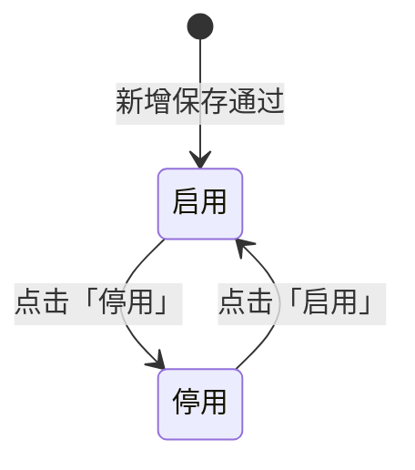
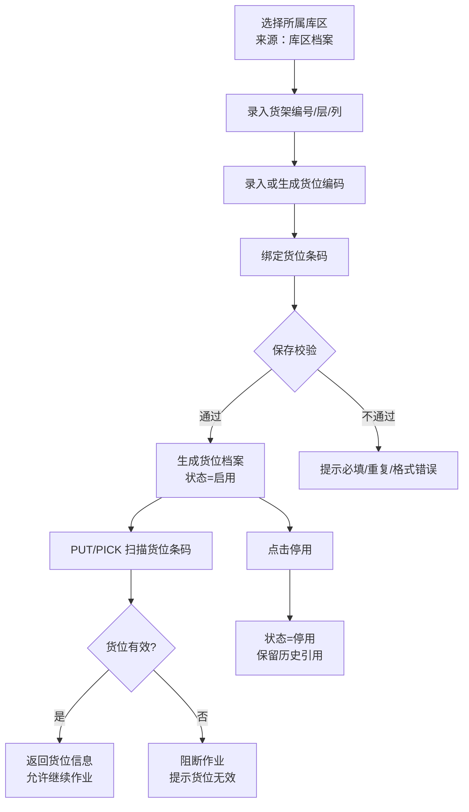
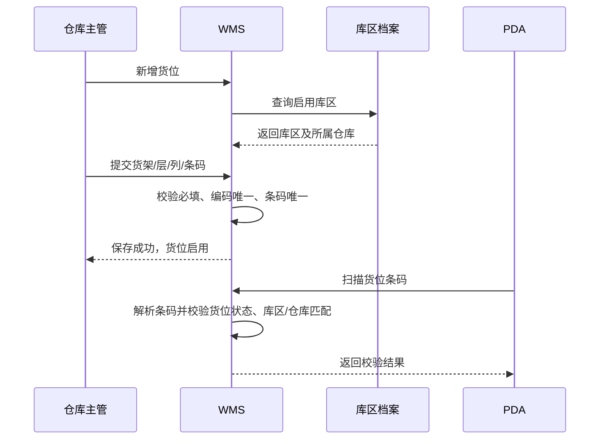

# 货位主PRD

> 角色：主PRD | 类型：档案主数据
> 关联文件：`货位字段清单.md` `货位_前端Demo版PRD.md`
> 权威层级：context/ > 本文件；字段定义以 `货位字段清单.md` 为 SSOT。

## 1. 业务背景

货位是 Forge WMS 最细粒度的库存承载位置，用于说明商品实际放在哪一个库区、哪一个货架、哪一层、哪一列。入库上架（PUT）需要 PDA 扫描货位条码确认实际上架货位，出库拣货（PICK）需要 PDA 按推荐路径扫描货位后再扫商品。

在 6 个仓库、日出库 20,000+ 单的作业规模下，如果货位档案不完整或条码绑定不准确，会直接造成上架错放、拣货找不到货、库存查询无法定位和库存流水追溯困难。因此货位管理的核心目标是建立可扫码、可追溯、可停用但不可物理删除的货位主数据。

## 2. 功能范围

| 范围 | 说明 |
|:--|:--|
| 货位档案维护 | 维护货位编码、货架编号、层、列、所属库区、条码、状态、是否可用等基础信息 |
| 所属库区引用 | 货位必须隶属库区，所属库区来源于库区档案；仓库信息随库区带出 |
| 条码绑定 | 支持为货位绑定唯一条码，供 PUT/PICK 的 PDA 扫码校验使用 |
| 启用/停用 | 主数据不物理删除，只通过「启用」「停用」按钮控制是否参与作业 |
| 作业引用 | 上架、拣货、库存查询、库存流水可按货位维度引用和追溯 |

不在本次范围：

- 不设计货位容量、ABC 分类、路径优化等高级推荐算法。
- 不设计条码打印硬件、PDA 硬件选型或扫码枪选型。
- 不提供删除货位功能。
- 不在货位管理中处理库存调整、盘点调整或库存过账。

## 3. 档案定位

| 维度 | 定位 |
|:--|:--|
| 数据类型 | 档案主数据 |
| 上游 SSOT | 库区档案。货位的所属库区必须来自库区档案，不允许手工录入游离库区 |
| 下游引用 | 上架单 PUT、拣货单 PICK、库存查询、库存流水 FL |
| 作业定位 | 货位是 PDA 扫码作业的空间锚点，负责把库存动作定位到实际存放位置 |
| 状态定位 | 货位状态只表示档案是否允许被新作业使用，不代表库存状态；库存状态仍以库存管理规则为准 |

### 3.1 隶属库区规则

- 新增货位时必须选择所属库区，所属库区只允许从库区档案中选择。
- 所属仓库由所属库区带出，不在货位档案中单独手填。
- 所属库区停用后，货位不得再被新 PUT/PICK 作业选用；历史单据和库存流水仍保留原货位信息。
- 一个货位只能隶属一个库区。如需调整所属库区，应通过编辑动作完成并记录操作日志。

## 4. 货位编码规则

context 已明确货位由「货架编号 / 层 / 列」组成，并支持条码绑定；但未明确正式货位编码的前缀、补零位数、分隔符、是否包含仓库或库区编码。因此本 PRD 只固化已明确的组成要素，不自创生产编码格式。

| 规则项 | 口径 |
|:--|:--|
| 组成要素 | 货架编号、层、列均为必填 |
| 唯一性 | 同一所属库区下，货架编号 + 层 + 列不可重复 |
| 货位编码 | 按 `context/11-字段校验规范` 执行编码校验：字母+数字、不可重复 |
| 展示名称 | Demo 可用 `货架-层-列` 形式展示，如 `A-01-02`，仅用于页面识别，不作为生产编码规则 |
| 不确定项 | 生产级 `code` 的前缀、补零规则和唯一范围未在 context 明确，需后续确认 |

## 5. 条码绑定

货位条码用于 PDA 扫码识别货位。PUT 上架时，PDA 扫描实际货位条码后写入实际上架货位；PICK 拣货时，PDA 扫描货位条码并校验是否匹配当前推荐货位。

| 规则 | 说明 |
|:--|:--|
| 绑定唯一性 | 一个货位绑定一个当前有效条码；同一条码不可绑定多个货位 |
| 条码格式 | 按 `context/11-字段校验规范`：数字为主，支持 EAN-13 |
| 作业校验 | PDA 扫码后必须能解析到唯一货位，并校验货位存在、启用、所属库区/仓库匹配 |
| 绑定方式 | PC 端支持新增时录入条码，详情页支持「绑定条码」「换绑条码」动作 |
| 操作留痕 | 条码绑定、换绑需记录操作人、操作时间、原条码、新条码 |
| 不确定项 | 条码生成来源、是否由系统自动生成、是否需要打印模板，context 未明确，本 PRD 不扩展 |

## 6. 维护规则

### 6.1 新增与编辑

- 新增货位必须填写货位编码、货架编号、层、列、所属库区和货位条码。
- 所属库区从库区档案选择，选择后带出所属仓库。
- 货位编码不可重复；同一所属库区下「货架编号 + 层 + 列」不可重复。
- 条码不可重复，格式按字段校验规范执行。
- 状态字段不在新增/编辑表单中直接编辑。
- 已被业务单据或库存流水引用的货位，是否允许修改货位编码和所属库区，context 未明确；Demo 版按保守口径将货位编码设为创建后只读。

### 6.2 启用与停用

| 当前状态 | 可执行动作 | 结果 | 说明 |
|:--|:--|:--|:--|
| 启用 | 停用 | 状态变为停用 | 停用后不再允许新上架、拣货扫码确认 |
| 停用 | 启用 | 状态变为启用 | 启用前需校验所属库区有效、条码已绑定且未重复 |

规则：

- 状态变更必须通过「启用」「停用」按钮触发，不允许直接编辑状态字段。
- 主数据不提供删除入口，历史引用保留。
- 按钮不可用时隐藏，不展示灰色 disabled 态。
- 是否允许停用仍有现存库存的货位，context 未明确；本 PRD 标注为待确认，不在 Demo 版强制新增库存清空规则。

### 6.3 作业引用校验

| 作业 | 校验 |
|:--|:--|
| PUT 上架 | 扫描货位后，校验货位存在、启用、条码匹配、属于当前作业仓库；无效时阻断确认 |
| PICK 拣货 | 扫描货位后，校验货位条码匹配当前推荐货位；不匹配时阻断继续扫商品 |
| 库存查询/流水 | 按货位维度展示库存和流水，停用货位仍可用于历史查询 |

## 7. 业务流程

### 7.1 业务流程图

### 7.2 系统时序图

## 8. 字段清单入口

字段的唯一事实来源见 `货位字段清单.md`。本主 PRD 只保留字段分类摘要：

| 字段分类 | 核心字段 |
|:--|:--|
| 货位基础 | 货位编码、货位名称、货架编号、层、列 |
| 所属关系 | 所属库区、所属仓库、库区类型 |
| 条码作业 | 货位条码、是否已绑定条码、是否可用 |
| 状态与系统字段 | 状态、创建人、创建时间、更新人、更新时间、操作记录 |

## 9. 验收标准

| 编号 | 验收点 | 标准 |
|:--|:--|:--|
| AC1 | 文件结构 | 主 PRD、字段清单、前端 Demo 版 PRD 三件齐全，字段枚举以字段清单为准 |
| AC2 | 所属库区 | 新增/编辑货位时，所属库区只能来源于库区档案，并带出所属仓库 |
| AC3 | 编码结构 | 货架编号、层、列必填；同一所属库区下组合不可重复 |
| AC4 | 编码不确定性 | 未在 context 明确的货位编码前缀、补零、分隔符不被写成生产规则 |
| AC5 | 条码绑定 | 条码格式符合字段校验规范，且不可重复；绑定和换绑有操作记录 |
| AC6 | 状态流转 | 启用/停用只能通过动作按钮触发，不允许直接编辑状态字段 |
| AC7 | 停用规则 | 停用货位不再参与新的 PUT/PICK 扫码确认，但历史库存流水可继续查询 |
| AC8 | 删除限制 | 页面和规则均不提供物理删除货位能力 |
| AC9 | 作业校验 | PUT/PICK 扫描不存在、停用、不匹配的货位时阻断作业并提示 |
| AC10 | Mock 时间 | Demo 示例数据使用 2026 年日期时间 |
