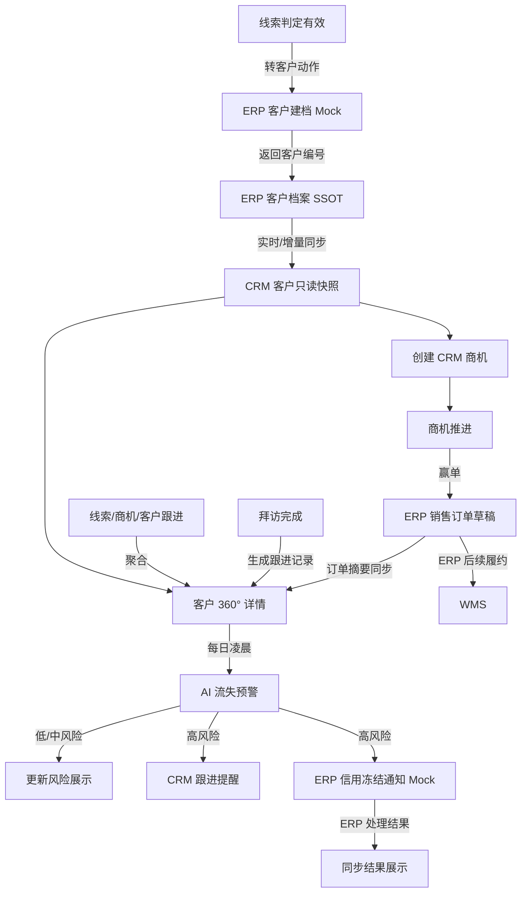
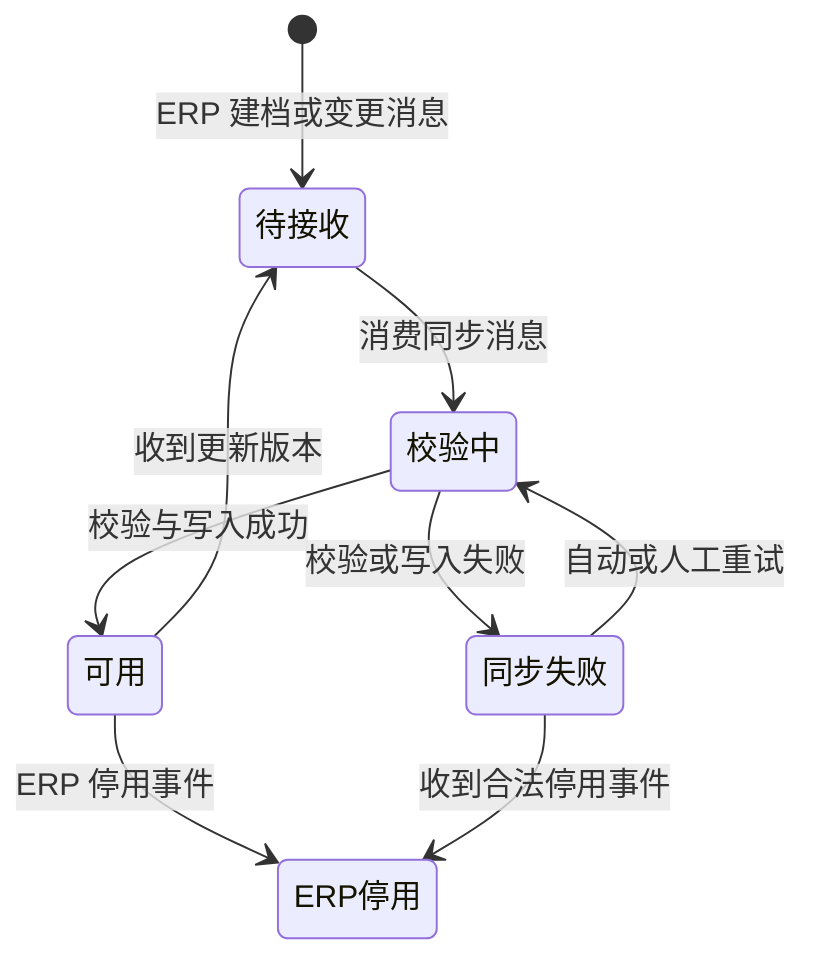

# 客户主PRD

> **版本**：V2.0 | 2026-07-18
> **读者**：研发工程师、测试工程师、产品复核、项目经理
> **字段定义 SSOT**：《客户字段清单》
> **特别声明**：客户正式档案的唯一权威源是 ERP；CRM 只持有只读快照与 CRM 聚合数据。

---

### 1. 业务背景

客户是 Forge CRM 中承接线索转化、商机推进、订单观察和持续跟进的聚合对象。它不是独立客户主数据系统，而是围绕 ERP 客户档案构建的销售关系视图。

在没有统一客户视图时，强盛科技面临以下问题：

1. 客户基础档案散落在 ERP 与个人表格中，销售查看路径割裂。
2. CRM 和 ERP 分别维护公司名称与联系人，容易形成双主数据源。
3. 销售无法从客户维度快速查看全部商机和交易历史。
4. 跟进记录分散在线索、商机和拜访中，无法还原完整关系过程。
5. ERP 订单结果没有回到客户上下文，复购判断缺少交易证据。
6. 长期未跟进客户只能靠销售记忆发现，流失干预严重滞后。
7. 主管无法区分“没有商机”和“有商机但停滞”的客户。
8. 高风险客户没有统一提醒，信用冻结等协同动作依赖人工通知。
9. ERP 档案变更后 CRM 信息可能陈旧，销售误用过期联系方式。
10. 同步失败没有显式标识，用户无法判断数据是否可信。
11. 客户详情缺乏 360° 聚合，销售需要跨多个页面反复查询。
12. 客户历史数据若被 CRM 随意编辑，会破坏 ERP 主数据治理。

本模块通过“ERP 快照 + CRM 商机/跟进聚合 + ERP 订单聚合 + AI 流失预警”提供客户 360° 视图，同时坚持客户主数据只在 ERP 建档、编辑和停用。

**定位句**：客户是 CRM 的成交运营聚合对象，不是客户主数据 SSOT；CRM 负责呈现与销售运营，ERP 负责客户正式档案与订单事实。

---

### 2. 功能范围

**In Scope**：

- 接收 ERP 客户档案快照。
- 接收 ERP 客户档案增量更新。
- 展示客户列表与只读基础信息。
- 展示 ERP 同步结果标识。
- 按数据权限查询客户。
- 从客户详情创建关联商机。
- 聚合客户名下全部 CRM 商机。
- 聚合 ERP 订单摘要。
- 聚合线索、商机、客户与拜访产生的跟进记录。
- 展示最近跟进时间。
- 每日计算 AI 流失风险。
- 高风险时生成 CRM 跟进提醒。
- 高风险时发送 ERP 信用冻结通知 Mock。
- 提供 AI 失败降级与人工重试。
- 记录客户快照同步审计信息。
- 保留历史关联数据的只读访问。

**Out of Scope**：

- CRM 新增客户正式档案；原因：客户 SSOT 在 ERP。
- CRM 编辑客户基础档案；原因：避免双写和主数据冲突。
- CRM 删除客户；原因：主数据不提供删除，停用由 ERP 执行。
- CRM 合并客户；原因：客户合并属于 ERP 主数据治理。
- CRM 调整客户信用额度；原因：信用策略由 ERP 管理。
- CRM 修改 ERP 订单；原因：订单 SSOT 在 ERP。
- CRM 直接冻结客户信用；原因：仅发送 Mock 通知，由 ERP 决策执行。
- CRM 直接操作 WMS；原因：WMS 是 ERP 的间接下游。
- 客户分层与会员体系；原因：依赖更长周期订单数据，规划在二期。
- 营销短信或邮件召回；原因：营销自动化不在一期范围。
- AI 模型在线自学习；原因：一期使用规则化 Mock 验证闭环。
- 移动端客户视图；原因：一期仅 PC Web。

---

### 3. 对象定位

#### 3.1 在系统中的位置

| 项目 | 内容 |
|------|------|
| 对象类型 | 客户（成交运营层 / 聚合视图） |
| 核心职责 | 在不破坏 ERP SSOT 的前提下聚合销售过程和交易结果 |
| 正式档案来源 | ERP 客户档案 API 实时同步 Mock |
| CRM 数据来源 | 线索转化、商机、跟进记录、拜访记录、AI 结果 |
| 下游对象 | 商机、拜访计划、跟进任务、流失召回任务 |
| 订单来源 | ERP 销售订单摘要同步 |
| 主数据动作 | CRM 不新增、不编辑、不删除；仅查看同步快照 |
| 停用动作 | 由 ERP 执行，CRM 同步后限制创建新业务 |
| 关联关系 | 一个客户可关联多个商机、订单、跟进记录和拜访 |
| 数据责任 | ERP 对基础档案负责；CRM 对销售聚合与风险结果负责 |

#### 3.2 系统链路图

链路边界：

- 客户基础档案只从 ERP 流入 CRM。
- CRM 不允许把快照编辑结果反向覆盖 ERP。
- 客户详情展示的订单是 ERP 摘要，不是 CRM 订单副本。
- 流失预警的信用冻结仅为通知 Mock，不等同 ERP 已冻结。
- WMS 与 CRM 无直接数据或操作链路。

#### 3.3 实体关系说明

| 关系 | 基数 | 说明 | 一致性约束 |
|------|:---:|------|------------|
| ERP客户档案 : CRM客户快照 | 1:1 | 以 ERP 客户编号绑定 | ERP 为权威源，CRM 只读 |
| 转化线索 : 客户 | 1:1 | 一条有效线索最多转为一个客户 | ERP 建档成功后才建立绑定 |
| 客户 : 商机 | 1:N | 一个客户可有多个销售机会 | 商机 SSOT 在 CRM |
| 客户 : ERP订单 | 1:N | 一个客户可有多个订单摘要 | 订单 SSOT 在 ERP |
| 客户 : 跟进记录 | 1:N | 聚合直接和关联对象跟进 | 原始跟进记录仍保留来源对象 |
| 客户 : 拜访计划 | 1:N | 可直接为客户创建多次拜访 | 拜访完成后生成跟进记录 |
| 客户 : 流失预测快照 | 1:N | 每日产生一个最新计算版本 | 页面展示最新成功版本 |
| 客户 : 系统用户 | N:M | 多个销售可因不同商机与客户关联 | 数据可见性由权限规则计算 |

实体一致性补充：

1. ERP 客户编号是跨系统绑定主键，CRM 不重新生成客户编号。
2. ERP 同步消息乱序时按来源版本或更新时间拒绝旧数据覆盖新数据。
3. 商机与订单聚合失败不影响客户基础快照读取。
4. 跟进聚合保留来源类型和来源标识，禁止复制成无来源文本。
5. 客户停用后保留历史商机、订单和跟进的只读查询。
6. 客户快照同步失败时保留最近一次成功版本。

---

### 4. 业务场景

| 场景ID | 场景 | 类型 | 触发角色 | 说明 |
|--------|------|------|----------|------|
| S01 | ERP 建档后生成 CRM 客户快照 | **主流程** | 系统 | ERP 返回客户编号并同步只读快照 |
| S02 | 客户 360° 视图支撑销售跟进 | **主流程** | 销售 | 聚合商机、订单和跟进记录 |
| S03 | 高流失风险触发召回与信用通知 | **支线** | 系统 | 每日计算高风险并执行两个后置动作 |
| S04 | ERP 增量同步失败 | **异常** | 系统 | 保留最近成功快照并展示同步异常 |
| S05 | 无权或停用客户发起新业务 | **异常** | 销售 | 阻断创建商机或拜访并提供明确原因 |

#### S01 ERP 建档后生成 CRM 客户快照

- 前置：线索已满足转客户条件。
- 动作：线索模块向 ERP 发起客户建档 Mock。
- 结果：ERP 返回正式客户编号。
- 结果：CRM 创建只读客户快照。
- 后置：线索进入已转客户终态。
- 失败：ERP 未返回成功时不创建孤立客户快照。

#### S02 客户 360° 视图支撑销售跟进

- 前置：客户快照存在且操作者有查看权限。
- 页面：加载基础快照、商机、订单和跟进聚合。
- 结果：销售可从一个页面理解客户关系和交易状态。
- 动作：从客户详情快捷创建商机或添加跟进。
- 约束：所有基础字段保持只读。
- 异常：某个聚合区块失败时只降级该区块。

#### S03 高流失风险触发召回与信用通知

- 触发：每日凌晨定时任务。
- 输入：最近跟进间隔、订单停滞、进行中商机与阶段停留。
- 结果：更新最新成功风险等级。
- 高风险后置一：向责任销售生成跟进提醒。
- 高风险后置二：向 ERP 发送信用冻结通知 Mock。
- 失败：保留上次成功风险并记录失败，不静默改成低风险。

#### S04 ERP 增量同步失败

- 触发：ERP 客户档案变更消息到达。
- 异常：消息格式错误、版本过旧或接口超时。
- 处理：拒绝覆盖最近成功快照。
- 页面：展示“同步异常”标识和最后成功同步时间。
- 重试：后台自动重试，管理员可人工触发。
- 影响：CRM 关联数据仍可查看，不允许编辑快照绕过问题。

#### S05 无权或停用客户发起新业务

- 无权访问：返回 403，不泄露客户基础信息。
- 客户停用：保留历史查询，但隐藏新建商机和新建拜访入口。
- 快照同步异常：新业务动作执行前再次查询客户可用性。
- 阻断提示：`当前客户不可用于新业务，请联系管理员核对 ERP 状态`。
- 结果：不创建孤立商机或拜访。

---

### 5. 状态机

#### 5.1 快照同步处理状态

> 客户在 CRM 中没有独立可编辑的业务状态。本节描述后台“快照同步处理状态”，它是技术流程状态，不新增《客户字段清单》中的客户业务字段。

| 处理状态 | 含义 | 是否终态 |
|----------|------|:--------:|
| 待接收 | 已收到同步通知，尚未开始校验 | 否 |
| 校验中 | 正在校验 ERP 标识、版本和快照内容 | 否 |
| 可用 | 最近一次同步成功，可供 CRM 只读引用 | 否 |
| 同步失败 | 最近一次处理失败，保留上次成功快照 | 否 |
| ERP停用 | ERP 已停用该客户，CRM 历史数据只读保留 | 是（对新业务） |

#### 5.2 状态机图

#### 5.3 状态流转表（核心交付物）

| 当前状态 | 动作 | 前置条件 | 结果状态 | 二次确认 | 后置影响 | 失败处理 |
|----------|------|----------|----------|:--------:|----------|----------|
| 无快照 | 接收建档结果 | ERP 返回合法客户编号与快照 | 待接收 | 否 | 创建同步任务，不创建可编辑客户 | 拒绝消息；线索转化保持未完成；记录错误 |
| 待接收 | 消费同步消息 | 消息未重复且版本有效 | 校验中 | 否 | 锁定当前消息处理 | 消息进入重试队列，保留原状态 |
| 校验中 | 写入快照 | 标识一致；字段校验通过 | 可用 | 否 | 更新只读快照；刷新同步标识 | 事务回滚；进入同步失败；保留上次成功版本 |
| 同步失败 | 自动重试 | 未超过重试上限；消息仍有效 | 校验中 | 否 | 增加重试次数 | 保持失败；记录下次重试时间 |
| 同步失败 | 人工重试 | 管理员权限；失败任务存在 | 校验中 | 是 | 记录操作者与重试原因 | 保持失败；Toast `同步重试失败` |
| 可用 | 接收增量变更 | 来源版本高于当前版本 | 待接收 | 否 | 准备覆盖快照 | 旧版本消息丢弃并记录，不改变快照 |
| 可用 | 接收 ERP 停用 | 停用事件合法且版本最新 | ERP停用 | 否 | 隐藏新业务入口；保留历史关联 | 校验失败保持可用并告警，不静默停用 |
| ERP停用 | 查看历史 | 操作者有数据权限 | ERP停用 | 否 | 只读展示商机、订单与跟进 | 无权限返回 403 |

#### 5.4 动作能力矩阵

| 动作 | 可用 | 同步失败 | ERP停用 |
|------|:----:|:--------:|:-------:|
| 查看客户快照 | ✅ | ✅，标注旧版本 | ✅，标注停用 |
| 新建客户 | ❌ | ❌ | ❌ |
| 编辑客户快照 | ❌ | ❌ | ❌ |
| 删除客户 | ❌ | ❌ | ❌ |
| 新建商机 | ✅ | 重新校验后决定 | ❌ |
| 新建拜访 | ✅ | 重新校验后决定 | ❌ |
| 添加跟进 | ✅ | ✅ | 历史补录按权限 |
| 查看商机 | ✅ | ✅ | ✅ |
| 查看订单 | ✅ | ✅ | ✅ |
| 重试同步 | 管理员 | 管理员 | ❌ |

状态约束：

- 页面不提供客户状态下拉框。
- CRM 不提供客户停用按钮。
- ERP 停用事实只能通过同步事件进入 CRM。
- 主数据不允许删除，历史关联永久保留。

---

### 6. 核心业务规则

#### 6.1 SSOT 与同步规则

| 规则ID | 规则 |
|--------|------|
| R01 | 客户正式档案、客户编号、基础信息和信用数据以 ERP 为唯一权威源；CRM 只读展示，不提供新增、编辑或删除入口。 |
| R02 | ERP 建档或变更通过 API Mock 实时同步；消息必须校验客户编号与来源版本，旧版本不得覆盖新版本，失败时保留最近一次成功快照。 |

#### 6.2 关联与聚合规则

| 规则ID | 规则 |
|--------|------|
| R03 | CRM 可在客户下创建商机、拜访和跟进，但这些对象只引用客户标识，不复制出可独立维护的客户主数据。 |
| R04 | 客户 360° 视图按客户标识聚合 CRM 商机与跟进、ERP 订单摘要；任一区块失败必须局部降级，不得使基础快照不可查看。 |

#### 6.3 风险与停用规则

| 规则ID | 规则 |
|--------|------|
| R05 | AI 流失预警每日计算；高风险必须生成 CRM 跟进提醒并发送 ERP 信用冻结通知 Mock，通知结果与风险结果分别记录。 |
| R06 | ERP 停用客户后，CRM 保留历史数据并禁止创建新业务；CRM 不提供删除或自行恢复能力，恢复必须来自 ERP 新版本同步。 |

执行原则：

1. 先校验权限。
2. 再校验客户快照可用性。
3. 再校验来源版本与并发。
4. 聚合查询互相隔离失败。
5. 外部动作独立记录结果。
6. 页面只展示最近成功快照和同步状态。

---

### 7. AI 串联规则（CRM特有）

#### 7.1 流失预警触发条件

| 风险结果 | 触发条件 | 说明 |
|----------|----------|------|
| 高风险 | 最近跟进超过 30 天，且存在进行中商机 | 两个条件同时成立 |
| 中风险 | 最近跟进位于 15 至 30 天，或所有商机长期停留在初期 | 任一条件成立 |
| 低风险 | 最近跟进小于 15 天，且存在活跃商机 | 两个条件同时成立 |

> 风险条件来自 `context/06-AI评分模型规则.md`；页面字段展示口径仍引用《客户字段清单》。

#### 7.2 AI 节点表

| AI 节点 | 触发时机 | 输入维度 | 输出 | 执行动作 | 失败处理 |
|---------|----------|----------|------|----------|----------|
| 流失预警 | 每日凌晨定时任务 | 最近跟进间隔、订单停滞天数、进行中商机、阶段停留 | 风险等级、解释摘要、计算时间 | 更新最新风险；高风险生成跟进提醒并发送 ERP 信用冻结通知 Mock | 保留上次成功风险并标注更新时间；没有历史结果时显示 `暂不可用`；任务进入重试队列 |
| 手动重算 | 主管或管理员点击重试 | 与定时任务相同 | 最新风险结果 | 刷新详情 Banner 与列表 Tag | 不清空旧结果；Toast `风险计算失败，请稍后重试` |

#### 7.3 后置动作与失败隔离

- 风险计算成功不代表 CRM 提醒发送成功。
- CRM 提醒失败不回滚风险结果。
- ERP 信用冻结通知失败不回滚风险结果。
- ERP 通知是协同请求，不代表信用已冻结。
- 两个后置动作分别记录请求标识和结果。
- ERP 通知支持幂等重试。
- 同一客户同一计算版本只生成一条召回提醒。
- 风险从高降为中或低时关闭未处理的自动提醒。
- 风险服务失败时不得默认降为低风险。
- 客户停用后仍计算历史风险仅供审计，不再生成新提醒。

#### 7.4 AI 可解释展示

- 详情页展示命中的主要条件。
- 展示最近成功计算时间。
- 展示上次跟进时间和商机活跃摘要。
- 不展示模型内部技术参数。
- 不允许用户直接修改 AI 风险字段。
- 通过新增跟进或商机变化影响下一次计算。

---

### 8. 权限设计

#### 8.1 数据可见范围

| 角色 | 可见数据范围 | 说明 |
|------|--------------|------|
| 销售 | 自己负责商机或被授权跟进的客户 | 可查看必要快照、商机、订单摘要和跟进 |
| 销售主管 | 本团队覆盖客户 | 可查看团队聚合与风险 |
| 系统管理员 | 全部客户快照 | 可处理同步异常 |
| 只读审计角色 | 授权范围内历史客户 | 不可触发新业务动作 |

可见性约束：

- 订单摘要遵循客户数据范围，不因 ERP 来源自动扩大权限。
- 跟进聚合过滤无权来源对象。
- 深链接访问必须重新校验。
- 导出与列表使用同一权限条件。
- 403 页面不展示客户名称等敏感信息。

#### 8.2 操作权限矩阵

| 操作 | 销售 | 销售主管 | 系统管理员 | 只读审计 |
|------|:----:|:--------:|:------------:|:--------:|
| 查看客户列表 | 授权范围 | 团队范围 | 全部 | 授权范围 |
| 查看客户详情 | 授权范围 | 团队范围 | 全部 | 授权范围 |
| 新增客户 | ❌ | ❌ | ❌ | ❌ |
| 编辑客户快照 | ❌ | ❌ | ❌ | ❌ |
| 删除客户 | ❌ | ❌ | ❌ | ❌ |
| 新建商机 | 授权客户 | 团队客户 | ✅ | ❌ |
| 新建拜访 | 授权客户 | 团队客户 | ✅ | ❌ |
| 添加跟进 | 授权客户 | 团队客户 | ✅ | ❌ |
| 查看 ERP 订单摘要 | 授权客户 | 团队客户 | ✅ | ✅ |
| 手动重算风险 | ❌ | ✅ | ✅ | ❌ |
| 重试快照同步 | ❌ | ❌ | ✅ | ❌ |
| 导出客户 | 授权范围 | 团队范围 | 全部 | 授权范围 |

权限失败处理：

- 无权操作不展示入口。
- 接口仍执行权限校验。
- 失败返回 403 且不改变数据。
- 页面 Toast `无权执行该操作`。

---

### 9. 边界与异常处理

#### 9.1 并发控制

| 场景 | 处理方式 |
|------|----------|
| 两条 ERP 更新消息并发 | 按来源版本排序，只允许最新合法版本生效 |
| 风险任务与新增跟进并发 | 风险快照记录计算基准时间，下次任务重算，不覆盖跟进 |
| 停用事件与新建商机并发 | 商机创建提交前再次校验客户可用性，停用优先阻断 |
| 人工重试与自动重试并发 | 使用任务锁，同一消息只允许一个执行器处理 |

#### 9.2 去重与幂等

| 场景 | 处理方式 |
|------|----------|
| 重复 ERP 建档消息 | 以客户编号和来源事件标识去重 |
| 重复增量消息 | 已处理版本直接返回成功，不重复覆盖 |
| 重复风险任务 | 以客户标识和计算日期去重 |
| 重复召回提醒 | 以客户标识和预测版本去重 |
| 重复信用冻结通知 | 以客户标识和预测版本作为幂等键 |

#### 9.3 数量、时间与业务边界

| 场景 | 处理方式 |
|------|----------|
| CRM 尝试新增客户 | 不展示入口；接口阻断并说明 ERP SSOT |
| CRM 尝试编辑快照 | 阻断；提示前往 ERP 维护并等待同步 |
| CRM 尝试删除客户 | 不提供删除；ERP 停用后只读保留 |
| ERP 消息缺少客户编号 | 拒绝写入并进入异常队列 |
| ERP 旧版本晚到 | 记录并丢弃，不覆盖新快照 |
| 同步失败 | 保留最近成功快照并显示异常标识 |
| 没有成功快照 | 不展示伪造客户数据，显示待同步状态 |
| 某聚合区块超时 | 仅该区块错误，其他区块正常显示 |
| 高风险通知失败 | 风险仍为高，展示通知失败并允许重试 |
| 风险计算失败 | 保留旧风险，不默认低风险 |
| 客户已停用 | 历史可查，新建商机和拜访阻断 |
| 订单摘要无数据 | 展示空态，不推断客户无交易 |

异常审计要求：

- 记录客户编号、来源版本、事件标识和处理结果。
- 同步失败记录技术原因与用户可见摘要。
- 风险任务记录计算基准时间。
- ERP 通知记录请求与结果，不记录认证凭证。
- 支持按客户编号查询跨系统链路日志。

---

### 10. 验收重点

| # | 验收项 | 输入条件 | 预期结果 |
|---|--------|----------|----------|
| V01 | ERP SSOT 与只读快照 | ERP 返回一条合法客户建档结果；用户打开客户列表和详情 | CRM 生成客户快照；编号来自 ERP；无新增、编辑、删除客户入口；基础字段只读 |
| V02 | 增量同步与旧版本保护 | 先收到较新客户变更，再收到较旧消息，随后模拟一次同步失败 | 新版本保留；旧消息丢弃；失败不覆盖成功快照；页面显示同步异常和最后成功时间 |
| V03 | 客户 360° 聚合 | 客户存在多个商机、ERP 订单、手工跟进和拜访生成记录 | 详情分别展示商机表、订单表和聚合时间线；来源标识正确；单区块失败不影响其他区块 |
| V04 | AI 高风险及失败降级 | 最近跟进超过阈值且有进行中商机；随后模拟 AI 服务失败 | 首次计算为高风险；生成一条 CRM 提醒和一条 ERP 通知；失败时保留上次结果且可重试 |
| V05 | 停用客户业务阻断 | ERP 同步客户停用事件；销售尝试新建商机和拜访 | 历史详情仍可查看；新业务入口消失；接口请求被阻断；不删除历史关联数据 |

补充验收：

- [ ] 客户字段定义只引用《客户字段清单》。
- [ ] 客户页面没有可编辑状态字段。
- [ ] CRM 不直接修改 ERP 订单或信用额度。
- [ ] 高风险不等同 ERP 已冻结信用。
- [ ] 无权限深链接不泄露客户信息。
- [ ] 所有同步与风险重试具备幂等保护。
- [ ] ERP 停用事实优先于新业务创建。
- [ ] WMS 不出现在 CRM 可操作入口中。

---

### 11. 修订记录

| 日期 | 版本 | 变更摘要 |
|------|------|----------|
| 2026-07-17 | V1.0 | 初版，定义客户快照与 360° 视图 |
| 2026-07-18 | V2.0 | 对齐 v2.0 模板，补齐 ERP SSOT、链路、实体、同步状态机、AI 触发与失败、权限、异常和验收 |
