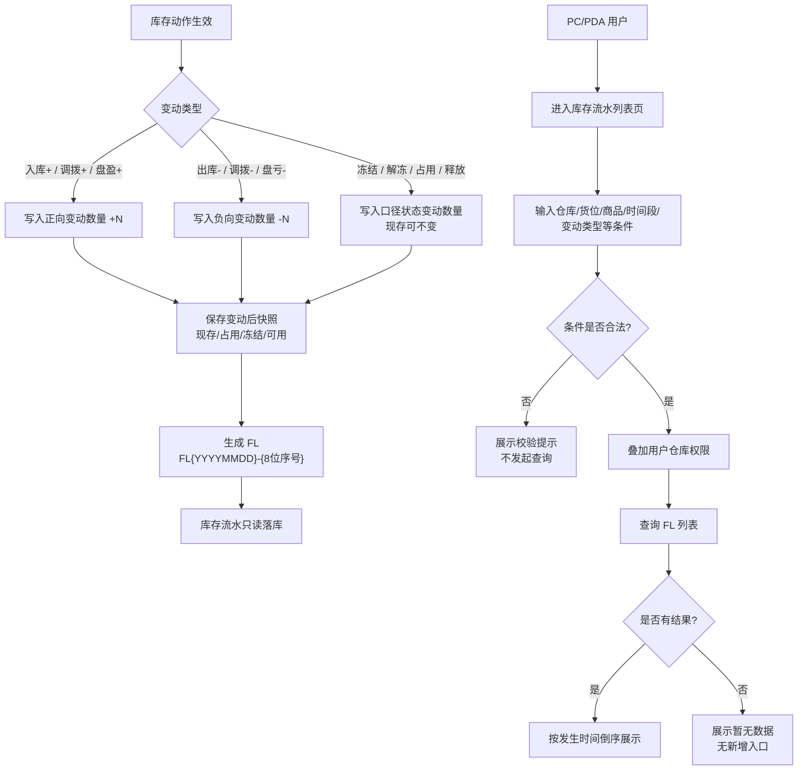

# 库存流水_业务流程推演

> 状态：已补全
> 角色：业务流程推演　|　类型：查询页
> 覆盖场景：系统生成流水、PC/PDA 查询、日期校验、权限过滤、空状态
> 不展开范围：新增/编辑/详情页、库存调整、来源单据执行逻辑
> 前置文档：《库存流水主PRD》《库存流水字段清单》《库存流水_业务规则规格》
> 版本：V1.0 | 2026-07-07

---

## 1. 流程目标

库存流水查询流程要验证两件事：

- 库存动作发生后，系统能自动生成只读 FL，并保存变动后库存快照
- 用户在 PC/PDA 上能按条件查询 FL，但不能通过页面新增、修改或调整库存

---

## 2. 业务流程图



---

## 3. 系统时序图

```mermaid
sequenceDiagram
    participant Actor as 库存动作触发方
    participant InvSvc as 库存服务
    participant FlowSvc as 库存流水服务
    participant DB as 库存/流水库
    participant User as PC/PDA用户
    participant Page as 库存流水列表页

    Actor->>InvSvc: 提交库存动作(入库/出库/调拨/盘点/冻结等)
    InvSvc->>InvSvc: 计算现存/占用/冻结/可用变化
    InvSvc->>FlowSvc: 请求生成FL(source_order_no, location, product, change_type, change_qty)
    FlowSvc->>FlowSvc: 生成flow_no并校验幂等键
    FlowSvc->>DB: 同事务写库存结果与FL快照
    DB-->>FlowSvc: 写入成功
    FlowSvc-->>InvSvc: 返回FL写入结果

    User->>Page: 打开库存流水查询页
    Page->>Page: 校验时间跨度<=365天
    Page->>DB: 查询FL(条件 + 仓库权限)
    DB-->>Page: 返回分页结果
    Page-->>User: 展示只读列表
```

---

## 4. 场景推演

### 场景 A：PC 按仓库 + 商品 + 时间段查询

| 步骤 | 执行方 | 操作 | 系统响应 |
| :--- | :--- | :--- | :--- |
| A1 | 仓库主管 | 打开库存流水列表页 | 默认展示最近 90 天、当前权限仓库范围内数据 |
| A2 | 仓库主管 | 选择 `WH001 北京主仓`，输入商品 `SKU001`，时间段 `2026-07-06 00:00:00` 至 `2026-07-06 23:59:59` |
| A3 | 系统 | 校验时间跨度 | 通过 |
| A4 | 系统 | 叠加仓库权限并查询 | 返回 `WH001 + SKU001 + 当日` 的流水 |
| A5 | 页面 | 渲染列表 | 按 `occurred_at DESC` 展示，变动数量带正负号 |

### 场景 B：PDA 扫货位查询

| 步骤 | 执行方 | 操作 | 系统响应 |
| :--- | :--- | :--- | :--- |
| B1 | 现场仓管 | PDA 进入库存流水查询页 |
| B2 | 现场仓管 | 扫描货位条码，解析为 `LOC-A01` |
| B3 | 系统 | 按 `location_code=LOC-A01` 和用户仓库权限查询 |
| B4 | 页面 | 展示该货位近期 FL | 不提供新增、编辑、调整入口 |

### 场景 C：日期跨度超限

| 步骤 | 执行方 | 操作 | 系统响应 |
| :--- | :--- | :--- | :--- |
| C1 | 用户 | 选择 `2025-01-01 00:00:00` 至 `2026-07-06 23:59:59` |
| C2 | 页面 | 计算跨度大于 365 天 |
| C3 | 页面 | 阻断查询 | 提示「查询时间跨度不可超过 365 天」 |
| C4 | 系统 | 不访问流水库 | 避免大范围扫表 |

### 场景 D：占用/释放类流水复核

| 步骤 | 执行方 | 操作 | 系统响应 |
| :--- | :--- | :--- | :--- |
| D1 | 测试 | 查询 `change_type=ALLOCATE` |
| D2 | 系统 | 返回占用流水 | `change_qty` 展示 `+N`，`qty_on_hand_after` 可不变 |
| D3 | 测试 | 查看系统字段快照 | 校验 `qty_available_after = qty_on_hand_after - qty_allocated_after - qty_frozen_after` |
| D4 | 测试 | 查询 `change_type=RELEASE` |
| D5 | 系统 | 返回释放流水 | `change_qty` 展示 `-N`，占用减少，可用增加 |

### 场景 E：查询无数据

| 步骤 | 执行方 | 操作 | 系统响应 |
| :--- | :--- | :--- | :--- |
| E1 | 用户 | 输入不存在的货位 `LOC-UNKNOWN` |
| E2 | 系统 | 查询结果为空 |
| E3 | 页面 | 展示「暂无库存流水记录」 | 不展示新增、编辑、调整库存入口 |

---

## 5. 数据流说明

| 数据节点 | 输入 | 输出 | 说明 |
| :--- | :--- | :--- | :--- |
| 库存动作 | 来源单据、仓库、货位、商品、数量 | 库存口径变化 | 由入库、出库、调拨、盘点等执行流程触发 |
| 库存流水服务 | 库存变化结果、来源信息 | FL 记录 | 生成 `flow_no`，保存变动后快照 |
| 库存流水查询页 | 查询条件、用户权限 | 分页列表 | 只读展示，不反写库存 |
| 导出能力 | 当前筛选结果 | 文件 | 只导出用户有权限看到的数据 |

---

## 6. 走查清单

| 检查项 | 预期 |
| :--- | :--- |
| 是否包含业务流程图 | 已包含 Mermaid `flowchart` |
| 是否包含系统时序图 | 已包含 Mermaid `sequenceDiagram` |
| 是否有状态机 | 无，查询页不适用 |
| 是否有新增/编辑/详情/调整 | 无 |
| 是否覆盖日期超限 | 已覆盖 |
| 是否覆盖 PDA 查询 | 已覆盖 |
| 是否覆盖三口径公式 | 已覆盖现存、占用、冻结、可用快照校验 |
