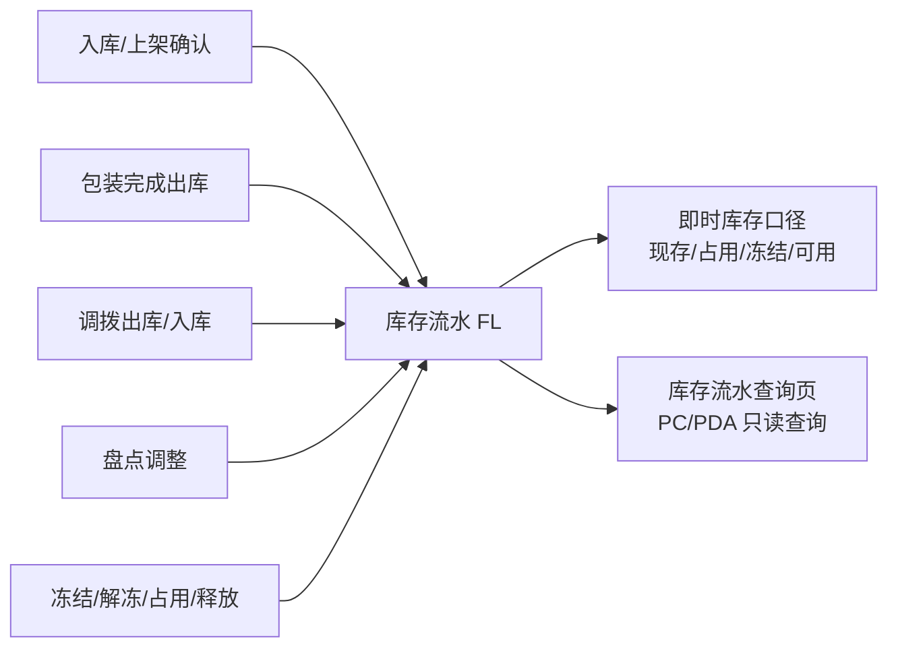

# 库存流水主PRD

> 状态：已补全
> 角色：主PRD　|　类型：查询页
> 读者：研发工程师、测试工程师、产品复核
> 权威层级：context/ > templates/ > 本文件（改业务规则须回溯 context/）
> 参照套件：ERP:库存管理/库存流水查询套件 + 同项目库存查询页写法
> 版本：V1.0 | 2026-07-07

---

## 1. 业务背景

库存流水（FL）是 Forge WMS 对所有库存变动的只读审计底账。系统在入库、出库、调拨、盘点、冻结、解冻、占用、释放等库存动作发生时自动记录流水，用于回答：

- 哪个仓库、哪个货位、哪个商品在什么时间发生了库存变化
- 本次变化属于哪类库存动作，数量变化是多少
- 变动完成后该货位/商品的现存是多少
- 该变化由哪张来源单据或哪个系统动作触发

本页面面向 PC 和 PDA 查询场景。PC 侧用于仓库主管、运营、财务对账；PDA 侧用于现场人员快速追溯某货位或某商品近期变动。库存流水本身不创建、不修改、不删除，仅作为系统自动生成的查询台账。

库存口径遵循 `context/06-库存管理规则`：

```text
可用 = 现存 - 占用 - 冻结
现存 = 期初 + Σ入库 - Σ出库 + Σ盘盈 - Σ盘亏
```

> FL 编码口径与 `context/09-单据命名规则.md` 保持一致：`FL{YYYYMMDD}-{8位序号}`，例如 `FL20260705-00000001`。

---

## 2. 功能范围

### 2.1 In Scope

| 范围 | 说明 |
| :--- | :--- |
| 多维度查询 | 支持按仓库、库区、货位、商品、时间段、变动类型、来源单号、FL 单号组合查询 |
| 流水列表展示 | 展示发生时间、仓库、货位、商品、变动类型、变动数量、变动后现存、来源单号、操作人 |
| 只读导出 | 可导出当前筛选结果，用于对账和问题排查；导出不改变任何业务数据 |
| PDA 快速查询 | 支持现场按货位/商品/来源单号快速查询近期流水 |
| 权限隔离 | 按用户可访问仓库范围过滤数据，避免跨仓查看未授权流水 |

### 2.2 Out of Scope

| 不做范围 | 说明 |
| :--- | :--- |
| 手工新增流水 | FL 只能由系统库存动作自动生成 |
| 编辑/删除/作废流水 | 流水是审计底账，不允许人工篡改 |
| 库存调整入口 | 本页面不提供调整库存、盘点调整、调拨、报损等业务动作入口 |
| 新增/编辑/详情页 | 本模块仅交付列表查询页，不提供新增页、编辑页、详情页 |
| 成本金额流水 | 一期仅记录数量口径，不涉及库存成本、金额、批次成本核算 |
| 第三方物流对接 | 不涉及快递、运输、TMS 之外的第三方物流系统对接 |

---

## 3. 单据定位

| 项目 | 内容 |
| :--- | :--- |
| 模块名称 | 库存流水 |
| 标识前缀 | `FL` |
| 单据层级 | 不属于业务单据流转层；属于系统自动生成的只读库存审计日志 |
| 核心职责 | 记录每一次库存口径变化，支撑库存追溯、异常排查、对账复核 |
| 数据来源 | 入库、出库、调拨、盘点、冻结、解冻、占用、释放等库存动作自动写入 |
| 下游影响 | 本查询页不触发下游单据；库存结果由各执行动作在写 FL 时同步完成 |
| 页面形态 | 查询页，仅列表页 |

### 3.1 系统链路



---

## 4. 业务场景

| 场景ID | 使用者 | 场景 | 说明 |
| :--- | :--- | :--- | :--- |
| S01 | 仓管员 | 按货位查询近期变化 | PDA 扫描 `LOC-A01`，查看该货位近期入库、出库、冻结等流水 |
| S02 | 仓库主管 | 按商品追溯现存变化 | PC 选择仓库与商品，核对变动后现存是否与库存查询一致 |
| S03 | 测试/产品复核 | 按变动类型验证规则 | 查询 `出库-`、`占用`、`释放` 等类型，验证三口径变化是否符合公式 |
| S04 | 财务/运营 | 按时间段导出流水 | 导出 2026 年某日某仓库库存流水，用于对账和留档 |
| S05 | 现场人员 | 无结果查询 | 输入错误货位或商品后列表为空，页面展示无数据提示，不提供新增入口 |

---

## 5. 状态机

**不适用(只读查询流水,无单据状态流转)**。

原因：

- 库存流水由系统库存动作自动写入，不由用户创建
- FL 作为审计日志不经历草稿、待处理、已完成、作废等生命周期
- 页面仅支持查询、重置、导出等只读能力
- 不存在状态变更按钮，也不允许通过页面修改任何库存结果

---

## 6. 字段清单摘要

字段定义以《库存流水字段清单》为 SSOT。主 PRD 只列核心分组：

| 分组 | 核心字段 |
| :--- | :--- |
| 查询条件 | `flNo`、`warehouseCode`、`zoneCode`、`locationCode`、`productKeyword`、`occurredRange`、`changeType`、`sourceOrderNo` |
| 列表展示 | `flNo`、`occurredAt`、`warehouseName`、`locationCode`、`productCode`、`productName`、`changeType`、`changeQty`、`qtyOnHandAfter`、`sourceOrderNo`、`operatorName` |
| 系统字段 | 来源单据行、变动后三口径快照、创建时间、创建人、权限仓库范围 |

---

## 7. 核心业务规则摘要

| 规则ID | 规则 |
| :--- | :--- |
| FL-R01 | 库存流水只由系统库存动作自动生成，前端不提供新增、编辑、删除、作废、调整入口 |
| FL-R02 | FL 单号格式为 `FL{YYYYMMDD}-{8位序号}`，例如 `FL20260705-00000001` |
| FL-R03 | 每次库存变动至少生成一条流水；按货位、商品、来源单据行粒度记录 |
| FL-R04 | 每条流水必须记录：时间、仓库、货位、商品、变动类型、变动数量、变动后现存 |
| FL-R05 | 变动类型枚举固定为：`INBOUND=入库+`、`OUTBOUND=出库-`、`TRANSFER_IN=调拨+`、`TRANSFER_OUT=调拨-`、`STOCK_GAIN=盘盈+`、`STOCK_LOSS=盘亏-`、`FREEZE=冻结`、`UNFREEZE=解冻`、`ALLOCATE=占用`、`RELEASE=释放` |
| FL-R06 | 现存型变动影响 `qtyOnHandAfter`；冻结、解冻、占用、释放不改变现存，但必须记录变动后的占用/冻结/可用快照用于按公式复核 |
| FL-R07 | 默认按 `occurredAt` 降序展示；PC 表格分页默认 20 条 |
| FL-R08 | 查询时间跨度不得超过 365 天，日期时间格式为 `YYYY-MM-DD HH:mm:ss` |
| FL-R09 | 空值展示为 `-`；数量字段为整数，变动数量必须带正负号 |

---

## 8. 动作能力矩阵

| 动作 | 是否支持 | 说明 |
| :--- | :---: | :--- |
| 查询 | 是 | 按条件组合过滤流水 |
| 重置 | 是 | 清空筛选条件并恢复默认时间范围 |
| 导出 | 是 | 导出当前筛选结果，属于只读动作 |
| 新增 | 否 | 禁止手工创建 FL |
| 编辑 | 否 | 禁止修改审计流水 |
| 删除 | 否 | 禁止删除审计流水 |
| 库存调整 | 否 | 调整必须走盘点/调拨/报损等业务单据，不在本页面提供 |
| 状态动作 | 否 | 无状态机，无状态变更按钮 |

---

## 9. 验收重点

| 验收项 | 输入条件 | 预期结果 |
| :--- | :--- | :--- |
| 只读查询 | 打开库存流水页面 | 页面无新增、编辑、删除、作废、调整库存入口 |
| FL 编码 | 查看任意流水号 | 符合 `FL{YYYYMMDD}-{8位序号}` |
| 三口径复核 | 查询占用/释放/冻结/解冻流水 | 现存可不变，但占用/冻结/可用快照符合 `可用=现存-占用-冻结` |
| 变动方向 | 查询入库、出库、盘盈、盘亏、调拨流水 | 变动数量按类型正确展示正负号 |
| 时间限制 | 查询跨度大于 365 天 | 阻断查询并提示缩短时间范围 |
| 权限隔离 | 普通仓管员登录 | 只能查询其可访问仓库范围内的 FL |
| 空状态 | 输入无匹配条件 | 列表展示暂无数据，不出现新增引导 |

---

## 10. 修订记录

| 日期 | 版本 | 说明 |
| :--- | :--- | :--- |
| 2026-07-07 | V1.0 | 补全库存流水查询页 6 件套主 PRD，按只读查询页规范定稿 |
