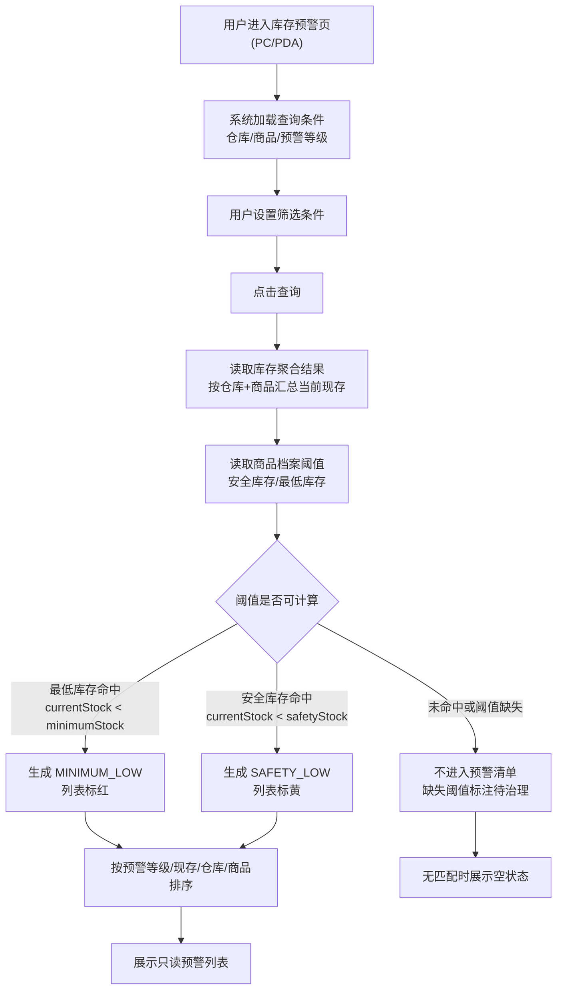
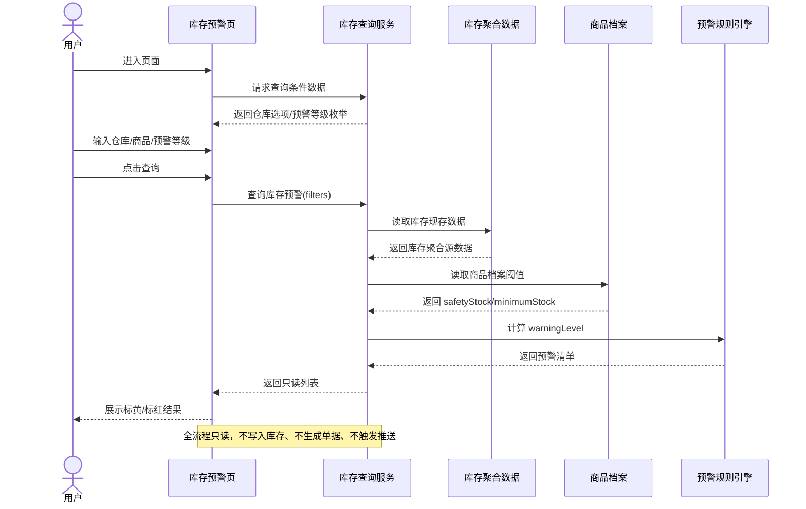

# 库存预警_业务流程推演

> 状态：V1.0 已补充 | 角色：业务流程推演 | 类型：查询页 | Mock 日期：2026-07

## 1. 流程边界

库存预警流程只覆盖用户进入查询页、设置筛选条件、系统读取数据、计算预警等级、展示清单。流程不包含新增/编辑/详情/确认/补货/推送。

## 2. 业务流程图

## 3. 系统时序图

## 4. 场景推演

### 4.1 默认查询全部预警

1. 用户进入库存预警页，查询条件默认：仓库=全部、商品=空、预警等级=`ALL`。
2. 系统读取全部仓库的库存聚合结果和商品档案阈值。
3. 命中 `MINIMUM_LOW` 的行标红，命中 `SAFETY_LOW` 的行标黄。
4. 未触发预警的正常库存不进入清单。

### 4.2 按仓库筛选

1. 用户选择 `WH002` 上海分仓。
2. 系统仅计算该仓库下的商品库存预警。
3. 列表只展示上海分仓命中的低库存商品。

### 4.3 按商品筛选

1. 用户输入商品编码或商品名称关键词，例如 `SKU003` 或 `复印纸`。
2. 系统按商品编码/名称模糊匹配。
3. 若匹配商品当前现存低于阈值，则展示对应预警等级；否则展示空状态。

### 4.4 按预警等级筛选

1. 用户选择 `MINIMUM_LOW`。
2. 系统只返回低于最低库存的红色预警行。
3. 黄色预警不展示。

### 4.5 阈值未配置

1. 商品档案未返回 `minimumStock`。
2. 系统不计算最低库存预警。
3. 如果 `safetyStock` 已配置且命中，则仍展示黄色预警。
4. 页面不允许用户在库存预警页补录阈值，只显示 `-` 或“商品档案占位/待确认”。

## 5. 异常与空状态

| 场景 | 系统表现 |
|:--|:--|
| 查询无预警 | 展示“暂无符合条件的库存预警” |
| 商品关键词无匹配 | 展示空状态，不报错 |
| 阈值缺失 | 缺失字段展示 `-`，不自行推导阈值 |
| 库存读取失败 | 展示查询失败提示，可重新查询 |
| PDA 离线 | 一期不新增离线预警推送；如本地已有缓存，仅按缓存展示并标注快照时间 |
