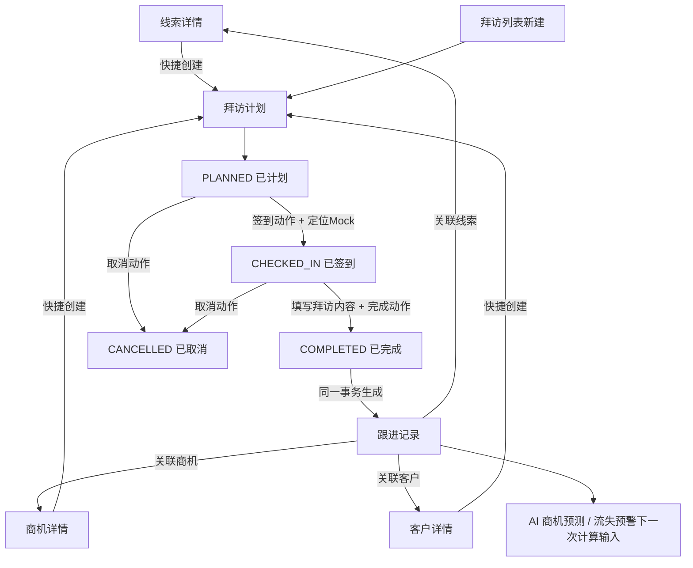
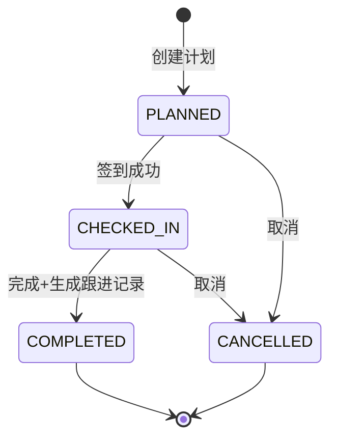

# 拜访计划主PRD

> **版本**：V2.0 | 2026-07-18
> **读者**：研发工程师、测试工程师、产品复核、项目经理
> **字段定义 SSOT**：《拜访计划字段清单》
> **引用原则**：本文描述业务流程、动作与联动，不重复定义字段取值、枚举、必填性或长度。

---

### 1. 业务背景

拜访计划是 Forge CRM 中把销售行动从“口头承诺”转化为可计划、可签到、可完成、可追溯记录的过程对象。它可以关联线索、商机或客户，并在完成时沉淀为统一跟进记录。

没有统一拜访管理时存在以下问题：

1. 拜访安排散落在个人日历和聊天工具中，主管无法掌握行动计划。
2. 拜访关联对象不明确，后续难以判断此次行动影响了哪条业务链路。
3. 销售仅口头反馈“已拜访”，缺少签到时间与地点证据。
4. 未签到即可标记完成，导致执行真实性无法验证。
5. 拜访完成后还需二次录入跟进记录，容易遗漏或内容不一致。
6. 取消拜访没有留痕，计划完成率统计失真。
7. 线索、商机和客户详情无法聚合查看相关拜访。
8. 同一个拜访可能被重复签到或重复完成，产生重复跟进记录。
9. 定位服务失败时缺少降级提示，用户误以为签到成功。
10. 关联对象状态变化后，计划仍可能执行到不合适的业务对象上。
11. 终态拜访仍被编辑，历史行动记录不稳定。
12. 拜访结果没有进入 AI 商机预测和流失预警上下文。

本模块通过“创建计划→签到→填写拜访内容→完成→自动生成跟进记录”的闭环，使销售行动与线索、商机、客户关系保持一致，并为 AI 预测提供可信行为数据。

**定位句**：拜访计划是 CRM 的销售行动执行对象；它不改变客户或商机主数据，完成后通过跟进记录把拜访事实回写到关联对象的业务时间线。

---

### 2. 功能范围

**In Scope**：

- 手动创建拜访计划。
- 从线索详情快捷创建拜访。
- 从商机详情快捷创建拜访。
- 从客户详情快捷创建拜访。
- 一次拜访只关联一个业务对象。
- 维护计划时间、方式、标题和业务信息。
- 已计划状态编辑拜访信息。
- 使用 PC Demo Mock 获取签到时间与地址。
- 签到后锁定关键计划信息。
- 已签到状态填写拜访内容。
- 已签到后完成拜访。
- 完成时自动生成一条关联对象跟进记录。
- 已计划或已签到状态取消拜访。
- 取消动作记录审计原因。
- 终态拜访只读展示。
- 列表、详情和关联对象视图展示。
- 重复动作幂等保护。
- 定位与跟进写入失败的完整反馈。

**Out of Scope**：

- 移动端签到；原因：一期仅 PC Web。
- 真实 GPS 轨迹；原因：Demo 不建设移动定位能力。
- 拜访路线规划；原因：属于二期外勤效率能力。
- 地理围栏与距离校验；原因：PC Demo 仅验证签到流程。
- 自动读取通讯录或日历；原因：不在核心 CRM 闭环范围。
- 拜访审批流；原因：一期由销售直接创建计划。
- 多对象关联；原因：一次拜访只绑定一个主业务对象。
- 重复周期拜访；原因：一期每次拜访独立创建。
- 文件与照片上传；原因：Demo 不建设文件服务。
- 删除拜访；原因：业务记录不提供删除，通过取消终止。
- 直接修改关联对象状态；原因：拜访只生成跟进记录。
- 真实 AI 模型训练；原因：拜访只提供输入数据。

---

### 3. 对象定位

#### 3.1 在系统中的位置

| 项目 | 内容 |
|------|------|
| 对象类型 | 拜访计划（销售行动层） |
| 核心职责 | 计划、签到并记录一次可追溯销售拜访 |
| 来源 | 列表新建，或线索/商机/客户详情快捷创建 |
| 上游对象 | CRM 线索、商机或客户 |
| 下游对象 | 跟进记录、关联对象时间线、AI 预测输入 |
| 关联基数 | 一个拜访计划关联一个业务对象；一个对象可有多个拜访 |
| 状态权威 | 拜访状态在 CRM 内权威 |
| 主数据边界 | 不修改客户、商品或订单主数据 |
| 删除策略 | 不删除，未完成计划通过取消进入终态 |
| 关键联动 | 完成时自动生成一条跟进记录 |

#### 3.2 系统链路图

链路约束：

- 快捷创建只预填并锁定关联对象，不复制对象主数据。
- 未签到不得直接完成。
- 完成与跟进记录生成必须事务一致。
- 取消不生成跟进记录。
- 完成后不直接推进商机或转客户。
- 终态不允许编辑、签到、完成或取消。

#### 3.3 实体关系说明

| 关系 | 基数 | 说明 | 约束 |
|------|:---:|------|------|
| 线索 : 拜访计划 | 1:N | 一个线索可安排多次拜访 | 关联类型与标识必须一致 |
| 商机 : 拜访计划 | 1:N | 一个商机可安排多次拜访 | 终态商机的新拜访按规则阻断 |
| 客户 : 拜访计划 | 1:N | 一个客户可安排多次拜访 | ERP停用客户不得新建拜访 |
| 拜访计划 : 关联对象 | N:1 | 每个拜访只能有一个主关联对象 | 不允许同时关联多个对象 |
| 拜访计划 : 跟进记录 | 1:0..1 | 只有完成拜访生成一条记录 | 使用拜访编号作为幂等来源键 |
| 拜访计划 : 签到事件 | 1:0..1 | 每次计划只接受一次有效签到 | 重复签到返回首次结果 |
| 拜访计划 : 审计日志 | 1:N | 创建、编辑、签到、完成、取消留痕 | 失败动作也记录结果 |

实体一致性要求：

1. 关联对象类型与关联对象 ID 必须来自同一次选择。
2. 快捷创建的关联对象默认锁定，避免跨对象误挂。
3. 跟进记录必须回写到同一关联对象。
4. 跟进内容标明来自哪一份拜访计划。
5. 跟进写入失败时拜访不得保持已完成。
6. 已取消拜访不生成跟进记录。
7. 已完成拜访重复回调不生成第二条跟进记录。

---

### 4. 业务场景

| 场景ID | 场景 | 类型 | 触发角色 | 说明 |
|--------|------|------|----------|------|
| S01 | 创建、签到并完成客户拜访 | **主流程** | 销售 | 完整闭环并自动生成跟进记录 |
| S02 | 从商机详情快捷创建 | **支线** | 销售 | 自动预填并锁定关联商机 |
| S03 | 已计划拜访取消 | **支线** | 销售 | 二次确认后进入取消终态，不生成跟进 |
| S04 | 未签到直接完成 | **异常** | 销售 | 阻断并提示先签到 |
| S05 | 完成时跟进记录写入失败 | **异常** | 系统 | 整体回滚保持已签到并允许重试 |

#### S01 创建、签到并完成客户拜访

- 前置：销售有拜访新增权限。
- 前置：客户快照可用。
- 动作：创建计划并保存。
- 动作：到达拜访时间后点击签到。
- 结果：系统记录 Mock 签到时间与地址。
- 动作：填写拜访内容并点击完成。
- 结果：拜访进入完成终态。
- 后置：关联客户时间线新增一条来源为拜访的跟进记录。

#### S02 从商机详情快捷创建

- 前置：商机非终态且操作者有权限。
- 入口：商机详情“创建拜访”。
- 页面：预填关联对象类型与对象 ID。
- 约束：两个关联字段默认锁定。
- 保存：创建计划，不改变商机阶段。
- 完成：生成商机跟进记录，并参与下次预测。

#### S03 已计划拜访取消

- 前置：拜访处于可取消状态。
- 动作：点击取消并填写动作原因。
- 确认：告知取消后不可恢复。
- 结果：进入取消终态。
- 后置：记录审计日志，不生成跟进记录。
- 约束：不删除拜访记录。

#### S04 未签到直接完成

- 前置：拜访仍为已计划。
- 动作：通过旧页面或接口请求完成。
- 结果：阻断，状态不变。
- 提示：`请先完成签到`。
- 数据：不写拜访内容，不生成跟进记录。
- 审计：记录非法状态动作。

#### S05 完成时跟进记录写入失败

- 前置：拜访已签到，拜访内容通过校验。
- 动作：点击完成。
- 异常：跟进记录写入失败。
- 结果：整个事务回滚，拜访保持已签到。
- 页面：保留拜访内容输入并提示重试。
- 后置：不得出现已完成但无跟进记录的半状态。

---

### 5. 状态机

#### 5.1 对象状态

> 完整状态定义以《拜访计划字段清单》为准，本节只说明业务含义。

| 状态 | 业务含义 | 是否终态 |
|------|----------|:--------:|
| `PLANNED` | 拜访已计划，尚未签到 | 否 |
| `CHECKED_IN` | 已记录签到事实，等待填写内容并完成 | 否 |
| `COMPLETED` | 拜访完成且跟进记录生成成功 | 是 |
| `CANCELLED` | 拜访取消，只读保留 | 是 |

#### 5.2 状态机图

#### 5.3 状态流转表（核心交付物）

| 当前状态 | 动作 | 前置条件 | 结果状态 | 二次确认 | 后置影响 | 失败处理 |
|----------|------|----------|----------|:--------:|----------|----------|
| 新建 | 保存计划 | 表单校验通过；关联对象存在且可用 | `PLANNED` | 否 | 生成拜访编号；出现在关联对象拜访列表 | 保持新增页；聚焦错误；Toast `拜访计划创建失败` |
| `PLANNED` | 保存修改 | 当前版本一致；操作者有编辑权限 | `PLANNED` | 否 | 更新计划信息和审计日志 | 保持原数据；Toast `保存失败，请重试` |
| `PLANNED` | 签到 | 到达允许签到时间窗口；定位 Mock 成功；有权限 | `CHECKED_IN` | 是 | 写入签到事实；锁定关键计划信息 | 定位失败保持原状态；Toast `签到失败，请重试` |
| `CHECKED_IN` | 完成 | 拜访内容通过校验；关联对象仍可写入跟进 | `COMPLETED` | 是 | 同一事务生成一条跟进记录；刷新关联对象时间线 | 任一步失败整体回滚；保持已签到；保留输入；Toast `完成失败，请重试` |
| `PLANNED` | 取消 | 动作原因通过校验；有权限 | `CANCELLED` | 是 | 记录取消审计；不生成跟进记录 | 保持已计划；保留原因；Toast `取消失败，请重试` |
| `CHECKED_IN` | 取消 | 尚未完成；动作原因通过校验；有权限 | `CANCELLED` | 是 | 记录取消审计；不生成跟进记录 | 保持已签到；Toast `取消失败，请重试` |
| `PLANNED` | 完成请求 | 尚未签到 | `PLANNED` | 否 | 无 | 阻断；Toast `请先完成签到` |
| `COMPLETED` | 重复完成 | 已生成来源跟进记录 | `COMPLETED` | 否 | 返回首次完成结果 | 不重复生成跟进记录 |
| `CANCELLED` | 签到或完成 | 已进入取消终态 | `CANCELLED` | 否 | 无 | 阻断；Toast `已取消的拜访不可操作` |

#### 5.4 动作能力矩阵

| 动作 | PLANNED | CHECKED_IN | COMPLETED | CANCELLED |
|------|:-------:|:----------:|:---------:|:---------:|
| 查看 | ✅ | ✅ | ✅ | ✅ |
| 编辑 | ✅ | ❌ | ❌ | ❌ |
| 签到 | ✅ | ❌ | ❌ | ❌ |
| 完成 | ❌ | ✅ | ❌ | ❌ |
| 取消 | ✅ | ✅ | ❌ | ❌ |
| 查看跟进记录 | ❌ | ❌ | ✅ | ❌ |
| 删除 | ❌ | ❌ | ❌ | ❌ |

矩阵约束：

- 状态不得在表单中直接修改。
- 不可用动作不渲染。
- 完成状态只有在跟进记录生成成功后成立。
- 终态不允许编辑或回退。

---

### 6. 核心业务规则

#### 6.1 创建与关联规则

| 规则ID | 规则 |
|--------|------|
| R01 | 每个拜访计划必须且只能关联一个线索、商机或客户；关联类型与对象 ID 必须匹配，快捷创建时默认预填并锁定。 |
| R02 | 创建和保存前必须校验关联对象存在、可见且允许新业务；已转客户线索、终态商机或 ERP 停用客户按对应对象规则阻断。 |

#### 6.2 签到与完成规则

| 规则ID | 规则 |
|--------|------|
| R03 | 拜访必须先签到再完成；签到由动作触发并记录 Mock 时间和地址，定位失败不得伪造签到成功。 |
| R04 | 完成动作必须校验拜访内容，并在同一事务中把拜访置为完成和生成唯一跟进记录；失败时整体回滚至已签到。 |

#### 6.3 取消与终态规则

| 规则ID | 规则 |
|--------|------|
| R05 | 已计划或已签到拜访可取消，取消动作原因写入审计日志；取消后不生成跟进记录且不可恢复。 |
| R06 | 完成或取消为只读终态，不提供编辑、回退或删除；重复完成使用拜访编号幂等，不生成第二条跟进记录。 |

执行顺序：

1. 操作权限。
2. 当前状态。
3. 关联对象有效性。
4. 字段清单校验。
5. 时间窗口与定位结果。
6. 版本并发。
7. 状态与跟进事务。
8. 审计与反馈。

---

### 7. AI 串联规则（CRM特有）

拜访不直接输出 AI 预测，但完成后的跟进记录进入线索评分、商机预测或客户流失预警的下一次计算输入。

| AI 节点 | 触发时机 | 输入 | 输出 | 执行动作 | 失败处理 |
|---------|----------|------|------|----------|----------|
| 行为数据回流 | 拜访完成并生成跟进记录后 | 关联对象、跟进时间、跟进内容、拜访来源 | 最新活动事实 | 更新关联对象最近跟进时间，并触发或等待对应 AI 节点计算 | AI 调用失败不回滚已完成拜访和跟进记录；保留上次成功结果并可重试 |
| 商机预测刷新 | 关联对象为商机 | 新跟进频率与内容 | 新成交概率 | 异步刷新商机预测 | 失败保留旧概率，拜访仍完成 |
| 流失预警输入 | 关联对象为客户 | 新最近跟进时间 | 下一次风险计算输入 | 下一次定时任务重新判断风险 | 定时任务失败保留旧风险，不删除拜访记录 |

AI 约束：

- AI 失败不得回滚业务事实。
- AI 结果不得自动修改拜访状态。
- 完成拜访不立即伪造新的风险等级。
- 自动生成的跟进记录明确标注来源拜访。
- 同一拜访只触发一次有效行为数据回流。
- 终态拜访后续不重复触发。

---

### 8. 权限设计

#### 8.1 数据可见范围

| 角色 | 可见范围 | 说明 |
|------|----------|------|
| 销售 | 自己创建或负责对象的拜访 | 可执行自身计划动作 |
| 销售主管 | 本团队拜访 | 可查看行动计划和完成情况 |
| 系统管理员 | 全部拜访 | 用于联调和异常处理 |
| 只读审计角色 | 授权范围内历史拜访 | 仅查看 |

数据范围约束：

- 拜访可见性不得绕过关联对象权限。
- 关联对象深链接继续执行权限校验。
- 签到地址按角色权限展示。
- 导出遵循当前列表数据范围。
- 无权用户不能通过拜访编号推断客户信息。

#### 8.2 操作权限矩阵

| 操作 | 销售 | 销售主管 | 系统管理员 | 只读审计 |
|------|:----:|:--------:|:------------:|:--------:|
| 查看拜访 | 自己负责 | 团队范围 | 全部 | 授权范围 |
| 新建拜访 | 授权对象 | 团队对象 | ✅ | ❌ |
| 编辑已计划 | 自己创建 | 团队范围 | ✅ | ❌ |
| 签到 | 自己计划 | 受托团队计划 | ✅ | ❌ |
| 完成 | 自己已签到 | 受托团队计划 | ✅ | ❌ |
| 取消 | 自己计划 | 团队范围 | ✅ | ❌ |
| 查看自动跟进 | 授权对象 | 团队范围 | ✅ | ✅ |
| 删除 | ❌ | ❌ | ❌ | ❌ |

权限失败处理：

- 页面入口不展示。
- 接口返回 403。
- 状态与跟进记录均不变化。
- Toast `无权执行该操作`。

---

### 9. 边界与异常处理

#### 9.1 并发控制

| 场景 | 处理方式 |
|------|----------|
| 编辑与签到并发 | 版本锁控制，首个成功动作生效 |
| 签到与取消并发 | 首个事务生效，另一个刷新最新状态 |
| 完成与取消并发 | 版本锁 + 事务控制，禁止同时形成终态 |
| 两次完成请求 | 来源键幂等，仅生成一条跟进记录 |

#### 9.2 去重与幂等

| 场景 | 处理方式 |
|------|----------|
| 重复创建点击 | 客户端请求键返回首次创建结果 |
| 重复签到 | 已签到时返回首次签到时间和地址 |
| 重复完成 | 按拜访编号和跟进来源键返回首次结果 |
| 重复取消 | 已取消时返回首次取消结果 |
| 跟进记录重试 | 使用拜访编号作为来源幂等键 |

#### 9.3 数量、时间与业务边界

| 场景 | 处理方式 |
|------|----------|
| 未签到直接完成 | 阻断并提示先签到 |
| 定位 Mock 失败 | 保持已计划，不写签到时间和地址 |
| 计划时间过早签到 | 按 Demo 时间窗口阻断并展示可签到时间 |
| 计划时间过期 | 允许按业务权限签到，但标记迟到审计摘要 |
| 拜访内容不合规 | 阻断完成并聚焦拜访内容 |
| 跟进写入失败 | 整体回滚保持已签到，保留输入 |
| 关联线索已转客户 | 新建时阻断并建议在客户下创建 |
| 关联商机已终态 | 新建时阻断，历史拜访仍可完成或查看 |
| 关联客户已停用 | 阻断新建，历史拜访只读保留 |
| 已取消后签到 | 阻断并提示已取消 |
| 已完成后取消 | 不展示入口，接口阻断 |
| 终态编辑或删除 | 不展示入口，接口阻断 |

异常审计：

- 记录拜访编号、原状态、目标状态、操作者和时间。
- 签到记录 Mock 定位请求结果。
- 完成记录自动跟进记录标识。
- 取消动作原因写入审计日志。
- 失败日志不暴露定位服务凭证。

---

### 10. 验收重点

| # | 验收项 | 输入条件 | 预期结果 |
|---|--------|----------|----------|
| V01 | 正常创建到完成 | 新建关联客户的拜访；签到 Mock 成功；填写合规拜访内容并完成 | 状态按计划→已签到→已完成；记录签到事实；仅生成一条客户跟进记录 |
| V02 | 快捷创建联动 | 从商机详情创建拜访 | 关联对象类型与 ID 自动预填并锁定；保存不改变商机阶段；完成后商机跟进时间线出现记录 |
| V03 | 未签到完成阻断 | 一条已计划拜访直接请求完成 | 页面无完成入口或接口阻断；状态不变；不生成跟进；提示先签到 |
| V04 | 完成事务回滚 | 一条已签到拜访；模拟跟进记录写入失败 | 拜访保持已签到；无孤立完成状态；输入内容保留；恢复后重试只生成一条记录 |
| V05 | 取消与终态锁定 | 已计划和已签到分别执行取消；再尝试编辑、签到、完成或删除 | 两条均进入取消终态；不生成跟进；所有后续写动作阻断；历史仍可查看 |

补充验收：

- [ ] 拜访状态不在表单直接编辑。
- [ ] 一次拜访只关联一个对象。
- [ ] 完成与跟进记录生成事务一致。
- [ ] 重复完成不生成重复跟进。
- [ ] 定位失败不伪造签到数据。
- [ ] 终态不编辑、不回退、不删除。
- [ ] AI 失败不回滚已完成拜访。
- [ ] CRM 不直接修改客户、商机或订单主数据。

---

### 11. 修订记录

| 日期 | 版本 | 变更摘要 |
|------|------|----------|
| 2026-07-18 | V1.0 | 初版，定义拜访计划流程 |
| 2026-07-18 | V2.0 | 对齐 v2.0 模板，补齐链路、实体、场景、状态失败处理、R01-R06、完成联动跟进、AI 回流、权限、异常与验收 |
