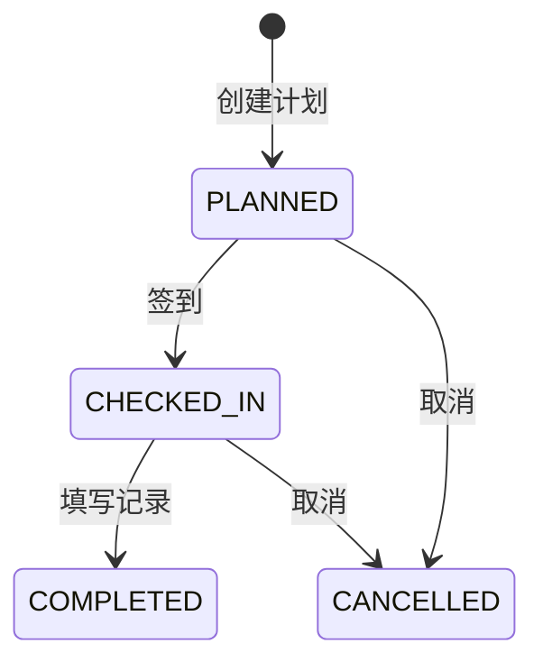

# 拜访计划主PRD

> **版本**：V1.0 | 2026-07-18

---

## 1. 业务背景

拜访是销售推进商机的核心动作。统一管理拜访计划，解决"谁去拜访了谁、拜访了什么内容、下次什么时候再去"的追踪问题。

---

## 2. 功能范围

**In Scope:**
- 拜访计划创建(关联线索/商机/客户)
- 拜访签到(记录时间+位置)
- 拜访记录填写
- 拜访完成/取消

**Out of Scope:**
- 拜访路线规划——二期
- GPS轨迹记录——二期

---

## 3. 对象定位

| 项目 | 内容 |
|------|------|
| 来源 | 手动创建,关联线索/商机/客户 |
| 关联 | 一个拜访可关联一个对象(线索/商机/客户) |
| 快捷创建 | 支持从线索/商机/客户详情页 route state 快捷创建，表单中自动锁定关联对象 |

---

## 4. 状态机

| 状态 | 含义 | 终态 |
|------|------|:---:|
| PLANNED | 已计划 | 否 |
| CHECKED_IN | 已签到 | 否 |
| COMPLETED | 已完成 | 是 |
| CANCELLED | 已取消 | 是 |

## 5. 验收

| # | 验收项 | 预期结果 |
|---|--------|---------|
| V01 | 创建→签到→完成 | 全流程闭环 |
| V02 | 关联商机的拜访 | 商机详情页展示关联拜访记录 |
| V03 | 联动回写跟进记录 | COMPLETED 时自动在关联实体(线索/商机/客户)的跟进记录中生成一条记录，类型=拜访，内容=【线下拜访】{标题} - {拜访内容} |
