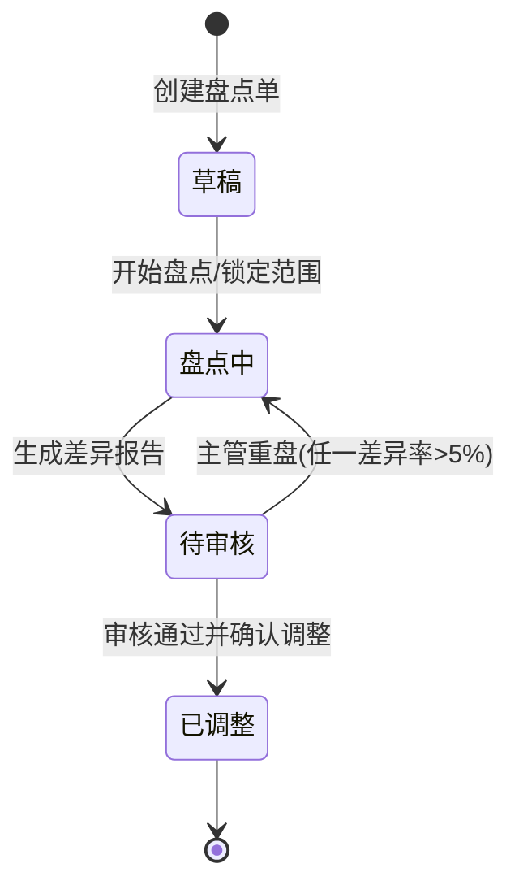

# 盘点单_业务规则规格

> 角色：业务规则规格 | 类型：执行作业单
> 覆盖盘点单状态机、冻结控制、PDA 实盘、差异阈值、主管审核和库存调整规则。

## 1. 状态机

| 当前状态 | 动作 | 目标状态 | 触发端 | 前置条件 | 后置结果 |
|:--|:--|:--|:--|:--|:--|
| - | 创建盘点单 | 草稿 | PC | 盘点类型、范围、盘点人、审核人校验通过 | 生成 CK 草稿 |
| 草稿 | 开始盘点 | 盘点中 | PC/系统 | 范围有效，货位可冻结 | 锁定系统数快照，相关货位冻结 |
| 盘点中 | 确认明细 | 盘点中 | PDA | 货位、商品、数量校验通过 | 写入实盘数并计算明细差异 |
| 盘点中 | 生成差异报告 | 待审核 | PC/系统 | 全部明细已盘 | 汇总差异报告，写入提交审核时间 |
| 待审核 | 主管重盘 | 盘点中 | PC | 任一明细差异率 >5% 或主管认为需复核 | 重盘行置为待重盘，重盘次数 +1，保持冻结 |
| 待审核 | 审核通过并确认调整 | 已调整 | PC/系统 | 主管权限，且不存在差异率 >5% 未重盘明细 | 按盘盈/盘亏更新现存，生成 FL，解除盘点冻结 |

## 2. 动作按钮规则

| 按钮/动作 | 展示状态 | 权限 | 校验 | 说明 |
|:--|:--|:--|:--|:--|
| 保存草稿 | 草稿 | 创建人/仓库主管 | 基础字段校验 | 不冻结库存 |
| 开始盘点 | 草稿 | 创建人/仓库主管 | 范围可冻结 | 状态进入盘点中 |
| PDA 实盘 | 盘点中 | 盘点人 | 扫货位、扫商品、数量校验 | 写入明细实盘数 |
| 生成差异报告 | 盘点中 | 创建人/仓库主管 | 全部明细已盘 | 状态进入待审核 |
| 主管重盘 | 待审核 | 审核人/仓库主管 | 差异率 >5% 或主管判定 | 回到盘点中 |
| 审核通过并确认调整 | 待审核 | 审核人/仓库主管 | 无超阈值未重盘明细 | 更新现存并生成 FL |
| 查看 FL | 已调整 | 有查看权限 | 已有关联 FL | 跳转库存流水 |

按钮不可用时隐藏，不展示灰色 disabled 态。状态字段只读，不允许直接编辑。

## 3. 盘点范围与冻结规则

| 编号 | 规则 | 说明 |
|:--|:--|:--|
| LOCK-R01 | 锁定时点 | 点击“开始盘点”后锁定范围，状态进入盘点中 |
| LOCK-R02 | 冻结口径 | 对应货位进入 `冻结` 态，盘点中禁止入库、出库、调拨等影响该货位库存的动作 |
| LOCK-R03 | 系统数快照 | `system_qty` 取锁定时该货位、商品的现存快照，后续用于差异比对 |
| LOCK-R04 | 动盘锁定 | `count_type=DYNAMIC` 时，仅锁定当前扫描或当前任务覆盖货位 |
| LOCK-R05 | 全盘锁定 | `count_type=FULL` 时，锁定全仓或指定全范围货位 |
| LOCK-R06 | 范围只读 | 进入盘点中后，盘点类型和范围不可编辑 |
| LOCK-R07 | 重盘冻结 | 主管要求重盘后仍保持原冻结范围，避免重盘期间发生出入库 |

## 4. PDA 实盘规则

| 编号 | 场景 | 校验规则 | 错误提示/反馈 |
|:--|:--|:--|:--|
| SCAN-R01 | 扫货位 | 实扫货位必须在 CK 盘点范围内 | `货位不在本次盘点范围内`，语音+震动 |
| SCAN-R02 | 扫商品 | 实扫商品必须匹配当前明细或属于盘点范围 | `商品不匹配，请核对商品` |
| SCAN-R03 | 未扫货位先扫商品 | 未完成货位校验前不允许确认商品 | `请先扫描货位` |
| SCAN-R04 | 明盘 | PDA 展示系统数，便于盘点员确认 | 系统数只读 |
| SCAN-R05 | 盲盘 | PDA 不展示系统数，提交后系统比对差异 | 盘点员仅录入实盘数 |
| SCAN-R06 | 离线扫码 | PDA 可离线缓存实盘记录，同步时以后端 CK 状态和冻结范围为准 | 冲突时提示重新同步 |

## 5. 数量与差异规则

| 编号 | 规则 | 说明 |
|:--|:--|:--|
| QTY-R01 | 实盘数整数 | `counted_qty` 必须为整数，允许 0 |
| QTY-R02 | 差异数 | `difference_qty = counted_qty - system_qty` |
| QTY-R03 | 盘盈 | `difference_qty > 0`，确认调整后现存增加 |
| QTY-R04 | 盘亏 | `difference_qty < 0`，确认调整后现存减少 |
| QTY-R05 | 无差异 | `difference_qty = 0`，不生成盘盈/盘亏 FL |
| QTY-R06 | 差异率 | `difference_rate = abs(difference_qty) / system_qty`；系统数为 0 的口径见字段清单不确定性 |
| QTY-R07 | 阈值 | 任一明细 `difference_rate > 5%` 时，主管审核必须要求重盘 |

## 6. 差异报告与主管审核

| 编号 | 规则 | 说明 |
|:--|:--|:--|
| REVIEW-R01 | 生成条件 | 所有明细均已确认实盘数后，才能生成差异报告 |
| REVIEW-R02 | 报告内容 | 展示货位、商品、系统数、实盘数、差异数、差异率、差异类型 |
| REVIEW-R03 | 审核角色 | 差异报告必须由审核人或仓库主管权限账号处理 |
| REVIEW-R04 | 超阈值重盘 | 任一差异率 >5% 的明细不得直接调整，必须回到盘点中重盘 |
| REVIEW-R05 | 重盘记录 | 每次主管重盘写入重盘次数、重盘原因和操作日志 |
| REVIEW-R06 | 审核通过 | 无超阈值未重盘明细时，主管可点击“审核通过并确认调整” |

## 7. 库存调整规则

| 编号 | 规则 | 说明 |
|:--|:--|:--|
| INV-R01 | 调整时点 | 只有“审核通过并确认调整”才更新现存并生成 FL |
| INV-R02 | 盘盈调整 | 差异数为正时，现存增加 `+difference_qty`，生成 `STOCK_GAIN` |
| INV-R03 | 盘亏调整 | 差异数为负时，现存减少 `difference_qty`，生成 `STOCK_LOSS` |
| INV-R04 | 占用不变 | 盘点调整不修改占用口径 |
| INV-R05 | 可用重算 | 可用不手工写入，按 `可用 = 现存 - 占用 - 冻结` 计算 |
| INV-R06 | 来源追溯 | FL 的来源单据类型为 `CK`，来源单号为当前 `count_no` |
| INV-R07 | 幂等 | 同一 CK 明细只能生成一次有效盘盈/盘亏 FL，重复点击必须拦截 |
| INV-R08 | 解冻 | 调整完成后解除盘点冻结；是否单独生成解冻 FL 待库存流水口径确认 |

## 8. 权限规则

| 角色 | 权限 | 说明 |
|:--|:--|:--|
| 盘点人 | PDA 扫码、录入实盘数、提交明细 | 不能审核和确认调整 |
| 仓库主管 | 创建 CK、开始盘点、生成差异报告、要求重盘、审核确认调整 | 可处理异常 |
| 审核人 | 审核差异报告、要求重盘、确认调整 | 由 CK 头部指定 |
| 只读账号 | 查看列表、详情、差异报告和 FL | 不能触发状态变化 |
| 系统 | 冻结范围、计算差异、生成 FL、写操作日志 | 无人工入口 |

## 9. 完成判定

| 判定项 | 规则 |
|:--|:--|
| 明细完成 | 已扫货位、商品并确认实盘数 |
| 盘点完成 | 全部明细完成后可生成差异报告 |
| 待审核完成 | 主管审核通过并确认调整，或超阈值要求重盘 |
| 单据完成 | 状态为已调整，库存更新和 FL 生成成功 |

## 10. 不确定性

- context 未明确盘点冻结、解冻是否也必须展示为库存流水 FL。本文只强制要求盘盈/盘亏调整生成 FL，冻结/解冻作为库存状态变化记录保留。
- context 未定义盘点单作废流程。本文不新增作废状态，避免扩展超出当前状态机。
