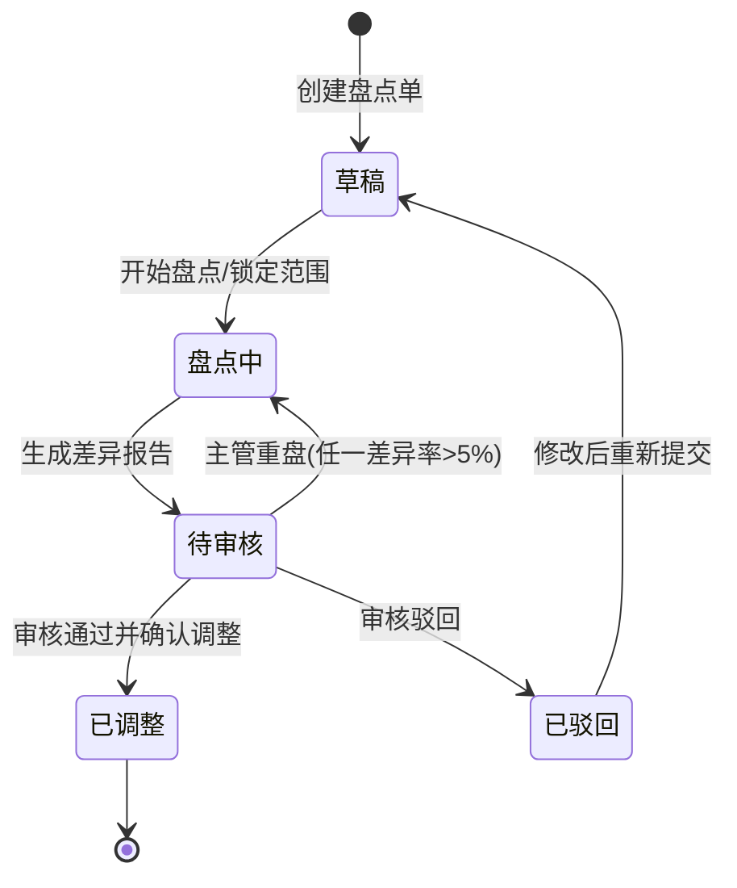

# 盘点单主PRD

> 角色：主PRD | 类型：执行作业单
> 权威层级：context/ > 库存管理规则 > 本文件
> 关联文件：`盘点单字段清单.md` `盘点单_业务规则规格.md` `盘点单_业务流程推演.md` `盘点单_用例数据推演.md`

## 1. 业务背景

盘点单（CK）用于闭环仓库账实核对，覆盖“创建盘点单 → 锁定盘点范围 → PDA 扫描实盘 → 系统比对差异 → 差异报告 → 主管审核 → 库存调整 → 生成 FL”的完整流程。

Forge WMS 在 6 个仓库、日出库 20,000+ 单的作业规模下，库存准确性会直接影响拣货命中率、订单履约和财务核算。盘点单的目标是把线下实物清点转成可冻结、可复盘、可审核、可追溯的系统流程，并在主管确认后按盘盈/盘亏调整现存库存。

## 2. 功能范围

### 2.1 In Scope

| 功能 | 端 | 说明 |
|:--|:--|:--|
| 创建盘点单 | PC | 选择盘点类型、仓库、盘点范围、盘点人、审核人，生成 CK 草稿 |
| 锁定盘点范围 | PC/系统 | 点击开始盘点后进入盘点中，对应货位进入冻结态，禁止出入库 |
| PDA 实盘作业 | PDA | 扫描货位、商品，录入实盘数；明盘显示系统数，盲盘不显示系统数 |
| 差异比对 | 系统 | 根据锁定时的系统数与实盘数计算差异数、差异率和差异类型 |
| 差异报告 | PC | 全部明细完成后生成差异报告，状态进入待审核 |
| 主管审核 | PC | 审核差异报告；任一明细差异率 >5% 时必须要求重盘 |
| 确认调整 | PC/系统 | 审核通过后确认调整，按盘盈/盘亏更新现存并生成库存流水 FL |
| 列表/详情查询 | PC | 查询 CK 状态、差异、重盘记录、调整结果和关联 FL |

### 2.2 Out Scope

- 不拆独立“差异调整单”，差异调整是盘点单流程内的库存调整环节。
- 不涉及第三方物流、运输系统或硬件选型。
- 不改变出入库业务单据的过账规则，盘点调整只处理盘点差异。
- 不提供删除盘点单入口；已生成单号不回收。
- 不定义后端实现方案，Demo 仅描述产品页面、交互和 Mock 数据。

## 3. 单据定位

| 项 | 说明 |
|:--|:--|
| 单据名称 | 盘点单 |
| 单据编码 | CK |
| 单号规则 | `CK{YYYYMMDD}-{4位序号}`，如 `CK20260706-0001` |
| 上游来源 | 仓库盘点计划或仓库主管手工创建 |
| 下游去向 | 库存流水 FL；盘盈生成 `STOCK_GAIN`，盘亏生成 `STOCK_LOSS` |
| 业务定位 | 锁定指定盘点范围，记录实盘结果、差异审核和库存调整结果 |
| 单据边界 | 差异报告、主管审核、确认调整均属于 CK 内部流程 |

## 4. 盘点类型与范围

| 类型 | 枚举值 | 系统行为 |
|:--|:--|:--|
| 明盘 | `OPEN` | PDA 展示锁定时系统库存数，盘点员逐项确认实盘数 |
| 盲盘 | `BLIND` | PDA 不展示系统数，提交后由系统比对差异 |
| 动盘 | `DYNAMIC` | 不停业盘点，仅锁定当前扫描或当前任务覆盖的货位 |
| 全盘 | `FULL` | 全仓停业盘点，开始盘点后锁定全部纳入范围的货位 |

盘点范围可以按仓库、库区、货位、商品组合定义。范围一旦进入盘点中，范围字段只读，不允许在盘点中扩大或缩小范围。

## 5. 业务场景

| # | 场景 | 系统处理 |
|:--:|:--|:--|
| 1 | 明盘正常盘点无差异 | PDA 展示系统数，实盘=系统数；生成差异报告后主管审核通过，无库存调整 FL |
| 2 | 盲盘出现盘盈 | PDA 不展示系统数，实盘数大于系统数；审核通过并确认调整后现存增加，生成 `STOCK_GAIN` FL |
| 3 | 盲盘出现盘亏 | 实盘数小于系统数；审核通过并确认调整后现存减少，生成 `STOCK_LOSS` FL |
| 4 | 差异率 >5% | 差异报告进入待审核后，主管点击“要求重盘”，CK 回到盘点中并保留冻结范围 |
| 5 | 动盘 | PDA 扫描到的货位进入冻结态，未扫描货位不受本 CK 冻结影响 |
| 6 | 全盘 | 盘点范围覆盖全仓，开始盘点后全部相关货位冻结，禁止出入库 |
| 7 | 盘点中遇到出入库请求 | 系统按货位冻结规则阻断入库、出库、调拨等会影响该货位现存的操作 |

## 6. 状态机

| 状态 | 含义 | 可执行动作 | 进入条件 |
|:--|:--|:--|:--|
| 草稿 | 已创建 CK，尚未锁定库存 | 编辑范围、开始盘点 | 创建盘点单并保存 |
| 盘点中 | 范围已锁定，相关货位冻结，PDA 正在实盘 | PDA 实盘、生成差异报告 | 点击开始盘点或主管要求重盘 |
| 待审核 | 全部明细已实盘，差异报告已生成，等待主管审核 | 主管重盘、审核通过并确认调整、审核驳回 | 全部明细完成且系统完成差异比对 |
| 已驳回 | 主管审核不通过，已记录驳回原因 | 修改草稿、重新提交差异报告 | 主管点击驳回；不调整库存、不生成 FL |
| 已调整 | 盘点结束，库存已按差异更新并生成 FL | 查看详情、查看 FL | 主管审核通过且确认调整成功 |

> 状态变更必须通过动作按钮触发，不允许直接编辑状态字段。按钮不可用时隐藏，不展示灰色 disabled 态。

## 7. 字段清单入口

字段的唯一事实来源见 `盘点单字段清单.md`。本主 PRD 只保留字段分类摘要：

| 分类 | 核心字段 |
|:--|:--|
| 盘点头 | 盘点单号、盘点类型、盘点范围、仓库、盘点人、审核人、状态、计划时间、锁定时间、调整时间 |
| 盘点明细 | 货位、商品、系统数、实盘数、差异数、差异率、差异类型、明细状态 |
| 系统字段 | 创建人、创建时间、更新时间、重盘次数、关联 FL、冻结/解冻记录、操作日志 |

## 8. 核心规则摘要

| # | 规则 | 摘要 |
|:--:|:--|:--|
| R1 | 单号规则 | CK 单号按 `CK{YYYYMMDD}-{4位序号}` 生成，不可编辑 |
| R2 | 范围冻结 | 进入盘点中后，对应货位冻结，禁止出入库 |
| R3 | 盘点类型 | 明盘展示系统数，盲盘不展示系统数；动盘锁当前扫描货位，全盘锁全部范围货位 |
| R4 | 差异计算 | `diffQty = countedQty - systemQty`；正数为盘盈，负数为盘亏 |
| R5 | 差异阈值 | 任一明细差异率 >5% 时，主管必须要求重盘，状态回到盘点中 |
| R6 | 主管审核 | 差异报告必须经主管审核，不能跳过审核直接调整库存 |
| R7 | 调整时点 | 仅“审核通过并确认调整”后更新现存并生成 FL |
| R8 | 审核驳回 | 主管驳回时必须填写驳回原因；状态进入已驳回，不调整库存、不生成 FL，允许修改后重新提交 |
| R9 | 库存口径 | 盘盈只增加现存，盘亏只减少现存；占用不变，可用按公式重算 |

## 9. 验收标准

| # | 验收项 | 验收标准 |
|:--:|:--|:--|
| AC1 | 单号 | 新建 CK 时生成 `CK{YYYYMMDD}-{4位序号}`，不可手改 |
| AC2 | 状态流转 | 仅允许草稿 → 盘点中 → 待审核 → 已调整/已驳回；差异率 >5% 时待审核 → 盘点中；驳回后可修改并重新提交 |
| AC3 | 冻结控制 | 盘点中范围内货位禁止入库、出库、调拨等库存变动 |
| AC4 | PDA 扫描 | PDA 必须先扫货位再扫商品，实盘数按数量校验规范提交 |
| AC5 | 明盘/盲盘 | 明盘展示系统数，盲盘不展示系统数 |
| AC6 | 差异报告 | 全部明细完成后才能生成差异报告，进入待审核 |
| AC7 | 主管审核 | 差异报告必须由审核人或主管权限账号处理 |
| AC8 | 阈值重盘 | 任一明细差异率 >5% 时只能要求重盘，不能直接确认调整 |
| AC9 | 驳回处理 | 审核驳回必须填写原因；不调整库存、不生成 FL；单据允许回到可编辑状态后重新提交 |
| AC10 | 库存调整 | 确认调整后，盘盈现存增加、盘亏现存减少，并生成来源为 CK 的 FL |
| AC11 | 单据边界 | 页面和规则不出现独立差异调整单入口 |

## 10. 不确定性

| 项 | 当前处理 | 待确认点 |
|:--|:--|:--|
| 差异率分母为 0 | 系统数为 0 且实盘数 >0 时，本文按 100% 差异处理，触发主管重盘 | 真实系统是否另设“无账有物”差异等级，context 未明确 |
| 冻结/解冻是否单独生成 FL | 本套件强调盘盈/盘亏确认调整生成 FL；冻结/解冻可作为库存状态记录 | context 未明确盘点冻结和解冻是否也在库存流水中独立展示 |
