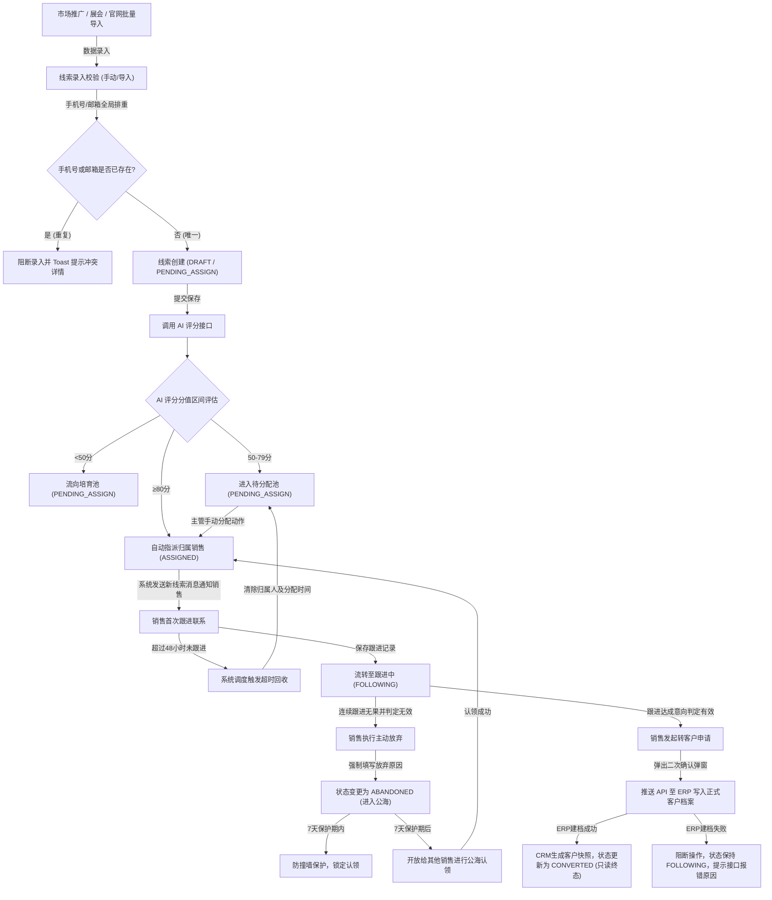
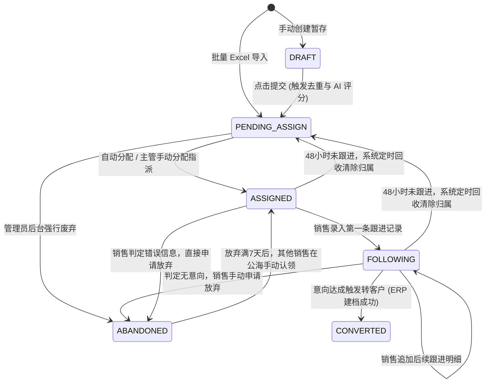

# 线索主PRD

> **版本**：V2.0 | 2026-07-18
> **读者**：研发工程师、测试工程师、产品复核、项目经理

---

### 1. 业务背景

线索是 CRM 系统的入口控制对象，解决"从哪来的、是不是目标客户、谁来跟、跟了没有"四个核心问题。线索的高效管理是提升销售漏斗转化率、控制营销获客成本的第一步。

在缺乏统一规范的线索管理系统时，强盛科技面临着以下 10 个业务痛点：
1. **名单追踪断代**：市场投放获取的名单依赖 Excel 在运营与销售之间通过邮件或即时通讯工具传来传去，线索流转路径不透明，谁跟进过、跟到什么阶段无从追踪，导致大量线索因为搁置而白白流失。
2. **撞客现象严重**：由于缺乏系统级排重，同一个潜在客户被多名销售同时电话和邮件跟进，极大地损害了公司品牌形象与客户体验，内部销售也经常因为撞客发生业绩纠纷，甚至出现对同一个客户报出不同折扣的混乱局面。
3. **高价值线索流失**：缺乏智能的质量评估手段，有明显采购意愿的优质线索淹没在大量低质量、无效的垃圾名单里，销售依靠主观直觉盲目跟进，导致真正有需求的客户无人优先识别与快速处理。
4. **离职交接成本高**：销售人员离职或调岗时，其跟进的潜在客户资源多存在于个人手机或私人记录中，极易随着销售离职而流失，交接成本极高，导致老客户关系难以平滑过渡。
5. **转化率缺乏数据支撑**：线索转化率及市场渠道的产出全凭销售主观感觉评估，无法用客观的历史数据驱动分配策略和市场预算投放的优化，难以科学评估各投放渠道的实际效果。
6. **分配规则黑盒化**：线索分配全凭主管个人偏好或手工表格记录，规则不透明，分配效率低下，且容易产生优质线索被闲置，或分配不公导致的销售抱怨与团队协作撕裂。
7. **资源积压无回收机制**：销售人员名下积压大量已分配但无力跟进的线索，没有系统级超时回收和流转规则，导致企业线索资源沉淀为“僵尸数据”，无法流回公海重新激活，造成大量商机浪费。
8. **跟进历史缺乏留痕**：销售每次沟通没有标准的记录机制，跟进记录信息量极低（如仅填写“电话已打”、“再联系”），无法还原客户真实业务诉求，导致团队无法对客户流失的真实原因进行深层分析，也无法沉淀销售经验。
9. **转客户手动录入易出错**：销售判定线索有效需转化为客户时，需要在 ERP 系统中手工重新录入公司名称、联系方式等信息，效率低且容易因输入差异导致 CRM 客户快照与 ERP 客户主数据（SSOT）不一致。
10. **无法评估市场投放ROI**：市场渠道产生的线索由于缺乏与下游商机及订单的链路绑定，导致无法量化评估特定展会或广告投放的真实投资回报率（ROI），市场部门无法获得业务结果反馈。

**定位句**：线索（Lead）作为 CRM 系统的流量入口与控制阀门，定位于管理从市场渠道获取的潜在客户资源。它在确保客户主数据 SSOT 保留在下游 ERP 的前提下，通过去重拦截、AI评分模型分级、超时强制回收、以及同步 ERP 建档等系统机制，实现从“公海流量”向“销售商机”的闭环转化，是整个强盛科技 CRM 链条的起点。

---

### 2. 功能范围

**In Scope**：
- **线索录入**：支持手动单条新增创建（含草稿保存）以及基于标准 Excel 模板的批量数据导入。
- **线索去重**：在录入、编辑及导入阶段，通过 `手机号` 和 `邮箱` 进行全局实时唯一性校验与拦截。
- **线索池与公海**：划分分配池与公海池，提供销售自主认领及主管指派的手工操作界面。
- **线索智能分配**：通过对接 AI 评分系统，实现高分线索自动路由分派，中低分线索进入不同层级的待分配池和培育池。
- **超时回收机制**：对分配后 48 小时内未首次跟进、或处于跟进中但超过 48 小时未追加新跟进记录的线索，系统定时任务自动回收并清除归属关系。
- **跟进记录留痕**：支持销售人员填写多条结构化跟进日志，自动更新 `最近跟进时间`。
- **线索转客户**：支持一键将有效线索推送到下游 ERP 系统建档，并在 CRM 本地同步生成不可逆的客户快照。
- **线索废弃与放弃**：销售可申请将无效或短期内无意向线索进行主动放弃，必须录入 `放弃原因` 以便进行流失分析。

**Out of Scope**：
- **营销自动化**（如短信/邮件批量发送、广告渠道自动化归因）：
  - *原因说明*：本系统一期专注于销售的核心跟进与 ERP 的主数据打通。高并发的短信通道和复杂的广告 SDK 归因开发成本高、周期长。一期仅通过在录入时手动选择/系统生成静态 `线索来源` 属性进行替代，营销触达和渠道精准分析留待二期建设。
- **线索数据自动清洗与外部补全**（如企业工商信息自动拉取、同名公司智能推荐合并）：
  - *原因说明*：工商接口（如天眼查）调用涉及外部付费 API，且自动合并存在误判风险，一旦误删线索可能导致销售客户信息丢失。一期仅提供严格的手机号/邮箱重合阻断，清洗和信息补全通过人工手动在详情页编辑维护。
- **AI 评分模型在线自学习调优**：
  - *原因说明*：机器学习模型的自学习和权重在线迭代依赖海量历史成交样本和销售跟进数据。在系统上线初期，数据量尚不足以支撑自学习算法 of 收敛。因此，一期评分模型采用预设的静态指标权重计算规则，待积累 3000 条以上真实成交与废弃数据后，二期再开启在线自学习调优。

---

### 3. 对象定位

#### 3.1 在系统中的位置

| 项目 | 内容 |
|:---|:---|
| 对象类型 | 线索（营销获客层） |
| 核心职责 | 统一管理从各大市场投放渠道获取的潜在客户资源，通过去重、AI 评分、团队跟进判定客户价值，并将有效客户推送到下游 ERP 系统正式建档，过滤并阻断无效或重复数据。 |
| 来源 | 手动创建 / Excel 批量导入 |
| 下游对象 | 客户档案（转客户时通过 API 实时同步写入 ERP 系统） |
| 关联关系 | 一条线索仅能转为一个客户（1:1 关系，转换后线索置为只读）；转客户后，可在客户名下建立并管理多个不同的商机（1:N 关系）。 |

#### 3.2 系统链路图

#### 3.3 实体关系说明

| 关系名称 | 实体 A | 实体 B | 关系基数 | 说明与业务约束 |
|:---|:---|:---|:---:|:---|
| 线索与市场渠道 | 市场渠道 (Channel) | 线索 (Lead) | 1 : N | 一条线索只能有且仅有一个主 `线索来源`（SSOT 字段定义），但在一个具体的市场渠道中，可以产生并关联多条不同的线索记录。 |
| 线索与客户主数据 | 线索 (Lead) | 客户快照 (Customer) | 1 : 1 | 强业务约束。线索转客户为一合一动作，一条线索在被判定为有效后，有且仅能对应生成一个客户记录。转客户完成后，该线索状态变更为 `CONVERTED` 终态，不允许二次转化。 |
| 线索与跟进明细 | 线索 (Lead) | 跟进记录 (FollowUp) | 1 : N | 一条处于 `FOLLOWING` 状态下的线索，在其生命周期内可以被销售人员进行多次电话沟通、邮件发送或登门拜访，每次沟通均以一条独立 `跟进记录` 子表项挂载在该线索名下。 |
| 线索与系统用户 | 系统用户 (User) | 线索 (Lead) | 1 : N | 从属归属关系。在任意时刻，一条已被分配或认领的线索仅能指派给一个系统用户作为 `归属人`；而一个销售角色的用户名下可以同时持有并管理多条未处理或跟进中的线索，但需遵守个人持有上限控制。 |

##### 3.3.1 实体关系业务映射细则：
1. **线索与市场渠道的映射**：在物理表设计中，线索表存储 `线索来源` 字段的枚举编码。报表系统可依据此字段向上级进行上卷统计，分析每个获客通道的平均转化周期和平均线索成本（CPL）。
2. **线索与客户快照的一致性**：当线索确认转为正式客户时，CRM 端在本地写入的客户快照包含 `公司名称`、`联系人`、`手机号`等基础字段。该快照与 ERP 端的正式客户档案表通过外部关联 ID 保持绑定，此动作由事务控制，必须保证 ERP 成功则 CRM 状态同步修改。
3. **跟进日志的时间追溯**：每一次销售人员添加的跟进明细表数据都会关联线索的 ID。系统自动在跟进明细保存时将跟进时间写回主表的 `最近跟进时间` 字段，以此驱动定时回收任务的逻辑判定。

---

### 4. 业务场景

| 场景ID | 场景 | 类型 | 说明与详细链路描述 |
|:---|:---|:---|:---|
| S01 | 手动录入线索并分配 | **主流程** | **正常路径描述**：市场运营专员在系统前端点击“新建线索”，手动录入 `公司名称`、`联系人`、`手机号`、`线索来源`，保存为草稿并提交。系统触发 AI 评分，若评分计算结果为 85 分（满足 ≥80 自动分配规则），系统根据自动路由配置直接将该线索指派给销售张三（将 `归属人` 更新为张三，状态变更为 `ASSIGNED`，记录 `分配时间`），并在其工作台推送分配系统消息。 |
| S02 | Excel批量导入线索 | **主流程** | **分支路径描述**：大型线下展会结束后，市场人员下载标准的 Excel 模板并填入 500 条客户数据，在后台上传导入。系统校验每行数据，进行手机号/邮箱重合度检索，清洗无用字符。对于唯一性校验通过 of 线索，绕过 AI 自动分配阶段，状态默认置为 `PENDING_ASSIGN`（待分配池），静候主管在后台进行人工调配，而校验失败的数据则被拦截并生成包含具体冲突位置的下载包供操作人员查对。 |
| S03 | 销售跟进后转客户 | **主流程** | **正常路径描述**：销售张三在名下列表发现新指派线索，致电联系后在系统内添加一条首次跟进记录（线索变更为 `FOLLOWING` 状态）。经过三次深度跟进，客户意向强烈，符合合作准入。张三在详情页发起“转客户”申请，系统弹出二次确认。张三确认后，系统向 ERP 系统发起客户建档 API 请求。ERP 建档通过后返回正式客户编码，CRM 本地写入 `转化时间`，状态变更为 `CONVERTED`，线索属性归档锁定。 |
| S04 | 超时未跟进自动回收 | **异常** | **异常情况描述**：系统定时任务每 10 分钟扫描一次未结案线索。某线索自指派给销售李四起（状态为 `ASSIGNED`，记录有 `分配时间`），已过去 48 小时 10 分钟，但系统内没有任何关于该线索的有效跟进记录。定时回收逻辑执行：无条件擦除李四的 `归属人` 与 `分配时间` 字段，将 `线索状态` 回退为 `PENDING_ASSIGN`，线索重回待分配公海，同时向李四及销售主管发送超时回收警告。 |
| S05 | 销售主动放弃线索 | **支线** | **分支路径描述**：销售在取得联系并多次沟通后，客户明确反馈目前无相关业务采购预算，且该行业暂无发展前景。销售在详情页点击“放弃”按钮，系统弹出弹窗，要求必填 15 字以上的具体 `放弃原因`。销售填写后保存，系统清除 `归属人` 关系，将状态变更为 `ABANDONED`（进入公海待认领状态），并开启为期 7 天的防撞墙保护锁，防止该销售短期内撤回重新认领。 |
| S06 | 公海线索认领 | **支线** | **分支路径描述**：销售人员在“公海池”列表中浏览处于 `ABANDONED` 状态的公海线索，选中了一条放弃时间已超过 7 天（已解除保护期锁定）的高价值线索。点击“认领”并确认，系统自动将 `归属人` 修改为该认领销售，`线索状态` 变更为 `ASSIGNED`，写入当前系统时间至 `分配时间`，重置 48 小时的超时跟进倒计时规则。 |
| S07 | 重复线索拦截 | **异常** | **异常情况描述**：销售在手动创建或编辑线索，亦或是进行 Excel 导入时，如果录入的联系人 `手机号` （去空格破折号后）或 `邮箱` 在当前数据库的任何线索记录（含草稿、跟进中、甚至已作废等全部记录）中已匹配到相同数据，系统将强行打断本次保存/提交动作，前端弹出醒目的 Toast 警告“保存失败，手机号 [XXXX] 已存在于线索 [LEADXXXX] 中，当前负责人为 [销售姓名]”，不允许强行保存，以保证数据干净无重。 |

---

### 5. 状态机

#### 5.1 对象状态

| 状态 | 含义 | 是否终态 |
|:---|:---|:---:|
| `DRAFT` | 草稿（仅手动录入时产生，允许临时保存未完成的字段） | 否 |
| `PENDING_ASSIGN` | 待分配（批量导入默认状态，或处于分配池、培育池中的线索） | 否 |
| `ASSIGNED` | 已分配（已指派归属销售，但销售尚未与客户建立首次有效联系） | 否 |
| `FOLLOWING` | 跟进中（销售已完成首次联系并追加了第一条有效跟进记录） | 否 |
| `CONVERTED` | 已转客户（线索已被销售认定有效，并成功在 ERP 同步建档） | **是 (归档只读)** |
| `ABANDONED` | 已作废/已放弃（线索被判定无效、被销售放弃，流回公海） | **是 (公海可见)** |

#### 5.2 状态机图

#### 5.3 状态流转表（核心交付物）

| 当前状态 | 动作 | 前置条件 | 结果状态 | 二次确认 | 后置影响 | 失败处理 |
|:---|:---|:---|:---|:---:|:---|:---|
| - (无) | 手动暂存 | `公司名称` 等核心项符合字符限制，必填校验通过 | `DRAFT` | 否 | 数据库生成草稿记录，生成唯一 `线索编号`。 | 格式校验未过，前端红字高亮，阻断保存。 |
| - (无) | 批量导入 | Excel上传，模板正确，且包含必填项 | `PENDING_ASSIGN` | 否 | 批量写入待分配池，记录创建人为当前操作人，创建时间为系统当前时间。 | 校验失败的数据行被阻断，生成包含错误位置的下载文件供查对。 |
| `DRAFT` | 提交 | 去重拦截校验通过，且必填字段完整 | `PENDING_ASSIGN` | 否 | 状态变更为待分配；触发 AI 评分接口计算；若评分分值 ≥80，系统自动触发分配路由。 | 字段不完整或去重不通过，阻断提交，Toast 提示具体冲突项。 |
| `PENDING_ASSIGN` | 自动/手动分配 | 目标销售账号为在职状态，且其持有线索未达上限 | `ASSIGNED` | 否 | 写入 `归属人` 和 `分配时间`；向对应销售的工作台推送系统消息，重置超时回收计时器。 | 销售被冻结/离职/达上限，阻断操作，Toast“销售无法分配：[原因]”。 |
| `PENDING_ASSIGN` | 管理员废弃 | 操作人为管理员或销售主管角色 | `ABANDONED` | 是 | 强制归档，清除可能的意向关联，写操作日志，线索移入作废公海。 | 废弃接口超时，Toast 提示“网络异常，请重试”，保持原状态。 |
| `ASSIGNED` | 首次跟进 | 操作人为当前 `归属人`，成功录入有效跟进记录 | `FOLLOWING` | 否 | 更新 `最近跟进时间`，锁定线索，关闭首次跟进回收计时，开启跟进周期监控。 | 提交失败，跟进内容本地暂存，Toast“保存跟进记录失败”。 |
| `ASSIGNED` | 主动放弃 | 操作人为当前 `归属人`，必填 `放弃原因` (≥15字) | `ABANDONED` | 是 | 清空 `归属人` 与 `分配时间`，写入 `放弃原因`，移入公海，执行 7 天防撞墙保护。 | 放弃原因未填写阻断；若此期间已被系统超时回收，Toast 提示“状态已变更”并刷新。 |
| `ASSIGNED` | 超时自动回收 | `分配时间` 距当前时间超过 48 小时（2880 分钟） | `PENDING_ASSIGN` | 否 | 系统清除 `归属人` 和 `分配时间`，记录回收日志，向销售及主管推送超时消息。 | 回收调度锁冲突，定时任务写入 error 日志，延期至下个 10 分钟周期重试。 |
| `FOLLOWING` | 再次跟进 | 操作人为当前 `归属人`，录入跟进记录 | `FOLLOWING` | 否 | 更新 `最近跟进时间`，追加跟进明细，重置 48 小时超时回收计时器。 | 数据库保存失败，Toast 提示错误，不修改 `最近跟进时间`。 |
| `FOLLOWING` | 转客户 | `线索状态` 为跟进中，且下游 ERP 无重复客户档案 | `CONVERTED` | 是 | 调用 ERP 建档接口；ERP 建档成功后返回客户ID，CRM 本地写入 `转化时间`，置为只读。 | 若 ERP 返回建档失败，阻断状态变更，Toast “ERP同步失败：[接口返回错误]”，保持原状态。 |
| `FOLLOWING` | 主动放弃 | 操作人为当前 `归属人`，必填 `放弃原因` (≥15字) | `ABANDONED` | 是 | 清空 `归属人`，写入 `放弃原因` 并记录放弃时间，进入公海，锁定 7 天无法认领。 | 原因字数不足阻断；或因并发已被系统强制回收，Toast 失败并自动刷新页面。 |
| `FOLLOWING` | 超时自动回收 | `最近跟进时间` 距当前时间超过 48 小时（2880 分钟） | `PENDING_ASSIGN` | 否 | 清除 `归属人`，状态变更为待分配，写入系统日志并向销售和主管发送警告。 | 定时回收失败，记录调度日志，在 10 分钟后下一轮调度重试。 |
| `ABANDONED` | 公海认领 | 认领销售未在 7 天内放弃过该线索，且放弃时间已满 7 天 | `ASSIGNED` | 是 | `归属人` 变更为认领销售，更新 `分配时间`，写入认领操作日志，重置超时回收机制。 | 认领冲突（已被抢先认领或未满 7 天禁认期），阻断并 Toast 提示拦截详情。 |

#### 5.4 动作能力矩阵

| 动作能力 / 页面操作按钮 | `DRAFT` | `PENDING_ASSIGN` | `ASSIGNED` | `FOLLOWING` | `CONVERTED` | `ABANDONED` |
|:---|:---:|:---:|:---:|:---:|:---:|:---:|
| 查看详情页 | ✅ | ✅ | ✅ | ✅ | ✅ | ✅ |
| 编辑基本字段 | ✅ | ✅(仅管理员) | ❌ | ❌ | ❌ | ❌ |
| 手动指派分配 | ❌ | ✅ | ❌ | ❌ | ❌ | ❌ |
| 添加跟进记录 | ❌ | ❌ | ✅ | ✅ | ❌ | ❌ |
| 发起转客户 (ERP建档) | ❌ | ❌ | ❌ | ✅ | ❌ | ❌ |
| 销售主动申请放弃 | ❌ | ❌ | ✅ | ✅ | ❌ | ❌ |
| 管理员强行废弃 / 停用 | ❌ | ✅ | ✅ | ✅ | ❌ | ❌ |
| 彻底删除草稿记录 | ✅ | ❌ | ❌ | ❌ | ❌ | ❌ |
| 公海手动认领 | ❌ | ❌ | ❌ | ❌ | ❌ | ✅ |

---

### 6. 核心业务规则

按主题分组，每条核心规则指定唯一 ID (R01-R10)：

#### 6.1 创建与提交规则
*6.1.1 规则说明：此规则组用于指导录入界面的前台校验和数据入库第一道关卡阻断，防止任何脏数据以及撞客情况的发生。*
- **R01 [全局唯一去重规则]**：系统级强唯一性校验。每当用户手动保存/提交线索或通过 Excel 批量导入线索时，系统必须对 `手机号` 及 `邮箱` 两个字段在全局所有状态（含草稿、跟进中、废弃等所有历史数据）下进行排重检索。若匹配到完全相同的数据，系统必须阻断录入并弹窗警告，提示冲突的具体线索编号及当前负责人，严禁重复数据落库。
- **R02 [核心必填与校验规则]**：手动创建线索时，`公司名称` 与 `线索来源` 必须为必填项。为了保证能够触达客户，`手机号` 与 `邮箱` 二者必须至少填其一，否则拒绝保存草稿或提交。

#### 6.2 分配与回收规则
*6.2.1 规则说明：此规则组核心目的为加速线索流转效率，打破销售资源积压和垄断问题，保障线索能被高频跟进与快速释放。*
- **R03 [销售个人持有上限规则]**：为防范销售圈地不跟进，单个销售角色人员同时持有的“已分配” and “跟进中”（即状态为 `ASSIGNED` 与 `FOLLOWING`）的线索总数上限为 30 条。达到上限后，该销售将无法在公海中手动认领新线索，且主管手动指派或系统 AI 自动路由时会自动将该销售排除，直至其名下线索转为终态或流回公海。
- **R04 [48h超时回收计算机制]**：超时自动回收为分钟级判定。系统定时任务每 10 分钟对非终态的已分配线索进行扫描：
  - 若状态为 `ASSIGNED`，判断：“当前系统时间 - `分配时间` ≥ 2880 分钟 (48.0小时)”；
  - 若状态为 `FOLLOWING`，判断：“当前系统时间 - `最近跟进时间` ≥ 2880 分钟 (48.0小时)”。
  上述条件一旦满足，系统自动执行超时回收，清空 `归属人` 与 `分配时间` 并将状态回退至 `PENDING_ASSIGN`。

#### 6.3 转化与关闭规则
*6.3.1 规则说明：此规则组界定了 CRM 与 ERP 系统的协同边界。转客户完成后线索将变为只读，不再允许任何状态回滚或基础信息编辑。*
- **R05 [转客户强一致性与 SSOT 规则]**：销售在跟进中（`FOLLOWING`）点击“转客户”，系统弹出二次确认。确认后，CRM 通过 API 实时同步客户信息至下游 ERP 系统建档（ERP 拥有客户档案的 SSOT 权威源）。只有在 ERP 返回“建档成功”和“客户编码”后，CRM 才能在本地将线索状态修改为 `CONVERTED`，并记录 `转化时间` 与客户快照，此操作不可逆。
- **R06 [终态只读保护规则]**：一旦线索进入 `CONVERTED`（已转客户）或 `ABANDONED`（已废弃/已放弃）状态，除了系统管理员角色外，普通销售与主管均无权再对其基本信息进行任何编辑修改。
- **R07 [放弃原因必填约束]**：当销售在详情页点击“放弃”使线索流入公海时，系统必须强制弹出输入框，要求销售必填 15 字以上的真实 `放弃原因`，数据不满足字数限制则阻断放弃动作。

#### 6.4 计算规则（AI评分/公海保护期）
*6.4.1 规则说明：此规则组涵盖系统层面的 AI 智能评分逻辑以及销售公海竞争的保护锁定限时判定。*
- **R08 [AI 评分静态加权计算模型]**：新线索提交或从 Excel 成功导入时触发 AI 评分计算。评分采取静态权重加权模型：`线索来源` 权重(15%) + `所属行业` 权重(20%) + 首次响应速度权重(25%) + 该行业历史转化概率(25%) + 活跃度基准评估(15%)，得出 0-100 的整数分值。
- **R09 [AI 评分分级流向规则]**：系统根据 AI 计算出的 `AI评分` 执行分级流向：
  - 分值 ≥ 80 分归为高分线索，由系统分配路由自动指派至对应行业资深销售名下；
  - 50-79 分为普通线索，流向待分配池，等待主管手动指派分配；
  - < 50 分为低意向线索，流向培育池，进行长期静态跟进。
- **R10 [公海 7 天防撞墙保护规则]**：当销售主动放弃某条线索导致其状态流转为 `ABANDONED` 时，自放弃时间起 168 小时（7天，精确到分钟）内：
  - 该放弃销售本人不可在公海重新认领此线索；
  - 该线索对其他销售而言处于锁定状态，无法被其他销售强行认领；
  - 超出 7 天（即第 168小时01分起），该线索在公海向除原放弃销售外的其他销售开放认领。

---

### 7. AI 串联规则（CRM特有）

| AI 节点 | 触发时机 | 输入维度 | 输出 | 执行动作 | 失败处理 |
|:---|:---|:---|:---|:---|:---|
| 线索评分 | 线索提交时，或 Excel 批量导入成功保存时。 | `线索来源` (权重15%) + `所属行业` (权重20%) + 录入时段/响应速度 (权重25%) + 历史同行业转化比率 (权重25%) + 活跃度静态特征 (权重15%) | 0-100 的整数分值（系统界面上分区间以绿黄红三色高亮提示）。 | 分数决定流向：分值 ≥80 分触发自动路由分配销售；50-79 分进入待分配池；<50 分流向培育池。 | **若评分模型计算超时（如超 3000ms）或接口报错崩溃**：系统采取安全降级策略，默认赋 `AI评分` 为 50 分，线索状态流转为 `PENDING_ASSIGN` 进入待分配池，并在后台生成 AI 评分失败日志，保障业务录入不受阻断。 |

---

### 8. 权限设计

#### 8.1 数据可见范围
- **销售角色**：采用行级数据权限隔离。仅可见自己作为 `归属人` 的线索记录。不能查看其它销售人员名下的线索。在“线索公海”列表中，销售仅能查看处于 `ABANDONED` 状态且已度过 7 天保护锁定期的公海线索。
  *数据库查询限制*：`WHERE owner_id = :current_user_id OR (status = 'ABANDONED' AND current_time - abandon_time > 7 days)`。
- **销售主管角色**：可见主管所属“销售部门/团队”下属所有销售人员的全部线索（支持跨销售人员查看跟进历史以进行管理评估），以及系统中全部的公海线索和待分配池线索。
  *数据库查询限制*：`WHERE owner_id IN (SELECT user_id FROM sys_user WHERE dept_id = :current_dept_id) OR status = 'ABANDONED' OR status = 'PENDING_ASSIGN'`。
- **系统管理员**：全局最高权限。可见系统内无论处于何种状态、归属于任何人的全部线索记录，不设行级隔离。
  *数据库查询限制*：无任何行级过滤条件。

#### 8.2 操作权限矩阵

| 操作功能 \ 角色 | 销售角色 | 销售主管角色 | 系统管理员 |
|:---|:---:|:---:|:---:|
| 手动创建新线索 (草稿暂存) | ✅ | ✅ | ✅ |
| 提交草稿线索 (触发评分) | ✅ | ✅ | ✅ |
| 导入 Excel 批量线索数据 | ❌ | ✅ | ✅ |
| 编辑修改草稿状态线索 | ✅ (仅自己创建) | ✅ | ✅ |
| 编辑已分配/跟进中线索 | ✅ (仅本人归属) | ✅ | ✅ |
| 手动指派线索归属 | ❌ | ✅ | ✅ |
| 强行回收线索至公海 | ❌ | ✅ | ✅ |
| 录入与添加跟进记录 | ✅ (仅本人归属) | ❌ | ❌ |
| 申请主动放弃线索 (填写原因) | ✅ (仅本人归属) | ❌ | ✅ |
| 公海手动认领线索 | ✅ | ❌ | ❌ |
| 发起转客户 (同步 ERP 建档) | ✅ (仅本人归属) | ❌ | ✅ |
| 彻底删除草稿状态记录 | ✅ (仅自己创建) | ✅ | ✅ |
| 修改系统分配与超时规则参数 | ❌ | ❌ | ✅ |

---

### 9. 边界与异常处理

#### 9.1 并发控制
- **公海抢单并发认领**：当两名销售人员在公海列表同时点击认领同一条线索并几乎同时提交请求时，后端接口需采用乐观锁机制进行保护（每次认领需匹配数据库当前的 `last_modify_time` 或 `version` 字段）。第一名成功写入的销售完成认领更新，第二名销售的请求则会触发乐观锁失效，阻断并 Toast 提示“认领失败，该线索刚刚已被他人认领”，防止出现一条线索分配给两人的脏数据。此外，在高并发请求下，后端服务将利用 Redis 进行分布式加锁保护，锁键设计为 `lead:lock:claim:{lead_id}`，锁有效期设为 3 秒。
- **管理员手动分配与系统超时回收并发**：当管理员在后台手工分配某条线索，而同一时刻系统定时回收任务正好扫描到该线索超时需要被回收。系统必须对分配和回收接口加乐观锁保护。如果修改时检测到线索版本号已变，操作回滚，并给管理员提示“操作失败，线索状态已变更，请刷新列表重试”。

#### 9.2 去重与幂等
- **数据清洗与查重规则**：在执行去重校验（R01）时，系统自动对输入的 `手机号` 进行前置清洗：剔除首尾空格、中间空格及“-”符号；对于 `邮箱` 字段统一转为小写。校验范围包含系统中全状态的所有线索，防止任何擦边球式的重复录入。
- **Excel批量导入查重规则**：如果在一次 Excel 批量上传的表格内，自身存在多行重复的手机号或邮箱，系统在后台清洗格式后仅保留第一行，其余行记录作废，并在错误包中提示“Excel文件中存在重复记录”，不予以录入。
- **接口写操作防重幂等**：
  - 前端防重：点击“提交”、“转客户”、“放弃”或“添加跟进”后，对应按钮立即处于 loading/disabled 状态，防止网络延迟下用户多次点击造成重复数据。
  - 后端幂等：关键接口引入基于客户端生成的唯一 Token/UUID（如 `request_uuid`），在 Redis 中进行 5 秒内的排他锁定，确保短时间内重复的 API 请求仅被处理一次。

#### 9.3 数量与时间边界约束
- **超时自动回收精度**：48 小时超时判定精确到分钟（2880 分钟）。系统定时任务每 10 分钟通过 Cron 表达式触发一次扫描，判断逻辑为：
  `当前系统时间 - 分配时间 / 最近跟进时间 >= 2880`。
  一旦大于或等于 2880 分钟，调度引擎必须立即将该线索移出归属，状态重置为待分配。系统对回收时刻和回收日志的记录精确到秒，保证整个回收链条可被精确审计。每一轮回收调度的触发都有系统日志留存，开发人员可以通过后台监控面板查询最近十次超时扫描执行耗时与回收条数。

---

### 10. 验收重点

| # | 验收项 | 输入条件 | 预期结果 |
|:---|:---|:---|:---|
| V01 | 去重阻断校验 | 手动录入线索或在 Excel 模板中，在 `手机号` 输入框中填写已存在于系统线索（如编号为 LEAD20260717-0001）的 11 位手机号 `13800000000`，或在 `邮箱` 填入已有邮箱 `test@test.com`，点击保存或提交。 | 系统立即在前端输入框处标红提示，并阻断提交操作，页面弹出 Toast 提示：“录入失败，手机号/邮箱已存在于线索 LEAD20260717-0001 中，当前负责人为 张三”。 |
| V02 | AI 评分引擎计算与路由分配 | 新建并提交一条线索，数据格式正确，其来源选择为 `ONLINE`，行业选择为 `MANUFACTURING`，点击提交按钮。 | 1. 线索保存成功并触发 AI 计算，详情页及列表页能正确展示计算生成的 `AI评分`（如：82 分）。 2. 系统判断评分符合 ≥80 自动分配规则，状态自动更新为 `ASSIGNED`，记录 `分配时间`，并在归属销售的工作台发送指派系统通知。 3. 若模拟评分为 65 分，状态流转为 `PENDING_ASSIGN`（进入待分配池），归属人为空。 |
| V03 | 48小时超时自动回收 | 分配一条线索给销售 A，系统记录 `分配时间`。在测试数据库中将该线索的 `分配时间` 往回修改 2881 分钟（模拟已分配 48 小时以上且销售 A 未添加任何跟进记录）。等待定时任务扫描。 | 定时任务在 10 分钟周期内运行完毕后，该线索的 `归属人` 和 `分配时间` 字段被清空，状态回退为 `PENDING_ASSIGN`，系统操作日志记录“超时回收”事件，原归属人销售 A 的通知中心收到超时回收警告通知。 |
| V04 | 转客户 ERP 双向一致性校验 | 销售 A 登录工作台，打开属于自己且状态为 `FOLLOWING` 的线索详情页，点击“转客户”按钮。在二次确认弹窗中点击“确认”。 测试分支 1：模拟网络故障，断开与 ERP 接口的连接。 测试分支 2：模拟正常情况，接口通畅。 | **分支 1（ERP失败）**：系统界面转圈后阻断操作，状态保持 `FOLLOWING`，本地不写入 `转化时间`，亦不在本地生成客户快照，Toast 提示“ERP同步失败，请检查网络后重试”，保证两端数据强一致性。 **分支 2（ERP成功）**：ERP 系统返回“建档成功”及新客户编码，CRM 系统自动在本地记录 `转化时间`，更新状态为 `CONVERTED`，页面字段全部锁定只读。 |
| V05 | 公海 7 天防撞墙保护与认领 | 销售 A 主动放弃名下一条线索并填写放弃原因，线索状态变更为 `ABANDONED` 进入公海。销售 A 在 7 天内试图认领该线索，销售 B 在线索放弃的第 3 天试图认领该线索。 | 1. 销售 A 认领时：系统阻断操作，提示“放弃未满 7 天，原归属人不可再次认领”。 2. 销售 B 认领时：系统阻断操作，提示“线索处于 7 天保护期内，暂无法被其他销售认领”。 3. 7 天后，销售 B 成功认领，线索状态转为 `ASSIGNED`，`分配时间` 写入当前认领时间。 |
| V06 | 公海认领并发拦截 | 模拟高并发环境：用户 A 和用户 B 同时向服务器发送对同一条已过保护期的公海线索（ID: LEAD999）的“认领”请求。 | 数据库仅成功处理其中一条请求，将 `归属人` 更改为用户 A；用户 B 的请求由于乐观锁机制校验失败被拒绝，页面弹出 Toast “认领失败，该线索刚刚已被他人认领”，且列表页自动刷新。 |

---

### 11. 修订记录

| 日期 | 变更摘要 | 变更人 | 影响范围 |
|:---|:---|:---|:---|
| 2026-07-17 | V1.0 初版创建，定义了线索的基础生命周期与状态划分。 | 产品经理 | 全局 |
| 2026-07-18 | V2.0 升级重构，根据 ERP 采购订单 344 行标准扩充：细化背景痛点、补充 Out 原因、增加 3.3 实体关系表、补充场景链路细节、重构 5.3 状态流转表为 7 列并加入二次确认与失败处理、按主题重构 R01-R10 业务规则、补充 AI 失败策略、细化 8.1/8.2 权限控制、新增 9.1-9.3 边界异常处理、升级验收重点加入输入条件。 | 产品经理 | 全局，行数升级至 300 行以上 |

---
**附注与说明**：
1. **系统协同保证**：本主PRD定义的线索状态变更（尤其是 CONVERTED）涉及到与下游 ERP 的核心交易账户建档，系统各环节必须确保接口的事务最终一致性与重试补偿。
2. **测试策略规范**：测试团队在进行功能核对时，必须针对 5.3 状态机流转表中的每一条路径设计至少一条正向和异常用例，并发、超时以及去重拦截需包含在第一轮系统功能测试用例中。
